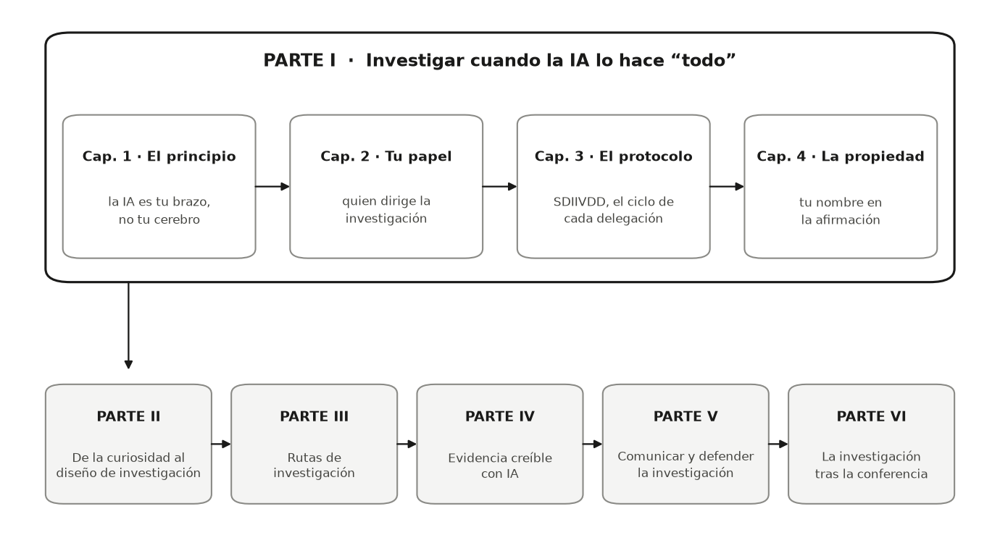

::: {.callout-warning .review-pending title="En desarrollo"}
Este capítulo forma parte de un libro en desarrollo activo y todavía
no ha pasado por la revisión del autor. El contenido puede cambiar a
medida que avanza la revisión.
:::

Las herramientas de IA ya pueden redactar el código, la prosa, las citas y las
figuras. Entonces, ¿qué te queda a ti? La Parte I responde esa pregunta y te
entrega las reglas de operación para todo lo que sigue: el principio (la IA es
tu brazo y tu asistente de investigación, no tu cerebro), tu papel (director de
investigación), el protocolo que ejecutas cada vez que delegas (SDIIVDD:
Especificar → Delegar → Interrogar → Inspeccionar → Verificar → Documentar →
Defender) y la responsabilidad que nunca se transfiere (tu nombre en la
afirmación).

Aquí está la Parte I de un vistazo, y dónde se ubica dentro del libro:

{fig-alt="Diagrama. Dentro de un gran marco de la Parte I, cuatro capítulos se encadenan: el principio, tu papel, el protocolo, la propiedad. Una flecha baja a una fila de cinco cajas, Partes II a VI, del diseño de investigación a la investigación tras la conferencia."}

Todo lo que viene después se apoya en estos cuatro capítulos. Cuando la Parte
II convierta tu curiosidad en un diseño de investigación, la lista de tareas
del director del Capítulo 2 será tu manera de repartir el trabajo. Cuando las
Partes III y IV produzcan evidencia, el protocolo SDIIVDD del Capítulo 3 será
la manera en que se revisa cada paso delegado. Y cuando las Partes V y VI
pongan tu afirmación en público, la regla de responsabilidad del Capítulo 4
será el piso sobre el que estás parado.

Cada capítulo termina con una sección **Ahora te toca a ti**. Trabájalas en
orden, empezando aquí, y para la última página del libro habrás construido un
proyecto de investigación completo y defendible, tuyo.
