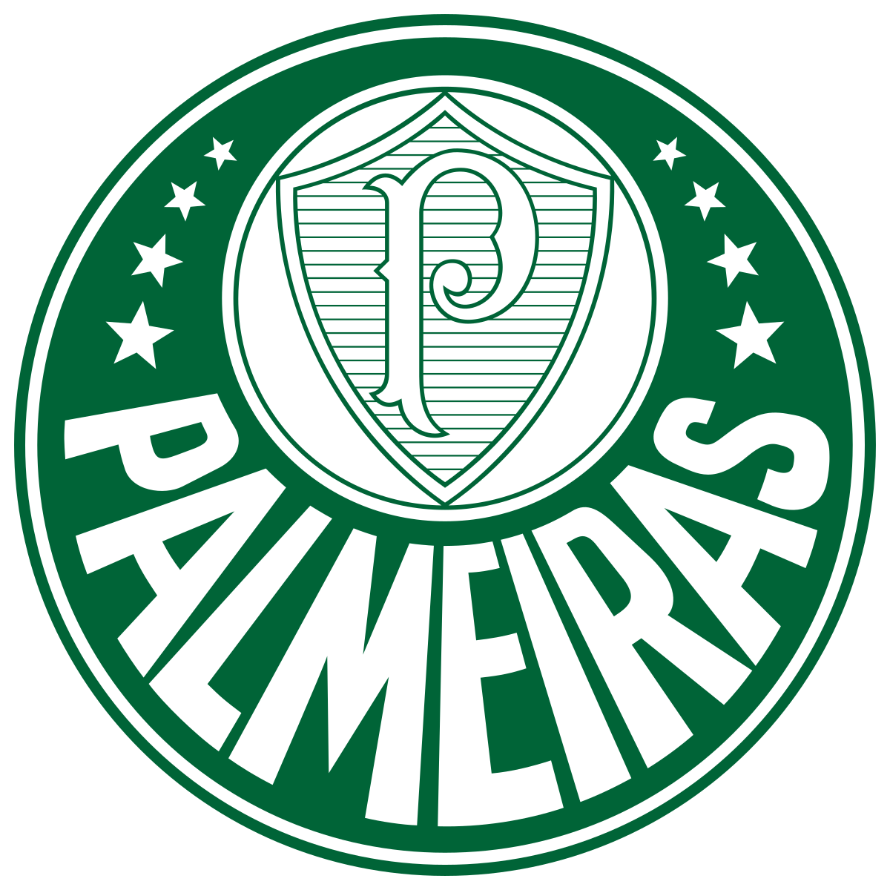

# Sobre o Autor {.unnumbered}

::: {.columns}
::: {.column width="32%"}
{width="90%" fig-alt="Retrato de Davi Moreira"}
:::
::: {.column width="68%"}
**Davi Moreira** é Clinical Assistant Professor no Departamento de Métodos
Quantitativos e Diretor do Daniels Undergraduate Business Honors Program na
Mitch Daniels School of Business da Purdue University. Seu trabalho se centra
em ciência de dados aplicada — estatística, processamento de linguagem
natural, análise preditiva, inferência causal e inteligência artificial — com
raízes em Comunicação Política, Política Comparada e Texto como Dado.

- Site: [davi-moreira.github.io](https://davi-moreira.github.io/){target="_blank"}
- E-mail: [dcordeir@purdue.edu](mailto:dcordeir@purdue.edu)
:::
:::

Antes da Purdue, ele foi Professor Adjunto de Ciência Política na Universidade
Federal de Pernambuco (UFPE) e teve posições de professor visitante na Emory
University e na School of Global Policy and Strategy da UC San Diego. Sua
pesquisa de doutorado recebeu o prêmio de melhor tese brasileira de doutorado
em Ciência Política e Relações Internacionais de 2017. Fora da universidade,
atuou como consultor Especialista em Monitoramento e Avaliação para o Banco
Mundial no Brasil, em Moçambique, em Angola e na República Democrática do
Congo.

Hoje, a maior parte do tempo dele na Purdue vai para aquilo de que este livro
é feito: ensinar estudantes de graduação em negócios a raciocinar com dados,
dirigir um programa de honors construído em torno de pesquisa original, e
desenhar cursos — incluindo aquele do qual este livro nasceu — que treinam
estudantes a usar IA intensamente e verificar tudo o que ela entrega. Ele
escreveu o EDR|AI para os estudantes que ensina: alunos de graduação que
querem produzir pesquisa que consigam defender, em um mundo no qual a IA
consegue produzir quase todo o resto. A única regra do livro também é a regra
de trabalho dele: a IA é o seu braço e a sua assistente de pesquisa, não o seu
cérebro.

## Fora do expediente

Duas coisas sobre as quais você vai acabar ouvindo falar se fizer aula com ele.

**Palmeiras.** O maior clube de futebol do Brasil e o treinamento em incerteza
mais rigoroso da vida do autor.

{width="110" fig-alt="Escudo do Palmeiras"}

[O jogo mais emocionante da história (vídeo)](https://www.youtube.com/watch?v=FCebgeX_3hI&t=89s){target="_blank"}

**Carnaval de Olinda.** O carnaval de rua da cidade natal dele, em Pernambuco,
famoso por seus bonecos gigantes.

{width="320" fig-alt="Bonecos gigantes no carnaval de Olinda"}

[NYT: Como John Travolta virou a estrela do Carnaval (em inglês)](https://www.nytimes.com/2024/02/13/world/americas/brazil-carnival-john-travolta.html){target="_blank"}
