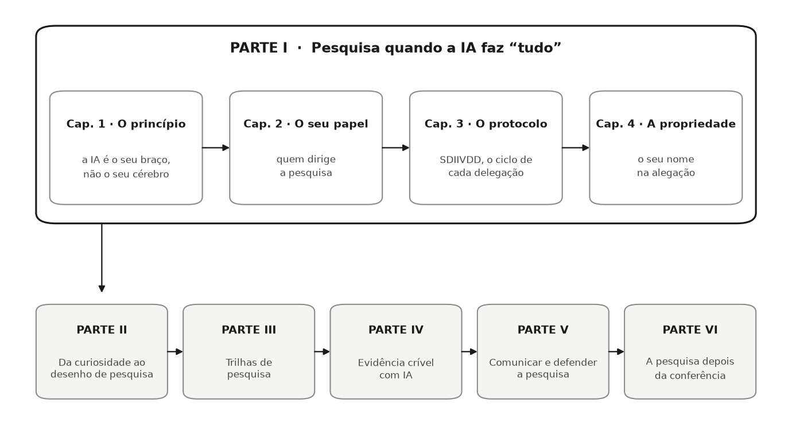

::: {.callout-warning .review-pending title="Em desenvolvimento"}
Este capítulo faz parte de um livro em desenvolvimento ativo e ainda
não passou pela revisão do autor. O conteúdo pode mudar conforme a
revisão avança.
:::

Ferramentas de IA já conseguem escrever o código, o texto, as citações e as
figuras. Então o que sobra para você? A Parte I responde a essa pergunta e
entrega as regras de operação para tudo o que vem depois: o princípio (a IA é o
seu braço e a sua assistente de pesquisa, não o seu cérebro), o seu papel
(diretor de pesquisa), o protocolo que você roda toda vez que delega (SDIIVDD) e
a propriedade intelectual que nunca se transfere (o seu nome na alegação).

Aqui está a Parte I em um relance, e onde ela se encaixa no livro:

{fig-alt="Diagrama. Dentro de um grande quadro da Parte I, quatro capítulos se encadeiam: o princípio, o seu papel, o protocolo, a propriedade. Uma seta desce para uma fileira de cinco caixas, Partes II a VI, do desenho de pesquisa à pesquisa depois da conferência."}

Tudo o que vem depois se apoia nesses quatro capítulos. Quando a Parte II
transformar a sua curiosidade em um desenho de pesquisa, a lista de tarefas do
diretor, do Capítulo 2, é como você divide o trabalho. Quando as Partes III e IV
produzirem evidência, o protocolo SDIIVDD, do Capítulo 3, é como cada etapa
delegada é conferida. E quando as Partes V e VI colocarem a sua alegação em
público, a regra de propriedade intelectual do Capítulo 4 é o chão em que você
está pisando.

Cada capítulo termina com uma seção **Agora é a sua vez**. Faça-as em ordem,
começando aqui, e, na última página do livro, você terá construído um projeto de
pesquisa completo e defensável, seu.
