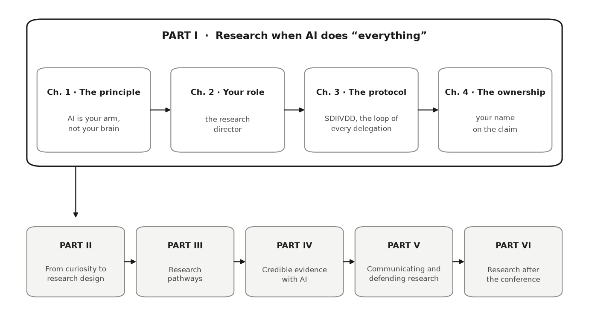

::: {.callout-warning .review-pending title="Under development"}
This chapter is part of a book in active development and has not yet
been through the author's review. Content may change as the review
advances.
:::

AI tools can now draft the code, the prose, the citations, and the figures. So
what is left for you? Part I answers that question and hands you the operating
rules for everything that follows: the principle (AI is your arm and your
research assistant, not your brain), your role (research director), the
protocol you run every time you delegate (SDIIVDD), and the ownership that
never transfers (your name on the claim).

Here is Part I at a glance, and where it sits in the book:

{fig-alt="Diagram. Inside a large Part I frame, four chapters chain left to right: the principle, your role, the protocol, the ownership. An arrow leads down to a row of five boxes, Parts II through VI, from research design to research after the conference."}

Everything downstream leans on these four chapters. When Part II turns your
curiosity into a research design, the director's task list from Chapter 2 is
how you split the work. When Parts III and IV produce evidence, the SDIIVDD
protocol from Chapter 3 is how every delegated step gets checked. And when
Parts V and VI put your claim in public, the ownership rule from Chapter 4 is
what you are standing on.

Each chapter ends with an **It is your turn** section. Work them in order,
starting here, and by the last page of the book you will have built a complete,
defensible research project of your own.
