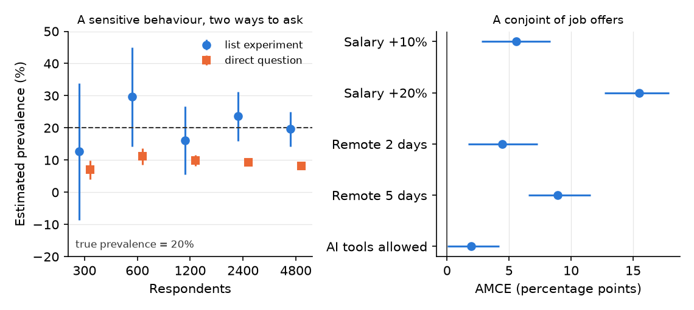

::: {.callout-warning .review-pending title="Under development"}
This chapter is part of a book in active development and has not yet
been through the author's review. Content may change as the review
advances.
:::

[{fig-alt="Open In Colab"}](https://colab.research.google.com/github/davi-moreira/2026F_evidence_driven_research_purdue_HONR464/blob/main/notebooks/book/ch42_survey_experiments.ipynb){target="_blank"}

> **The research decision.** Decide what you randomize inside your questionnaire,
> and whether the number it yields describes something people already hold (a
> prevalence, a preference) or tests the effect of a message you wrote. Then say
> what a stated answer can and cannot tell you about what people actually do. The
> questionnaire is yours, so no tool gets to decide what its numbers mean.

## Why this decision matters

**The decision on the table: what your survey experiment measures, and how far a stated answer can travel toward real behaviour.**

> *"Your survey says four percent of staff have pasted client files into an
> unapproved AI tool. I have seen the network logs. Either your number is wrong, or
> you asked a question nobody would answer honestly. Tell me which, and tell me what
> your next number would mean."*
> — a **chief information-security officer**, reading an internal staff survey at
> an accounting firm

People do not always tell a survey the truth, and they often do not know it. Ask an
employee straight out whether they broke the data policy, and many who did will say
no. Ask a job seeker which matters more, salary or remote work, and you get an
opinion about themselves rather than a record of the choices they make. A survey
experiment answers both problems with the same move: you let chance decide which
version of a question each respondent sees, and you read the answer off the
difference between versions. That move does real work, and it is easy to misread.
Randomizing inside a questionnaire does not make every number causal, and it does not turn a
hypothetical choice into a real one. This chapter gives you the decision that keeps
those two confusions out of your write-up.

## The concept

Survey experiments live on two of the book's pathways at once, and your stated
question decides which one you are on. The coin flip does not. When the question
asks about something respondents already hold, a prevalence or a preference, you
are on the
[experimental-descriptive pathway](../part3-pathways/13-experimental-descriptive-research.qmd).
RDSS files both list and conjoint experiments in its experimental-descriptive
design library for that reason: the experiment works as a measurement instrument
[@blair2023rdss]. When the question asks what a message you wrote does to answers,
you are on the
[experimental-causal pathway](../part3-pathways/15-experimental-causal-research.qmd),
with the same coin flip and a causal inquiry.

A **survey experiment** is a questionnaire in which chance decides which version of
some question, text, or item each respondent receives [@mutz2011population].
Example: half of a representative sample reads a news paragraph that frames a tax
as "a fee on polluters," the other half reads "a tax on energy," and both then
report their support. Three families cover most of what you will meet.

A **framing experiment** is a survey experiment that randomizes the wording or
content of a message and measures its effect on a stated attitude. Example: a
political scientist tests whether naming a policy's cost changes support for it.
The estimand is causal: the average difference in stated support that reading one
version rather than the other produces, among these respondents, in this survey.
It says nothing yet about a ballot cast months later.

A **vignette experiment** is a survey experiment in which respondents judge a short
described scenario whose features are randomized, one feature or several at once.
When several features vary together it is often called a **factorial survey**.
Example: a conservation biologist describes a wetland restoration plan and
randomizes which species it protects and what it costs each household, then asks
whether the respondent would support it [@auspurg2015factorial].

A **conjoint experiment** is a vignette design pushed further: respondents compare
whole profiles, such as two job offers or two candidates, each built from several
attributes whose levels are all assigned at random. Example: an offer with a 10
percent raise, two remote days, and AI tools allowed, set beside an offer with no
raise, five remote days, and AI tools banned. The **average marginal component
effect (AMCE)** is the average change in the chance that a profile is chosen when
one attribute moves from its baseline level to another level, averaged over all the
other attributes as you randomized them, and over the offers it was paired against
[@hainmueller2014causal]. Example: an AMCE of 9 points for "five remote days" means
that switching an offer from no remote days to five raised its chance of being
chosen by 9 percentage points, on average across the salaries, policies, and rival
offers it came bundled with.

That last clause is where conjoint results go wrong. The AMCE depends on the
distribution of attributes you chose to show. RDSS calls the inquiry
data-strategy-dependent, because the average is taken over a mix of profiles that
you, the researcher, set [@blair2023rdss]. Two consequences follow. First, AMCEs
for different attributes are not a ranking of what people care about, because
each depends on how far apart you set its levels. A salary range that tops out at
+20 percent will look more important than one that tops out at +10 percent, with
identical respondents. Second, comparing AMCEs between subgroups, such as older
and younger job seekers, can mislead: the comparison depends on which level you
named as the baseline, so describe each subgroup with **marginal means**, the plain
share of profiles chosen when they carry a given level
[@leeper2020measuring].

Hainmueller and his coauthors define the AMCE as a causal effect of a feature on a
stated choice. RDSS frames the conjoint inquiry as a description of preferences,
since you could in principle ask about every possible profile and the experiment
only samples them, and it grants that the causal reading is also correct
[@blair2023rdss]. The number is the same either way, so the compass reads your
question, not the estimator. "Which offers do these job seekers say they prefer?"
is descriptive. "What does describing an offer as fully remote do to the chance
these job seekers pick it?" is causal, and the kind rule keeps it causal: the
effect of a feature of a hypothetical profile on a stated choice, under the mix of
profiles you dealt. Neither version reaches what anyone does with a real offer.

A **list experiment** is a survey experiment for sensitive behaviour. Every
respondent sees a list of innocuous statements and reports only *how many* are true
for them, never which. A random half sees the same list plus the sensitive item.
Example: four control statements about commuting and meetings, plus, for the
treatment half, "I pasted client information into an AI tool the firm has not
approved." Because the two halves are alike on average, the difference in their mean
counts estimates the share who hold the sensitive trait, the **prevalence**
[@blair2012statistical]. A count in the middle of the range cannot pin the trait on
the person who gave it, since the control items could explain it, which is the point. A count at either end can: in the longer
list, a total that the control items alone could never reach announces the trait.
The protection is only as good as the list.

Two assumptions carry the list experiment, and RDSS names them plainly. **No design
effects** means adding the sensitive item does not change how people count the
control items. **No liars** means people who hold the trait do add it to their
count [@blair2023rdss]. A **ceiling effect** breaks the second: someone who agrees
with every control item and holds the trait would have to report the maximum, which
is a confession, so they shave one off. A **floor effect** is the mirror image near
zero: when the control items are so rare that almost everyone's honest control
count is zero, a count of one reads as an admission, so some people who hold the
trait report zero instead [@blair2012statistical]. Control items chosen so that almost nobody lands at either end keep both at
bay, and pairing items that tend to cancel out also shrinks the noise
[@glynn2013learn].

Whatever the family, the warrant has two parts. Random assignment of versions
licenses the comparison between them. Only the sampling licenses reach: a
probability sample of the firm's staff lets a prevalence speak for the staff, while
an opt-in panel leaves it with the people who answered.

## A worked example

Take the security officer's challenge seriously. You run a staff survey at a
mid-sized accounting firm, and the policy question is how many employees pasted
client information into an unapproved AI tool last month. A direct question
produced the four percent the officer did not believe. You switch to a list
experiment and draft four control items.

Your first draft reads naturally: "I attended at least one meeting this week," "I
checked email after 6 p.m.," "I used the printer," "I ate lunch at my desk." Close
to half your staff may say yes to all four. That is the trap. Anyone who holds the sensitive
trait and agrees with all four control items would have to report five, which
announces the trait to whoever reads the file. A respondent who notices will say
four, and your estimate slides down.

Your second draft balances the list. "I drove to work on Monday" and "I took public
transit on Monday" are close to opposites, so nearly everyone says yes to one and
no to the other. One item is rare ("I presented to a client this week") and one is
common ("I worked from home at least one day"). Nobody can now say yes to all four,
but look closely at what that buys. If the drive and transit items really are
opposites, three is the highest honest control count, so a four on the longer list
is a confession too. The top of the scale moved down one step; it did not vanish.
What shrank is the number of people standing on it: only those who presented to a
client *and* worked from home. The estimand is the share of the firm's staff who pasted client
information into an unapproved tool last month; the warrant for that reach is a
random draw from the staff list; the answer strategy is a difference in mean
counts.

Choosing control items so that few respondents can reach the ceiling, and pairing
items that pull in opposite directions, is standard design advice for list
experiments [@glynn2013learn].

The block below asks both lists of a very large simulated staff, so that noise is
not the story, with a true prevalence of 20 percent. It takes the worst case: every
respondent who holds the trait and sits at the top of what their control items can
produce shaves one off rather than confess. Watch the share of people standing at
that top.

```python
import numpy as np
SEED = 464
rng = np.random.default_rng(SEED)

n, truth = 100_000, 0.20   # TRUE share who pasted client data into an unapproved AI tool
trait = rng.random(n) < truth
longer = rng.permutation(n) < n // 2      # coin flip: who sees the five-item list

def run_list(control):                    # control: one yes/no column per item
    base = control.sum(axis=1)
    top = base.max()                      # highest count the control items allow
    # top + 1 on the longer list would be a confession, so anyone there says top
    count = base + (longer & trait) - (longer & trait & (base == top))
    est = count[longer].mean() - count[~longer].mean()
    se = np.sqrt(count[longer].var(ddof=1) / longer.sum()
                 + count[~longer].var(ddof=1) / (~longer).sum())
    return est, se, top, (base == top).mean()

popular = rng.random((n, 4)) < np.array([0.85, 0.80, 0.90, 0.75])
drives = rng.random(n) < 0.5              # "I drove to work" vs "I took transit"
balanced = np.column_stack([drives, ~drives, rng.random(n) < 0.15,
                            rng.random(n) < 0.70])

print(f"true prevalence                 : {truth*100:.1f}%")
for name, items in (("popular control items", popular),
                    ("balanced control items", balanced)):
    est, se, top, ceiling = run_list(items)
    print(f"{name:<23} : {est*100:5.1f}% +/- {1.96*se*100:.1f}"
          f"   (at the top count of {top}: {ceiling*100:.0f}%)")
print("\nthe list did not fail at random. it failed where the design let a")
print("truthful answer become a confession")
```

The popular list reports 10.1 percent, plus or minus 0.9, against a truth of 20.
Forty-six percent of respondents agreed with all four control items, and every one
of them who held the trait had a reason to hide it. The balanced list reports 17.8
percent, plus or minus 0.8. Its top count is three, and 10 percent of respondents
sit there, so it still loses about two points to people shaving one off, and its
interval no longer covers the truth. Same respondents, same trait, same coin flip:
the design of four innocent sentences cut the exposed group from nearly half the
staff to a tenth, and most of the bias with it, without removing either. The
simulation takes the worst case, in which every exposed respondent shaves one off.
Real respondents will do it less often, but you cannot know how much less from the
counts alone. And any exposed respondent who answers truthfully is identifiable in
your file, so a balanced list lowers the disclosure risk rather than ending it.
Away from the top, both numbers still rest on no liars and no design effects,
which this simulation granted and your real staff may not.

## A seeded simulation

A list experiment buys protection from lying with precision. Each respondent's
count carries the noise of four other questions, and only half of them see the
sensitive item, so the estimate wobbles far more than a direct question would.
RDSS describes the choice between the two as a trade between bias and variance
[@blair2023rdss]. The code below makes that trade visible. At five sample sizes it
runs a list experiment and, for the same number of people, a direct question that
only 45 percent of those with the trait answer truthfully. It then runs a conjoint
of job offers, with 800 respondents each choosing between two offers five times,
and estimates each AMCE with an interval that resamples people rather than
individual choices, since one person's five choices are not five independent
respondents. The seed makes every rerun reproduce this exact figure.

```python
import numpy as np
import matplotlib.pyplot as plt

SEED = 464
rng = np.random.default_rng(SEED)

# LEFT: a list experiment vs a direct question. True prevalence is 20%,
# but only 45% of those with the trait admit it when asked directly.
truth, admit = 0.20, 0.45
control_p = np.array([0.5, 0.3, 0.6, 0.2])     # four innocuous control items
sizes = [300, 600, 1200, 2400, 4800]
rows = []
for n in sizes:
    trait = rng.random(n) < truth
    listed = rng.permutation(n) < n // 2        # half get the longer list
    count = (rng.random((n, 4)) < control_p).sum(axis=1) + (listed & trait)
    lst = count[listed].mean() - count[~listed].mean()
    lst_se = np.sqrt(count[listed].var(ddof=1) / listed.sum()
                     + count[~listed].var(ddof=1) / (~listed).sum())
    said_yes = trait & (rng.random(n) < admit)  # the same n, asked directly
    d = said_yes.mean()
    rows.append((n, lst, lst_se, d, np.sqrt(d * (1 - d) / n)))

# RIGHT: a conjoint of job offers. Each respondent picks one of two offers,
# five times; every attribute level is dealt at random.
R, T = 800, 5
salary = rng.integers(0, 3, (R, T, 2))          # +0%, +10%, +20%
remote = rng.integers(0, 3, (R, T, 2))          # 0, 2, 5 remote days a week
ai_ok = rng.integers(0, 2, (R, T, 2))           # AI tools banned / allowed
util = (np.array([0, .35, .90])[salary] + np.array([0, .30, .55])[remote]
        + .15 * ai_ok + rng.logistic(0, 1, (R, T, 2)))
chosen = (util == util.max(axis=2, keepdims=True)).astype(float)
levels = [("Salary +10%", salary, 1), ("Salary +20%", salary, 2),
          ("Remote 2 days", remote, 1), ("Remote 5 days", remote, 2),
          ("AI tools allowed", ai_ok, 1)]

def amces(ix):
    return [chosen[ix][a[ix] == k].mean() - chosen[ix][a[ix] == 0].mean()
            for _, a, k in levels]

est = np.array(amces(np.arange(R)))
boot = np.array([amces(rng.integers(0, R, R)) for _ in range(300)])  # resample PEOPLE
lo, hi = np.percentile(boot, [2.5, 97.5], axis=0)

for n, l, lse, d, dse in rows:
    print(f"n = {n:>5}  list {l*100:5.1f}% +/- {1.96*lse*100:4.1f}   "
          f"direct {d*100:5.1f}% +/- {1.96*dse*100:4.1f}")
for (name, _, _), e, a, b in zip(levels, est, lo, hi):
    print(f"{name:<17}: {e*100:+5.1f} pp  [{a*100:+5.1f}, {b*100:+5.1f}]")

fig, (ax1, ax2) = plt.subplots(1, 2, figsize=(7.6, 3.4))
x = np.arange(len(sizes))
ax1.errorbar(x - .1, [r[1] * 100 for r in rows], [1.96 * r[2] * 100 for r in rows],
             fmt="o", color="#2a78d6", label="list experiment")
ax1.errorbar(x + .1, [r[3] * 100 for r in rows], [1.96 * r[4] * 100 for r in rows],
             fmt="s", color="#eb6834", label="direct question")
ax1.axhline(truth * 100, color="#333333", ls="--", lw=1)
ax1.set_ylim(-20, 50)
ax1.text(.03, .04, "true prevalence = 20%", fontsize=8, transform=ax1.transAxes)
ax1.set_xticks(x, [str(n) for n in sizes])
ax1.set_xlabel("Respondents")
ax1.set_ylabel("Estimated prevalence (%)")
ax1.legend(fontsize=8, frameon=False, loc="upper right")
y = np.arange(len(levels))[::-1]
ax2.errorbar(est * 100, y, xerr=[(est - lo) * 100, (hi - est) * 100],
             fmt="o", color="#2a78d6")
ax2.axvline(0, color="#333333", lw=.8)
ax2.set_yticks(y, [name for name, _, _ in levels])
ax2.set_xlabel("AMCE (percentage points)")
fig.tight_layout()
plt.show()
```

{fig-alt="Two-panel chart. Left: dot-and-interval plot of estimated prevalence at 300, 600, 1200, 2400 and 4800 respondents, with blue circles for the list experiment and orange squares for the direct question, and a dashed line at the true prevalence of 20 percent. The blue intervals are wide and shrink with sample size, from 12.7 plus or minus 21.3 at 300 to 19.6 plus or minus 5.4 at 4800, and all cross the dashed line. The orange squares sit between about 7 and 11 percent with narrow intervals that never reach 20. Right: horizontal dot plot of five AMCEs with 95 percent intervals in blue: Salary +10% at 5.6, Salary +20% at 15.5, Remote 2 days at 4.4, Remote 5 days at 8.9, and AI tools allowed at 1.9, with a vertical line at zero."}

Read the left panel first. The orange squares are the direct question, and they
are precise and wrong: at 1,200 respondents it reports 9.8 percent, plus or minus
1.7, and adding people only tightens the interval around the wrong answer. At 4,800
respondents the square still sits near 8 percent, less than half the true 20. The
blue circles are the list experiment. At 1,200 respondents it reports 16.2 percent,
plus or minus 10.5, an interval about six times wider than the direct question's
and wide enough to be nearly useless for a policy memo. At 300 respondents it
reports 12.7, plus or minus 21.3, an interval that runs below zero. Only at 4,800
does it tighten to 19.6, plus or minus 5.4. Look at 600 respondents, too: 29.7
percent, far above the truth, with an interval that still covers it. Your one
survey is one of these blue dots, and you do not get to choose which. That is the
precision cost, and you pay it in sample size before you field anything. The trade
can also run the other way. When few people shade their answer and your sample is
small, the direct question's total error can be the smaller of the two, and RDSS
shows how to compare the designs on that total before you choose [@blair2023rdss].

Now the right panel. Five remote days moved the chance an offer was chosen by 8.9
points (6.6 to 11.6). A 20 percent raise moved it by 15.5 points (12.7 to 17.9),
and a 10 percent raise by only 5.6 (2.8 to 8.3). So is salary more important than
remote work? The honest answer is that the question has no answer here. Put a 10
percent raise at the top of the salary menu and remote work "wins"; put 20 percent
there and salary "wins". Each AMCE describes what that level did against that
baseline, averaged over the mix you dealt. Allowing AI tools moved choices by 1.9
points, with an interval from 0.0 to 4.2 that reaches down to about zero. In the
companion notebook, add a fourth salary level of +30 percent to the menu, give it a
bigger pull in `util`, and rerun. The new level earns the largest AMCE on the chart,
and salary looks more important than ever, although no simulated respondent's taste
for money changed. What changed is the menu you dealt.

## What a stated answer can tell you

A survey experiment measures what people say inside a questionnaire. Whether that
travels to what they do is a separate claim, and it needs separate evidence.

**Stated preference** is what people report they would choose; **revealed
preference** is what their actual choices show. Example: a job seeker who picks the
remote offer on a screen may still accept the higher-paying office job when the
real letter arrives. The good news is that this gap has been measured. In
Switzerland, researchers compared conjoint and vignette experiments about which
immigrants should be naturalized with real local votes on actual applicants. The survey
estimates matched the behavioural benchmark well, the paired conjoint came closest,
and small differences in design changed how close a survey came
[@hainmueller2015validating]. That result earns your design some
credibility. It does not vouch for your topic, your population, or your wording, so
your limits line still says the estimate describes stated choices.

A **demand effect** is a shift in answers that happens when respondents guess what
you hope to find and answer toward it. Example: an employee who realizes the survey is about AI policy may
suddenly favour the offer that bans AI tools. In online survey experiments this
worry has been tested directly: telling participants what the researchers expected
barely changed the treatment effects in five replicated studies
[@mummolo2019demand]. That lowers the concern for typical online designs; it does
not remove it for a small, identifiable workplace sample where respondents know you.

A **manipulation check** is a question that confirms respondents actually noticed
the feature you varied. Example: after the tax-framing paragraph, ask which phrase
the paragraph used. An **attention check** is an item that tests whether a
respondent is reading at all. Example: "To show you are reading, select 'somewhat
disagree' here." Decide before fielding what you will do with people who fail
either one, and report results with and without them. Filtering on a check placed
before the treatment keeps the coin flip's balance, though it narrows whom your
estimate describes to the attentive. Dropping people who fail a check placed after it
can break the balance the coin flip bought you, because the version someone read
may change whether they pass.

**Language-model respondents** are a new temptation. An AI tool can produce
thousands of plausible survey answers in seconds, and some studies find those
answers track real subgroups on certain questions [@argyle2023out]. Others find the
simulated answers too uniform, and too unstable across prompt wordings and over
time, to stand in for people [@bisbee2024synthetic]. Use a model to pretest your wording,
spot a confusing item, or rehearse your analysis on fake data. Never report its
answers as findings about people.

Last, the ethics. A list experiment exists because the item is sensitive, and a
conjoint about hiring can touch protected traits. Consent, the handling of
sensitive answers, and your project's permission status are settled before
fielding, as the
[ethics chapter](../part2-curiosity-to-design/research-ethics-and-data-governance.qmd)
lays out. In a workplace, anonymity from your manager matters as much as anonymity
in the data file.

## An AI failure case

You paste your conjoint output into a chatbot and ask for the findings paragraph.
It answers fluently: "Salary is the most important factor for job seekers, nearly
twice as important as remote work, while AI-tool policy is irrelevant. Employers
should prioritize pay over flexibility." It even includes a tidy bar chart ranking
the three attributes. This is two named failures at once. The first is
**plausible-but-wrong-method**: it ranked attributes by comparing AMCEs whose level
ranges you set differently, and the ranking would flip if you had capped salary at
+10 percent. The second is **silent scope change**: it turned stated choices among hypothetical
offers into advice about real hiring, and an interval that reaches about zero into
"irrelevant." A ranked chart is not a ranking of what people value.

You catch it by asking one question the tool cannot answer from the numbers alone:
*what did I put on the menu?* Lay each AMCE beside the levels that produced it.
Then rewrite the sentence yourself: "Among these respondents, a 20 percent raise
increased an offer's chance of being chosen by about 15 points, and five remote days
by about 9, relative to the baselines shown (95 percent intervals roughly 13 to 18
and 7 to 12); these describe stated choices under the attribute mix we randomized." Log why you rejected the ranking.

## It is your turn

<!-- station-pointer:begin -->
> **A further route beyond the five pathways.** This lesson
> extends [Studio 5: Develop the pathway](../studios/studio05-develop-the-pathway.qmd). Read it once
> you have declared your primary pathway and your question
> calls for this design. Studio 5's milestone asks for the
> same decisions, answered for this route.
<!-- station-pointer:end -->

*Your design is declared and diagnosed. This route is for a question that a
questionnaire can answer only if chance decides what each respondent sees, and it
asks you to say out loud what kind of number that produces.*

The hands-on half of this section lives in the chapter's **companion notebook**: open it in Colab with the badge at the top, and work the steps there.

Commit your own answer first, then delegate. Each prompt is a checkable job, not a
request for a verdict. Work them as a loop. The first answer is a draft: find the
claim you cannot check, say so in your next message, and run it again. Some tools
will draft a whole questionnaire, field it to simulated respondents, and hand you a
finished analysis. The finished look is exactly what makes the questions in this
chapter worth asking before you accept it.

::: {.callout-important title="Do not delegate"}
Three calls stay yours. You decide **what you randomize and which kind of number it
yields**, a prevalence, a preference, or the effect of a message. You decide **the
wording and the menu**: the sensitive item, the control items, the attribute
levels, because every estimate inherits them. And you decide **whether a stated
answer can stand in for behaviour in your write-up, and whether you may ask at
all**. A tool can draft items and attack your design. What the numbers mean is
your call.
:::

1. Name what you randomize and the kind of answer it yields. Write your Research
   Contract's question line, then one line that says whether the design is a list,
   conjoint, vignette, or framing experiment, and whether the inquiry is
   descriptive (prevalence or preference) or causal (the effect of a message, or of
   a profile feature on stated choices), with its reach. Let the words of your
   question decide the kind, not the fact that you randomized.
2. Write your estimand and your warrant in two sentences. The estimand names the
   quantity, the respondents, and the setting: "the share of this firm's staff who
   did X last month" or "the change in the chance an offer is chosen when it
   carries level L, under the attribute mix in the attached table." The warrant
   names what licenses each crossing: random assignment of versions for the
   comparison, and your sampling for the reach.

   *When you are ready to delegate this step:*

   ```text
   Act as a survey methodologist. Here is my design: [paste question, instrument
   type, sample source, and estimand]. List, as a table, every assumption my
   estimate rests on, for example no design effects and no liars for a list
   experiment, or the attribute distribution for a conjoint. For each, say what I
   could check in my own data or pilot.
   ```

   After running, verify: compare the table against the assumptions you wrote first
   and against this chapter; if the tool missed the sampling assumption behind your
   reach, add it back. Counters **illusion of completeness** (a tidy table that
   omits the one assumption your reach depends on).
3. Draft the instrument yourself before any tool sees it. For a list experiment,
   write the sensitive item and four control items. For a conjoint, write the
   attribute table with every level. For a vignette or framing design, write both
   versions word for word.

   **Red-team your instrument.**

   ```text
   Here are my control items and sensitive item: [paste]. Act as a hostile
   reviewer. Estimate roughly what share of respondents could reach the highest or
   lowest count my control items allow (remember that two items that cannot both be
   true lower the highest count), name any item that could change how people count the
   others, and say which item a respondent might find threatening. Do not rewrite
   the list for me; list the problems so I fix them myself.
   ```

   After running, verify: if it says the list looks fine, push back with "assume
   ceiling effects are severe; which item causes them?" Praise without an objection
   is a red flag. Counters **sycophantic agreement** (praise that reviews your ego,
   not your evidence).
4. Diagnose the design by simulation before you field it. In the companion
   notebook, set a plausible true value, your planned sample size, and your actual
   items or levels, and record the interval width your design will produce.

   *When you are ready to delegate this step:*

   ```text
   Act as a Python tutor. Here is the simulation from my companion notebook with my
   own items and sample size: [paste the cell]. Explain line by line how the
   interval for the difference in mean counts is computed, and tell me what would
   change if I asked the direct question to everyone instead.
   ```

   After running, verify: rerun the cell yourself and confirm every number the
   tool quotes appears in your own printout. Counters **confident fabrication**
   (a fluent walkthrough quoting an interval your code never produced).
5. Write your limits line. Say whether the estimate describes stated or revealed
   behaviour, what demand effect is most plausible for your respondents, what you
   will do with failed attention or manipulation checks, and your permission status
   from the ethics chapter.
6. Log the step in your AI Research Ledger, and verify at least one output with a
   named method from the [Verification Guide](../verification-guide.qmd). A
   **simulation** is the natural check for this route: plant a known prevalence or
   a known AMCE, run your exact design, and confirm it recovers the planted value
   within its interval. **Direct calculation** is the strong second check:
   recompute one difference in means by hand from your pilot counts. An AI reviewer
   may run the checks with you; the decision to accept or reject stays yours.
