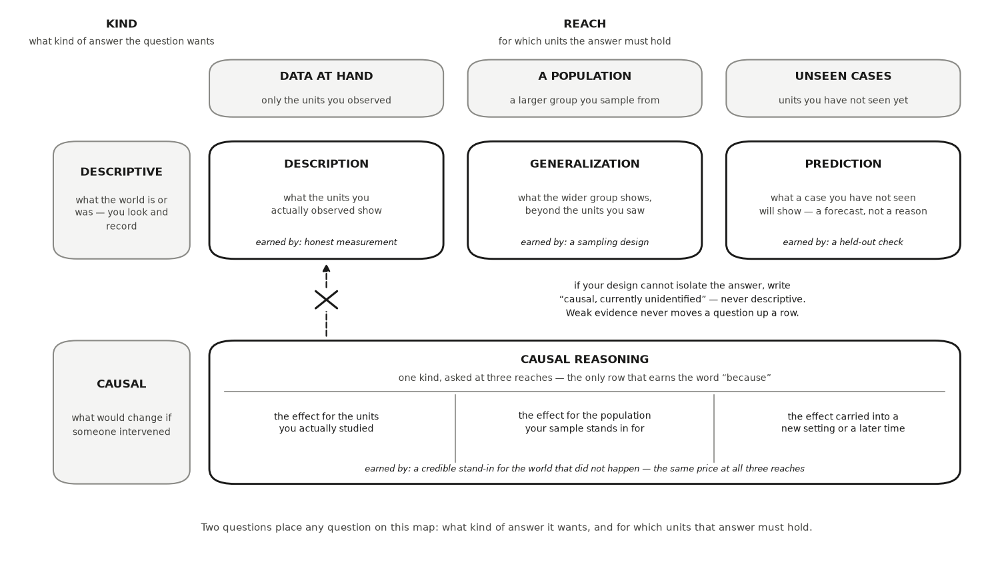

---
# GENERATED FILE — DO NOT EDIT.
# Written by scripts/build_studio_slides.py from the EDR|AI book:
#   book/studios/studio02-govern-the-work.qmd      (the studio's promise)
#   the studio's chapters                                 (its argument)
#   book/studios/milestone02-govern-the-work.qmd   (its milestone)
# Editorial overlay: planning/BOOK_SLIDE_PLANS/<lesson-id>.yml
# Lessons on this deck: ai-arm-not-brain research-director sdiivdd responsibility-ownership question-kinds declare-your-question
# Edit the CHAPTER (or its plan) and rerun the script. Edits made here are
# silently reverted on the next build and fail `--check` in CI.
title: "HONR 46400 · Evidence-Driven Research"
subtitle: "Studio 2 — Set your rules, shape your question"
author: "Davi Moreira"
format:
  revealjs:
    theme: [default, _theme/edrai-slides.scss]
    include-in-header: _theme/head.html
    include-after-body: _theme/fit.html
    width: 1600
    height: 900
    margin: 0.07
    center: false
    slide-number: c/t
    show-slide-number: all
    transition: fade
    background-transition: fade
    transition-speed: fast
    incremental: false
    hash: true
    hash-type: number
    history: false
    progress: true
    controls: true
    controls-layout: bottom-right
    touch: true
    preview-links: auto
    link-external-newwindow: true
    logo: _theme/edrai_logo.png
    footer: "EDR|AI · Studio 2 — Set your rules, shape your question"
    chalkboard:
      buttons: false
    menu:
      side: left
      width: wide
      numbers: true
    code-line-numbers: false
    highlight-style: github
    fig-align: center
---

## What you can defend when you leave {data-menu-title="Studio 2 · What you can defend when you leave"}

::: {.kicker}

Studio 2

:::

::::: {.slide-body}

::: {.decision}

Set how you and your tools will work while the stakes are still small, verify
your first AI assistance, and close by declaring the question your evidence
will answer.

:::

:::::


## The milestone ahead {data-menu-title="Studio 2 · The milestone ahead"}

::: {.kicker}

Studio 2

:::

::::: {.slide-body}

This studio closes with **[Milestone 2: Your rules and your
question](https://davi-moreira.github.io/2026F_evidence_driven_research_purdue_HONR464/book/studios/milestone02-govern-the-work.html)**,
a short chapter of its own after the lessons. **What it asks you to produce.**
Your working agreement (an ownership statement, your working rules, your
opened AI Research Ledger, your delegation map, and the red-flag screen of
your chosen problem) and your question, formally declared: objective, units,
outcomes and conditions, kind and reach, and a provisional claim boundary.

:::::

::: {.notes}

Your committed problem now needs two things at once: guardrails, and an exact
sentence. The rules are not a preface to the question; they govern how it is
written — which parts AI may draft, which decisions stay yours, what gets
verified, what gets recorded, and what your name signs. So this studio
interleaves its two purposes. You open the ledger and map the work, test a
claim your starting belief already makes, and put your name on the record.
Then, under those rules, you classify the question, draft its wording with
every change accounted for, and close with the field card, the boundary pair,
and the stranger test. Every later studio traces its evidence, design,
analysis, and claim back to a declared question, and to the rules under which
that declaration was made.

Milestone 3 holds the declared question up against what is already known, and
it will usually send back a sharper version. The milestone chapter keeps the
working details: the practice steps, the versioned record, and how the
artifact is assessed.

:::


## The lessons in this studio {data-menu-title="Studio 2 · The lessons in this studio"}

::: {.kicker}

Studio 2 · Road map

:::

::::: {.slide-body}

- [Lesson 2 — AI Is Your Arm, Not Your Brain](https://davi-moreira.github.io/2026F_evidence_driven_research_purdue_HONR464/book/part1-research-with-ai/01-ai-is-your-arm-not-your-brain.html): your opened AI Research Ledger and one verified factual hinge from your own problem, including the retrospective Studio 1 receipt as row one.
- [Lesson 3 — You as a Research Director](https://davi-moreira.github.io/2026F_evidence_driven_research_purdue_HONR464/book/part1-research-with-ai/02-the-student-as-research-director.html): your delegation map for the whole project and for the declaration ahead: candidate wording may travel, while the lead question, kind, reach, and boundary stay yours.
- [Lesson 4 — Specify, Delegate, Interrogate, Inspect, Verify, Document, Defend](https://davi-moreira.github.io/2026F_evidence_driven_research_purdue_HONR464/book/part1-research-with-ai/03-specify-delegate-interrogate-inspect-verify-document-defend.html): one complete SDIIVDD run on a checkable claim your starting belief makes, with the check's outcome on record — including "nothing changed" when the check agreed.
- [Lesson 5 — Research Responsibility and Intellectual Ownership](https://davi-moreira.github.io/2026F_evidence_driven_research_purdue_HONR464/book/part1-research-with-ai/04-research-responsibility-and-intellectual-ownership.html): your ownership statement, never-delegate list, and first AI-use disclosure, with the research question named as the first sentence your name signs.
- [Lesson 6 — Choose Your Question's Kind and Reach](https://davi-moreira.github.io/2026F_evidence_driven_research_purdue_HONR464/book/part2-curiosity-to-design/06-descriptive-predictive-and-causal-questions.html): your lead question chosen from the candidates, placed by kind and reach, with double-barrels split and a comparison world recorded when causal.
- [Lesson 7 — Declare Your Research Question](https://davi-moreira.github.io/2026F_evidence_driven_research_purdue_HONR464/book/part2-curiosity-to-design/declare-your-question.html): your chosen formal wording with every change accounted for, the field card, the boundary pair with its uncertainty-and-limitations line, and the stranger-test result, dated as version zero.

:::::


## AI Is Your Arm, Not Your Brain {background-color="#1a1a19" .divider data-menu-title="CHAPTER 2 — AI Is Your Arm, Not Your Brain"}

::: {.kicker}

Lesson 1 of this studio · Chapter 2

:::

::: {.divider-line}

what has to happen to an AI's output before you are willing to call it
evidence

:::


## The research decision {data-menu-title="Ch 2 · The research decision"}

::: {.kicker}

Chapter 2

:::

::::: {.slide-body}

::: {.decision}

Decide what must happen between an AI output and evidence you are willing to
use. Name the check, record the exchange, and keep responsibility for the
result.

:::

:::::


## The words this chapter uses {data-menu-title="Ch 2 · The words this chapter uses"}

::: {.kicker}

Chapter 2 · Key terms

:::

::::: {.slide-body}

:::: {.terms .two}

::: {.term}

[Delegation]{.t}

[handing a well-specified task to the tool, such as "find three published sources for last year's county unemployment rate.]{.d}

:::

::: {.term}

[Verification]{.t}

[an independent check, run by a method outside the model, that the result is actually true.]{.d}

:::

::::

:::::

::: {.notes}

Each term is defined in the chapter on first use; these are the definitions as
the book gives them.

:::


## A CPA's signature says: I checked this, and I will answer for it {data-menu-title="Ch 2 · A CPA's signature says: I checked this, and I will answer for it"}

::: {.kicker}

Chapter 2 · Why this decision matters

:::

::::: {.slide-body}

- A **certified public accountant (CPA)** is licensed to sign off on a company's financial statements.
- That signature makes them personally answerable for the numbers.
- Investors turn to the CPA if the figures prove wrong.
- Signing is not a claim that the accounting software ran without errors.

:::::

::: {.notes}

Picture an audit review. When a CPA signs, they are not certifying that the
software behaved. They are saying, "I checked this, and I will answer for it."
That is the posture this book asks you to adopt from page one. Ask the room
who, in their own project, would be the person holding the pen.

:::


## A tool cannot sign your work. You can. {data-menu-title="Ch 2 · A tool cannot sign your work. You can."}

::: {.kicker}

Chapter 2 · Why this decision matters

:::

::::: {.slide-body}

- An AI tool can fetch a statistic, draft a paragraph, or write working code in seconds.
- A brainstorm can produce a possibility. It cannot make a factual statement reliable.
- So the question is not what the tool can produce.
- It is what you handed it, and how you checked what came back.

:::::

::: {.notes}

You arrive here with a curiosity commitment and one logged line for every AI
activity that shaped it. The stakes now change: the decision on the table is
what has to happen to an AI's output before you are willing to call it
evidence. Speed is not the issue here. Answerability is.

:::


## The arm reaches. It does not decide what is true. {data-menu-title="Ch 2 · The arm reaches. It does not decide what is true."}

::: {.kicker}

Chapter 2 · The concept

:::

::::: {.slide-body}

- The rule that names the chapter: AI as your arm, not your brain.
- The tool can reach, fetch, draft, and compute for you.
- It does not get to decide what is true or what you claim.
- Let it draft a summary of a government statistics release, then confirm every number yourself.

:::::

::: {.notes}

Read the rule literally. An arm is useful because it does the work you direct,
and it does not choose the work. The summary example is the whole shape of the
lesson in one sentence: delegated production, retained judgment, and a check
you run on every number before the summary counts for anything.

:::


## Verification runs by a method outside the model {data-menu-title="Ch 2 · Verification runs by a method outside the model"}

::: {.kicker}

Chapter 2 · The concept

:::

::::: {.slide-body}

- Delegate a well-specified task: find three published sources for last year's county unemployment rate.
- Verify by opening the statistical agency's real data table and reading the number yourself.
- Trusting what the tool typed is not a check.

:::::

::: {.notes}

Delegation and verification are the two moves that put the rule into practice,
and they are only useful as a pair. The word doing the work in the definition
of verification is "independent": the check has to come from outside the
model, which rules out asking the same tool whether it was right.

:::


## A wrong answer looks exactly like a right one {data-menu-title="Ch 2 · A wrong answer looks exactly like a right one"}

::: {.kicker}

Chapter 2 · The concept

:::

::::: {.slide-body}

:::: {.terms}

::: {.term}

[Hallucination]{.t}

[confident, polished output that is simply made up, such as a citation to a report that does not exist]{.d}

:::

::: {.term}

[Retrievable]{.t}

[a source is retrievable when you can open the actual document and confirm it]{.d}

:::

::::

:::::

::: {.notes}

Verification cannot be skipped because a wrong AI answer looks exactly like a
right one (Ji et al. 2023). A tool may quote a median starting salary and
attribute it to a "National Graduate Earnings Survey" that was never
published. Tone is identical for real and invented, so tone cannot be your
filter. Retrievability is.

:::


## Four calls stay yours, however good the tool gets {data-menu-title="Ch 2 · Four calls stay yours, however good the tool gets"}

::: {.kicker}

Chapter 2 · The concept

:::

::::: {.slide-body}

::: {.lead}

A never-delegate decision is a call that stays yours no matter how good the
tool becomes.

:::

- Which question you pursue.
- What your evidence licenses.
- The ethics of the work.
- How you state your uncertainty.

:::::

::: {.notes}

A tool may list several ways to adjust old prices for inflation, but deciding
which one your analysis requires is yours to own. Notice that none of these
four are things a better model fixes. They are decisions about what you are
willing to defend, and defending is not a task you can hand out.

:::


## Ask, then Verify, then Document {data-menu-title="Ch 2 · Ask, then Verify, then Document"}

::: {.kicker}

Chapter 2 · The concept

:::

::::: {.slide-body}

- Use the tool ambitiously.
- Confirm every fact and number yourself.
- Log the tool, the task, and the check in a record that travels with your work (Autio et al. 2024).

:::::

::: {.notes}

This is the habit in three words, and it is deliberately short enough to
remember mid-task. Ambition is part of it: the rule is not "use AI less", it
is "check what you use". The record is what makes the check visible to anyone
reading your work later, including you.

:::


## The ledger opens now, and backfills what came before {data-menu-title="Ch 2 · The ledger opens now, and backfills what came before"}

::: {.kicker}

Chapter 2 · The concept

:::

::::: {.slide-body}

- The curiosity studio opened with the discovery cycle Zahavy presents through Einstein (Zahavy 2026).
- There you worked upstream, where a possible explanation begins.
- This lesson starts downstream, once an idea exists.
- Every line from that studio becomes a row of its own, marked retrospective.
- The date a ledger opens does not erase an earlier delegation.

:::::

::: {.notes}

The curiosity studio opened with the discovery cycle Zahavy presents through
Einstein: experience, an explanatory jump, predictions, and a return to
evidence. Downstream, AI can help locate evidence, draft text, transform data,
or inspect code, and those abilities are worth having precisely when their
products are verified. That is why the ledger opens here rather than earlier.

:::


## A 2019 menu price and a 2025 price are not comparable as they stand {data-menu-title="Ch 2 · A 2019 menu price and a 2025 price are not comparable as they stand"}

::: {.kicker}

Chapter 2 · A worked example

:::

::::: {.slide-body}

- The question: did meals near you get more expensive after a 2019 local minimum-wage increase?
- A dollar buys less now than it did then.
- The **Consumer Price Index (CPI)** is a published number tracking what a typical household's basket costs over time.
- A higher value means the same basket costs more.

:::::

::: {.notes}

Start with the comparison the reader actually wants to make, because the
measurement problem only appears once you try. The CPI is the published number
that makes the two years commensurable, and naming it is already a decision
about which price index fits a question about what households pay.

:::


## Sort the work before you ask {data-menu-title="Ch 2 · Sort the work before you ask"}

::: {.kicker}

Chapter 2 · A worked example

:::

::::: {.slide-body}

- Delegate: locating candidate published price series.
- Delegate: listing the inputs an inflation adjustment needs.
- Keep: that a consumer index, not a producer or wholesale index, fits what households pay.
- Keep: the base year you convert every price into.
- Keep: whether a source is authoritative.

:::::

::: {.notes}

Sorting comes before prompting, not after. You ask an AI assistant for the
series and it returns "consumer prices rose roughly 23 percent between 2019
and 2025," citing a statistical agency. That sentence is a candidate input,
not a result, and it arrived from the delegated column, not the kept one.

:::


## Recompute it yourself, or it was never evidence {data-menu-title="Ch 2 · Recompute it yourself, or it was never evidence"}

::: {.kicker}

Chapter 2 · A worked example

:::

::::: {.slide-body}

- Open the agency's actual data table and read the two index values yourself.
- Recompute the percentage change by hand.
- If it confirms the number, you log a verified input.
- If it differs, or cannot be found at all, the number was never evidence.

:::::

::: {.notes}

Either way your comparison rests on a number you retrieved, not one a model
typed. The habit this drills, opening the source rather than trusting the
sentence, is the documented defense against fluent invented detail (Ji et al.
2023). Ask the room what they would do with the 23 percent figure if the table
could not be found.

:::


## The code takes the index on faith, exactly as the tool did {data-menu-title="Ch 2 · The code takes the index on faith, exactly as the tool did"}

::: {.kicker}

Chapter 2 · A worked example

:::

::::: {.slide-body}

- Watch the two index values: they are placeholders standing in until you retrieve the real ones.
- Replace them and rerun; nothing in the code can check them for you.
- The thirty 2019 menu prices are simulated, seeded at 464.

```python
import numpy as np, pandas as pd
SEED = 464
rng = np.random.default_rng(SEED)

# Thirty 2019 menu prices from restaurants near campus.
prices_2019 = np.round(rng.normal(12.50, 2.10, size=30), 2)

# These two index values are the input you must RETRIEVE yourself, from the
# agency's own table. They stand in until you do; replace them and rerun.
cpi_2019, cpi_2025 = 100.0, 123.0

adjusted = prices_2019 * cpi_2025 / cpi_2019
print(f"index 2019 {cpi_2019}  ->  index 2025 {cpi_2025}")
print(f"price change implied      : {(cpi_2025 / cpi_2019 - 1) * 100:.0f}%")
print(f"mean 2019 menu price      : ${prices_2019.mean():.2f}")
print(f"same meal in 2025 dollars : ${adjusted.mean():.2f}")
```

:::::

::: {.notes}

Run it, then say what it cannot do for you. The arithmetic runs the same way
whether the two index values are real or invented, which is why retrieving and
checking them is the part you keep. A block that runs cleanly on invented
inputs still produces an invented answer.

:::


## An AI failure case {data-menu-title="Ch 2 · An AI failure case"}

::: {.kicker}

Chapter 2

:::

::::: {.slide-body}

::: {.failure}

[Where the tool failed]{.label}

You ask for the median starting salary of graduates in your field and a
source. The tool returns a crisp value and attributes it to "the 2024 National
Graduate Earnings Survey, Table 3." It reads like every real citation you have
seen: an official-sounding survey, a year, a table. It is fabricated, or the
number is not on that page.

:::

:::::


## How it failed {data-menu-title="Ch 2 · How it failed"}

::: {.kicker}

Chapter 2 · An AI failure case

:::

::::: {.slide-body}

- Here is exactly how you catch it.
- You do not trust the citation as delivered.
- You search for the survey in a library catalog and, if it opens, turn to the named table and read the line.
- If the survey does not exist, or has no such value, the confident citation collapses.
- Fabricated sources sound just as authoritative as real ones, so the only reliable filter is opening the document.

:::::

::: {.notes}

Here is exactly how you catch it. You do not trust the citation as delivered.
You search for the survey in a library catalog and, if it opens, turn to the
named table and read the line. If the survey does not exist, or has no such
value, the confident citation collapses. Fabricated sources sound just as
authoritative as real ones, so the only reliable filter is opening the
document.

:::


## Do not delegate {data-menu-title="Ch 2 · Do not delegate"}

::: {.kicker}

Chapter 2

:::

::::: {.slide-body}

::: {.rule-human}

[This stays yours]{.label}

These stay yours, no matter how fluent the tool sounds. Deciding which measure
fits your question and which base year the comparison requires. Judging
whether a source is authoritative enough to build on. Setting the claim you
will defend and stating its uncertainty. The tool gathers options and drafts
prose; choosing among them, and answering for the choice, is the researcher's
job.

:::

:::::


## It is your turn {data-menu-title="Ch 2 · It is your turn"}

::: {.kicker}

Chapter 2 · Your move

:::

::::: {.slide-body}

1. Open a blank spreadsheet or document and title it **AI Research Ledger**.
2. Open your ledger's first rows backward, one for each Studio 1 activity you logged: the brainstorm, the source search, the candidate list, and the red-team.
3. Under your chosen problem, write the single fact you would need to know before you could take it further.
4. Take the fact you just named, and ask an AI tool for three published sources that speak to it.
5. Log the exchange in your AI Research Ledger, and verify at least one output with a named method from the [Verification Guide](https://davi-moreira.github.io/2026F_evidence_driven_research_purdue_HONR464/book/verification-guide.html).

::: {.turn}
Work it in the [companion notebook](https://colab.research.google.com/github/davi-moreira/2026F_evidence_driven_research_purdue_HONR464/blob/main/notebooks/book/ch02_ai_is_your_arm_not_your_brain.ipynb) with [Chapter 2](https://davi-moreira.github.io/2026F_evidence_driven_research_purdue_HONR464/book/part1-research-with-ai/01-ai-is-your-arm-not-your-brain.html) open beside it. Log every delegation in your AI Research Ledger.
:::

:::::

::: {.notes}

The chapter's numbered steps, in the book's own order. The AI prompts each
step carries live in the companion notebook.

:::


## You as a Research Director {background-color="#1a1a19" .divider data-menu-title="CHAPTER 3 — You as a Research Director"}

::: {.kicker}

Lesson 2 of this studio · Chapter 3

:::

::: {.divider-line}

which tasks in your project you hand to an AI, which you hand over and then
check yourself, and which never leave your hands at all

:::


## The research decision {data-menu-title="Ch 3 · The research decision"}

::: {.kicker}

Chapter 3

:::

::::: {.slide-body}

::: {.decision}

Every task in your project belongs in one of three buckets: safe to delegate,
delegate then verify, or never delegate. Your decision here is where each task
goes. You sort the list before you open the tool, not in the middle of using
it, and you defend the placements one line at a time.

:::

:::::


## The words this chapter uses {data-menu-title="Ch 3 · The words this chapter uses"}

::: {.kicker}

Chapter 3 · Key terms

:::

::::: {.slide-body}

:::: {.terms .two}

::: {.term}

[Delegation]{.t}

[handing a task to someone or something else to carry out, the way you might hand off formatting a messy table while keeping the reading of what the numbers mean.]{.d}

:::

::: {.term}

[Verification]{.t}

[the step that earns trust: confirming a result yourself, by a named method, before you put your name on it.]{.d}

:::

::::

:::::

::: {.notes}

Each term is defined in the chapter on first use; these are the definitions as
the book gives them.

:::


## A lab head briefs a new hire on where the line sits {data-menu-title="Ch 3 · A lab head briefs a new hire on where the line sits"}

::: {.kicker}

Chapter 3 · Why this decision matters

:::

::::: {.slide-body}

- A **principal investigator** runs a lab and owns its scientific decisions.
- Day one, a new lab member is told where the line sits.
- The assistant is faster. The line does not move because of that.

::: {.note-card}

Here is the deal. A research assistant here can run the assay, plot the
readings, and format the table, and honestly, they will do it faster than I
would. What the assistant does not do is choose the question, decide what the
readings mean, or sign the claim. That part is mine. Learn where that line
sits, because it does not move just because the assistant got faster.

:::

:::::

::: {.notes}

Read the briefing out loud and let it sit for a second. Notice what the PI
concedes without hesitation: the assistant really is faster at the assay, the
plot, the table. What the PI keeps is choosing the question, deciding what the
readings mean, and signing the claim. Ask the room which of those three they
would find hardest to hold onto when a tool offers to do it for them.

:::


## The risk is drift, not the routine work {data-menu-title="Ch 3 · The risk is drift, not the routine work"}

::: {.kicker}

Chapter 3 · Why this decision matters

:::

::::: {.slide-body}

- AI is the fastest research assistant you will ever direct.
- The risk is not that it does the routine work.
- The risk is letting it drift into the calls that make the work yours.
- Deciding task by task what you delegate makes you a director, not a passenger.

:::::

::: {.notes}

The chapter is careful here, and the slide keeps that care: nothing is wrong
with handing out the routine work. What goes wrong is drift, one small call at
a time, until the judgments that made the project yours were made by something
that cannot answer for them. The alternative to directing is not caution, it
is being a passenger. Ask who has already let a tool make a call they had not
planned to hand over.

:::


## A director assigns the work and still answers for it {data-menu-title="Ch 3 · A director assigns the work and still answers for it"}

::: {.kicker}

Chapter 3 · The concept

:::

::::: {.slide-body}

:::: {.terms}

::: {.term}

[Research director]{.t}

[the person who assigns each piece of work and stays accountable for the finished result]{.d}

:::

::: {.term}

[Delegation triage]{.t}

[sorting each task into one of three buckets before you start]{.d}

:::

::: {.term}

[Never-delegate decision]{.t}

[any call that defines the science itself, from the question to the uncertainty you report]{.d}

:::

::::

:::::

::: {.notes}

These three words do the work of the whole chapter, so give them a moment
each. The example the book uses for the first one is exact: you may ask a tool
to draft your methods paragraph, but you are the one who signs it and answers
for it. Stress the word "before" in the second definition, because a triage
done mid-tool is not a triage. The third gets its full list on the next slide
but one.

:::


## Two buckets you may hand out, and they are not the same bucket {data-menu-title="Ch 3 · Two buckets you may hand out, and they are not the same bucket"}

::: {.kicker}

Chapter 3 · The concept

:::

::::: {.slide-body}

- **Safe to delegate**: low stakes and easy to check, so a wrong answer costs little.
- Example: rewording one survey item three ways.
- **Delegate then verify**: fine to hand out, but you must confirm it with a real check.
- Example: ask for a lab protocol, then open it and confirm it says what the tool claimed.

:::::

::: {.notes}

The difference between these two is the cost of being wrong, not the
difficulty of the task. Rewording a survey item three ways is safe because one
glance catches a bad rewording. Locating a protocol is not safe in that sense,
because a plausible wrong answer looks exactly like a right one until you open
the document. Ask the room for one task from their own project that sits in
each bucket, and make them say why.

:::


## Never delegate names the science itself {data-menu-title="Ch 3 · Never delegate names the science itself"}

::: {.kicker}

Chapter 3 · The concept

:::

::::: {.slide-body}

- The question you pursue, and the design and the people or samples it covers.
- What your measures mean, and the ethics.
- The boundary of your claim, and the uncertainty you report.
- Example: deciding whether your evidence actually supports the claim you want to make.
- Research-integrity guidance draws this same line (National Academies of Sciences, Engineering, and Medicine 2017).

:::::

::: {.notes}

Read the list slowly. The chapter gives it as a single definition, and each
item names a call that defines the science itself. The bucket is defined by a
property, not by difficulty: these are the calls that stay yours no matter how
capable the tool becomes. That is why the chapter's phrasing is "no matter how
capable", and why a better model next year changes nothing about this list.

:::


## A loop you did not watch is not a loop you verified {data-menu-title="Ch 3 · A loop you did not watch is not a loop you verified"}

::: {.kicker}

Chapter 3 · The concept

:::

::::: {.slide-body}

- Handing a task to a modern tool rarely means one prompt and one answer.
- The tool drafts, runs, reads its own error, rewrites, and runs again.
- Increasingly it closes that loop itself and shows you only the tidy result at the end.
- Decide right then what you will inspect when the loop stops (Autio et al. 2024).

:::::

::: {.notes}

This is what has changed about delegation, and it is why the triage has to be
written down. When you only see the tidy result at the end, the temptation is
to judge whether the final answer looks plausible, which is not a check.
Naming the inspection at the moment you drop a task into "delegate then
verify" is cheap. Naming it after a confident answer arrives is much harder,
because you now have a reason to want it to be right.

:::


## Does a food preservative slow E. coli growth? {data-menu-title="Ch 3 · Does a food preservative slow E. coli growth?"}

::: {.kicker}

Chapter 3 · A worked example

:::

::::: {.slide-body}

- The question: does sodium benzoate slow growth in a harmless lab strain of *E. coli*?
- **Optical density** is how cloudy a liquid culture gets as cells multiply.
- It is read on a plate reader as OD600.
- You are the director. The AI is your assistant.

:::::

::: {.notes}

Everything from here is one concrete triage on one concrete question, so the
buckets stop being abstract. Note that the measure is defined before it is
used, which is the standard this book holds you to in your own writing. Ask
the room to hold the question in mind, because the never-delegate bucket at
the end is entirely about what this particular measure licenses you to say.

:::


## Safe to delegate: one glance catches the mistake {data-menu-title="Ch 3 · Safe to delegate: one glance catches the mistake"}

::: {.kicker}

Chapter 3 · A worked example

:::

::::: {.slide-body}

- Reformat three plates of raw OD600 numbers into one tidy table.
- Draft a plain-language version of your methods paragraph.
- A value in the wrong column is caught at a glance, so the stakes are low.

:::::

::: {.notes}

Both of these are real work and both take time, which is exactly why handing
them out is worth doing. The test the chapter applies is the cost of an
undetected error, and here that cost is near zero because the error is
visible. Push the room a little: apply that same test to the plain-language
methods draft, and have someone say out loud what an undetected error in it
would look like.

:::


## Delegate then verify: name the check before you hand it out {data-menu-title="Ch 3 · Delegate then verify: name the check before you hand it out"}

::: {.kicker}

Chapter 3 · A worked example

:::

::::: {.slide-body}

- Locate a standard protocol for reading bacterial growth curves.
- Draft the formula for **doubling time**, the hours a population takes to double.
- The check: open the actual protocol and read it yourself.
- The check: recompute one doubling time by hand from two printed OD values.

:::::

::: {.notes}

Notice that each handed-out task arrives with its check already attached, and
the checks are specific: this document, this recomputation. That specificity
is the whole point, because "I will sanity-check it" is not a check. Both
checks are small, and both would catch the failure modes that matter, a
protocol that does not exist and a formula that does not compute what it
claims.

:::


## No tool decides what "inhibits" means here {data-menu-title="Ch 3 · No tool decides what “inhibits” means here"}

::: {.kicker}

Chapter 3 · A worked example

:::

::::: {.slide-body}

- Deciding that the concentrations you test are biologically meaningful and safe.
- Deciding whether a gap between the treated and untreated curves licenses "inhibits".
- Stating how uncertain that conclusion is, given three plates and one strain.
- Let a tool make those calls and you become a reader of someone else's guess.

:::::

::: {.notes}

This is the bucket the chapter defends hardest, so slow down. The word
"licenses" is doing real work: a visible gap between two curves is a fact, and
calling it inhibition is a claim about biology that the gap alone does not
establish. The uncertainty line is bounded on purpose, three plates and one
strain, and that bound is part of the finding rather than a disclaimer added
afterwards.

:::


## Run it, change one input, and watch a sentence stop being true {data-menu-title="Ch 3 · Run it, change one input, and watch a sentence stop being true"}

::: {.kicker}

Chapter 3 · A worked example

:::

::::: {.slide-body}

- SEED = 464, so the three plates and the hourly readings repeat exactly.
- Watch the control and benzoate OD600 columns pull apart hour by hour.
- The last function is the hand check, from two OD values four hours apart.

```python
import numpy as np, pandas as pd
SEED = 464
rng = np.random.default_rng(SEED)

hours = np.arange(0, 8)

def plates(doubling_hours, n_plates=3, od0=0.05):
    """Three plates read hourly; the culture doubles every `doubling_hours`."""
    true_curve = od0 * 2 ** (hours / doubling_hours)
    return true_curve + rng.normal(0, 0.01, size=(n_plates, len(hours)))

control, benzoate = plates(1.5), plates(2.4)
print(pd.DataFrame({"hour": hours,
                    "control OD600": control.mean(0).round(3),
                    "benzoate OD600": benzoate.mean(0).round(3)}).to_string(index=False))

# The check you run by hand, from two printed OD values four hours apart.
def doubling_time(od_a, od_b, hours_apart):
    return hours_apart * np.log(2) / np.log(od_b / od_a)

print(f"\ncontrol doubling time : "
      f"{doubling_time(control.mean(0)[2], control.mean(0)[6], 4):.2f} h")
print(f"benzoate doubling time: "
      f"{doubling_time(benzoate.mean(0)[2], benzoate.mean(0)[6], 4):.2f} h")
```

:::::

::: {.notes}

The block builds this example's data and prints the numbers the section
quotes, so the triage above is not hypothetical. The doubling-time function is
the recomputation named in the "delegate then verify" bucket, written out.
Change one input, the doubling hours or the noise, and find which sentence in
the section stops being true. That is the habit the rest of the book keeps
asking for.

:::


## An AI failure case {data-menu-title="Ch 3 · An AI failure case"}

::: {.kicker}

Chapter 3

:::

::::: {.slide-body}

::: {.failure}

[Where the tool failed]{.label}

You paste your eight tasks in and ask the tool to sort them. Back comes a
clean, confident table. Seven rows look right. But one reads: *"Decide whether
the growth difference is biologically meaningful: delegate then verify, just
apply the standard effect-size cutoff."* It sounds authoritative, and it hides
a scope change. A judgment about what counts as meaningful in your specific
system has been swapped for a mechanical lookup, and the "standard cutoff" it
names is one no source will confirm. You catch it two ways. You wrote your own
triage before you asked, and your version had that row as never delegate, so
the mismatch jumps out. Then you try to retrieve the "standard cutoff," and
nothing real supports it. The row goes back where it belongs.

:::

:::::


## Do not delegate {data-menu-title="Ch 3 · Do not delegate"}

::: {.kicker}

Chapter 3

:::

::::: {.slide-body}

::: {.rule-human}

[This stays yours]{.label}

The buckets themselves are yours to fill, and three calls never leave the
"never delegate" bucket: **which question your project pursues**, **whether
your evidence supports the claim you want to make**, and **how much
uncertainty you report**. You may ask a tool to lay out options, but choosing
among them, and answering for the choice, is the job that makes you the
director.

:::

:::::


## It is your turn {data-menu-title="Ch 3 · It is your turn"}

::: {.kicker}

Chapter 3 · Your move

:::

::::: {.slide-body}

1. Take the research problem you committed to, and list every task the project around it would need: finding sources, gathering or cleaning data, choosing measures, computing, drafting, interpreting, deciding.
2. Sort every line into safe to delegate, delegate then verify, or never delegate, with a one-line reason beside it.
3. For each "delegate then verify" line, name the check now, while it is cheap: which document you will open, which number you will recompute, which second method you will run.
4. Star the two lines you would defend hardest as never-delegate, and write one sentence each on why those calls are what make the project yours.
5. Hand the same list to an AI tool, ask it to argue with your placements, and keep only the changes you can justify out loud.
6. Log that exchange in your AI Research Ledger, and verify at least one placement with a named method from the [Verification Guide](https://davi-moreira.github.io/2026F_evidence_driven_research_purdue_HONR464/book/verification-guide.html).

::: {.turn}
Work it in the [companion notebook](https://colab.research.google.com/github/davi-moreira/2026F_evidence_driven_research_purdue_HONR464/blob/main/notebooks/book/ch03_the_student_as_research_director.ipynb) with [Chapter 3](https://davi-moreira.github.io/2026F_evidence_driven_research_purdue_HONR464/book/part1-research-with-ai/02-the-student-as-research-director.html) open beside it. Log every delegation in your AI Research Ledger.
:::

:::::

::: {.notes}

The chapter's numbered steps, in the book's own order. The AI prompts each
step carries live in the companion notebook.

:::


## Specify, Delegate, Interrogate, Inspect, Verify, Document, Defend {background-color="#1a1a19" .divider data-menu-title="CHAPTER 4 — Specify, Delegate, Interrogate, Inspect, Verify, Document, Defend"}

::: {.kicker}

Lesson 3 of this studio · Chapter 4

:::

::: {.divider-line}

whether each delegation gets improvised, or run through the same fixed
checklist every single time

:::


## The research decision {data-menu-title="Ch 4 · The research decision"}

::: {.kicker}

Chapter 4

:::

::::: {.slide-body}

::: {.decision}

Every time you hand work to an AI tool, you decide how that work gets routed:
what you pin down before you ask, what you open and read when the answer comes
back, and what you are willing to say in your own words at the end. Your
decision in this chapter is to stop improvising that route and run the same
seven-step checklist every time.

:::

:::::


## A lift you cannot reproduce is a rumor {data-menu-title="Ch 4 · A lift you cannot reproduce is a rumor"}

::: {.kicker}

Chapter 4 · Why this decision matters

:::

::::: {.slide-body}

- An analytics lead, reading a claim that a new checkout page converts better.
- The decision: improvise every delegation, or run one fixed checklist each time.

::: {.note-card}

Show me the comparison, not the number. Who saw each version, over which days,
and measured against what? A lift I cannot reproduce is a rumor.

:::

:::::

::: {.notes}

That reviewer does not care how confident the output sounded. What the lead
wants is the comparison behind the number: who saw each version, over which
days, measured against what. Ask the room what they would have to put on the
table to answer that, and whether they could produce it for the last result an
AI tool handed them.

:::


## Paste the output and you have signed your name to a guess {data-menu-title="Ch 4 · Paste the output and you have signed your name to a guess"}

::: {.kicker}

Chapter 4 · Why this decision matters

:::

::::: {.slide-body}

- A tool can write the code, run it, and hand back a tidy result in one breath.
- That speed is exactly why a loose habit is dangerous.
- The question every serious reader asks: what did you set up, what did you hand off?
- And how did you check it before you believed it?

:::::

::: {.notes}

If you paste the result straight into your work, you have imported a guess and
signed your name to it. The reviewer does not care how confident the output
sounded. The habit in this chapter answers that question every time, so you
never have to reconstruct the answer from memory.

:::


## SDIIVDD is Ask, Verify, Document opened up {data-menu-title="Ch 4 · SDIIVDD is Ask, Verify, Document opened up"}

::: {.kicker}

Chapter 4 · The concept

:::

::::: {.slide-body}

::: {.lead}

Seven steps, run in the same order every time you hand research work to an AI
tool.

:::

:::: {.terms .two}

::: {.term}

[Checklist]{.t}

[seven steps you run every time you hand research work to an AI tool, in the same order]{.d}

:::

::: {.term}

[Protocol]{.t}

[a fixed sequence of steps you run every time, so you never skip the check that matters]{.d}

:::

::: {.term}

[Delegate]{.t}

[to assign a checkable chunk of work, not your judgment]{.d}

:::

::: {.term}

[Never-delegate decisions]{.t}

[the calls you always own: what you are really asking, what counts as a fair test, and what your evidence licenses you to claim]{.d}

:::

::::

:::::

::: {.notes}

The name is only the first letter of each step: Specify, Delegate,
Interrogate, Inspect, Verify, Document, Defend. No matter how small the task
looks, the order does not change. Run it the way a pilot runs a preflight
checklist (Degani & Wiener 1993). Not because you have forgotten how to fly,
but because the item you would have skipped is the one that bites.

:::


## The first four steps happen before you believe anything {data-menu-title="Ch 4 · The first four steps happen before you believe anything"}

::: {.kicker}

Chapter 4 · The concept

:::

::::: {.slide-body}

- **Specify.** Write the exact task and your own expected answer before you ask.
- **Delegate.** Hand over a checkable chunk of work, never your judgment.
- **Interrogate.** Ask the draft what it assumes.
- **Inspect.** Read what the tool produced, not its summary of itself.

:::::

::: {.notes}

Specify sounds like this: compare conversion on the old and new checkout
pages, I expect the new page to win by a few percent, not by half, and both
versions have to be measured on the same days. Interrogate sounds like this:
when you report turnout, is the denominator registered voters or every
voting-age adult? Inspect means opening the analysis script and seeing which
wells it treats as controls, instead of trusting the comment that says
controls were excluded.

:::


## The last three steps are what make the result yours {data-menu-title="Ch 4 · The last three steps are what make the result yours"}

::: {.kicker}

Chapter 4 · The concept

:::

::::: {.slide-body}

- **Verify.** Confirm the result with a real, independent check before you trust it.
- **Document.** Log the tool, the task, the prompt, and how you checked.
- **Defend.** State the result in your own words, with the tool out of the room.
- Defend: turnout was six points higher in these precincts, among registered voters, in this one election.

:::::

::: {.notes}

Verify, on the inflation example, means recomputing the adjustment by hand
from the two published index values and seeing whether you land on the same
number. Document is one ledger row: the tool wrote the conversion script, and
you re-derived one week's rate by hand, in a record that travels with your
work. The defended sentence carries its own boundary, "in this one election",
because that is what the evidence covers.

:::


## Specify and Defend are the human bookends {data-menu-title="Ch 4 · Specify and Defend are the human bookends"}

::: {.kicker}

Chapter 4 · The concept

:::

::::: {.slide-body}

- Two of the seven stay human no matter how good the tool gets.
- Everything you hand off sits safely between them.
- A tool can run the comparison for you.
- Only you decide the comparison was fair enough to report.

:::::

::: {.notes}

These are the never-delegate decisions: what you are really asking, what
counts as a fair test, and what your evidence licenses you to claim. Ask the
room which of the seven steps they skipped the last time they used an AI tool,
and whether it was one of these two. If it was, the work between the bookends
had nothing holding it in place.

:::


## The middle four steps are a loop, not a straight line {data-menu-title="Ch 4 · The middle four steps are a loop, not a straight line"}

::: {.kicker}

Chapter 4 · The concept

:::

::::: {.slide-body}

- You prompt, read the output, interrogate it, refine, and run it again.
- One task can send you around that loop five times.
- Going around is not a sign you are doing it badly.
- Be a little suspicious of a first output that needs no second pass.

:::::

::: {.notes}

Steps 2 through 5 are the loop, and a first output that needs no second pass
is rare enough to deserve a second look. The loop is also where AI earns its
keep as a brainstorming partner: ask it for candidate questions, rival
explanations, designs you had not considered. Generate widely with it; the
choosing stays yours.

:::


## When the tool runs the loop, your checks happen only if you insist {data-menu-title="Ch 4 · When the tool runs the loop, your checks happen only if you insist"}

::: {.kicker}

Chapter 4 · The concept

:::

::::: {.slide-body}

- Agentic tools plan, write code, run it, read the error, rewrite, and run again.
- Many cycles deep, they hand you one clean result. That is a real gain in reach.
- The interrogating and inspecting between cycles never happened, unless you insisted.
- The cycles can be automated. The bookends cannot.

:::::

::: {.notes}

The checklist is how you keep command either way. When you run the loop, it
tells you what to do on each pass. When the tool runs the loop, it tells you
what to hold the tool to: a specification written before the first cycle, the
intermediate work opened and read rather than summarized, and an independent
check on the final number, before you say anything in your own name.

:::


## 126,000 conversations, and the same seven steps {data-menu-title="Ch 4 · 126,000 conversations, and the same seven steps"}

::: {.kicker}

Chapter 4 · The concept

:::

::::: {.slide-body}

- A Wharton Generative AI Labs team asked whether human persuasion tactics move a chatbot.
- A model does not answer the same way twice, so each prompt runs hundreds of times.
- First study, early 2025, run through a web interface: 28,000 conversations, one model.
- Follow-up: a coding agent drove the tool. 126,000 conversations, three models at once.
- Compliance rose from about 35 percent to about 51 percent (Meincke et al. 2026).

:::::

::: {.notes}

The question was whether an appeal to authority, or a reminder that everyone
else has already agreed, would move a model into answering a request it was
built to refuse. Settling that means comparing rates, not anecdotes, which is
why the team built a tool to do the running. For the follow-up they described
the experiment to the agent in plain language: it offered different ways to
word a condition, ran pilots, sent the whole design to three models at once,
and read the raw answers back to flag the ones that broke the pattern.

:::


## Scale is not rigor {data-menu-title="Ch 4 · Scale is not rigor"}

::: {.kicker}

Chapter 4 · The concept

:::

::::: {.slide-body}

- Delegated: configuring the runs, launching them in parallel, the first pass over transcripts.
- Never delegated: the plain request, the persuasive one, what counts as complying.
- The case shows the science got bigger. It does not show it got better.
- A specification you got wrong gets more expensive the faster it runs.

:::::

::: {.notes}

The team's own summary names this chapter's first and last steps: the
researcher "still makes the scientific decisions, determining what question is
worth asking, what counts as a fair comparison, and whether the results are
meaningful." Nothing here shows the agent improved the science. Whether the
comparison was fair, and whether 51 percent means what it appears to mean,
still rest with the seven researchers whose names are on the paper.

:::


## A sale week charged version A a crowd version B never met {data-menu-title="Ch 4 · A sale week charged version A a crowd version B never met"}

::: {.kicker}

Chapter 4 · A worked example

:::

::::: {.slide-body}

- You are checking whether a new checkout page converts better than the old one.
- Conversion rate is the share of visits that end in a purchase.
- Interrogate: the tool admits it pooled every session in the file.
- Inspect: a site-wide sale filled week 1, and the new page went live only in week 2.

:::::

::: {.notes}

Specify came first: the new page should win by a few percent at most, and the
two versions have to be measured on the same days, on the same kind of
shopper. Delegate was the script that computes each version's rate from the
session log and reports the difference. The sale filled the site with bargain
hunters who browse and leave, so the script charged version A an entire week
of window shoppers that version B never saw. If the room needs the rate
spelled out: 40 purchases out of 1,000 visits is 4 percent.

:::


## Two rows, one log, and only one survives Verify {data-menu-title="Ch 4 · Two rows, one log, and only one survives Verify"}

::: {.kicker}

Chapter 4 · A worked example

:::

::::: {.slide-body}

- The pooled row is what the tool's script reported.
- The week 2 row is what survived Inspect and Verify.
- Watch the relative difference collapse once both versions run side by side.

```python
import numpy as np, pandas as pd
SEED = 464
rng = np.random.default_rng(SEED)

# A constructed session log: exact purchase counts per cell, shuffled into
# session order. Week 1 is the site-wide sale, and only version A was live.
cells = [("A", 1, 5000, 105), ("A", 2, 5000, 200), ("B", 2, 5000, 212)]
log = pd.concat([
    pd.DataFrame({"version": v, "week": w,
                  "bought": rng.permutation(np.r_[np.ones(b), np.zeros(n - b)])})
    for v, w, n, b in cells])

pooled = log.groupby("version")["bought"].mean()
week2 = log[log.week == 2].groupby("version")["bought"].mean()
print(f"pooled over both weeks : A {pooled['A']*100:.2f}%   B {pooled['B']*100:.2f}%"
      f"   -> {(pooled['B']-pooled['A'])/pooled['A']*100:+.0f}% relative")
print(f"week 2, both live      : A {week2['A']*100:.2f}%   B {week2['B']*100:.2f}%"
      f"   -> {(week2['B']-week2['A'])/week2['A']*100:+.0f}% relative")
```

:::::

::: {.notes}

The block builds the session log and computes the number both ways. The log is
constructed with exact purchase counts per cell, shuffled into session order,
under SEED = 464. Have the room predict the pooled figure before you run it,
then read the two printed lines against each other.

:::


## Defend states the result and what it does not establish {data-menu-title="Ch 4 · Defend states the result and what it does not establish"}

::: {.kicker}

Chapter 4 · A worked example

:::

::::: {.slide-body}

- Verify: restrict both versions to the second week and recompute.
- Also confirm both versions count a purchase the same way.
- Document: log the prompt, the fix, and the verified numbers.
- Defend: the new page converted about 6 percent better over the five shared days.
- Then name the bounds: no sale period tested, no separate look at mobile traffic.

:::::

::: {.notes}

The defended sentence in full: "among shoppers who saw either version during
the five days both were live, the new page converted about 6 percent better. I
have not tested it during a sale, and I have not looked at mobile traffic
separately." Running a fixed checklist rather than trusting recall is an old
and well-studied safeguard in high-stakes work (Degani & Wiener 1993). The
tool did the typing. You did the research.

:::


## An AI failure case {data-menu-title="Ch 4 · An AI failure case"}

::: {.kicker}

Chapter 4

:::

::::: {.slide-body}

::: {.failure}

[Where the tool failed]{.label}

You ask for the analysis and the tool reports, with total confidence, "the new
checkout page converts 50 percent better." The number is wrong, and the code
that produced it runs without a single error. Here is the trap: the script
pooled every session in the log. The old page's numbers include the sale week,
when the site was full of bargain hunters who never intended to buy, and the
new page only existed afterward. The comparison charged one version a crowd
the other never met.

:::

:::::


## How it failed {data-menu-title="Ch 4 · How it failed"}

::: {.kicker}

Chapter 4 · An AI failure case

:::

::::: {.slide-body}

- You catch it at Inspect and Verify.
- Reading the script shows it never filters by date.
- Restricting both versions to the days they actually ran side by side collapses the "50 percent" to about 6.
- A green check is not a correct result.
- You verify the number, not the paragraph about the number.

:::::

::: {.notes}

You catch it at Inspect and Verify. Reading the script shows it never filters
by date. Restricting both versions to the days they actually ran side by side
collapses the "50 percent" to about 6. A green check is not a correct result.
You verify the number, not the paragraph about the number.

:::


## Do not delegate {data-menu-title="Ch 4 · Do not delegate"}

::: {.kicker}

Chapter 4

:::

::::: {.slide-body}

::: {.rule-human}

[This stays yours]{.label}

Specify and Defend never leave your hands. You decide **what question the
comparison answers**, **what counts as a fair comparison**, and **whether the
data behind it is honest** for the claim you want to make. You own the final
sentence, its boundary, and its uncertainty. The tool can compute the rates,
but it cannot decide the test was fair or the claim was earned. Those are
yours.

:::

:::::


## It is your turn {data-menu-title="Ch 4 · It is your turn"}

::: {.kicker}

Chapter 4 · Your move

:::

::::: {.slide-body}

1. Pick one genuine, checkable claim — your opening move's starting belief is the natural choice, because checking it sharpens the question you will declare at this studio's close.
2. **Specify.** Before you open any tool, write your own expected answer and what a fair way of getting it would look like.
3. **Delegate, Interrogate, Inspect.** Hand the task over.
4. **Verify.** Run one independent check and write its outcome down either way — "nothing changed" is a result worth recording.
5. **Defend.** With the tool closed, write one sentence stating the result in your own words, and one sentence naming what it does not establish.
6. **Document** the whole run in your AI Research Ledger, naming the verification method you used from the [Verification Guide](https://davi-moreira.github.io/2026F_evidence_driven_research_purdue_HONR464/book/verification-guide.html) and the check's outcome — the step where you caught something the tool got wrong, or the record that the check agreed, which is a result too.

::: {.turn}
Work it in the [companion notebook](https://colab.research.google.com/github/davi-moreira/2026F_evidence_driven_research_purdue_HONR464/blob/main/notebooks/book/ch04_specify_delegate_interrogate_inspect_verify_document_defend.ipynb) with [Chapter 4](https://davi-moreira.github.io/2026F_evidence_driven_research_purdue_HONR464/book/part1-research-with-ai/03-specify-delegate-interrogate-inspect-verify-document-defend.html) open beside it. Log every delegation in your AI Research Ledger.
:::

:::::

::: {.notes}

The chapter's numbered steps, in the book's own order. The AI prompts each
step carries live in the companion notebook.

:::


## Research Responsibility and Intellectual Ownership {background-color="#1a1a19" .divider data-menu-title="CHAPTER 5 — Research Responsibility and Intellectual Ownership"}

::: {.kicker}

Lesson 4 of this studio · Chapter 5

:::

::: {.divider-line}

which sentences in your work you are prepared to answer for as your own, and
what you tell your reader about how each one was made

:::


## The research decision {data-menu-title="Ch 5 · The research decision"}

::: {.kicker}

Chapter 5

:::

::::: {.slide-body}

::: {.decision}

For every sentence an AI helped produce, you decide two things: whether you
will personally stand behind it as your own, and what your disclosure will say
about how it came to be. Your name on the work means you answer for it,
whatever tool helped.

:::

:::::


## An editor does not ask which software wrote it {data-menu-title="Ch 5 · An editor does not ask which software wrote it"}

::: {.kicker}

Chapter 5 · Why this decision matters

:::

::::: {.slide-body}

- A journal editor, to a first-time author, on what happens when a paper is wrong.
- The question is never which tool. The question is whose name.

::: {.note-card}

"When something in this paper turns out to be wrong, I do not ask which
software wrote it. I ask whose name is on it. That person answers for every
line."

:::

:::::

::: {.notes}

Read the quote out loud and let it sit for a second before you move on. The
editor is not making a rule about AI, and that is the point: the rule about
names predates every tool in the room. Ask who in here has already put their
name on something an AI helped write.

:::


## Your name goes on a poster, a note, and a defense {data-menu-title="Ch 5 · Your name goes on a poster, a note, and a defense"}

::: {.kicker}

Chapter 5 · Why this decision matters

:::

::::: {.slide-body}

- You finish this book with work that carries your name.
- An AI may find sources, draft a paragraph, or compute a number.
- None of that moves the responsibility off you.
- Draw the line on purpose, before someone else draws it for you.

:::::

::: {.notes}

Name the three things concretely: a poster or one-figure summary, a research
note, and a defense in front of people who can ask anything. The reviewer, the
reader, and your future self all hold the named author accountable, so the
line gets drawn either way. Drawing it yourself, now, is the only part you
control.

:::


## Ownership rests on accountability, and disclosure makes it visible {data-menu-title="Ch 5 · Ownership rests on accountability, and disclosure makes it visible"}

::: {.kicker}

Chapter 5 · The concept

:::

::::: {.slide-body}

:::: {.terms .two}

::: {.term}

[Intellectual ownership]{.t}

[being the author of, and answerable for, every claim that appears under your name, whatever tool helped produce it (International Committee of Medical Journal Editors 2026)]{.d}

:::

::: {.term}

[Accountability]{.t}

[being the person who answers for the work's correctness and integrity when it is questioned (National Academies of Sciences, Engineering, and Medicine 2017)]{.d}

:::

::: {.term}

[AI-use disclosure]{.t}

[a short, honest record of which AI tool did which task and how you verified its output (Allen et al. 2014)]{.d}

:::

::: {.term}

[A never-delegate decision]{.t}

[a judgment that stays yours no matter how capable the tool becomes]{.d}

:::

::::

:::::

::: {.notes}

These four words carry the whole chapter, so give them the definitions the
book gives them rather than a paraphrase. Ownership is the state,
accountability is what it costs you when the work is questioned, and
disclosure is how a reader can see where your judgment entered. The
never-delegate list is the short set of calls that never reaches the tool at
all.

:::


## At your defense, the AI computed it is not an answer {data-menu-title="Ch 5 · At your defense, the AI computed it is not an answer"}

::: {.kicker}

Chapter 5 · The concept

:::

::::: {.slide-body}

- An AI drafts your methods paragraph: creek chloride exceeded a safety threshold.
- You own that sentence, and if it is wrong, the mistake is yours.
- At your defense, someone asks how you know a number.
- "The AI computed it" is not an answer.
- "I recomputed it from my own measurements, and here is the check" is.

:::::

::: {.notes}

Walk the room through the exchange as it actually happens: someone asks how
you know a number, and there are only two kinds of reply. One names a tool,
which locates the answer outside you. The other names a check you ran and can
show. Ask what the second reply requires you to have kept while you worked.

:::


## Disclosure is not a confession; it protects you {data-menu-title="Ch 5 · Disclosure is not a confession; it protects you"}

::: {.kicker}

Chapter 5 · The concept

:::

::::: {.slide-body}

- It shows exactly where your own judgment entered the work.
- Example: "an AI assistant located candidate sources; I retrieved and confirmed each one in the library catalog."
- Two halves: what the tool did, and what you did about it.

:::::

::: {.notes}

The instinct is to treat disclosure as an admission that weakens the work, and
that instinct gets it backwards. A disclosure that names the tool's task and
your verification is a record of judgment, and the reader can locate it. Point
out which half of the example sentence is the tool's and which one is yours.

:::


## You rarely send one prompt anymore, so I used AI for analysis says nothing {data-menu-title="Ch 5 · You rarely send one prompt anymore, so I used AI for analysis says nothing"}

::: {.kicker}

Chapter 5 · The concept

:::

::::: {.slide-body}

- You ask, you read, you push back, you ask again.
- An agentic tool may run dozens of those cycles on its own.
- Say what you specified, roughly what the loop did, what you checked.
- Nobody remembers cycle eleven a month later. Your ledger does.

:::::

::: {.notes}

This is the part of disclosure that has genuinely gotten harder, and the
chapter says so plainly. A loop with dozens of cycles cannot be reconstructed
from memory a month later, which is the practical reason the ledger exists
rather than a bureaucratic one. Ask how many cycles they ran on their last
delegation, and whether they could write down what happened in cycle three.

:::


## An AI can list candidate measures; choosing the one you defend is yours {data-menu-title="Ch 5 · An AI can list candidate measures; choosing the one you defend is yours"}

::: {.kicker}

Chapter 5 · The concept

:::

::::: {.slide-body}

- Which question you pursue stays yours.
- What your evidence licenses stays yours.
- The ethics of the study, and your name on the work, stay yours.
- Use AI freely for reach and speed. Keep ownership, accountability, and honest disclosure for yourself.

:::::

::: {.notes}

The water-quality example is the cleanest version of the split: listing
candidate measures is reach, and picking the one you will stand behind is
judgment. Read the four never-delegate calls as a list of decisions, not
topics, because that is how the It is your turn step asks for them. The
closing rule is deliberately short, so say it as written.

:::


## Ten samples from the creek behind campus {data-menu-title="Ch 5 · Ten samples from the creek behind campus"}

::: {.kicker}

Chapter 5 · A worked example

:::

::::: {.slide-body}

- You test whether winter road salt raises chloride in the creek.
- Chloride is a dissolved salt ion that harms freshwater life above certain levels.
- You collect ten water samples on one day, at one site.
- Then you ask an AI tool to help write up the result.

:::::

::: {.notes}

Set the scene before the tool speaks, because the shape of the evidence is
what decides the argument later. Ten samples, one site, one day. Keep those
three facts visible on the board; every ownership call in the next slides
comes back to them.

:::


## The drafted paragraph reads like a finished result {data-menu-title="Ch 5 · The drafted paragraph reads like a finished result"}

::: {.kicker}

Chapter 5 · A worked example

:::

::::: {.slide-body}

- You asked the tool to help write up the result. It returned this.
- Fluent, specific, and ready to paste into your write-up.
- The ownership decision: which parts will you personally stand behind?

::: {.note-card}

"Mean chloride was 310 mg/L, well above the U.S. EPA chronic aquatic-life
criterion of 230 mg/L, so the creek is unsafe for aquatic life."

:::

:::::

::: {.notes}

Ask the room to mark the sentence up before you show the next slide. There are
three distinct things in it: a number from your data, a number from a
published document, and a word that generalizes far past both. Fluency is what
makes the sentence hard to question, which is exactly why it needs splitting.

:::


## Split it into pieces you can own {data-menu-title="Ch 5 · Split it into pieces you can own"}

::: {.kicker}

Chapter 5 · A worked example

:::

::::: {.slide-body}

- Recompute the mean of your ten samples. You get 304, not 310.
- Open the EPA criteria document and confirm the published figure yourself.
- The word "unsafe" claims the whole creek all winter, from ten samples on one day.
- Narrow it: elevated chloride in these samples, at this site, on this date.

:::::

::: {.notes}

Each piece gets the check its own kind of claim needs. Your number is
recomputed, the published number is retrieved from the primary source, and the
word that overreached is narrowed to what the evidence licenses. Note that the
narrowed claim is still a finding; it is just a finding you can defend when
someone asks how you know.

:::


## Run the one-minute check before you read the next line {data-menu-title="Ch 5 · Run the one-minute check before you read the next line"}

::: {.kicker}

Chapter 5 · A worked example

:::

::::: {.slide-body}

- The block builds the ten samples and recomputes their mean.
- Watch the printed mean against the drafted 310 mg/L.
- The criterion is not printed here. Retrieve it yourself, then compare.

```python
import numpy as np, pandas as pd
SEED = 464
rng = np.random.default_rng(SEED)

# Ten chloride samples (mg/L) from one site, on one day.
chloride = np.round(rng.normal(297, 18, size=10), 1)
print(pd.DataFrame({"sample": range(1, 11),
                    "chloride mg/L": chloride}).to_string(index=False))
print(f"\nmean of your ten samples : {chloride.mean():.0f} mg/L")
print("the drafted paragraph said: 310 mg/L")
print("the criterion it quoted   : retrieve it yourself, then compare")
```

:::::

::: {.notes}

Run it live and let the gap between the recomputed mean and 310 appear on the
screen rather than describing it. The seed is 464, so everyone sees the same
ten samples. Point out that the script deliberately refuses to print the
criterion, because that number has to come from the EPA document, not from
anything on this slide.

:::


## You own the corrected sentence; you would not have owned the original {data-menu-title="Ch 5 · You own the corrected sentence; you would not have owned the original"}

::: {.kicker}

Chapter 5 · A worked example

:::

::::: {.slide-body}

- The tool drafted the paragraph.
- You did the checking, retrieving, and rewriting that made the claim yours.
- Now the disclosure writes itself from what actually happened.
- Editorial guidance takes the same position on authorship (International Committee of Medical Journal Editors 2026).

:::::

::: {.notes}

Close the example on the sequence, not on the moral: draft, check, retrieve,
narrow, then disclose what you did. The disclosure is easy to write at this
point precisely because the work of ownership already happened. The chapter
cites editorial guidance that authorship cannot be delegated to a tool and
that the named author answers for every claim, so this is the field's
position, not only the book's.

:::


## An AI failure case {data-menu-title="Ch 5 · An AI failure case"}

::: {.kicker}

Chapter 5

:::

::::: {.slide-body}

::: {.failure}

[Where the tool failed]{.label}

You ask the tool to write your AI-use disclosure for you. It produces a tidy,
confident sentence: "AI was used only for minor language editing." It sounds
professional, and it is false. The tool actually drafted your entire results
paragraph, including the 310 mg/L figure and the "unsafe" claim. Left
unchecked, that disclosure understates the tool's role and overstates your
ownership, which is exactly the integrity problem disclosure exists to
prevent.

:::

:::::


## How it failed {data-menu-title="Ch 5 · How it failed"}

::: {.kicker}

Chapter 5 · An AI failure case

:::

::::: {.slide-body}

- You catch it with a record the tool cannot see: your own AI Research Ledger.
- Lay the one-line disclosure next to your ledger rows and the mismatch is plain.
- The ledger says the tool drafted the analysis; the disclosure says it only edited language.
- You rewrite the disclosure to match what happened.
- The lesson is blunt: never let a tool describe its own role.

:::::

::: {.notes}

You catch it with a record the tool cannot see: your own AI Research Ledger.
Lay the one-line disclosure next to your ledger rows and the mismatch is
plain. The ledger says the tool drafted the analysis; the disclosure says it
only edited language. You rewrite the disclosure to match what happened. The
lesson is blunt: never let a tool describe its own role. You describe it, from
your record.

:::


## Do not delegate {data-menu-title="Ch 5 · Do not delegate"}

::: {.kicker}

Chapter 5

:::

::::: {.slide-body}

::: {.rule-human}

[This stays yours]{.label}

The tool may fetch, draft, and compute. It may never decide which claims you
put your name on, whether your evidence supports a word like "unsafe," the
ethics of your sampling, how you state your uncertainty, or what your AI-use
disclosure says. Authorship is a responsibility, not a task, and it does not
transfer.

:::

:::::


## It is your turn {data-menu-title="Ch 5 · It is your turn"}

::: {.kicker}

Chapter 5 · Your move

:::

::::: {.slide-body}

1. Write your **ownership statement**: three or four sentences naming the work you intend to put your name on, what you will personally answer for, and what you will not claim to have done.
2. Write your **never-delegate list** for this specific project.
3. Draft the AI-use disclosure you would attach to your work as it stands today, built from your ledger rows rather than from memory.
4. Read the disclosure and the ledger side by side.
5. Find one sentence you have already written that you could not defend if someone asked how you know it is true.
6. Log all of it in your AI Research Ledger, and verify at least one surviving claim with a named method from the [Verification Guide](https://davi-moreira.github.io/2026F_evidence_driven_research_purdue_HONR464/book/verification-guide.html): primary-source reading if it rests on a source, direct calculation if it rests on a number.

::: {.turn}
Work it in the [companion notebook](https://colab.research.google.com/github/davi-moreira/2026F_evidence_driven_research_purdue_HONR464/blob/main/notebooks/book/ch05_research_responsibility_and_intellectual_ownership.ipynb) with [Chapter 5](https://davi-moreira.github.io/2026F_evidence_driven_research_purdue_HONR464/book/part1-research-with-ai/04-research-responsibility-and-intellectual-ownership.html) open beside it. Log every delegation in your AI Research Ledger.
:::

:::::

::: {.notes}

The chapter's numbered steps, in the book's own order. The AI prompts each
step carries live in the companion notebook.

:::


## Choose Your Question's Kind and Reach {background-color="#1a1a19" .divider data-menu-title="CHAPTER 6 — Choose Your Question's Kind and Reach"}

::: {.kicker}

Lesson 5 of this studio · Chapter 6

:::

::: {.divider-line}

what kind of answer your question wants, and for which units that answer has
to hold

:::


## The research decision {data-menu-title="Ch 6 · The research decision"}

::: {.kicker}

Chapter 6

:::

::::: {.slide-body}

::: {.decision}

Place your question on the inquiry compass: what KIND of answer it wants
(descriptive or causal) and what REACH the answer may claim — with prediction
as its own compass position, a descriptive kind aimed at unseen cases, never a
third kind. The classification fixes what your evidence will ever be allowed
to say; the next lesson turns the classified question into the formal
declaration.

:::

:::::


## The words this chapter uses {data-menu-title="Ch 6 · The words this chapter uses"}

::: {.kicker}

Chapter 6 · Key terms

:::

::::: {.slide-body}

:::: {.terms .two}

::: {.term}

[Data at hand]{.t}

[only the units you actually observed.]{.d}

:::

::: {.term}

[A population]{.t}

[a larger group your sampling reaches beyond the data.]{.d}

:::

::: {.term}

[Unseen cases]{.t}

[units you have not observed yet, usually future ones.]{.d}

:::

::: {.term}

[Description]{.t}

[descriptive about the data at hand.]{.d}

:::

::::

:::::

::: {.notes}

Each term is defined in the chapter on first use; these are the definitions as
the book gives them.

:::


## Two questions stand between you and any method {data-menu-title="Ch 6 · Two questions stand between you and any method"}

::: {.kicker}

Chapter 6 · Why this decision matters

:::

::::: {.slide-body}

- A committee member asks what, exactly, you are trying to learn.
- Everything downstream sits inside the box those two answers draw.

::: {.note-card}

Before I approve a single method, I make you answer two questions about your
question. What kind of answer does it want, and for whom must that answer
hold?

:::

:::::

::: {.notes}

That line is a thesis advisor at your first committee meeting, and it is the
whole lesson in one sentence. You come in with a committed problem, a working
agreement, a ledger, and one verified delegation, and none of those tell you
what would count as an answer. Ask the room: which of the two questions is
harder to answer about your own project right now?

:::


## Misclassify the question and every later method aims wrong {data-menu-title="Ch 6 · Misclassify the question and every later method aims wrong"}

::: {.kicker}

Chapter 6 · Why this decision matters

:::

::::: {.slide-body}

- A broad topic cannot tell you which evidence belongs.
- A promising problem cannot tell you what would count as an answer.
- A method that describes what is there cannot tell you what an intervention would change.
- The compass fixes what your evidence may claim before you spend months collecting it.

:::::

::: {.notes}

A formal research question can do what a topic and a problem cannot, provided
its parts agree. Getting the classification wrong is not a wording slip: the
method you pick aims at the target the classification named, and the compass
fixes what your evidence may claim before you spend months collecting it. This
is why the placement comes before the design and not after it.

:::


## The first axis is kind: does answering need an intervention? {data-menu-title="Ch 6 · The first axis is kind: does answering need an intervention?"}

::: {.kicker}

Chapter 6 · The concept

:::

::::: {.slide-body}

::: {.lead}

The second axis is reach: for which units the answer must hold.

:::

:::: {.terms .two}

::: {.term}

[Research question]{.t}

[the single sentence evidence can answer and be wrong about]{.d}

:::

::: {.term}

[Inquiry compass]{.t}

[the map that sorts any question by exactly two things]{.d}

:::

::: {.term}

[Descriptive question]{.t}

[asks what the world is or was, with no intervention needed]{.d}

:::

::: {.term}

[Causal question]{.t}

[asks what would change if someone intervened]{.d}

:::

::::

:::::

::: {.notes}

The chapter's own examples separate the two kinds cleanly. What fraction of
first-years skip breakfast is descriptive: you look and record. Does a free
breakfast raise attendance is causal, because answering it forces a comparison
to a world that did not happen. The compass is adapted from Research Design in
the Social Sciences (Blair, Coppock, and Humphreys, 2023, ch. 7).

:::


## Prediction is descriptive, never a third kind {data-menu-title="Ch 6 · Prediction is descriptive, never a third kind"}

::: {.kicker}

Chapter 6 · The concept

:::

::::: {.slide-body}

- **Description** is descriptive about the data at hand.
- **Generalization** is descriptive about a population, paid for with a sampling design.
- **Prediction** is descriptive about unseen cases, forecasting a new case from a pattern.
- Guessing who will drop out is not knowing what makes them drop out (Shmueli 2010).
- **Causal reasoning** is the only position that earns the word because.

:::::

::: {.notes}

Generalization has to pay for its reach: the sampling design is what lets the
units you saw stand in for the ones you did not. Prediction needs something
different: only a pattern that travels to a case you have not seen, which
leaves you knowing nothing about why that case behaves as it does. Ask the
room which of the four positions their current question is closest to, and why
the other three are wrong for it.

:::


## Causal questions have reach too, and it changes the question {data-menu-title="Ch 6 · Causal questions have reach too, and it changes the question"}

::: {.kicker}

Chapter 6 · The concept

:::

::::: {.slide-body}

- The effect for the units you actually studied.
- The effect for a wider population your sample stands in for.
- The effect inside one named subgroup.
- Three different questions with three different answers, so say which one you want.

:::::

::: {.notes}

The four names are labels, not boxes that answer anything for you. The
chapter's example is exact: the effect of a second register on the twelve
lunch periods you timed is not the same quantity as its effect on every
weekday lunch this term. So the question itself has to say which of the three
you want.

:::


## Your data never change what kind of question you asked {data-menu-title="Ch 6 · Your data never change what kind of question you asked"}

::: {.kicker}

Chapter 6 · The concept

:::

::::: {.slide-body}

- A question about what an intervention would change stays causal (Blair et al. 2023).
- Managers open a second register only when the line is already long.
- Crowding and registers move together, so the design cannot isolate the answer.
- The honest status is **currently unidentified**, not descriptive.

:::::

::: {.notes}

This is the rule that keeps the whole compass honest, and it is the one most
often broken. Currently unidentified means the question is still causal and
this design does not reach it yet. The temptation is to relabel the question
to match the evidence you happen to have, and the relabelling is what turns a
design problem into a false claim.

:::


## Question, warrant, result: keep the three apart {data-menu-title="Ch 6 · Question, warrant, result: keep the three apart"}

::: {.kicker}

Chapter 6 · The concept

:::

::::: {.slide-body}

::: {.lead}

In the periods you observed, two-register counters had longer waits.

:::

:::: {.terms}

::: {.term}

[Question]{.t}

[what you asked, and its kind is fixed by its words]{.d}

:::

::: {.term}

[Warrant]{.t}

[the design's reason your evidence can answer it]{.d}

:::

::: {.term}

[Result]{.t}

[what this evidence supports anyway]{.d}

:::

::::

:::::

::: {.notes}

Here the warrant is missing, because crowding decides which counters get the
register. The result is still descriptive, real, and worth stating, and it
sits beside your causal question rather than replacing it. Keep the bound the
chapter puts on this: in some designs the missing warrant is partial rather
than absent, and the evidence can still narrow the answer, bounding it or
fixing its sign, without pinning it down.

:::


## The map that sorts any question by exactly two things {data-menu-title="Ch 6 · The map that sorts any question by exactly two things"}

::: {.kicker}

Chapter 6 · The concept

:::

::::: {.slide-body}

- Filled boxes are what you classify on; white boxes are where the question lands.
- Generalization pays for its reach with a sampling design; prediction needs a pattern that travels.
- The causal row is one kind asked at three reaches, not three new positions.

{fig-align="center" width="85%" fig-alt="The inquiry compass. Two questions place any research question: what kind of answer it wants, and for which units that answer must hold. Filled boxes "}

::: {.figure-caption}

The inquiry compass. Two questions place any research question: what kind of
answer it wants, and for which units that answer must hold. Filled boxes are
what you classify on; white boxes are where the question lands. The causal row
is drawn as one band because it is one kind asked at three reaches, not three
new positions, and the crossed-out arrow is the move the compass forbids.

:::

:::::

::: {.notes}

Put the map up and have the room place their own question on it out loud, one
axis at a time: kind first, then reach. Two things are worth pointing at. The
causal row is drawn as one band because causal reach is real without being
three new names: the effect for the units you studied, the effect for the
population your sample stands in for, and the effect carried into a new
setting are three different quantities of the same kind. And the crossed-out
arrow is the rule you just made, drawn as geometry: a causal question your
design cannot isolate is written currently unidentified, never descriptive.

:::


## Two honest moves, and one dishonest one {data-menu-title="Ch 6 · Two honest moves, and one dishonest one"}

::: {.kicker}

Chapter 6 · The concept

:::

::::: {.slide-body}

- Strengthen the design until it can carry a causal answer.
- Or declare a new descriptive question and record the swap as a decision.
- Sliding quietly between the two is how a project claims more than it earned.
- Rewrite it as descriptive only if that is genuinely what you now want to ask.

:::::

::: {.notes}

The question that comes up here is whether a causal question with weak data
should just be rewritten as descriptive. Your current result may well be
descriptive while the causal question sits unanswered beside it. Write
currently unidentified next to the causal one, then decide whether to redesign
or to change questions. Both are respectable; quietly swapping the question
and keeping the causal wording is not.

:::


## One coffee line, four different questions {data-menu-title="Ch 6 · One coffee line, four different questions"}

::: {.kicker}

Chapter 6 · A worked example

:::

::::: {.slide-body}

- Curiosity: why is the campus coffee line so slow at noon?
- Give it edges and it becomes a **topic**: waiting time at campus dining counters.
- You time how long twelve customers wait to be served.
- That one topic hides four questions, one at each compass position.

:::::

::: {.notes}

The backdrop is a standard result in operations research: waiting time climbs
sharply once customers arrive nearly as fast as the counter can serve them.
Notice that nothing about the twelve timings decides the position: one topic
hides four questions, and each asks something different of the evidence.
Questions 2 and 4 ask for more than twelve timings can give, and the next
slide says what.

:::


## Same counter, same twelve timings, four positions {data-menu-title="Ch 6 · Same counter, same twelve timings, four positions"}

::: {.kicker}

Chapter 6 · A worked example

:::

::::: {.slide-body}

- Questions 1 to 3 stay descriptive. Only the reach moves.
- Question 4 flips the kind: it needs a comparison to a world that did not happen.

| The question | Kind | Position |
|---|---|---|
| Among these twelve customers, what was the average wait? | descriptive | Description |
| Across every customer at this counter during weekday lunch, what is the mean wait? | descriptive | Generalization |
| A customer walks up tomorrow at noon; how long will they wait? | descriptive | Prediction |
| Does opening a second register shorten the wait? | causal | Causal reasoning |

:::::

::: {.notes}

Question 2 must hold for a population you did not measure, paid for with a
sampling design that makes your twelve stand in for the rest. Question 3 only
needs a pattern that travels to a case you have not seen, so you forecast the
wait without knowing why any particular line runs fast or slow. Question 4
needs the same lunch hour in two worlds, one with a second register and one
without, and only one of those worlds actually happens. That imagined
comparison is the signature of a causal question.

:::


## A partner's one question is really two {data-menu-title="Ch 6 · A partner's one question is really two"}

::: {.kicker}

Chapter 6 · A worked example

:::

::::: {.slide-body}

- How long are our lines, and does a second register shorten them?
- A **double-barreled question** secretly asks two questions of different kinds.
- This one fuses question 1's average with question 4's causal comparison.
- No single design answers both, so split it and let each half keep its position.

:::::

::: {.notes}

Offered as one question, it cannot be answered as one. The fix is mechanical:
split it into two clean questions, each with its own compass position. Hand
the room a sentence with an and in it from their own project and have them try
the split out loud.

:::


## Run it, then break one sentence on purpose {data-menu-title="Ch 6 · Run it, then break one sentence on purpose"}

::: {.kicker}

Chapter 6 · A worked example

:::

::::: {.slide-body}

- Twelve timed waits in minutes, at one register during weekday lunch.
- The printed average answers question 1 and nothing else.
- It describes the twelve you recorded, not the counter and not tomorrow.

```python
import numpy as np, pandas as pd
SEED = 464
rng = np.random.default_rng(SEED)

# Twelve timed waits (minutes) at one register during weekday lunch.
waits = np.round(rng.gamma(shape=2.0, scale=1.8, size=12), 1)
print(pd.DataFrame({"customer": range(1, 13),
                    "wait (min)": waits}).to_string(index=False))
print(f"\naverage wait of these twelve : {waits.mean():.1f} min")
print("that number answers question 1 and nothing else: it describes the")
print("twelve you recorded, not the counter, not tomorrow, not a second register")
```

:::::

::: {.notes}

The block builds this example's data and prints the numbers the section
quotes. Change one input, rerun, and watch which sentence in the section stops
being true. That predicting well and explaining why are different goals, not
stages of one goal, is argued in detail in the statistics literature (Shmueli
2010).

:::


## An AI failure case {data-menu-title="Ch 6 · An AI failure case"}

::: {.kicker}

Chapter 6

:::

::::: {.slide-body}

::: {.failure}

[Where the tool failed]{.label}

Suppose your project only records wait times at counters that already run two
registers. Nothing is ever assigned; you measure counters as you find them.
You ask a chatbot to classify "is a second register an effective way to cut
waiting?" It reads the question as causal, which is right, and then reports
the difference between busy two-register counters and quieter one-register
counters as the effect. That is fluent, well-formatted, and wrong, because the
counters that got a second register are the crowded ones. Crowding drives both
the register and the wait, so the comparison carries no causal answer.

:::

:::::


## How it failed {data-menu-title="Ch 6 · How it failed"}

::: {.kicker}

Chapter 6 · An AI failure case

:::

::::: {.slide-body}

- The tool's error was not the label.
- It was skipping the step between a causal question and a causal answer: showing why this comparison isolates the register's effect and nothing else.
- You catch it by asking what makes one counter differ from another, and whether that same thing also moves waiting time.
- Here it does.
- So your honest status is causal and currently unidentified, and you now choose openly.

:::::

::: {.notes}

The tool's error was not the label. It was skipping the step between a causal
question and a causal answer: showing why this comparison isolates the
register's effect and nothing else. You catch it by asking what makes one
counter differ from another, and whether that same thing also moves waiting
time. Here it does. So your honest status is causal and currently
unidentified, and you now choose openly. You can look for a design that
carries the answer, such as opening periods assigned at random, or a schedule
fixed in advance for reasons that have nothing to do with expected crowding. A
schedule that quietly tracks the lunch rush is the same confounding wearing a
clock. Or you can declare a descriptive question you can actually answer,
write down that you changed it, and stop using the word "effective."

:::


## Do not delegate {data-menu-title="Ch 6 · Do not delegate"}

::: {.kicker}

Chapter 6

:::

::::: {.slide-body}

::: {.rule-human}

[This stays yours]{.label}

Three decisions stay yours: which problem you will study, how you word your
question, and which compass position it belongs to. A tool can offer a label,
but only you can decide what answer your question truly wants, and only you
can defend the placement when someone challenges it. If you cannot classify
your question cleanly yet, that is a finding, not a failure; a question that
will not sit in one box is usually still double-barreled, and naming that is
progress.

:::

:::::


## It is your turn {data-menu-title="Ch 6 · It is your turn"}

::: {.kicker}

Chapter 6 · Your move

:::

::::: {.slide-body}

1. Write your research problem out as questions, three or four of them, each a sentence evidence could answer and be wrong about.
2. Classify each question on both axes, kind and reach, and name the position.
3. Hunt the double-barrels.
4. Pick your **lead question**, the one your project will be built around.
5. If your lead question is causal, describe the comparison world it needs: the version of events that did not happen and that your design will have to stand in for.
6. Log the classification in your AI Research Ledger, and verify it with a named method from the [Verification Guide](https://davi-moreira.github.io/2026F_evidence_driven_research_purdue_HONR464/book/verification-guide.html).

::: {.turn}
Work it in the [companion notebook](https://colab.research.google.com/github/davi-moreira/2026F_evidence_driven_research_purdue_HONR464/blob/main/notebooks/book/ch06_descriptive_predictive_and_causal_questions.ipynb) with [Chapter 6](https://davi-moreira.github.io/2026F_evidence_driven_research_purdue_HONR464/book/part2-curiosity-to-design/06-descriptive-predictive-and-causal-questions.html) open beside it. Log every delegation in your AI Research Ledger.
:::

:::::

::: {.notes}

The chapter's numbered steps, in the book's own order. The AI prompts each
step carries live in the companion notebook.

:::


## Declare Your Research Question {background-color="#1a1a19" .divider data-menu-title="CHAPTER 7 — Declare Your Research Question"}

::: {.kicker}

Lesson 6 of this studio · Chapter 7

:::

::: {.divider-line}

which exact words, out of every way your question could be phrased, become the
sentence the whole project answers to

:::


## The research decision {data-menu-title="Ch 7 · The research decision"}

::: {.kicker}

Chapter 7

:::

::::: {.slide-body}

::: {.decision}

Turn your classified lead question into the formal declaration that will
govern the project: the question sentence plus its field card, with the claim
boundary attached. AI may draft candidate wordings under your rules; every
word that survives is one your name signs.

:::

:::::


## One sentence, and the whole project answers to it {data-menu-title="Ch 7 · One sentence, and the whole project answers to it"}

::: {.kicker}

Chapter 7 · Why this decision matters

:::

::::: {.slide-body}

::: {.lead}

Which exact words, out of every way your question could be phrased, become the
sentence the project answers to?

:::

- Which evidence belongs. Which analysis runs. Which claim ships.
- Every one of those choices checks itself against these words.
- That makes this the highest-stakes sentence of the project so far.

:::::

::: {.notes}

This is the decision on the table today. Not a topic, not a hunch: the exact
wording. Ask the room to name a later decision that would not be touched by a
change in this sentence, and let them try. The point is that there isn't one,
because every downstream call is measured against the declaration.

:::


## Change one word and you change which rows you count {data-menu-title="Ch 7 · Change one word and you change which rows you count"}

::: {.kicker}

Chapter 7 · Why this decision matters

:::

::::: {.slide-body}

- "dinner entrees" becomes "what a student pays for dinner".
- You have just changed which rows of the world your project counts.
- "went together" becomes "raised".
- You have just promised a comparison your design may never pay for.

:::::

::: {.notes}

Take these two swaps slowly, one at a time. The first changes which rows of
the world the project counts. The second changes what the project promises:
one verb commits you to a comparison the design may never pay for. Words do
real work here, which is why the wording is the decision and not the
packaging.

:::


## The declaration is a contract with the evidence, not prose polish {data-menu-title="Ch 7 · The declaration is a contract with the evidence, not prose polish"}

::: {.kicker}

Chapter 7 · Why this decision matters

:::

::::: {.slide-body}

- You built rules first: a ledger, a delegation map, a verified exchange.
- You wrote an ownership statement. Those rules were never the point.
- They exist so this decision can be made well.
- Write the contract while changing it still costs nothing.

:::::

::: {.notes}

This is where the studio's two purposes meet. The declaration is the first
artifact your rules govern end to end, so it is also the first real test of
whether those rules do anything. And rewriting a question today costs nothing.
Rewriting it later does.

:::


## A declaration has two parts, and neither covers for the other {data-menu-title="Ch 7 · A declaration has two parts, and neither covers for the other"}

::: {.kicker}

Chapter 7 · The concept

:::

::::: {.slide-body}

- The **lead question**: the one sentence your evidence will answer.
- You classified it by kind and reach in the last lesson.
- The **field card**: the short record pinning down every term that sentence carries (Booth et al. 2024).

:::::

::: {.notes}

Keep the two separate in your head. The question is what a reader sees. The
card is what makes the question mean one thing rather than several. A question
without a card is open to interpretation, and a card without a question has
nothing to pin down.

:::


## Four fields pin down what the sentence is actually about {data-menu-title="Ch 7 · Four fields pin down what the sentence is actually about"}

::: {.kicker}

Chapter 7 · The concept

:::

::::: {.slide-body}

:::: {.terms .two}

::: {.term}

[Objective]{.t}

[what the study intends to describe, predict, or explain]{.d}

:::

::: {.term}

[Unit of analysis]{.t}

[the kind of entity the answer makes a claim about]{.d}

:::

::: {.term}

[Outcome]{.t}

[what you will actually record]{.d}

:::

::: {.term}

[Conditions]{.t}

[the comparison, setting, or time that gives the outcome meaning]{.d}

:::

::::

:::::

::: {.notes}

Each of these four is a decision you can get wrong quietly. Ask the room for
the unit of analysis in their own project right now. Whoever hesitates has
found the field their card most needs. The card also carries the question's
kind and reach, which came from the compass in the last lesson.

:::


## A readable question plus a complete card beats a sixty-word question {data-menu-title="Ch 7 · A readable question plus a complete card beats a sixty-word question"}

::: {.kicker}

Chapter 7 · The concept

:::

::::: {.slide-body}

- Do not force every field into one overloaded sentence.
- The card carries kind and reach, from the compass.
- It also carries the **provisional claim boundary**.
- The sentence you hope to defend, and the stronger one you already know you cannot.

::: {.note-card}

A boundary written early is a promise; a boundary written late is an excuse.

:::

:::::

::: {.notes}

The temptation is to cram objective, unit, outcome, and conditions into the
question sentence itself, and the result is unreadable. Put them on the card
instead. Then write the boundary pair now, before any results exist, because a
boundary you write after seeing the numbers is indistinguishable from an
excuse.

:::


## Wording delegates well; what the project promises does not {data-menu-title="Ch 7 · Wording delegates well; what the project promises does not"}

::: {.kicker}

Chapter 7 · The concept

:::

::::: {.slide-body}

- A tool can produce five phrasings of your question in seconds.
- Some of them will be sharper than yours.
- The choice among them stays with you.
- So do the kind, the reach, and the boundary: they decide what the project promises.

:::::

::: {.notes}

This is why declaring happens in this studio and not somewhere quieter. It is
a delegation exercise with a clean split. Drafting phrasings is genuinely
faster with a tool. Deciding which phrasing your name signs is not something a
tool can do for you, because it is a promise about what you will defend.

:::


## A wording you cannot account for is not sharper. It is different. {data-menu-title="Ch 7 · A wording you cannot account for is not sharper. It is different."}

::: {.kicker}

Chapter 7 · The concept

:::

::::: {.slide-body}

:::: {.terms}

::: {.term}

[Candidate wording]{.t}

[the one part of the declaration that delegates well]{.d}

:::

::: {.term}

[Show-what-changed]{.t}

[for every candidate wording, the tool states exactly which words differ from yours and what each change does to the question's meaning]{.d}

:::

::::

- Run every candidate through this before you adopt a single one.
- Cannot account for a change? Then the sentence is a different question.

:::::

::: {.notes}

Show-what-changed is the discipline that makes the delegation safe. It
converts a vague feeling that a sentence reads better into a word-level
account you can check. Have someone in the room read out a candidate wording
and try to name every word that moved. That is the whole method: account for
every word, or treat the sentence as a different question.

:::


## The restaurant reader arrives with a classified question {data-menu-title="Ch 7 · The restaurant reader arrives with a classified question"}

::: {.kicker}

Chapter 7 · A worked example

:::

::::: {.slide-body}

- Kind: descriptive. Reach: the data at hand.
- The classification is done. The declaration is not.

::: {.note-card}

did menu prices near campus rise faster than overall prices between 2019 and
2025?

:::

:::::

::: {.notes}

Remember where this reader has been. The last lesson put the question on the
compass. That fixed what sort of answer is available, and it did not fix a
single term in the sentence. That is the work left, and it is what the field
card does.

:::


## Wording A counts entree prices; wording B counts price plus fee {data-menu-title="Ch 7 · Wording A counts entree prices; wording B counts price plus fee"}

::: {.kicker}

Chapter 7 · A worked example

:::

::::: {.slide-body}

- Wording A pins the outcome to listed dinner-entree prices.
- Wording B counts the listed price plus its delivery fee, across every item type.
- Both run against the same overall-price benchmark.

:::::

::: {.notes}

Neither wording is careless. Both are things a reasonable person would write
on a first pass. Ask the room which one they would have written, and then ask
what would happen if they wrote one and analyzed the other. The block on the
next slide runs both against one seeded world.

:::


## Same world, two sentences, two answers {data-menu-title="Ch 7 · Same world, two sentences, two answers"}

::: {.kicker}

Chapter 7 · A worked example

:::

::::: {.slide-body}

- Watch the three printed growth figures: the index, wording A, wording B.
- The overall index enters as an input, not as something this code computed.
- Both wordings outran the retrieved index here, by different margins.

```python
import numpy as np, pandas as pd
SEED = 464
rng = np.random.default_rng(SEED)

n = 200
items = pd.DataFrame({
    "year": rng.choice([2019, 2025], size=n),
    "kind": rng.choice(["entree", "drink", "side"], size=n, p=[.5, .3, .2]),
})
base = np.where(items["kind"] == "entree", 13.0,
        np.where(items["kind"] == "drink", 3.5, 5.0))
growth = np.where(items["year"] == 2025, 1.24, 1.0)   # prices grew ~24%
items["price"] = np.round(base * growth * rng.normal(1, .08, n), 2)
# delivery fees barely existed in 2019 and are common in 2025
items["fee"] = np.where(items["year"] == 2025,
                        rng.choice([0, 2.5, 4.0], size=n, p=[.3, .4, .3]),
                        rng.choice([0, 2.5], size=n, p=[.9, .1]))

def growth_pct(df, col):
    m = df.groupby("year")[col].mean()
    return 100 * (m[2025] / m[2019] - 1)

# The overall index is an INPUT you retrieve from the agency's table
# (Lesson 2's discipline); this stand-in says overall prices rose 18%.
overall_index_growth = 18.0

a = items[items["kind"] == "entree"].copy()
wording_a = growth_pct(a, "price")
items["paid"] = items["price"] + items["fee"]
wording_b = growth_pct(items, "paid")
print(f"overall index (retrieved input)          : {overall_index_growth:5.1f}% growth")
print(f"Wording A — listed dinner-entree prices  : {wording_a:5.1f}% growth")
print(f"Wording B — listed price plus fee, all   : {wording_b:5.1f}% growth")
print(f"\nA beats the index by {wording_a - overall_index_growth:.1f} points; "
      f"B beats it by {wording_b - overall_index_growth:.1f}.")
print("same world, two sentences, two answers: the sentence chooses the rows")
```

:::::

::: {.notes}

The world is seeded at 464, so everyone sees the same numbers. Delivery fees
barely existed in 2019 and are common in 2025, which is what pulls the two
wordings apart. Point at the index line and name it as Lesson 2's discipline:
you retrieve that number from the agency's table, and the 18% in the code is a
stand-in for the one you would retrieve.

:::


## The card records why wording A won {data-menu-title="Ch 7 · The card records why wording A won"}

::: {.kicker}

Chapter 7 · A worked example

:::

::::: {.slide-body}

- Objective: describe menu-price growth against the overall index.
- Unit: a menu item retrievable in both years. Outcome: the listed price.
- Conditions: 2019 versus 2025. Kind: descriptive. Reach: the data at hand.
- The comparison in the sentence is now visible in the code.

:::::

::: {.notes}

Fixing the outcome and the units before any analysis runs is the standard
craft of question formulation (Booth et al. 2024). Read the card line by line
and check each one against the code the room just saw. That is what keeps the
two wordings from blurring into one claim later.

:::


## The boundary pair says what this sentence will not buy {data-menu-title="Ch 7 · The boundary pair says what this sentence will not buy"}

::: {.kicker}

Chapter 7 · A worked example

:::

::::: {.slide-body}

- Hope to defend: "on this panel, listed prices rose faster than the index".
- Will not defend: "eating near campus became less affordable".
- Fees, portions, and wages sit outside these words.
- Wording B is not wrong. It is a different project.

:::::

::: {.notes}

The second sentence is the one everybody actually wants to say, and it is the
one these words cannot reach. Saying so now costs nothing. Saying so after the
analysis looks like backing down. The card is what keeps wording A and wording
B from blurring into one claim later.

:::


## An AI failure case {data-menu-title="Ch 7 · An AI failure case"}

::: {.kicker}

Chapter 7

:::

::::: {.slide-body}

::: {.failure}

[Where the tool failed]{.label}

You paste your lead question and ask a tool to "make it more precise." It
returns: *"did rising restaurant prices reduce students' dining-out frequency
near campus between 2019 and 2025?"* It reads sharper. It is a different
study. The subject slid from prices to student behavior, the outcome from a
listed price to a frequency nobody measured, and the kind from descriptive to
causal, all in one helpful-sounding sentence.

:::

:::::


## How it failed {data-menu-title="Ch 7 · How it failed"}

::: {.kicker}

Chapter 7 · An AI failure case

:::

::::: {.slide-body}

- You catch it with show-what-changed: put the tool's sentence beside yours and account for every word that differs.
- Three of the changes have no reason you can write down, so the wording is rejected, and the rejection goes in the ledger.
- The failure is **silent scope change** at the declaration level, and it is the most expensive version of it, because a drifted declaration drifts everything downstream.

:::::

::: {.notes}

You catch it with show-what-changed: put the tool's sentence beside yours and
account for every word that differs. Three of the changes have no reason you
can write down, so the wording is rejected, and the rejection goes in the
ledger. The failure is **silent scope change** at the declaration level, and
it is the most expensive version of it, because a drifted declaration drifts
everything downstream.

:::


## Do not delegate {data-menu-title="Ch 7 · Do not delegate"}

::: {.kicker}

Chapter 7

:::

::::: {.slide-body}

::: {.rule-human}

[This stays yours]{.label}

The choice among candidate wordings. The question's kind and reach. Both
boundary sentences. The tool drafts phrasings and flags weaknesses; deciding
what the project promises is the researcher's job.

:::

:::::


## It is your turn {data-menu-title="Ch 7 · It is your turn"}

::: {.kicker}

Chapter 7 · Your move

:::

::::: {.slide-body}

1. Write your field card first, from your own lead question as it stands: objective, unit of analysis, outcome, conditions, kind, reach.
2. Delegate the wording, under show-what-changed:
3. Choose the final wording and write one sentence on why it beat the others, including yours if yours lost.
4. Write the boundary pair: the sentence you hope to defend, and the stronger sentence you will not be able to defend, each in one line.
5. Write the declaration's uncertainty-and-limitations line: the key limitation you already foresee in answering these words with the evidence you can reach, and the uncertainty any answer will have to carry.
6. Run the stranger test on the declaration: hand the question and the card to someone who knows nothing about the project, and ask them to say what one unit is, what gets recorded, and who the answer is about.
7. Log the declaration in your AI Research Ledger and date it: this is version zero of the sentence your whole project answers to, and the milestone files it beside your working agreement.

::: {.turn}
Work it in the [companion notebook](https://colab.research.google.com/github/davi-moreira/2026F_evidence_driven_research_purdue_HONR464/blob/main/notebooks/book/ch07_declare_your_question.ipynb) with [Chapter 7](https://davi-moreira.github.io/2026F_evidence_driven_research_purdue_HONR464/book/part2-curiosity-to-design/declare-your-question.html) open beside it. Log every delegation in your AI Research Ledger.
:::

:::::

::: {.notes}

The chapter's numbered steps, in the book's own order. The AI prompts each
step carries live in the companion notebook.

:::


## Milestone 2: Your rules and your question {background-color="#1a1a19" .divider data-menu-title="MILESTONE 2 — Milestone 2: Your rules and your question"}

::: {.kicker}

Studio 2 closes here

:::

::: {.divider-line}

What the lessons handed you becomes one artifact you can defend.

:::


## What this milestone produces {data-menu-title="M2 · What this milestone produces"}

::: {.kicker}

Milestone 2

:::

::::: {.slide-body}

::: {.decision}

[The artifact]{.label}

**What this milestone produces.** Your working agreement (an ownership statement, your working rules, your opened AI Research Ledger, your delegation map, and the red-flag screen of your chosen problem) and your question, formally declared: objective, units, outcomes and conditions, kind and reach, and a provisional claim boundary.

:::

:::::


## What you bring {data-menu-title="M2 · What you bring"}

::: {.kicker}

Milestone 2 · Check before you start

:::

::::: {.slide-body}

- [Lesson 2 — AI Is Your Arm, Not Your Brain](https://davi-moreira.github.io/2026F_evidence_driven_research_purdue_HONR464/book/part1-research-with-ai/01-ai-is-your-arm-not-your-brain.html): your opened AI Research Ledger and one verified factual hinge from your own problem, including the retrospective Studio 1 receipt as row one.
- [Lesson 3 — You as a Research Director](https://davi-moreira.github.io/2026F_evidence_driven_research_purdue_HONR464/book/part1-research-with-ai/02-the-student-as-research-director.html): your delegation map for the whole project and for the declaration ahead: candidate wording may travel, while the lead question, kind, reach, and boundary stay yours.
- [Lesson 4 — Specify, Delegate, Interrogate, Inspect, Verify, Document, Defend](https://davi-moreira.github.io/2026F_evidence_driven_research_purdue_HONR464/book/part1-research-with-ai/03-specify-delegate-interrogate-inspect-verify-document-defend.html): one complete SDIIVDD run on a checkable claim your starting belief makes, with the check's outcome on record — including "nothing changed" when the check agreed.
- [Lesson 5 — Research Responsibility and Intellectual Ownership](https://davi-moreira.github.io/2026F_evidence_driven_research_purdue_HONR464/book/part1-research-with-ai/04-research-responsibility-and-intellectual-ownership.html): your ownership statement, never-delegate list, and first AI-use disclosure, with the research question named as the first sentence your name signs.
- [Lesson 6 — Choose Your Question's Kind and Reach](https://davi-moreira.github.io/2026F_evidence_driven_research_purdue_HONR464/book/part2-curiosity-to-design/06-descriptive-predictive-and-causal-questions.html): your lead question chosen from the candidates, placed by kind and reach, with double-barrels split and a comparison world recorded when causal.
- [Lesson 7 — Declare Your Research Question](https://davi-moreira.github.io/2026F_evidence_driven_research_purdue_HONR464/book/part2-curiosity-to-design/declare-your-question.html): your chosen formal wording with every change accounted for, the field card, the boundary pair with its uncertainty-and-limitations line, and the stranger-test result, dated as version zero.

:::::


## The practice {data-menu-title="M2 · The practice"}

::: {.kicker}

Milestone 2 · In the studio

:::

::::: {.slide-body}

1. Write your ownership statement: the decisions that stay yours no matter how good the tool gets — the choice of question first among them.
2. Write your working rules: what you will delegate, what you will always verify, and how you will record both. Mark the declaration work on the map: candidate wordings are delegable; kind, reach, and the boundary never are.
3. Open your AI Research Ledger and give its first rows to the exchanges you have already run, the Studio 1 brainstorm included.
4. Build and run the red-flag screen on your chosen problem: is it answerable, is it yours to ask, and could you defend attempting it.
5. Assemble your declaration from the last two lessons: the lead question classified by kind and reach, the field card (objective, unit, outcome, conditions), and the chosen wording with every change accounted for.
6. Write your provisional claim boundary beside it: the sentence you hope to defend, the stronger sentence you will not be able to, and the uncertainty-and-limitations line any answer will have to carry.
7. Read the two artifacts against each other: every never-delegate line in the agreement must cover a decision the declaration actually made. Where one names a rule the other ignored, fix the weaker document.

:::::


## The four rails, here {data-menu-title="M2 · The four rails, here"}

::: {.kicker}

Milestone 2 · Every studio, these four

:::

::::: {.slide-body}

:::: {.rails}

::: {.rail}

[Ethics, permissions, and data exposure]{.t}

[The red-flag screen runs here, and a problem that studies people leaves this studio with that fact attached.]{.d}

:::

::: {.rail}

[Evidence, provenance, and reproducibility]{.t}

[Nothing here is settled until Studio 3 checks it against what is already known.]{.d}

:::

::: {.rail}

[AI activity, verification, and human decisions]{.t}

[The ledger opens here and every earlier exchange gets its row; from now on, no delegation goes unrecorded.]{.d}

:::

::: {.rail}

[Uncertainty, claim boundary, and revision history]{.t}

[A question with no recognizable answer cannot carry uncertainty; fix the question before you leave.]{.d}

:::

::::

:::::


## A version, not a pass {data-menu-title="M2 · A version, not a pass"}

::: {.kicker}

Milestone 2

:::

::::: {.slide-body}

::: {.note-card}

[How the record works]{.label}

Your milestone artifact is a dated, numbered **version** with the reason for
the version attached. When later evidence changes it, you write the next
version rather than editing the last one, because the sequence of changes is
itself part of your research record.

:::

:::::


## The one rule {background-color="#1a1a19" .divider data-menu-title="THE ONE RULE"}

::: {.creed}
AI is your arm and your research assistant, not your brain.
:::

::: {.divider-line}
AI can review AI, and a second model is a real auditor of the first. The
last decision is always human.
:::

::: {.deck-links}
[Studio 2 in EDR|AI](https://davi-moreira.github.io/2026F_evidence_driven_research_purdue_HONR464/book/studios/studio02-govern-the-work.html) · [Milestone 2](https://davi-moreira.github.io/2026F_evidence_driven_research_purdue_HONR464/book/studios/milestone02-govern-the-work.html) · [Verification Guide](https://davi-moreira.github.io/2026F_evidence_driven_research_purdue_HONR464/book/verification-guide.html)
:::
