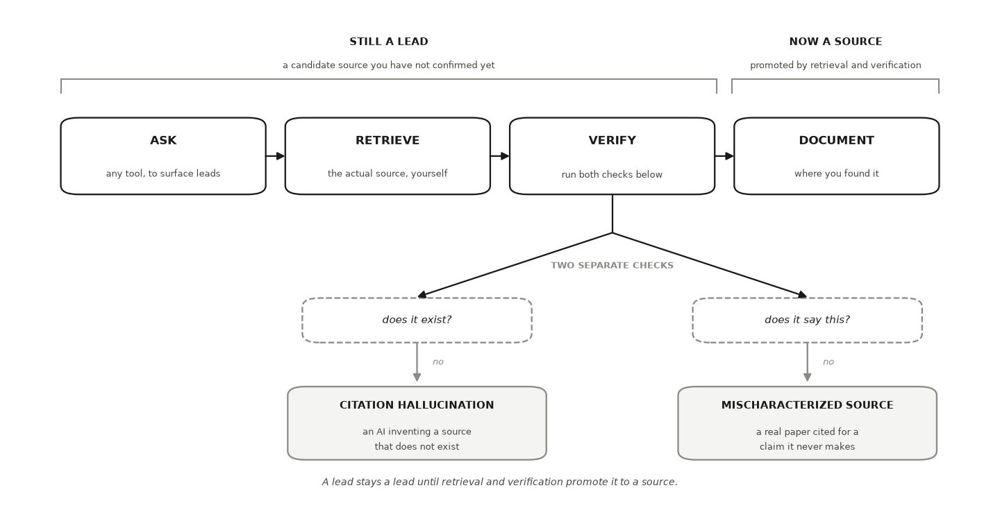

---
# GENERATED FILE — DO NOT EDIT.
# Written by scripts/build_studio_slides.py from the EDR|AI book:
#   book/studios/studio03-ground-in-evidence.qmd      (the studio's promise)
#   the studio's chapters                                 (its argument)
#   book/studios/milestone03-ground-in-evidence.qmd   (its milestone)
# Editorial overlay: planning/BOOK_SLIDE_PLANS/<lesson-id>.yml
# Lessons on this deck: research-builds verifying-prior-evidence
# Edit the CHAPTER (or its plan) and rerun the script. Edits made here are
# silently reverted on the next build and fail `--check` in CI.
title: "HONR 46400 · Evidence-Driven Research"
subtitle: "Studio 3 — Ground it in verified evidence"
author: "Davi Moreira"
format:
  revealjs:
    theme: [default, _theme/edrai-slides.scss]
    include-in-header: _theme/head.html
    include-after-body: _theme/fit.html
    width: 1600
    height: 900
    margin: 0.07
    center: false
    slide-number: c/t
    show-slide-number: all
    transition: fade
    background-transition: fade
    transition-speed: fast
    incremental: false
    hash: true
    hash-type: number
    history: false
    progress: true
    controls: true
    controls-layout: bottom-right
    touch: true
    preview-links: auto
    link-external-newwindow: true
    logo: _theme/edrai_logo.png
    footer: "EDR|AI · Studio 3 — Ground it in verified evidence"
    chalkboard:
      buttons: false
    menu:
      side: left
      width: wide
      numbers: true
    code-line-numbers: false
    highlight-style: github
    fig-align: center
---

## What you can defend when you leave {data-menu-title="Studio 3 · What you can defend when you leave"}

::: {.kicker}

Studio 3

:::

::::: {.slide-body}

::: {.decision}

Find out what is already known, verify that it is actually known, and let it
change your question.

:::

:::::


## The milestone ahead {data-menu-title="Studio 3 · The milestone ahead"}

::: {.kicker}

Studio 3

:::

::::: {.slide-body}

This studio closes with **[Milestone 3: Your evidence
base](https://davi-moreira.github.io/2026F_evidence_driven_research_purdue_HONR464/book/studios/milestone03-ground-in-evidence.html)**,
a short chapter of its own after the lessons. **What it asks you to produce.**
An evidence registry of verified sources, your search log, an evidence map,
and an explicit revision of your Studio 2 declaration.

:::::

::: {.notes}

No question is asked in an empty room. Before you spend months answering
yours, this milestone makes you find out what is already known, verify that it
is actually known rather than merely repeated, and let the verified record
change your question. It is also where the book's evidence rail becomes
physical: the registry you assemble here is what every later citation traces
back to, all the way to the release audit in Studio 12.

Milestone 4 takes your revised question and the gap your evidence map exposed,
and writes them into a research contract that can be diagnosed. The milestone
chapter keeps the working details: the practice steps, the versioned record,
and how the artifact is assessed.

:::


## The lessons in this studio {data-menu-title="Studio 3 · The lessons in this studio"}

::: {.kicker}

Studio 3 · Road map

:::

::::: {.slide-body}

- [Lesson 8 — Research Builds on Research](https://davi-moreira.github.io/2026F_evidence_driven_research_purdue_HONR464/book/part2-curiosity-to-design/07-research-builds-on-research.html): your candidate source list with a status column, seeded by your own search, an AI sweep, and hand snowballing, with a lead source marked.
- [Lesson 9 — Finding and Verifying Prior Evidence](https://davi-moreira.github.io/2026F_evidence_driven_research_purdue_HONR464/book/part2-curiosity-to-design/08-finding-and-verifying-prior-evidence.html): your verified sources, your evidence map with its quiet spot, your gap written as one bounded sentence, and your revised declaration — or the defended reason it holds.

:::::


## Research Builds on Research {background-color="#1a1a19" .divider data-menu-title="CHAPTER 8 — Research Builds on Research"}

::: {.kicker}

Lesson 1 of this studio · Chapter 8

:::

::: {.divider-line}

which conversation your question joins, and which leads are worth your time

:::


## The research decision {data-menu-title="Ch 8 · The research decision"}

::: {.kicker}

Chapter 8

:::

::::: {.slide-body}

::: {.decision}

Which conversation your question joins, and which of the candidate sources a
search or an AI hands you are worth chasing. You decide what goes on the list
and what gets dropped. Nothing on that list counts as evidence yet.

:::

:::::


## An advisor circles one line in your first draft {data-menu-title="Ch 8 · An advisor circles one line in your first draft"}

::: {.kicker}

Chapter 8 · Why this decision matters

:::

::::: {.slide-body}

- "You cite six papers. Where did they come from, and what argument are they having?"
- Research never starts from zero.
- Someone has already asked something close to your question.
- Find them before you spend months rediscovering what they already know.

:::::

::: {.notes}

The decision on the table is which conversation your question joins, and which
leads are worth your time. Ask the room where the six papers in their own
draft would come from today. The chapter's answer to the advisor is that
someone has already asked something close, and finding those people is the
work the rest of the chapter sets up.

:::


## Miss the study, or build on a paper nobody wrote {data-menu-title="Ch 8 · Miss the study, or build on a paper nobody wrote"}

::: {.kicker}

Chapter 8 · Why this decision matters

:::

::::: {.slide-body}

- Get the search wrong in one direction and you miss the study that answers you.
- Get it wrong in the other and you build on a citation nobody ever wrote.
- Get it right and an afternoon buys you years of other people's work.

:::::

::: {.notes}

The chapter names two ways to get the search wrong, and they fail differently.
One leaves you rediscovering work that already exists. The other puts a
citation nobody ever wrote underneath your argument, which is exactly what the
worked example shows a tool doing. Keep the chapter's bound in view: this is
the gathering step, so nothing on your list counts as evidence yet.

:::


## You join a running argument; you do not found an island {data-menu-title="Ch 8 · You join a running argument; you do not found an island"}

::: {.kicker}

Chapter 8 · The concept

:::

::::: {.slide-body}

- One team measures how a policy moved turnout in one state.
- A second repeats it elsewhere. A third pools both.
- A field is a running argument, each study answering, extending, or challenging the ones before it (Booth et al. 2024).
- Your job is not to invent an island. Add one honest sentence.

:::::

::: {.notes}

The book's name for this is a cumulative conversation, and it is why a
literature search is not an administrative chore. You are looking for the
people already arguing about your question, so that your one sentence lands
somewhere. Ask the room which argument their question would be joining.

:::


## Nothing you gathered is a source yet {data-menu-title="Ch 8 · Nothing you gathered is a source yet"}

::: {.kicker}

Chapter 8 · The concept

:::

::::: {.slide-body}

::: {.lead}

Everything you gather starts as a lead.

:::

:::: {.terms}

::: {.term}

[Cumulative conversation]{.t}

[a running argument where each study answers, extends, or challenges the ones before it]{.d}

:::

::: {.term}

[Lead]{.t}

[a candidate source you have not checked yet, such as a citation an AI hands you]{.d}

:::

::: {.term}

[Retrieval-verification loop]{.t}

[ask a tool for leads, retrieve the source yourself, verify it exists and says what was claimed, and document where you found it]{.d}

:::

::::

:::::

::: {.notes}

A lead stays a lead until you retrieve and read it. The loop has four steps,
and this chapter is only the first one, gathering well. The next chapter is
where leads earn promotion, so hold the vocabulary strictly now: calling
something a source before you have opened it is the error the whole loop
exists to prevent.

:::


## Two solid sources, walked both ways, quickly become ten {data-menu-title="Ch 8 · Two solid sources, walked both ways, quickly become ten"}

::: {.kicker}

Chapter 8 · The concept

:::

::::: {.slide-body}

- Snowballing grows your list from one real source by walking its links two ways (Greenhalgh & Peacock 2005).
- Backward citation search reads the source's own reference list for the older work it built on.
- Forward citation search finds the newer papers that cite it.
- The ten arrive with their relationships already visible.

:::::

::: {.notes}

Snowballing has to start from one real retrieved source, so the seed is
something you retrieve yourself rather than something a tool returns. Backward
gives you the older work the source built on, forward the newer work citing
it. Ask who has actually opened a reference list this term, and what they
found two steps back.

:::


## A real gap and an abandoned search look identical from your desk {data-menu-title="Ch 8 · A real gap and an abandoned search look identical from your desk"}

::: {.kicker}

Chapter 8 · The concept

:::

::::: {.slide-body}

- A genuine gap is a question your verified sources actually leave unanswered (Snyder 2019).
- You confirm it by looking both ways, backward and forward.
- An unfinished search is one you simply stopped chasing.
- Only one of the two is a contribution.

:::::

::: {.notes}

This is the sentence to hold onto: from your desk the two feel the same. What
separates them is whether the sources around the empty spot were retrieved and
read. Snowballing is what turns a hunch about a gap into something you can
defend when someone asks how hard you looked.

:::


## The evidence map marks the spot no source reaches {data-menu-title="Ch 8 · The evidence map marks the spot no source reaches"}

::: {.kicker}

Chapter 8 · The concept

:::

::::: {.slide-body}

- Each source becomes one claim node: what it asserts, in one sentence.
- Lines connect claims that agree or contradict.
- One marked spot shows where no source reaches, and that is your candidate gap.
- It is honest only when every node around it is a source you opened yourself.

:::::

::: {.notes}

Forcing each source into one sentence is the work, because the node has to
state what that source asserts. The map makes agreements and contradictions
visible, and it makes the empty spot visible too. Hold the chapter's bound on
the last line: the spot becomes honest only when every node around it is a
source you opened yourself.

:::


## One question, two parts: how much, and for whom {data-menu-title="Ch 8 · One question, two parts: how much, and for whom"}

::: {.kicker}

Chapter 8 · A worked example

:::

::::: {.slide-body}

- Your curiosity is voting, and how far people live from the polling place seems to matter.
- Your question: does moving a polling place farther away lower turnout?
- And does the drop land harder in some neighborhoods than others?

:::::

::: {.notes}

The question carries two parts, an average effect and a difference across
neighborhoods. Keep both in view, because the candidate gap at the end of this
example lives in the second part and not the first.

:::


## The journal in the AI's citation does not exist {data-menu-title="Ch 8 · The journal in the AI's citation does not exist"}

::: {.kicker}

Chapter 8 · A worked example

:::

::::: {.slide-body}

- You ask an AI for the key studies and get one confident citation.
- Two plausible author names, a 2019 date, an official-sounding journal title.
- It reads like a longer version of the real *Electoral Studies*.
- Nothing in your library portal, nothing on Google Scholar, nothing on the publisher's site.
- The citation was manufactured, and it took four minutes to find out.

:::::

::: {.notes}

Notice what made it convincing: the shape was right, and the journal name sat
close to a real one. Notice also how cheap the check was. You searched the
exact title in your library portal, on Google Scholar, and on the publisher's
site, and four minutes settled it.

:::


## One retrieved review becomes six real sources in an hour {data-menu-title="Ch 8 · One retrieved review becomes six real sources in an hour"}

::: {.kicker}

Chapter 8 · A worked example

:::

::::: {.slide-body}

- Retrieve one real review of polling-place location and turnout, and read it.
- Backward: the older work on the costs of voting it builds on.
- Forward: recent studies using precinct-level administrative records.
- Within an hour your list holds a half-dozen real sources and one live disagreement.

:::::

::: {.notes}

This is the loop run properly, and the difference from the failed attempt is
that you opened something. One review read carefully carries two directions of
search inside it already. Ask what the seed would be for the question each
person brought to class.

:::


## The disagreement is the live edge of the field {data-menu-title="Ch 8 · The disagreement is the live edge of the field"}

::: {.kicker}

Chapter 8 · A worked example

:::

::::: {.slide-body}

- Some studies find relocating a polling place shaves a point or two off turnout.
- Others find voters switch to mail ballots and total turnout barely moves.
- That disagreement tells you the question is unsettled.
- For some questions, snowballing finds what database queries miss (Greenhalgh & Peacock 2005).

:::::

::: {.notes}

A disagreement inside your list is a finding about the field, not a failure of
your search. It marks where the open work is. Snowballing being a documented
search method is the chapter's claim, and it is stated for some questions, not
as a replacement for database searching.

:::


## The broad question is no gap; the narrow one may be {data-menu-title="Ch 8 · The broad question is no gap; the narrow one may be"}

::: {.kicker}

Chapter 8 · A worked example

:::

::::: {.slide-body}

- "Does distance affect turnout" is no gap. The literature is enormous.
- Whether the drop concentrates in neighborhoods without a car may be genuine.
- You can defend it only because you gathered the sources around it.
- And because you are about to open every one.

:::::

::: {.notes}

This is the decision the chapter says stays yours. The one citation the AI
handed you was manufactured, so nothing it gave you narrowed anything. What
makes the narrow question defensible is the retrieval you are about to do.
Note the chapter's own hedge: the narrower question may be genuine, and only
retrieval that comes up empty earns the word.

:::


## Six records, and the one variable behind the disagreement {data-menu-title="Ch 8 · Six records, and the one variable behind the disagreement"}

::: {.kicker}

Chapter 8 · A worked example

:::

::::: {.slide-body}

- Six retrieved records stand in for the reading you do by hand.
- Watch the two means: records that ignored mail switching against those that measured it.
- No citations are planted here, because a fabricated source is what you are learning to catch.

```python
import numpy as np, pandas as pd
SEED = 464
rng = np.random.default_rng(SEED)

# Six retrieved records on polling-place distance and turnout. NO fabricated
# citations appear here: these are anonymous stand-ins for records you open
# yourself. The one thing that differs is what each record measured.
measured_switching = np.array([False, False, False, True, True, True])
effects = np.round(np.where(measured_switching, -0.2, -1.5)
                   + rng.normal(0, 0.35, size=6), 2)
print(pd.DataFrame({"record": [f"record {i}" for i in range(1, 7)],
                    "turnout change (pp)": effects,
                    "measured mail switching": measured_switching}).to_string(index=False))
print(f"\nmean where switching was ignored : "
      f"{effects[~measured_switching].mean():+.2f} pp")
print(f"mean where switching was measured: "
      f"{effects[measured_switching].mean():+.2f} pp")
print("\nthe live disagreement is not noise. it tracks what each record measured")
```

:::::

::: {.notes}

The block is seeded at 464, so the printed numbers are the same on every run.
The two means are the point: the disagreement in the table is not noise, and
it tracks what each record measured. Ask which of the six records you would
want to open first, and why.

:::


## An AI failure case {data-menu-title="Ch 8 · An AI failure case"}

::: {.kicker}

Chapter 8

:::

::::: {.slide-body}

::: {.failure}

[Where the tool failed]{.label}

The most common failure here is **citation hallucination**, the taxonomy's
*confident fabrication*: the model invents a source and presents it with full
confidence. In the worked example it produced a plausible author pair, a 2019
date, and a journal that does not exist. You caught it in a minute by
searching the exact title in quotes across your library portal and Google
Scholar and finding nothing. Fluent confidence is not evidence. If you cannot
locate a source where it should live, treat it as fabricated until you prove
otherwise.

:::

:::::


## Do not delegate {data-menu-title="Ch 8 · Do not delegate"}

::: {.kicker}

Chapter 8

:::

::::: {.slide-body}

::: {.rule-human}

[This stays yours]{.label}

Two decisions never leave your hands. Whether a source counts as **verified**:
only reading it yourself settles that. And whether your **gap is real**: only
retrieval that comes up empty earns the word. What your project may claim
follows from those two. An AI can point; it cannot certify.

:::

:::::


## It is your turn {data-menu-title="Ch 8 · It is your turn"}

::: {.kicker}

Chapter 8 · Your move

:::

::::: {.slide-body}

1. Write your lead question at the top of a fresh page.
2. Search once yourself before you delegate.
3. Ask an AI for five more candidates on the same question, each with authors, year, exact title, and venue.
4. Snowball your seed by hand.
5. Put all of them in one candidate list with a status column, and write `lead` in every row.
6. Log the delegation in your AI Research Ledger, and verify at least one candidate now with a named method from the [Verification Guide](https://davi-moreira.github.io/2026F_evidence_driven_research_purdue_HONR464/book/verification-guide.html); primary-source reading is the one that fits.

::: {.turn}
Work it in the [companion notebook](https://colab.research.google.com/github/davi-moreira/2026F_evidence_driven_research_purdue_HONR464/blob/main/notebooks/book/ch08_research_builds_on_research.ipynb) with [Chapter 8](https://davi-moreira.github.io/2026F_evidence_driven_research_purdue_HONR464/book/part2-curiosity-to-design/07-research-builds-on-research.html) open beside it. Log every delegation in your AI Research Ledger.
:::

:::::

::: {.notes}

The chapter's numbered steps, in the book's own order. The AI prompts each
step carries live in the companion notebook.

:::


## Finding and Verifying Prior Evidence {background-color="#1a1a19" .divider data-menu-title="CHAPTER 9 — Finding and Verifying Prior Evidence"}

::: {.kicker}

Lesson 2 of this studio · Chapter 9

:::

::: {.divider-line}

which leads become verified evidence, and whether the quiet spot on your map
is a real gap

:::


## The research decision {data-menu-title="Ch 9 · The research decision"}

::: {.kicker}

Chapter 9

:::

::::: {.slide-body}

::: {.decision}

Which of your candidate leads survive retrieval and reading, and therefore
become evidence you may build on, and whether the quiet spot they leave on
your map is a genuine gap or a search you stopped too early.

:::

:::::


## Your advisor asks for the conversation, not a pile of summaries {data-menu-title="Ch 9 · Your advisor asks for the conversation, not a pile of summaries"}

::: {.kicker}

Chapter 9 · Why this decision matters

:::

::::: {.slide-body}

- She hands your first draft back: "Show me the conversation your work joins."
- Which studies agree, which fight, and where exactly is the hole you say you are filling?
- That question decides whether your project has a place to stand.

:::::

::: {.notes}

Open with the scene, because it is the moment the reader is heading toward.
The advisor is not asking for more sources. She is asking whether you can
locate your own question inside a running argument. Ask the room: if someone
asked you that today, could you answer it for your project?

:::


## Two ways to get it wrong, and both are expensive {data-menu-title="Ch 9 · Two ways to get it wrong, and both are expensive"}

::: {.kicker}

Chapter 9 · Why this decision matters

:::

::::: {.slide-body}

- Cite a source that does not exist, and every result resting on it is compromised.
- Same damage if the source is real but does not say what you claim.
- Announce a gap a paper already filled, and you have promised a contribution you cannot deliver.
- This chapter is where you make both calls, on the record.

:::::

::: {.notes}

The chapter names two ways to get it wrong: a citation that fails, and a gap a
paper already filled. Keep them apart, because the fixes are different. The
citation failure has two forms of its own, one caught by trying to retrieve
the source and one only by reading it. Both calls are ones you sign, which is
why the chapter treats them as a research decision rather than a chore at the
end.

:::


## A field is a running argument, and your job is to join it {data-menu-title="Ch 9 · A field is a running argument, and your job is to join it"}

::: {.kicker}

Chapter 9 · The concept

:::

::::: {.slide-body}

- One team reports that a soil treatment raises crop yield.
- The next tests whether the effect holds in a different climate.
- Your job is not to invent an island.
- Find the conversation your question belongs to and add one honest sentence.

:::::

::: {.notes}

The cumulative conversation is the idea everything else in the chapter hangs
on. Each study answers, extends, or challenges the ones before it. Keep the
crop-yield pair concrete before you generalize, and hold the chapter's target
in view: one honest sentence added to a running argument, not an island of
your own.

:::


## A lead stays a lead until you retrieve and read it yourself {data-menu-title="Ch 9 · A lead stays a lead until you retrieve and read it yourself"}

::: {.kicker}

Chapter 9 · The concept

:::

::::: {.slide-body}

:::: {.terms}

::: {.term}

[Lead]{.t}

[a candidate source you have not confirmed yet]{.d}

:::

::: {.term}

[Retrieval-verification loop]{.t}

[ask any tool to surface leads, retrieve the actual source yourself, verify it exists and says what was claimed, document where you found it]{.d}

:::

::::

- Four steps, and every source you keep passes through them (Snyder 2019).
- Retrieval and verification are what promote a lead into a source.

:::::

::: {.notes}

The loop is the habit the whole chapter is trying to install. The tool can do
the first step. The other three are yours, and the second one, retrieving the
actual source, is where a fabricated citation is caught. Ask the room how many
of their current references they have personally opened.

:::


## Real and mischaracterized are two separate checks {data-menu-title="Ch 9 · Real and mischaracterized are two separate checks"}

::: {.kicker}

Chapter 9 · The concept

:::

::::: {.slide-body}

:::: {.terms}

::: {.term}

[Citation hallucination]{.t}

[an AI inventing a source that does not exist, dressed in a real-sounding author pair, a recent year, and a plausible journal]{.d}

:::

::: {.term}

[Mischaracterized source]{.t}

[a real paper cited for a claim it never makes, such as a study reporting a correlation cited as proof of a cause]{.d}

:::

::::

- A source can be real and still be mischaracterized (Ji et al. 2023).
- "Does it exist" and "does it say this" are two questions. Run both.

:::::

::: {.notes}

This is the slide to slow down on. The instinct is to treat existence as the
whole test, so a real paper feels safe once it resolves. The
correlation-cited-as-cause example is the one to press: nothing about
retrieval catches it, only reading the results section does.

:::


## A lead becomes a source only by passing both checks {data-menu-title="Ch 9 · A lead becomes a source only by passing both checks"}

::: {.kicker}

Chapter 9 · The concept

:::

::::: {.slide-body}

- Ask, retrieve, verify, document. The tool does the first step; the other three are yours.
- Verify is two questions, not one: does it exist, and does it say this?
- Each question catches its own named failure.

{fig-align="center" width="100%" fig-alt="Four boxes in a row: ask any tool to surface leads; retrieve the actual source yourself; verify, running both checks below; and document where you found it. A span above the first three reads still a lead, a candidate source you have not confirmed yet; a span above the last reads now a source, promoted by retrieval and verification. Below verify, a fork leads to two questions: does it exist, and does it say this. A no to the first is a citation hallucination, an AI inventing a source that does not exist. A no to the second is a mischaracterized source, a real paper cited for a claim it never makes."}

:::::

::: {.notes}

Walk the chain left to right once, then stop at Verify and make the fork do
the work: two questions, two failures, and a source that passes one can still
fail the other. Ask the room which of the two they actually run on a reference
they already trust.

:::


## Two solid sources, snowballed both ways, become ten {data-menu-title="Ch 9 · Two solid sources, snowballed both ways, become ten"}

::: {.kicker}

Chapter 9 · The concept

:::

::::: {.slide-body}

- Snowballing walks a verified source's links in two directions.
- Backward: read its reference list to find the older work it built on.
- Forward: follow the "Cited by" trail to newer works that cite it.

:::::

::: {.notes}

Snowballing is how a small verified set grows without going back to a blind
keyword search. It also matters for the next slide, because the gap test asks
for one backward and one forward link from each verified source.

:::


## You earn the word gap only after real sources stay silent {data-menu-title="Ch 9 · You earn the word gap only after real sources stay silent"}

::: {.kicker}

Chapter 9 · The concept

:::

::::: {.slide-body}

:::: {.terms}

::: {.term}

[Genuine gap]{.t}

[a question your verified sources actually leave unanswered, confirmed by looking]{.d}

:::

::: {.term}

[Unfinished search]{.t}

[a question you simply stopped chasing]{.d}

:::

::::

- From your desk they feel identical, and only one is a real contribution.
- The test is retrieval, followed forward and backward (Greenhalgh & Peacock 2005).

:::::

::: {.notes}

Keep the bound the chapter puts on the word gap. You have not found a gap
because you did not find anything; you have found one when real sources you
opened, followed in both directions, still say nothing about your question.
Writing "my search is unfinished" is an honest result, not a failure.

:::


## Biochar in sandy fields, and a citation that is nowhere {data-menu-title="Ch 9 · Biochar in sandy fields, and a citation that is nowhere"}

::: {.kicker}

Chapter 9 · A worked example

:::

::::: {.slide-body}

- Your question: does biochar raise maize yield in sandy fields?
- The AI returns a named author pair, a 2021 date, a real-sounding soil-science journal.
- The finding is tidy: biochar lifted yield by 18 percent.
- You go to read it. Not in the library portal, not on Google Scholar.

:::::

::: {.notes}

Biochar is charcoal made from crop waste and mixed into soil, so the question
is a real one in crop science. Everything about the returned citation looks
right, which is the point. The detail is what makes it convincing, and the
detail is not evidence of existence.

:::


## A missing study is not proof that nobody has tested it {data-menu-title="Ch 9 · A missing study is not proof that nobody has tested it"}

::: {.kicker}

Chapter 9 · A worked example

:::

::::: {.slide-body}

- Three things could be true when a citation will not resolve.
- Fabricated whole, and there is nothing to find.
- Garbled: right idea, wrong author or year, so search the claim itself.
- Paywalled or obscure, reachable through your library or by emailing the author.
- Your move is the same in all three: the lead stays out until retrieval succeeds.

:::::

::: {.notes}

This is the decision the section is built around. The tempting reading is that
an empty search proves the gap, and it proves nothing of the kind. Note that
the three cases have different follow-ups but the same bookkeeping rule, which
is what keeps the verified column honest.

:::


## Four retrieved sources, snowballed, and a gap you can defend {data-menu-title="Ch 9 · Four retrieved sources, snowballed, and a gap you can defend"}

::: {.kicker}

Chapter 9 · A worked example

:::

::::: {.slide-body}

- You retrieve four soil-science studies through the library database and read each one.
- Backward from a 2019 field trial: the older greenhouse study it built on.
- Forward through "Cited by": two newer trials in loam and clay.
- None of the four you retrieved ran the trial in the sandy soil your county farms.

:::::

::: {.notes}

Now the conversation is visible: biochar helps yield in some soils, the size
of the effect varies, and the sandy case is untested among the sources you
opened. That quiet spot is ringed by papers you retrieved yourself, which is
exactly what makes it defensible in front of the advisor from the first slide.

:::


## Twelve leads, four in the verified column {data-menu-title="Ch 9 · Twelve leads, four in the verified column"}

::: {.kicker}

Chapter 9 · A worked example

:::

::::: {.slide-body}

- Watch the tally, not the titles. The block carries no citations at all.
- Four opened. Three garbled, two paywalled, three found nothing.
- The eight that did not open are not evidence that nobody studied your question.

```python
import numpy as np, pandas as pd
SEED = 464
rng = np.random.default_rng(SEED)

# Twelve leads returned by a search, each with what happened when you tried to
# retrieve it. The statuses are anonymous: no citation appears here, real or
# invented. Four opened; the rest are still leads.
status = rng.permutation(["retrieved"] * 4
                         + ["garbled (real, wrong metadata)"] * 3
                         + ["paywalled (request sent)"] * 2
                         + ["nothing found"] * 3)
leads = pd.DataFrame({"lead": range(1, 13), "retrieval status": status})
print(leads.to_string(index=False))
counts = pd.Series(status).value_counts()
print("\n" + counts.to_string())
print(f"\nverified column           : {counts.get('retrieved', 0)}")
print("everything else stays OUT until retrieval succeeds — a lead you could")
print("not open is not evidence that nobody has studied your question")
```

:::::

::: {.notes}

Run it and read the counts aloud. The statuses are the evidence here, and the
tally is the number that decides whether you have earned the word gap. Ask the
room what their own twelve would look like today.

:::


## An AI failure case {data-menu-title="Ch 9 · An AI failure case"}

::: {.kicker}

Chapter 9

:::

::::: {.slide-body}

::: {.failure}

[Where the tool failed]{.label}

The failure to expect here is confident fabrication. Ask a general-purpose
tool for "the most-cited study on biochar and maize yield in sandy soil" and
it will often produce one, complete with a DOI-shaped string and a real
journal name, because producing a fluent citation is exactly what it is built
to do. The detail is not evidence of existence. You catch it the moment you
try to retrieve it: paste the exact title in quotation marks into the library
database and Google Scholar. If nothing resolves anywhere it should live, the
citation is fabricated until proven otherwise, and it never enters your
ledger. The fluency was the trap; the empty search result is the tell.

:::

:::::


## Do not delegate {data-menu-title="Ch 9 · Do not delegate"}

::: {.kicker}

Chapter 9

:::

::::: {.slide-body}

::: {.rule-human}

[This stays yours]{.label}

Two calls stay yours alone, because your name goes on the map. First,
**whether a source counts as verified**: you retrieved it, opened it, and read
the claim yourself, so no AI summary substitutes for the paper. Second,
**whether your gap is genuine**: you walked one backward and one forward link
from each verified source and the question still stands unanswered. An AI can
point; only you can vouch.

:::

:::::


## It is your turn {data-menu-title="Ch 9 · It is your turn"}

::: {.kicker}

Chapter 9 · Your move

:::

::::: {.slide-body}

1. Try to retrieve every candidate on your list.
2. Open the ones that resolve and read them.
3. Criticize each one.
4. Draw your evidence map: one node per verified source, lines between the ones that agree, and a marked line between any two that disagree.
5. Find the quiet spot on the map and write your gap as one bounded sentence: "Across the sources I retrieved and verified, ___ has not been established for ___." If the honest version is "my search is still unfinished," write that instead.
6. Close the loop on your declaration: rewrite your declared question in light of the map, or defend leaving it unchanged with a reason tied to a specific node, and record the resulting version with its reason.
7. Log the verification work in your AI Research Ledger, naming the method you used from the [Verification Guide](https://davi-moreira.github.io/2026F_evidence_driven_research_purdue_HONR464/book/verification-guide.html); primary-source reading is the one that fits every citation.

::: {.turn}
Work it in the [companion notebook](https://colab.research.google.com/github/davi-moreira/2026F_evidence_driven_research_purdue_HONR464/blob/main/notebooks/book/ch09_finding_and_verifying_prior_evidence.ipynb) with [Chapter 9](https://davi-moreira.github.io/2026F_evidence_driven_research_purdue_HONR464/book/part2-curiosity-to-design/08-finding-and-verifying-prior-evidence.html) open beside it. Log every delegation in your AI Research Ledger.
:::

:::::

::: {.notes}

The chapter's numbered steps, in the book's own order. The AI prompts each
step carries live in the companion notebook.

:::


## Milestone 3: Your evidence base {background-color="#1a1a19" .divider data-menu-title="MILESTONE 3 — Milestone 3: Your evidence base"}

::: {.kicker}

Studio 3 closes here

:::

::: {.divider-line}

What the lessons handed you becomes one artifact you can defend.

:::


## What this milestone produces {data-menu-title="M3 · What this milestone produces"}

::: {.kicker}

Milestone 3

:::

::::: {.slide-body}

::: {.decision}

[The artifact]{.label}

**What this milestone produces.** An evidence registry of verified sources, your search log, an evidence map, and an explicit revision of your Studio 2 declaration.

:::

:::::


## What you bring {data-menu-title="M3 · What you bring"}

::: {.kicker}

Milestone 3 · Check before you start

:::

::::: {.slide-body}

- [Lesson 8 — Research Builds on Research](https://davi-moreira.github.io/2026F_evidence_driven_research_purdue_HONR464/book/part2-curiosity-to-design/07-research-builds-on-research.html): your candidate source list with a status column, seeded by your own search, an AI sweep, and hand snowballing, with a lead source marked.
- [Lesson 9 — Finding and Verifying Prior Evidence](https://davi-moreira.github.io/2026F_evidence_driven_research_purdue_HONR464/book/part2-curiosity-to-design/08-finding-and-verifying-prior-evidence.html): your verified sources, your evidence map with its quiet spot, your gap written as one bounded sentence, and your revised declaration — or the defended reason it holds.

:::::


## The practice {data-menu-title="M3 · The practice"}

::: {.kicker}

Milestone 3 · In the studio

:::

::::: {.slide-body}

1. Search deliberately and log every search: where you looked, what terms, what you found and did not.
2. Verify each source you intend to cite by retrieving and reading it, never by trusting a summary.
3. Build the evidence map: what is settled, what is contested, what is missing.
4. Write the revision: how your question changed, or a defended statement of why it did not.

:::::


## The four rails, here {data-menu-title="M3 · The four rails, here"}

::: {.kicker}

Milestone 3 · Every studio, these four

:::

::::: {.slide-body}

:::: {.rails}

::: {.rail}

[Ethics, permissions, and data exposure]{.t}

[Record the licence and terms of any dataset you found here, before you plan to use it.]{.d}

:::

::: {.rail}

[Evidence, provenance, and reproducibility]{.t}

[This studio IS the evidence rail's home; every later citation traces to this registry.]{.d}

:::

::: {.rail}

[AI activity, verification, and human decisions]{.t}

[Every AI-suggested source is unverified until you have opened it yourself.]{.d}

:::

::: {.rail}

[Uncertainty, claim boundary, and revision history]{.t}

[Note where the literature disagrees; that disagreement is uncertainty you inherit.]{.d}

:::

::::

:::::


## A version, not a pass {data-menu-title="M3 · A version, not a pass"}

::: {.kicker}

Milestone 3

:::

::::: {.slide-body}

::: {.note-card}

[How the record works]{.label}

Your milestone artifact is a dated, numbered **version** with the reason for
the version attached. When later evidence changes it, you write the next
version rather than editing the last one, because the sequence of changes is
itself part of your research record.

:::

:::::


## The one rule {background-color="#1a1a19" .divider data-menu-title="THE ONE RULE"}

::: {.creed}
AI is your arm and your research assistant, not your brain.
:::

::: {.divider-line}
AI can review AI, and a second model is a real auditor of the first. The
last decision is always human.
:::

::: {.deck-links}
[Studio 3 in EDR|AI](https://davi-moreira.github.io/2026F_evidence_driven_research_purdue_HONR464/book/studios/studio03-ground-in-evidence.html) · [Milestone 3](https://davi-moreira.github.io/2026F_evidence_driven_research_purdue_HONR464/book/studios/milestone03-ground-in-evidence.html) · [Verification Guide](https://davi-moreira.github.io/2026F_evidence_driven_research_purdue_HONR464/book/verification-guide.html)
:::
