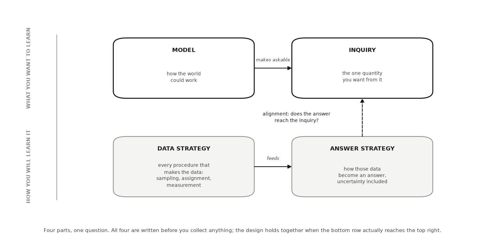
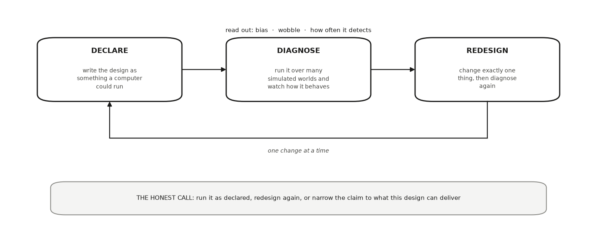

---
# GENERATED FILE — DO NOT EDIT.
# Written by scripts/build_studio_slides.py from the EDR|AI book:
#   book/studios/studio04-declare-and-diagnose.qmd      (the studio's promise)
#   the studio's chapters                                 (its argument)
#   book/studios/milestone04-declare-and-diagnose.qmd   (its milestone)
# Editorial overlay: planning/BOOK_SLIDE_PLANS/<lesson-id>.yml
# Lessons on this deck: mida uncertainty-foundations declare-diagnose ethics-data-governance
# Edit the CHAPTER (or its plan) and rerun the script. Edits made here are
# silently reverted on the next build and fail `--check` in CI.
title: "HONR 46400 · Evidence-Driven Research"
subtitle: "Studio 4 — Declare and diagnose provisionally"
author: "Davi Moreira"
format:
  revealjs:
    theme: [default, _theme/edrai-slides.scss]
    include-in-header: _theme/head.html
    include-after-body: _theme/fit.html
    width: 1600
    height: 900
    margin: 0.07
    center: false
    slide-number: c/t
    show-slide-number: all
    transition: fade
    background-transition: fade
    transition-speed: fast
    incremental: false
    hash: true
    hash-type: number
    history: false
    progress: true
    controls: true
    controls-layout: bottom-right
    touch: true
    preview-links: auto
    link-external-newwindow: true
    logo: _theme/edrai_logo.png
    footer: "EDR|AI · Studio 4 — Declare and diagnose provisionally"
    chalkboard:
      buttons: false
    menu:
      side: left
      width: wide
      numbers: true
    code-line-numbers: false
    highlight-style: github
    fig-align: center
---

## What you can defend when you leave {data-menu-title="Studio 4 · What you can defend when you leave"}

::: {.kicker}

Studio 4

:::

::::: {.slide-body}

::: {.decision}

Write your design down as something specific enough to be diagnosed, then find
out how it behaves before it costs you anything.

:::

:::::


## The milestone ahead {data-menu-title="Studio 4 · The milestone ahead"}

::: {.kicker}

Studio 4

:::

::::: {.slide-body}

This studio closes with **[Milestone 4: Your research contract,
v0](https://davi-moreira.github.io/2026F_evidence_driven_research_purdue_HONR464/book/studios/milestone04-declare-and-diagnose.html)**,
a short chapter of its own after the lessons. **What it asks you to produce.**
Research Contract v0 — objective, target estimand, population, setting and
time, data strategy, a provisional operationalization you mark for revision,
warrant, answer strategy and uncertainty statement — plus the design
properties you diagnosed (its bias, its wobble, and how often it would detect
what you are looking for), your permission status, and a redesign record.
Measurement proper is taught and assessed in Studio 6; here you only commit to
a starting choice and say why it is defensible for now.

:::::

::: {.notes}

This is the hinge of the book. Everything before it shaped a question;
everything after it executes a design. The contract you write here (objective,
estimand, population, data strategy, a provisional operationalization,
warrant, answer strategy, uncertainty) is declared before any result exists,
so that later changes are visibly design or visibly drift. Diagnosing it on
simulated data now, while changing your mind is still free, is what makes the
declaration honest rather than decorative. The four MIDA parts you declare
here, and the declare-and-diagnose loop you run on them, were introduced by
Blair, Cooper, Coppock, and Humphreys (Blair et al. 2019) and developed in
RDSS (Blair et al. 2023); this book puts them in plain language and joins them
to a governed AI workflow.

Milestone 5 commits the contract to one research pathway and writes what that
pathway can and cannot establish. The milestone chapter keeps the working
details: the practice steps, the versioned record, and how the artifact is
assessed.

:::


## The lessons in this studio {data-menu-title="Studio 4 · The lessons in this studio"}

::: {.kicker}

Studio 4 · Road map

:::

::::: {.slide-body}

- [Lesson 10 — Model, Inquiry, Data Strategy, and Answer Strategy](https://davi-moreira.github.io/2026F_evidence_driven_research_purdue_HONR464/book/part2-curiosity-to-design/09-model-inquiry-data-strategy-and-answer-strategy.html): your MIDA declaration: model, inquiry, data strategy, and answer strategy, with the alignment sentence that ties them together — carrying population, setting and time, the provisional operationalization, and the warrant into Contract v0.
- [Lesson 11 — Uncertainty Before You Need It](https://davi-moreira.github.io/2026F_evidence_driven_research_purdue_HONR464/book/part2-curiosity-to-design/uncertainty-foundations.html): your estimand and estimator, the repeat-run story behind them, your dependence structure, and your uncertainty sentence next to its wrong twin.
- [Lesson 12 — Declaring and Diagnosing a Research Design](https://davi-moreira.github.io/2026F_evidence_driven_research_purdue_HONR464/book/part2-curiosity-to-design/10-declaring-and-diagnosing-a-research-design.html): your design diagnosis: bias, wobble, and power read from simulation, one redesign, and the honest call that followed.
- [Lesson 13 — Research Ethics and Data Governance](https://davi-moreira.github.io/2026F_evidence_driven_research_purdue_HONR464/book/part2-curiosity-to-design/research-ethics-and-data-governance.html): your declared permission status, your minimised column list, your AI boundary, and your four governance decisions.

:::::


## Model, Inquiry, Data Strategy, and Answer Strategy {background-color="#1a1a19" .divider data-menu-title="CHAPTER 10 — Model, Inquiry, Data Strategy, and Answer Strategy"}

::: {.kicker}

Lesson 1 of this studio · Chapter 10

:::

::: {.divider-line}

the four parts of your design, and whether all four point at the same quantity

:::


## The research decision {data-menu-title="Ch 10 · The research decision"}

::: {.kicker}

Chapter 10

:::

::::: {.slide-body}

::: {.decision}

The four parts of your own design, written down before any data exist: a model
of the world, the one named quantity you want out of it, a plan for how the
data arrive, and a plan for turning that data into your quantity. Then the
harder call: whether those four parts actually point at the same thing.

:::

:::::


## An analytics lead asks for the number first, then the route to it {data-menu-title="Ch 10 · An analytics lead asks for the number first, then the route to it"}

::: {.kicker}

Chapter 10 · Why this decision matters

:::

::::: {.slide-body}

- She reads your one-page design before you spend months on it.
- "Show me the exact number you are after."
- "Then show me that the way you collect and crunch the data can actually reach that number."
- "If those two drift apart, every result you bring me answers a question I never asked."

:::::

::: {.notes}

This is the reader you are writing the design for. Her worry is not about your
effort or your tools. It is about whether the number you can actually produce
is the number you promised her. Ask the room whose one-page design would
survive that question this morning.

:::


## Getting the four parts to agree on paper is the cheapest check you run {data-menu-title="Ch 10 · Getting the four parts to agree on paper is the cheapest check you run"}

::: {.kicker}

Chapter 10 · Why this decision matters

:::

::::: {.slide-body}

- Do the check before you inspect any outcome-bearing field.
- Do it before you compute the answer.

::: {.note-card}

A design that skips this step is not rigorous. It is a hope with good
formatting.

:::

:::::

::: {.notes}

The order is deliberate. The four parts agree first, and only then does
anything with an outcome in it get opened. That is why this is the cheapest
quality check available: it runs on one page, and it catches the drift before
the months of collection rather than after.

:::


## Any research design can be written as four parts, and the four have names {data-menu-title="Ch 10 · Any research design can be written as four parts, and the four have names"}

::: {.kicker}

Chapter 10 · The concept

:::

::::: {.slide-body}

::: {.lead}

Blair, Cooper, Coppock and Humphreys named that framework MIDA, one letter
each (Blair et al. 2019).

:::

:::: {.terms .two}

::: {.term}

[Model]{.t}

[your written picture of how the world could work: which things exist and what could affect what]{.d}

:::

::: {.term}

[Inquiry]{.t}

[the one exact quantity you want from that world, named before any outcome arrives]{.d}

:::

::: {.term}

[Data strategy]{.t}

[every procedure that makes your data exist: who gets sampled, who gets which condition when you assign one, how each outcome is measured]{.d}

:::

::: {.term}

[Answer strategy]{.t}

[the whole procedure that turns those data into an answer, uncertainty included]{.d}

:::

::::

:::::

::: {.notes}

Blair, Coppock and Humphreys developed the framework at book length in
Research Design in the Social Sciences. The four labels are theirs; the plain
language here is this book putting them to work on a first quantitative
project. All four are written down before any data exist.

:::


## Written for one recommender, each part is a single plain sentence {data-menu-title="Ch 10 · Written for one recommender, each part is a single plain sentence"}

::: {.kicker}

Chapter 10 · The concept

:::

::::: {.slide-body}

- Model: a listener's chance of accepting a recommended song runs from 0 to 1.
- A new recommender could nudge that chance up.
- Inquiry: the average lift in accept rate the new recommender causes across listeners.
- Data strategy: randomly send each session to the old or new recommender, then log every accept.
- Answer strategy: accept rate in the new group minus the old, reported with an interval.

:::::

::: {.notes}

Read the four in order and you can hear them connect. The model makes a
quantity askable, the data strategy produces the raw material, the answer
strategy does the arithmetic and says how sure it is. The inquiry is the one
that forces a choice: if you need the word "and" to state it, you have two
inquiries and you have to pick the one you would defend first.

:::


## The dashed arrow is the check that matters {data-menu-title="Ch 10 · The dashed arrow is the check that matters"}

::: {.kicker}

Chapter 10 · The concept

:::

::::: {.slide-body}

- Top row is what you want to learn. Bottom row is how you plan to learn it.
- All four are written down before you collect anything.
- The dashed arrow asks whether your answer strategy reaches the inquiry you named.

{fig-align="center" width="58%" fig-alt="The four parts of a design. The top row is what you want to learn; the bottom row is how you plan to learn it. All four are written down before you co"}

::: {.figure-caption}

The four parts of a design. The top row is what you want to learn; the bottom
row is how you plan to learn it. All four are written down before you collect
anything, and the dashed arrow is the check that matters: your answer strategy
has to reach the inquiry you named.

:::

:::::

::: {.notes}

Model makes the inquiry askable, and the data strategy feeds the answer
strategy. Only one arrow in the picture is dashed, and it runs upward, from
the answer strategy back to the inquiry. Ask two people to say in one sentence
why their own answer strategy reaches their own inquiry.

:::


## The four are not a checklist, and they have to align {data-menu-title="Ch 10 · The four are not a checklist, and they have to align"}

::: {.kicker}

Chapter 10 · The concept

:::

::::: {.slide-body}

- You do not fill them in any order (Blair et al. 2023).
- Align means your data and answer strategies reach the inquiry your model makes askable.
- Misaligned: a causal inquiry, but the people who see the new version differ systematically.
- That comparison delivers an **association**: two things move together, with no proof one caused the other.

:::::

::: {.notes}

Nothing in the arithmetic will tell you the alignment broke. The subtraction
still runs and still returns a number. What changes is what that number is
allowed to be called, and the only place to catch it is the design page,
before collection.

:::


## Your data do not get to rewrite your question {data-menu-title="Ch 10 · Your data do not get to rewrite your question"}

::: {.kicker}

Chapter 10 · The concept

:::

::::: {.slide-body}

- The inquiry is still causal. This design simply does not reach it.
- The absence of randomizing does not settle the matter either.
- Observational designs can carry causal answers with a defended identification argument suited to the design.
- Honest diagnosis: causal inquiry, currently unidentified under this data and answer strategy (Hernán & Robins 2020).
- Naming that on paper is the whole job here.

:::::

::: {.notes}

This is the easy lesson to get wrong. Alignment never licenses relabeling a
causal question as descriptive because the data are weak. It licenses one
sentence: the question stays, and this design does not answer it. Whether an
observational design can be defended for a causal claim is a later chapter's
whole subject, so the identification argument has to suit the design, not just
be asserted.

:::


## Each listener has two accept rates; the inquiry is their average difference {data-menu-title="Ch 10 · Each listener has two accept rates; the inquiry is their average difference"}

::: {.kicker}

Chapter 10 · A worked example

:::

::::: {.slide-body}

- A music-streaming company tests whether a new autoplay recommender raises how often listeners keep the track.
- Model: one accept rate under the old recommender, one under the new.
- The new one could be higher, lower, or the same.
- Inquiry: the average difference across all listeners. One number, causal in kind.
- Data strategy buckets each session at random; the answer strategy subtracts the two rates.

:::::

::: {.notes}

Notice what the model does not claim. It does not say the new recommender is
better, only that each listener has two possible rates and the difference
could go either way. The inquiry then picks one number out of that world, and
everything after it has to reach that number.

:::


## Random bucketing is what licenses the word "causes" {data-menu-title="Ch 10 · Random bucketing is what licenses the word “causes”"}

::: {.kicker}

Chapter 10 · A worked example

:::

::::: {.slide-body}

- The inquiry asks for a caused difference.
- Random bucketing breaks the link between who the listener is and which version they see.
- Nothing about the listener decides which version they get, so the four parts agree.

:::::

::: {.notes}

The alignment audit for the good version takes one sentence, and this is it.
Ask the room to say why randomizing earns the word causes here. The answer is
not that randomizing sounds rigorous. It is that the thing deciding the
version is no longer anything about the person.

:::


## The shortcut changes the claim, not the question {data-menu-title="Ch 10 · The shortcut changes the claim, not the question"}

::: {.kicker}

Chapter 10 · A worked example

:::

::::: {.slide-body}

- Ship the new recommender to new users, compare them against existing users on the old one.
- New and existing users differ in ways that also move accept rate.
- The inquiry stays exactly what it was: the caused lift.
- What the evidence supports drops from "causes" to "is associated with".
- Same question, broken alignment.

:::::

::: {.notes}

Keep the chapter's precision here. The inquiry does not change; the claim the
evidence supports does, which leaves a causal inquiry that is currently
unidentified. Declaring a design as four linked parts, so that misalignment
becomes visible before data collection, is the approach set out in the
design-declaration literature (Blair et al. 2023).

:::


## Same model, same inquiry: watch the second number miss the truth {data-menu-title="Ch 10 · Same model, same inquiry: watch the second number miss the truth"}

::: {.kicker}

Chapter 10 · A worked example

:::

::::: {.slide-body}

- The simulation builds a true caused lift of 4 points into every listener.
- Data strategy 1 buckets at random. Data strategy 2 ships the new version to new users.
- SEED = 464, so the three printed numbers come out the same for you.

```python
import numpy as np, pandas as pd
SEED = 464
rng = np.random.default_rng(SEED)

n = 4000
# MODEL: each listener has two accept rates; the new recommender adds 4 points.
heavy = rng.random(n) < 0.45              # heavy listeners accept more anyway
accept_old = 0.30 + 0.18 * heavy
accept_new = accept_old + 0.04

# DATA STRATEGY 1 — random bucketing: nothing about the listener decides arm.
new_arm = rng.random(n) < 0.5
kept = np.where(new_arm, rng.random(n) < accept_new, rng.random(n) < accept_old)
randomized = kept[new_arm].mean() - kept[~new_arm].mean()

# DATA STRATEGY 2 — the shortcut: ship "new" to new users, who differ.
is_new_user = ~heavy                       # new users are the lighter listeners
kept2 = np.where(is_new_user, rng.random(n) < accept_new, rng.random(n) < accept_old)
shortcut = kept2[is_new_user].mean() - kept2[~is_new_user].mean()

print(f"true caused lift             : {0.04:+.3f}")
print(f"randomized buckets           : {randomized:+.3f}")
print(f"new-vs-existing users        : {shortcut:+.3f}")
print("\nsame inquiry both times. the second design does not answer it —")
print("the inquiry stays causal and is now unidentified")
```

:::::

::: {.notes}

Run it, then read the three printed lines together. The randomized estimate
lands near the lift that was built in; the new-versus-existing comparison does
not, because here the new users are the lighter listeners. The inquiry never
moved. Only the data strategy did, and that was enough to lose the answer.

:::


## An AI failure case {data-menu-title="Ch 10 · An AI failure case"}

::: {.kicker}

Chapter 10

:::

::::: {.slide-body}

::: {.failure}

[Where the tool failed]{.label}

You paste your streaming question and ask for MIDA. The tool returns four
confident, well-formatted parts and calls the design "rigorous." Read closely:
it wrote the **data strategy** as "compare new users on the new recommender to
existing users on the old one," and it kept the **inquiry** worded as a caused
lift. That is two failures at once. The data strategy is
**plausible-but-wrong**, because user tenure moves accept rate on its own. And
the draft presents that comparison as if it answers the caused-lift inquiry, a
**silent scope change** from what the evidence supports (an association) to
what the write-up claims (a cause). The inquiry may keep its causal wording;
what it may not do is borrow this comparison as its answer. You catch it two
ways: set the inquiry's words beside the data strategy and ask whether
randomization actually happened, then sketch the model as a diagram and look
for an arrow from "user tenure" into both the version seen and the accept
rate. That open arrow is the confounder the fluent draft never mentioned.

:::

:::::


## Do not delegate {data-menu-title="Ch 10 · Do not delegate"}

::: {.kicker}

Chapter 10

:::

::::: {.slide-body}

::: {.rule-human}

[This stays yours]{.label}

Three choices stay yours. **Which world your question assumes** (the model,
and so what could confound it). **Which single quantity you want** (the
inquiry, named in your words, not the AI's paraphrase). **Whether your four
parts align**, and therefore whether your claim boundary is *causes*, only *is
associated with*, or *causal but not yet identified by this design*. That
third state is a real answer, and keeping your question while admitting the
design cannot reach it is more honest than shrinking the question to fit the
data. An AI can draft candidate parts. Deciding they agree, and owning the
claim that follows, is research judgment you cannot hand off.

:::

:::::


## It is your turn {data-menu-title="Ch 10 · It is your turn"}

::: {.kicker}

Chapter 10 · Your move

:::

::::: {.slide-body}

1. Write your **model** in three or four sentences of plain language.
2. Write your **inquiry** as one sentence naming one quantity: an average, a difference, a rate, a share.
3. Write your **data strategy**: who or what gets sampled, from which list, and who gets which condition, if any.
4. Write your **answer strategy**: the arithmetic that turns your data into your inquiry.
5. Audit the alignment yourself and write the one sentence that matters: "Because my data strategy is ___, the strongest honest wording of my result is ___." If that sentence lands on *is associated with* rather than *causes*, you have not failed; you have found your claim boundary early, which is the point.
6. Log the draft in your AI Research Ledger, then verify the alignment claim with a named method from the [Verification Guide](https://davi-moreira.github.io/2026F_evidence_driven_research_purdue_HONR464/book/verification-guide.html); peer reasoning or a causal diagram both fit.

::: {.turn}
Work it in the [companion notebook](https://colab.research.google.com/github/davi-moreira/2026F_evidence_driven_research_purdue_HONR464/blob/main/notebooks/book/ch10_model_inquiry_data_strategy_and_answer_strategy.ipynb) with [Chapter 10](https://davi-moreira.github.io/2026F_evidence_driven_research_purdue_HONR464/book/part2-curiosity-to-design/09-model-inquiry-data-strategy-and-answer-strategy.html) open beside it. Log every delegation in your AI Research Ledger.
:::

:::::

::: {.notes}

The chapter's numbered steps, in the book's own order. The AI prompts each
step carries live in the companion notebook.

:::


## Uncertainty Before You Need It {background-color="#1a1a19" .divider data-menu-title="CHAPTER 11 — Uncertainty Before You Need It"}

::: {.kicker}

Lesson 2 of this studio · Chapter 11

:::


## The research decision {data-menu-title="Ch 11 · The research decision"}

::: {.kicker}

Chapter 11

:::

::::: {.slide-body}

::: {.decision}

What quantity you are actually after, what recipe you will use to guess it,
and what you will say about how much that guess could have moved. You decide
all three before you inspect the outcomes, because each one changes what the
others are allowed to mean.

:::

:::::


## Your number is one draw from a procedure {data-menu-title="Ch 11 · Your number is one draw from a procedure"}

::: {.kicker}

Chapter 11 · Why this decision matters

:::

::::: {.slide-body}

::: {.lead}

The honest question is not 'is my number right?'

:::

- Different households answered. Different weeks got sampled.
- A coin came up heads for this village and tails for that one.
- Ask instead: how much does a number from this procedure move around?

:::::

::: {.notes}

Every result you will ever produce comes from a procedure that could have come
out differently, so the number you hold is one draw from that process. The
chapter's claim is that this has an answer you can see rather than guess: run
the same procedure again and again and look at the pile of answers it
produces. That pile is the whole subject of the chapter, and every other word
here is vocabulary for talking about its shape.

:::


## You run your study once; the pile describes the procedure {data-menu-title="Ch 11 · You run your study once; the pile describes the procedure"}

::: {.kicker}

Chapter 11 · Why this decision matters

:::

::::: {.slide-body}

- 'I only get to run my study once. What good is imagining a thousand runs?'
- A procedure can be studied by repetition even when your study cannot.
- That is why you can report uncertainty from a single sample.
- Bias, power and coverage in the next chapter all describe this pile.

:::::

::: {.notes}

Put the question to the room before you answer it, because it is the objection
most people arrive with. The uncertainty statement is not about your run, it
is about your procedure. Say plainly why this comes before the next chapter
rather than after: the next chapter diagnoses a design by its bias, its power
and its coverage, and each of those words is a statement about a pile of
repeated answers. Meet the pile first and those words stop being jargon.

:::


## The estimand does not move. The estimate does. {data-menu-title="Ch 11 · The estimand does not move. The estimate does."}

::: {.kicker}

Chapter 11 · The concept

:::

::::: {.slide-body}

:::: {.terms}

::: {.term}

[Estimand]{.t}

[the quantity you want, defined in the world before you touch the outcome data]{.d}

:::

::: {.term}

[Estimator]{.t}

[the recipe you apply to data to guess the estimand]{.d}

:::

::: {.term}

[Estimate]{.t}

[what one run of the recipe returns]{.d}

:::

::::

- Estimand: the average monthly rent of all 4,000 households, one town, one month.
- Estimator: draw 60 households at random and take their average rent.
- Estimate: 1,621. One number, from one run, on one day.

:::::

::: {.notes}

Three words get confused constantly, and separating them fixes most of the
confusion in this area. The estimand is a number about the world, not about
your data (Morris et al. 2019): it would have a value even if you never ran a
survey. The estimator is a procedure, which is what makes it the thing that
can be repeated. The distance between those two facts, one fixed and one
moving, is where uncertainty lives. One bridge back to the design vocabulary:
in RDSS the inquiry is the question your design asks and the estimand is the
value that question has in the world (Blair et al. 2023), while estimator and
estimate are common statistical usage rather than anyone's coinage.

:::


## Repeat the recipe and the answers form a shape {data-menu-title="Ch 11 · Repeat the recipe and the answers form a shape"}

::: {.kicker}

Chapter 11 · The concept

:::

::::: {.slide-body}

- Run the survey again on the same town and you get a different estimate.
- Run it 2,000 times and the 2,000 estimates pile up into a shape.
- **Sampling distribution:** the pile you would get from repeating your whole procedure many times in the same world.
- It is a property of the procedure, not of any one run.

:::::

::: {.notes}

Hold on to the phrase "in the same world", because it is what makes the pile a
statement about the procedure rather than about luck. The simulation on the
next slide builds this pile from a town whose true average rent is 1,568,
which is a number you only ever know because you built the town yourself.

:::


## Watch two honest surveys disagree {data-menu-title="Ch 11 · Watch two honest surveys disagree"}

::: {.kicker}

Chapter 11 · The concept

:::

::::: {.slide-body}

- The estimand is computed from all 4,000 households, before any survey runs.
- The first survey said 1,621. The second said 1,655.
- Neither is a mistake. Both are what this recipe does.

```python
import numpy as np
SEED = 464
rng = np.random.default_rng(SEED)

town = rng.lognormal(mean=7.3, sigma=0.35, size=4000)   # every household's rent
estimand = town.mean()                                   # the quantity we want

# the recipe: survey 60 households at random, take the mean
means = np.array([rng.choice(town, size=60, replace=False).mean()
                  for _ in range(2000)])

print(f"estimand (true average rent): {estimand:,.0f}")
print(f"one survey said: {means[0]:,.0f}; another said: {means[1]:,.0f}")
print(f"centre of the pile: {means.mean():,.0f}")
print(f"spread of the pile: {means.std(ddof=1):,.0f}")
print(f"middle 95% of the pile: {np.percentile(means, 2.5):,.0f}"
      f" to {np.percentile(means, 97.5):,.0f}")
```

:::::

::: {.notes}

Walk the code as a recipe, not as syntax: build the town, take the quantity
you want from it, then run the 60-household survey 2,000 times. Ask the room
which line is the estimand and which is the estimator before you reveal the
printout. The last three prints are the ones the rest of the chapter leans on.

:::


## Those three numbers are what uncertainty language exists to say {data-menu-title="Ch 11 · Those three numbers are what uncertainty language exists to say"}

::: {.kicker}

Chapter 11 · The concept

:::

::::: {.slide-body}

- Centre 1,569 against a truth of 1,568: the recipe aims true.
- Spread about 72: how far one survey typically lands from the centre.
- Middle 95% runs from 1,431 to 1,713.
- Where the pile sits. How wide it is. What range covers nearly all of it.

:::::

::: {.notes}

Read the three numbers out slowly and name what each one answers. The centre
answers where the procedure aims, the spread answers how far a single survey
typically lands from that centre, and the middle 95% answers what range the
procedure produces almost all of the time. The two terms coming next, standard
error and confidence interval, are two of these three facts under a formal
name.

:::


## Width is not aim, and a 95% recipe is not a 95% range {data-menu-title="Ch 11 · Width is not aim, and a 95% recipe is not a 95% range"}

::: {.kicker}

Chapter 11 · The concept

:::

::::: {.slide-body}

:::: {.terms}

::: {.term}

[Standard error]{.t}

[the typical distance between one run's estimate and the centre of the pile]{.d}

:::

::: {.term}

[Confidence interval]{.t}

[a range built by a recipe that catches the estimand a stated share of the time, when the same recipe is repeated]{.d}

:::

::::

- For this survey the standard error is about 72.
- It does not say how wrong today's estimate is.
- A tightly packed pile can still sit centred on the wrong quantity.
- The next chapter gives aim its own name.

:::::

::: {.notes}

Read the interval definition slowly, because the obvious paraphrase of it is
false. You cannot see the pile from one survey, but you can estimate its width
from one survey and then build a range around your single estimate. Keep width
and aim apart in the room's heads: they are two different facts about the same
procedure.

:::


## The intervals caught the truth 94.8% of the time {data-menu-title="Ch 11 · The intervals caught the truth 94.8% of the time"}

::: {.kicker}

Chapter 11 · The concept

:::

::::: {.slide-body}

- The width here is estimated from ONE survey, not from the pile.
- Count how often the range brackets 1,568 across 2,000 runs.
- Any one interval either caught 1,568 or missed it, and you would never know which.

```python
rng = np.random.default_rng(SEED)
n, runs, hits = 60, 2000, 0

for _ in range(runs):
    s = rng.choice(town, size=n, replace=False)
    se = s.std(ddof=1) / np.sqrt(n)          # width estimated from ONE survey
    lo, hi = s.mean() - 1.96 * se, s.mean() + 1.96 * se
    hits += lo <= estimand <= hi

print(f"share of intervals that caught the truth: {hits / runs:.1%}")
```

:::::

::: {.notes}

The recipe does what it promises, and the 95% property belongs to the recipe,
only while its assumptions hold. You can check that here only because this
town is one we built. In a real study you never see the pile: it is implied by
your sampling plan and your stated assumptions. Say the bound out loud, since
it is the one people drop: simulation checks what those assumptions imply, it
does not prove the world obeys them.

:::


## Fixed numbers do not have chances {data-menu-title="Ch 11 · Fixed numbers do not have chances"}

::: {.kicker}

Chapter 11 · The concept

:::

::::: {.slide-body}

- The honest sentence about your own study is quoted below.
- The dishonest one: 'a 95% chance the true average is between 1,470 and 1,771.'
- The honest sentence describes a procedure. The dishonest one claims a chance for a fixed number.
- Your computed interval either contains the truth or it does not (Greenland et al. 2016).

::: {.note-card}

my estimate is 1,621, from a procedure whose 95% intervals catch the true
average about 95 times in 100

:::

:::::

::: {.notes}

The dishonest version is the one you will hear constantly, so make the room
say the honest one aloud once. There is no chance left inside a finished
interval, because both the true average and your range are now fixed. What has
the 95% property is the recipe that produced the range.

:::


## Same 60 households, and everything about the uncertainty changed {data-menu-title="Ch 11 · Same 60 households, and everything about the uncertainty changed"}

::: {.kicker}

Chapter 11 · A worked example

:::

::::: {.slide-body}

- A business-school team wants this month's average rent, to price a housing product.
- Plan: survey 60 households drawn at random, report a 95% interval.
- Cheaper plan: draw 12 buildings at random, survey 5 rented flats in each.
- Nothing about the estimand changed. Nothing about the arithmetic changed.

:::::

::: {.notes}

State their three commitments in the chapter's order, because they are the
three this whole lesson has been building: the estimand is average monthly
rent across all renting households in the town this month, the estimator is
the mean of 60 households drawn at random from the list of rented dwellings,
and the uncertainty statement is a 95% interval built from the spread inside
their own sample. Then note that the field team's change sounds entirely
reasonable. Knocking on 60 scattered doors is expensive, and 12 buildings of 5
flats is still 60 households from the same population.

:::


## Flats in one building already tell you about each other {data-menu-title="Ch 11 · Flats in one building already tell you about each other"}

::: {.kicker}

Chapter 11 · A worked example

:::

::::: {.slide-body}

- **Dependence:** learning one observation changes what you should expect about another.
- One landlord, one neighbourhood, one heating system, one rent schedule.
- Another flat in the same building adds less than a fresh independent flat would.
- The arithmetic does not notice. The procedure's honesty does.

:::::

::: {.notes}

The question the room will ask is how anyone would know their data have this
problem. The chapter's answer is to ask how the data were collected, not what
they look like. If units were selected in groups, measured repeatedly, or
connected to each other, the dependence is in the design, and the design is
something you know before you see a single number.

:::


## The naive interval promised 95% and delivered 63.2% {data-menu-title="Ch 11 · The naive interval promised 95% and delivered 63.2%"}

::: {.kicker}

Chapter 11 · A worked example

:::

::::: {.slide-body}

- Two intervals, same data: 60 flats, or the 12 building means.
- Watch the two catching rates, not the estimates.
- Nothing in the output would have warned the team.

```python
rng = np.random.default_rng(SEED)
B, K, truth, runs = 12, 5, 2000.0, 2000      # 12 buildings, 5 flats each
naive_hits = cluster_hits = 0

for _ in range(runs):
    building_effect = rng.normal(0, 260, B)   # landlord/neighbourhood effect
    data = np.array([truth + building_effect[b] + rng.normal(0, 120, K)
                     for b in range(B)])

    flats = data.ravel()                      # pretend: 60 independent flats
    se_naive = flats.std(ddof=1) / np.sqrt(60)
    naive_hits += (flats.mean() - 1.96 * se_naive <= truth
                   <= flats.mean() + 1.96 * se_naive)

    b_means = data.mean(axis=1)               # honest: 12 independent buildings
    se_cluster = b_means.std(ddof=1) / np.sqrt(B)
    cluster_hits += (b_means.mean() - 1.96 * se_cluster <= truth
                     <= b_means.mean() + 1.96 * se_cluster)

print(f"treating 60 flats as independent: {naive_hits / runs:.1%} caught the truth")
print(f"treating 12 buildings as the unit: {cluster_hits / runs:.1%} caught the truth")
```

:::::

::: {.notes}

Treating 60 flats as 60 independent observations catches the truth 63.2% of
the time (Donner & Klar 2000). It is not a little optimistic, it is wrong
about one case in three. Switching to buildings as the unit brings it to
91.7%, better by a lot and still shy of 95, which is worth being honest about
rather than rounding away. With only 12 buildings the usual multiplier of 1.96
is too narrow; widening it to the value appropriate for 12 groups gets 94.5%,
and surveying 40 buildings at 5 flats each gets 94.2% with the ordinary
multiplier.

:::


## Sixty flats in 12 buildings carry roughly the information of 14 independent flats {data-menu-title="Ch 11 · Sixty flats in 12 buildings carry roughly the information of 14 independent flats"}

::: {.kicker}

Chapter 11 · A worked example

:::

::::: {.slide-body}

- That number comes from these data, not from a rule about group size.
- 'My observations are dependent' does not tell you which way to correct.
- Direction depends on the design, the estimator, and how your units relate.
- A design that balances within each group can narrow the pile instead.

:::::

::: {.notes}

This is the practical lesson, and it is not about arithmetic. Say plainly that
14 is not "divide by the group size": a different dependence structure gives a
different answer. Here the flats in a building resemble each other, which
widens the pile, so the honest fix is a wider interval. Do not let the room
walk out with "dependence means widen", because that is a rule the chapter
refuses to give.

:::


## Extra buildings buy precision; extra flats inside one buy little {data-menu-title="Ch 11 · Extra buildings buy precision; extra flats inside one buy little"}

::: {.kicker}

Chapter 11 · A worked example

:::

::::: {.slide-body}

::: {.lead}

With the variability this example assumes, and not as a general rule.

:::

- Doubling flats per building, five to ten, moves the spread from about 77 to 76.
- Doubling the buildings instead moves it to about 54.
- The wobble from which buildings you picked is untouched by measuring more flats.
- Extra flats are not worthless. They run into sharply diminishing returns.

:::::

::: {.notes}

Bound this the way the chapter does: it holds with the variability this
example assumes, not everywhere. Close with the chapter's four-option check,
read aloud, on a reported interval of 1,470 to 1,771. The warranted reading is
that under its assumptions the procedure catches the true average in about 95
of every 100 repeated surveys. The other three fail in ways worth naming: one
hands the procedure's repetition rate to a finished interval, one confuses
uncertainty about a town-wide average with the far wider spread among
households, and one swaps a moving sequence of intervals for this one fixed
range.

:::


## An AI failure case {data-menu-title="Ch 11 · An AI failure case"}

::: {.kicker}

Chapter 11

:::

::::: {.slide-body}

::: {.failure}

[Where the tool failed]{.label}

Ask an assistant to interpret an interval and you will very often get this,
fluently and confidently:

:::

:::::


## How it failed {data-menu-title="Ch 11 · How it failed"}

::: {.kicker}

Chapter 11 · An AI failure case

:::

::::: {.slide-body}

- The number is fine.
- The sentence is not.
- The true average is a fixed quantity, and your computed range is now fixed too, so no probability is left to assign between them.
- What is 95% is the long-run catching rate of the recipe that produced the range.
- This one matters more than it looks.

:::::

::: {.notes}

The number is fine. The sentence is not. The true average is a fixed quantity,
and your computed range is now fixed too, so no probability is left to assign
between them. What is 95% is the long-run catching rate of the recipe that
produced the range.

This one matters more than it looks. A researcher who believes the wrong
version will also believe that a range which "just misses" a value is weak
evidence against it, and will start reading single intervals as verdicts. The
verification move is small: ask what would be repeated, and if nothing in the
sentence could be repeated, the sentence is about the wrong thing.

:::


## Do not delegate {data-menu-title="Ch 11 · Do not delegate"}

::: {.kicker}

Chapter 11

:::

::::: {.slide-body}

::: {.rule-human}

[This stays yours]{.label}

- **The estimand.** What you are trying to learn is a research decision, not a
  modelling detail. Nobody can hand it to you.
- **The claim your interval makes.** You are responsible for the sentence that goes
  in the paper, including refusing the flattering version of it.
- **The independent unit.** Only you know how your data were really collected.

:::

:::::


## It is your turn {data-menu-title="Ch 11 · It is your turn"}

::: {.kicker}

Chapter 11 · Your move

:::

::::: {.slide-body}

1. **State your estimand** in one sentence, as a quantity in the world with a population, a setting, and a time.
2. **State your estimator** as a recipe: what you will collect, and exactly what you will compute from it.
3. **Name what would differ on a repeat.** Write the two or three things that would come out differently if selection and measurement ran again for the same target population, setting, and time.
4. **Name your dependence structure.** List the levels at which your observations were sampled, repeated, or connected, and how many units you have at each level.
5. **Write your uncertainty sentence, and then write the wrong version of it.** State what your interval will and will not claim.
6. **Log it.** Add your AI Research Ledger rows for anything you delegated here, and record which decisions you kept.

::: {.turn}
Work it in the [companion notebook](https://colab.research.google.com/github/davi-moreira/2026F_evidence_driven_research_purdue_HONR464/blob/main/notebooks/book/ch11_uncertainty_foundations.ipynb) with [Chapter 11](https://davi-moreira.github.io/2026F_evidence_driven_research_purdue_HONR464/book/part2-curiosity-to-design/uncertainty-foundations.html) open beside it. Log every delegation in your AI Research Ledger.
:::

:::::

::: {.notes}

The chapter's numbered steps, in the book's own order. The AI prompts each
step carries live in the companion notebook.

:::


## Declaring and Diagnosing a Research Design {background-color="#1a1a19" .divider data-menu-title="CHAPTER 12 — Declaring and Diagnosing a Research Design"}

::: {.kicker}

Lesson 3 of this studio · Chapter 12

:::

::: {.divider-line}

whether this design is strong enough to run, judged before you spend anything
collecting data

:::


## The research decision {data-menu-title="Ch 12 · The research decision"}

::: {.kicker}

Chapter 12

:::

::::: {.slide-body}

::: {.decision}

Whether the design you wrote down is strong enough to run, decided before you
collect a single data point: you simulate it, read how often it lands on the
truth, and name the one change that most improves it. Then you either run it,
fix it, or narrow what you promised.

:::

:::::


## The words this chapter uses {data-menu-title="Ch 12 · The words this chapter uses"}

::: {.kicker}

Chapter 12 · Key terms

:::

::::: {.slide-body}

:::: {.terms .two}

::: {.term}

[Diagnose]{.t}

[running that declared design many times on fresh simulated worlds and watching how its estimate behaves.]{.d}

:::

::: {.term}

[Bias]{.t}

[the average of your errors across the runs, counting direction: each estimate minus the truth, averaged.]{.d}

:::

::: {.term}

[Variance]{.t}

[how much the estimate wobbles from one run to the next.]{.d}

:::

::: {.term}

[Power]{.t}

[how often the design detects a real effect, and it means nothing until you say how you would decide (Greenland et al. 2016).]{.d}

:::

::::

:::::

::: {.notes}

Each term is defined in the chapter on first use; these are the definitions as
the book gives them.

:::


## A methodologist asks how often your design would work {data-menu-title="Ch 12 · A methodologist asks how often your design would work"}

::: {.kicker}

Chapter 12 · Why this decision matters

:::

::::: {.slide-body}

- A methodologist on your committee reads your plan and asks one question.
- "How often would this exact design catch the real effect if you ran it a thousand times?"
- If your answer is "I never checked," she stops there.

:::::

::: {.notes}

The decision on the table is whether this design is strong enough to run,
judged before you spend anything collecting data. Ask the room what they would
say to her today, with the design they currently have on paper. The honest
answer for most first drafts is that nobody has checked, and that is what this
chapter fixes.

:::


## A design can read beautifully and still come back empty {data-menu-title="Ch 12 · A design can read beautifully and still come back empty"}

::: {.kicker}

Chapter 12 · Why this decision matters

:::

::::: {.slide-body}

- A sharp question and a clean comparison are not proof of strength.
- The same design can return "nothing here" nine times out of ten.
- Or it can land confidently on the wrong number every time.
- Simulation finds that out cheaply, before you collect a single data point.

:::::

::: {.notes}

The two failures are different and the chapter keeps them apart all the way
through: a design that almost never detects a real effect, and a design that
detects the wrong one reliably. Finding either in simulation is cheap. The
months you would have spent collecting doomed data go instead to a design that
can actually answer your question.

:::


## Declaring means writing your design so a computer can run it {data-menu-title="Ch 12 · Declaring means writing your design so a computer can run it"}

::: {.kicker}

Chapter 12 · The concept

:::

::::: {.slide-body}

- You already built the four parts of a design.
- A model that generates fake data, and an inquiry it can compute on that data.
- A plan for sampling and assigning conditions, and a rule that turns data into an estimate.
- Example: 40 shoppers, a coin flip for the new checkout screen, two group averages subtracted.

:::::

::: {.notes}

The three-step loop of declare, diagnose, and redesign is borrowed from RDSS
(Blair et al. 2023). Declaring adds nothing to the design you already have; it
only writes it down in a form that can be executed. If someone else could not
run your declaration and get an estimate, it is not declared yet.

:::


## Diagnosing means watching the estimate behave across many runs {data-menu-title="Ch 12 · Diagnosing means watching the estimate behave across many runs"}

::: {.kicker}

Chapter 12 · The concept

:::

::::: {.slide-body}

- Run the declared design many times on fresh simulated worlds.
- Example: run the coin-flip study 2,000 times and collect all 2,000 estimates.
- Watch how the estimate behaves across those runs, not in any one of them.
- Three numbers start the story, and each answers a different worry.

:::::

::: {.notes}

The three worries are: does the design aim at the truth, how much does it
wobble, and how often does it detect the effect. Ask the room which of the
three they would guess is their own design's weakest, before anyone computes
anything. The guess is worth recording, because the diagnosis can contradict
it.

:::


## Bias counts direction, so misses that cancel are not bias {data-menu-title="Ch 12 · Bias counts direction, so misses that cancel are not bias"}

::: {.kicker}

Chapter 12 · The concept

:::

::::: {.slide-body}

- The truth is 2. Five runs return 0, 1, 2, 3, and 4.
- The errors are -2, -1, 0, +1, +2, which average to zero.
- Bias is zero even though only one run landed on 2.
- Misses that all lean one way tell you the design is tilted.

:::::

::: {.notes}

Bias is the average of your errors across the runs, counting direction: each
estimate minus the truth, averaged. A design is unbiased when its estimates
center on the true answer. Direction is what makes bias different from plain
distance. Misses that cancel tell you the design is aimed correctly; misses
that all lean one way tell you it is tilted.

:::


## Variance is the one problem size reliably helps {data-menu-title="Ch 12 · Variance is the one problem size reliably helps"}

::: {.kicker}

Chapter 12 · The concept

:::

::::: {.slide-body}

- Variance is how much the estimate wobbles from one run to the next.
- Example: estimates swinging between -5 and +9 around a true value of 2.
- More of the same kind of data, from the same design, usually shrinks that wobble.

:::::

::: {.notes}

Hold this one next to bias, because the difference decides what a redesign
should change. Collecting more of the same kind of data usually shrinks the
wobble, and it is the one problem size reliably helps. Nothing here says size
fixes anything else, and the worked example is about to show a case where it
fixes nothing at all.

:::


## Power means nothing until you say how you would decide {data-menu-title="Ch 12 · Power means nothing until you say how you would decide"}

::: {.kicker}

Chapter 12 · The concept

:::

::::: {.slide-body}

- Power is how often the design detects a real effect.
- Example rule for checkout: call it an effect when the gap exceeds about twice its typical wobble.
- At the usual 5 percent setting, a zero-effect design still cries effect in about 5 runs of 100.
- That threshold is never the chance your one finding is false.
- Clearing the rule in 8 of 100 runs, when the truth is 2, is 8% power: almost useless.

:::::

::: {.notes}

A statistical test is the rule you use to decide whether your data conflict
enough with "no effect" to call the result real, and the threshold is how
demanding that rule is. The threshold is a property of the rule read across
imagined repetitions, never the chance that your one finding is false
(Greenland et al. 2016). Power moves with everything in the declaration: the
test, the threshold, the effect you planted, the sample size, and how the
world makes noise. Report the whole card beside the number.

:::


## One number is never the whole diagnosis {data-menu-title="Ch 12 · One number is never the whole diagnosis"}

::: {.kicker}

Chapter 12 · The concept

:::

::::: {.slide-body}

::: {.lead}

Bias, variance, and power are properties of the design read across many runs,
never off a single study.

:::

:::: {.terms}

::: {.term}

[Diagnosand]{.t}

[a property of a design you want to diagnose]{.d}

:::

::: {.term}

[Root mean-squared error]{.t}

[the typical size of a miss, with big misses weighted extra]{.d}

:::

::: {.term}

[Coverage]{.t}

[how often the range you report around your estimate actually contains the truth]{.d}

:::

::::

:::::

::: {.notes}

Blair, Cooper, Coppock, and Humphreys introduced the term diagnosand, and
bias, variance, and power are three of them (Blair et al. 2019; Blair et al.
2023). They do not exhaust the pile. In the five-run example, the plain
average distance is 1.2 but the RMSE is about 1.4, because the two 2-point
misses count for more than their share. A design can be unbiased and still
miss badly every time, which is exactly why one number is never the whole
diagnosis (Morris et al. 2019). The last lesson built these ranges properly;
here you only need to know that a diagnosis can ask about them.

:::


## Redesign changes exactly one part, then diagnoses again {data-menu-title="Ch 12 · Redesign changes exactly one part, then diagnoses again"}

::: {.kicker}

Chapter 12 · The concept

:::

::::: {.slide-body}

- Change one part in response to the diagnosis, then run the diagnosis again.
- Low power that comes from high variance calls for more data.
- A tilt built into the design calls for a different design.
- More data makes a tilted estimate steadier, not truer.

:::::

::: {.notes}

One change at a time is what makes the second diagnosis readable: if you
change three things, you cannot say which one moved the numbers. The tilt case
is the one people get wrong, and it is worth saying plainly. When the problem
is who ends up in which group, a bigger sample buys precision around the wrong
answer.

:::


## The call to run, revise, or narrow sits outside the loop {data-menu-title="Ch 12 · The call to run, revise, or narrow sits outside the loop"}

::: {.kicker}

Chapter 12 · The concept

:::

::::: {.slide-body}

::: {.lead}

You can go around as many times as the diagnosis asks, changing one thing each
time.

:::

{fig-align="center" width="62%" fig-alt="The loop, and the call that ends it. You can go around as many times as the diagnosis asks, changing one thing each time, but the decision to run, rev"}

::: {.figure-caption}

The loop, and the call that ends it. You can go around as many times as the
diagnosis asks, changing one thing each time, but the decision to run, revise,
or narrow the claim is never inside the loop.

:::

:::::

::: {.notes}

The loop is declare, diagnose, redesign, and back to declare. What the figure
marks off is the honest call at the end: run it as declared, redesign again,
or narrow the claim to what this design can deliver. That call is never inside
the loop, because no diagnosis can make it for you.

:::


## You set the button's true effect yourself, at 8 seconds saved {data-menu-title="Ch 12 · You set the button's true effect yourself, at 8 seconds saved"}

::: {.kicker}

Chapter 12 · A worked example

:::

::::: {.slide-body}

- An online grocer asks whether a one-tap reorder button speeds up checkout.
- The button rebuilds a shopper's last cart in a single press.
- Your outcome is seconds-to-complete.
- In the world you simulate, the button shaves 8 seconds off.

:::::

::: {.notes}

You declare it: build shoppers whose baseline checkout times vary a lot,
because some browse and some race; flip a coin to assign the button; subtract
the two group averages. Notice that you set the true effect yourself. That is
what makes the diagnosis readable, because you always know what the right
answer was.

:::


## The pilot is honest and useless at once {data-menu-title="Ch 12 · The pilot is honest and useless at once"}

::: {.kicker}

Chapter 12 · A worked example

:::

::::: {.slide-body}

- You diagnose a pilot of 12 shoppers per version.
- Bias is near zero, so the design aims true.
- The spread is huge, because per-person times vary so much.
- Power comes back under 10%.

:::::

::: {.notes}

This is the pairing the chapter wants on the table: a design can be aimed
correctly and still be worthless. It points at the 8-second gain on average,
and almost never gets close enough on any single run to prove it. Ask the room
what they would change, and hold their answer against the next slide.

:::


## Size cured the variance and did nothing for the opt-in design {data-menu-title="Ch 12 · Size cured the variance and did nothing for the opt-in design"}

::: {.kicker}

Chapter 12 · A worked example

:::

::::: {.slide-body}

- Raise the sample to 400 per version: power jumps past 90%.
- Now drop the coin flip and let shoppers opt into the button themselves.
- The ones who opt in are the frequent, practiced shoppers who check out faster anyway.
- That design is just as tight at 400 per version, yet it centers on 14 seconds.
- No amount of extra data moves it.

:::::

::: {.notes}

The button gets credit for speed that habit delivered. That gap names the last
idea. A randomized design can identify the button's effect, meaning pin the
time gap on the button and rule out other causes, while the confounded one
shows only an association, where the two move together but a common cause
could explain it.

:::


## The bias column and the power column answer different questions {data-menu-title="Ch 12 · The bias column and the power column answer different questions"}

::: {.kicker}

Chapter 12 · A worked example

:::

::::: {.slide-body}

- The block declares all three designs and diagnoses each one.
- That is the whole loop this chapter teaches.
- Read the bias column and the power column as two different questions.
- The last printed line says it: size cured the variance, not the opt-in bias.

```python
import numpy as np, pandas as pd
SEED = 464
rng = np.random.default_rng(SEED)

TRUE_EFFECT = -8.0        # seconds the button really saves

def run(n_per_arm, randomize, runs=2000):
    """Declare a design once, then diagnose it by running it many times."""
    out = []
    for _ in range(runs):
        base = rng.normal(150, 32, size=2 * n_per_arm)     # people differ a lot
        if randomize:
            treated = rng.random(2 * n_per_arm) < 0.5
        else:                       # shoppers opt in — the fast ones do
            treated = rng.random(2 * n_per_arm) < 1 / (
                1 + np.exp((base - 150) / 170))
        secs = base + TRUE_EFFECT * treated + rng.normal(0, 8, size=2 * n_per_arm)
        out.append(secs[treated].mean() - secs[~treated].mean())
    est = np.array(out)
    se = est.std(ddof=1)
    return {"estimate": est.mean(), "bias": est.mean() - TRUE_EFFECT,
            "power": float((np.abs(est) > 1.96 * se).mean())}

designs = {"pilot, randomized, 12/arm": run(12, True),
           "randomized, 400/arm": run(400, True),
           "opt-in, 400/arm": run(400, False)}
print(pd.DataFrame(designs).T.round(2).to_string())
print("\nsize cured the variance. it did nothing for the opt-in design's bias")
```

:::::

::: {.notes}

The true effect is planted at -8.0 seconds and SEED = 464, so every run here
is reproducible. Each design is diagnosed over 2,000 runs. Diagnosing a design
by simulating it many times before running it once is standard practice for
evaluating statistical methods (Morris et al. 2019). Change one input live,
the arm size or the opt-in rule, and watch which column moves.

:::


## An AI failure case {data-menu-title="Ch 12 · An AI failure case"}

::: {.kicker}

Chapter 12

:::

::::: {.slide-body}

::: {.failure}

[Where the tool failed]{.label}

You paste your confounded observational design and ask, "My estimate is noisy.
What should I do?" The tool answers with confidence: "Collect more
observations to tighten your estimate." That sounds obviously right and is
exactly wrong for your case. Your problem is **bias** from self-selection, not
variance, and more data only makes a biased estimate a more *precise* wrong
number. You catch it the way this chapter teaches: run the confounded design
in simulation at a large sample and watch the estimates cluster tightly around
14 seconds when the truth is 8. The spread shrank; the error did not. That is
the `plausible-but-wrong-method` failure, and your own diagnosis unmasks it.

:::

:::::


## Do not delegate {data-menu-title="Ch 12 · Do not delegate"}

::: {.kicker}

Chapter 12

:::

::::: {.slide-body}

::: {.rule-human}

[This stays yours]{.label}

Three calls stay yours. **Which world your question assumes**, the model you
declare, is a claim about reality no tool can make for you. **Which single
quantity you name as your inquiry** decides what "success" even means. And
**the honest call of whether to run a design your own diagnosis says is too
weak** is a judgment you sign your name to. An AI can propose threats and
draft simulation code, but it cannot decide that your under-powered study is
worth months of your life anyway.

:::

:::::


## It is your turn {data-menu-title="Ch 12 · It is your turn"}

::: {.kicker}

Chapter 12 · Your move

:::

::::: {.slide-body}

1. Declare your design as something that can be run.
2. Diagnose it.
3. Name the worst of the three, and say which kind of problem it is.
4. Redesign once.
5. Make the honest call in one sentence: run it as redesigned, redesign again, or narrow the claim to what this design can actually deliver.
6. Log both diagnoses in your AI Research Ledger, and verify the key number with a named method from the [Verification Guide](https://davi-moreira.github.io/2026F_evidence_driven_research_purdue_HONR464/book/verification-guide.html); simulation is the method for a claim about how a procedure behaves, and a causal diagram is the second check if your inquiry uses the word *causes*.

::: {.turn}
Work it in the [companion notebook](https://colab.research.google.com/github/davi-moreira/2026F_evidence_driven_research_purdue_HONR464/blob/main/notebooks/book/ch12_declaring_and_diagnosing_a_research_design.ipynb) with [Chapter 12](https://davi-moreira.github.io/2026F_evidence_driven_research_purdue_HONR464/book/part2-curiosity-to-design/10-declaring-and-diagnosing-a-research-design.html) open beside it. Log every delegation in your AI Research Ledger.
:::

:::::

::: {.notes}

The chapter's numbered steps, in the book's own order. The AI prompts each
step carries live in the companion notebook.

:::


## Research Ethics and Data Governance {background-color="#1a1a19" .divider data-menu-title="CHAPTER 13 — Research Ethics and Data Governance"}

::: {.kicker}

Lesson 4 of this studio · Chapter 13

:::


## The research decision {data-menu-title="Ch 13 · The research decision"}

::: {.kicker}

Chapter 13

:::

::::: {.slide-body}

::: {.decision}

Whether you are permitted to collect the data your design calls for, who
decides that, and how you will hold the data once you have them. You settle
this before collection starts, because it is the one design flaw no later
analysis can repair.

:::

:::::


## The words this chapter uses {data-menu-title="Ch 13 · The words this chapter uses"}

::: {.kicker}

Chapter 13 · Key terms

:::

::::: {.slide-body}

:::: {.terms .two}

::: {.term}

[Cleared]{.t}

[no formal determination is needed and you can say why in one sentence.]{.d}

:::

::: {.term}

[Formal determination required]{.t}

[a competent authority has to rule before you collect.]{.d}

:::

::: {.term}

[Pending]{.t}

[you asked and are waiting.]{.d}

:::

::: {.term}

[Not authorized — stop]{.t}

[you may not proceed as planned.]{.d}

:::

::::

:::::

::: {.notes}

Each term is defined in the chapter on first use; these are the definitions as
the book gives them.

:::


## This is the one mistake no later analysis can repair {data-menu-title="Ch 13 · This is the one mistake no later analysis can repair"}

::: {.kicker}

Chapter 13 · Why this decision matters

:::

::::: {.slide-body}

- A bad estimator can be swapped. A weak design can be redesigned.
- Data collected without permission cannot be fixed by any amount of later care.
- The thing that went wrong already happened to someone.
- Work collected without the right permissions often cannot be published or presented.

:::::

::: {.notes}

That is why the decision sits exactly here, right after your design becomes
executable and right before you execute it. There is a second reason, less
noble and just as real: you can find yourself holding data you are not allowed
to use, at the worst possible moment. Put the usual objection to the room,
that this is overkill for a project this small. The size of the project does
not change what happens to the person you interviewed, and small projects get
lighter review, not no review.

:::


## Someone else rules on your permission status {data-menu-title="Ch 13 · Someone else rules on your permission status"}

::: {.kicker}

Chapter 13 · The concept

:::

::::: {.slide-body}

::: {.lead}

This chapter is not legal advice, and rules differ by country, institution,
and data source.

:::

:::: {.terms}

::: {.term}

[Permission status]{.t}

[a statement of whether you may collect, who decided, and what you are waiting on]{.d}

:::

::: {.term}

[Competent authority]{.t}

[whoever, at your institution, is empowered to make this ruling]{.d}

:::

::::

:::::

::: {.notes}

The authority's name differs by country and campus: an ethics committee, a
review board, a data protection officer, a supervisor holding delegated
authority. Find out which one covers projects like yours before you need it.
What the chapter gives you is the ability to recognize which situation you are
in and to ask the right person the right question early, not a ruling on what
any specific rule requires where you are. The next slide is the four statuses,
and the job is to land on exactly one of them and write it down.

:::


## Your project lands on exactly one of four statuses {data-menu-title="Ch 13 · Your project lands on exactly one of four statuses"}

::: {.kicker}

Chapter 13 · The concept

:::

::::: {.slide-body}

- **Cleared:** a published national statistics table, with no individual records in it.
- **Formal determination required:** you plan to interview people about their experience of unemployment.
- **Pending:** protocol submitted, and you refine the interview guide while you wait.
- **Not authorized — stop:** a licence that forbids the use you have in mind.

:::::

::: {.notes}

Pending is not a freeze. Work that does not touch people or their data may
continue while you wait. And stopping is a design decision, not a failure: the
chapter ends with what to do instead, so the fourth card is not the end of a
project.

:::


## The determination turns on three questions, asked in order {data-menu-title="Ch 13 · The determination turns on three questions, asked in order"}

::: {.kicker}

Chapter 13 · The concept

:::

::::: {.slide-body}

- Is this meant to produce knowledge that generalizes? Not 'will I publish it' (U.S. Department of Health and Human Services 2026).
- Do living people, or data about identifiable living people, enter your study?
- How do the data reach you, and are they sensitive?
- If the first two are yes: assume formal determination required until your competent authority rules otherwise.

:::::

::: {.notes}

Whether you intend to publish is not the test in every framework, and some
national policies place course-based research expressly inside their scope.
The second question covers records, logs, and existing datasets in which
individuals can be picked out; it does not stop being about people because the
file arrived as a spreadsheet. The third separates collecting directly from
people, using data someone else already collected, and sensitive data: health,
finances, immigration status, political views, anything that could harm
someone if it escaped. Do not talk yourself out of asking. The cost of asking
is an email; the cost of not asking is your project.

:::


## Six situations look exempt, and often are not {data-menu-title="Ch 13 · Six situations look exempt, and often are not"}

::: {.kicker}

Chapter 13 · The concept

:::

::::: {.slide-body}

- Public posts: availability and permission are separate questions (Franzke et al. 2020).
- Your classmates are human subjects, and classroom power makes consent harder.
- Interviewing a professional about their organization is sometimes outside the scope. Their own experience flips it.
- A public dataset with individual records: access is not identifiability.
- "I am not going to publish it" is the most common escape hatch, and the weakest.

:::::

::: {.notes}

Some frameworks require both public availability and the absence of any
reasonable expectation of privacy before a public-information exemption
applies, and platform terms often restrict collection regardless of what any
review board says. People posted to an audience, not to a researcher.
Interviewing a professional can genuinely be outside the scope while you are
collecting facts about an organization rather than about a person. Frameworks
generally turn on the kind of activity you are running, not on where the
output lands, so a study you never publish can still need a determination. The
sixth case is any of the five above plus an AI tool: adding an assistant does
not simplify the determination, it adds a party to the handling of the data.

:::


## Deleting names is not de-identification {data-menu-title="Ch 13 · Deleting names is not de-identification"}

::: {.kicker}

Chapter 13 · A worked example

:::

::::: {.slide-body}

- The question: do first-generation students use campus advising differently from continuing-generation students?
- The plan: a short survey of 800, names removed before anything is analyzed.
- De-identification means a person cannot reasonably be picked out of the data.
- Deleting names is not that. The remaining columns can still single someone out (Sweeney 2000).

:::::

::: {.notes}

That promise sounds sufficient, and it is the promise most first projects
make. The simulation on the next slide runs at SEED 464, so the numbers
reproduce exactly. Before you run it, ask the room to predict how many of the
800 will be unique on four ordinary columns.

:::


## Four ordinary columns, and two in three respondents are unique {data-menu-title="Ch 13 · Four ordinary columns, and two in three respondents are unique"}

::: {.kicker}

Chapter 13 · A worked example

:::

::::: {.slide-body}

- `share_unique` is the share of rows whose combination of columns occurs exactly once.
- Department alone singles out nobody. Department and year together, still nobody.
- Add country of origin and 30.2% are alone. Add age and 67.6% are.

```python
import numpy as np
from collections import Counter
SEED = 464
rng = np.random.default_rng(SEED)

n = 800
dept    = rng.integers(0, 12, n)      # 12 departments
year    = rng.integers(1, 5, n)       # 4 class years
country = rng.choice(np.arange(28), size=n,
                     p=np.r_[0.45, 0.10, 0.07, 0.05, 0.04, np.full(23, 0.29 / 23)])
age     = np.clip(rng.normal(20.5, 2.2, n).round().astype(int), 17, 35)

def share_unique(*cols):
    keys = list(zip(*cols))
    counts = Counter(keys)
    return sum(1 for k in keys if counts[k] == 1) / len(keys)

print(f"unique on department alone:            {share_unique(dept):.1%}")
print(f"unique on department + year:           {share_unique(dept, year):.1%}")
print(f"unique on department + year + country: {share_unique(dept, year, country):.1%}")
print(f"and adding age:                        {share_unique(dept, year, country, age):.1%}")
```

:::::

::: {.notes}

Nothing here is a rare or secret variable; these are four columns a survey
collects without thinking. Two in three respondents are uniquely described in
a file with no names in it. Anyone who knows one respondent's department,
year, country and age can find that person's answers.

:::


## The protection failed most for the least common characteristics {data-menu-title="Ch 13 · The protection failed most for the least common characteristics"}

::: {.kicker}

Chapter 13 · A worked example

:::

::::: {.slide-body}

- Among respondents from the most common country, 40.3% are unique.
- Among those from less common countries, 97.2% are.
- A measure that works for the majority and fails for a minority is not protection.

```python
rare = country >= 5                    # students from less-common countries
common = country == 0                  # students from the most common one

print(f"unique among less-common-country students: "
      f"{share_unique(dept[rare], year[rare], country[rare], age[rare]):.1%}")
print(f"unique among most-common-country students: "
      f"{share_unique(dept[common], year[common], country[common], age[common]):.1%}")
```

:::::

::: {.notes}

This is the part worth sitting with. The failure is uneven, and it lands
hardest on the people with the least common characteristics, who are often
exactly the people a study about belonging is asking about. Nearly every one
of them is individually identifiable in a file described as anonymous.

:::


## The fix is fewer columns, decided before collection {data-menu-title="Ch 13 · The fix is fewer columns, decided before collection"}

::: {.kicker}

Chapter 13 · A worked example

:::

::::: {.slide-body}

- Not more deleting. Decide which columns your declared analysis actually requires.
- Comparing first-generation and continuing-generation groups may not need country at all.
- Age may be needed only as a range.
- Then the risky combination never exists (European Parliament and Council of the European Union 2016).

:::::

::: {.notes}

Data minimisation is the name for this: collecting only what your declared
analysis requires. It is available only before collection, because you cannot
un-collect a column once it is in the file. Step 3 of the It is your turn
section is where you write out every variable you plan to collect and cross
out the ones your analysis does not require.

:::


## A signature captures one moment. Consent is a condition you maintain. {data-menu-title="Ch 13 · A signature captures one moment. Consent is a condition you maintain."}

::: {.kicker}

Chapter 13 · Consent is a process

:::

::::: {.slide-body}

- Informed consent is the ongoing condition that a participant understands and agrees (National Commission for the Protection of Human Subjects of Biomedical and Behavioral Research 1979).
- They understand what you will do with their words, in language they actually use.
- They can decline without cost, which is hardest where you hold any power.
- They can withdraw later, so you must know which data are theirs.

:::::

::: {.notes}

That last requirement sits in tension with anonymity, and the chapter asks you
to notice the tension rather than paper over it. If you truly cannot link a
response to a person, you cannot honour a withdrawal request either. Decide
which one your study needs, and tell participants the truth about it.

:::


## Pasting data into an AI tool can be a disclosure {data-menu-title="Ch 13 · Pasting data into an AI tool can be a disclosure"}

::: {.kicker}

Chapter 13 · AI and the exposure question

:::

::::: {.slide-body}

- A disclosure passes data to a third party your permission did not cover.
- Your participants agreed to share with you and your project.
- They did not agree to share with whatever service you found convenient.
- That does not make AI unusable here. It makes the boundary matter.

:::::

::: {.notes}

Name the boundary out loud: work with the tool on the shape of your data, not
its contents. Column names, types, ranges and the analysis you intend are
usually safe to describe, and individual records usually are not. Ask it to
write the code and run the code yourself, which is the pattern this book
teaches everywhere else anyway. If you need to show real values, generate a
synthetic sample that shares the structure and none of the people; it debugs
your pipeline just as well.

:::


## Check the tool before you paste, and report it if you slip {data-menu-title="Ch 13 · Check the tool before you paste, and report it if you slip"}

::: {.kicker}

Chapter 13 · AI and the exposure question

:::

::::: {.slide-body}

- Check retention, whether inputs train the model, human review, and storage location.
- Some agreements prohibit third-party processing outright, and no setting inside the tool changes that.
- An institution-provided tool is not automatically approved for every dataset.
- When a transfer is authorized, send the smallest fragment that does the job.

:::::

::: {.notes}

Your AI Research Ledger should record what you sent, not only what came back,
so the exposure question has an answer you can produce on request. If you
paste something you should not have, the recovery is procedural, not private:
stop sharing further, write down exactly what went where and when, and tell
your supervisor and your competent authority promptly. Do not conceal it, and
do not assume that deleting the conversation undid it.

:::


## Four governance decisions you cannot retrofit {data-menu-title="Ch 13 · Four governance decisions you cannot retrofit"}

::: {.kicker}

Chapter 13 · Data governance for a small project

:::

::::: {.slide-body}

- Where the data live: one named location, backed up, not scattered.
- Who can open it: name the people. "The group chat" is not access control.
- How long you keep it: set an actual date now.
- What happens at the end: deletion, transfer, or deposit under the licence you promised.

:::::

::: {.notes}

All four take about ten minutes, and none of them can be added afterwards. On
a project this size, who can open it is usually you and your supervisor. Data
you no longer need is pure risk, and "forever, just in case" is a decision you
are making whether or not you notice.

:::


## Four diagnoses, each with a tell you could have caught earlier {data-menu-title="Ch 13 · Four diagnoses, each with a tell you could have caught earlier"}

::: {.kicker}

Chapter 13 · Four situations that must stop or wait

:::

::::: {.slide-body}

::: {.lead}

When the answer is stop, you are one design decision away from a different
project.

:::

- Scraping a debt-support forum: you would not read those posts aloud with names attached.
- Surveying your own study group: you can name every respondent.
- Pasting 200 agreement-bound rows: you accepted terms you had not read.
- The interview that turned: you asked about the organization, the answer was about a person.

:::::

::: {.notes}

Read the tell first, then the ruling. The forum and the study group both land
on formal determination required, and sensitive data plus a personal
relationship plus no determination is the combination that ends projects; the
pasted spreadsheet is not authorized and has to be reported; the interview
that turned is a pause and ask, before transcribing. If you have no
institution to consult, the route is data that carry no permission question:
published aggregate statistics, licensed open datasets with no individual
records, or simulated data you generate yourself. What you may not do is
decide for yourself that collecting from people is fine because there was
nobody to ask. Close on the chapter's own check: 5,000 hospital discharge
records with names and addresses removed still describe identifiable living
people, so the answer is formal determination required, not cleared.

:::


## An AI failure case {data-menu-title="Ch 13 · An AI failure case"}

::: {.kicker}

Chapter 13

:::

::::: {.slide-body}

::: {.failure}

[Where the tool failed]{.label}

Describe a study to an assistant and ask whether you need approval, and you
will usually get a fluent, specific, reassuring answer:

:::

:::::


## How it failed {data-menu-title="Ch 13 · How it failed"}

::: {.kicker}

Chapter 13 · An AI failure case

:::

::::: {.slide-body}

- Three things are wrong at once.
- The tool does not know your jurisdiction or your institution's rules for student projects.
- It does not know your data source's licence.
- And it has stated a conclusion, which is the one thing in this chapter that is not yours or its to state.
- The failure is worse than an ordinary wrong answer, because it is exactly the answer you were hoping for, delivered in the register of someone who knows.

:::::

::: {.notes}

Three things are wrong at once. The tool does not know your jurisdiction or
your institution's rules for student projects. It does not know your data
source's licence. And it has stated a conclusion, which is the one thing in
this chapter that is not yours or its to state.

The failure is worse than an ordinary wrong answer, because it is exactly the
answer you were hoping for, delivered in the register of someone who knows.
The verification move is structural, not factual: an answer to "do I need
approval" is only worth anything from the body that grants it. Use the tool to
generate the questions. Take the questions to the person who decides.

:::


## Do not delegate {data-menu-title="Ch 13 · Do not delegate"}

::: {.kicker}

Chapter 13

:::

::::: {.slide-body}

::: {.rule-human}

[This stays yours]{.label}

- **The determination.** Only your competent authority can rule on your project. No
  tool, and no confident classmate, can do it for you.
- **What you promise participants.** You will be held to those words, so they must be
  yours.
- **What leaves your machine.** Every paste is a decision about somebody else's data.

:::

:::::


## It is your turn {data-menu-title="Ch 13 · It is your turn"}

::: {.kicker}

Chapter 13 · Your move

:::

::::: {.slide-body}

1. **Run the determination.** Answer the three questions in writing: is your knowledge meant to travel, do identifiable living people enter your study, and how do the data reach you.
2. **Declare one permission status** — cleared, formal determination required, pending, or not authorized — and name the competent authority at your institution who covers student projects.
3. **List your columns and minimise them.** Write every variable you plan to collect, then cross out the ones your declared analysis does not require.
4. **Run the uniqueness check** on your planned quasi-identifiers, using the companion notebook.
5. **Write your AI boundary** in two lines: what you will send to an AI tool on this project, and what you will never send.
6. **Write your four governance decisions** — where the data live, who can open them, how long you keep them, and what happens at the end.
7. **Write your stop plan.** In one sentence: if your determination comes back "not authorized", what is the version of this question you would ask instead?

::: {.turn}
Work it in the [companion notebook](https://colab.research.google.com/github/davi-moreira/2026F_evidence_driven_research_purdue_HONR464/blob/main/notebooks/book/ch13_research_ethics_and_data_governance.ipynb) with [Chapter 13](https://davi-moreira.github.io/2026F_evidence_driven_research_purdue_HONR464/book/part2-curiosity-to-design/research-ethics-and-data-governance.html) open beside it. Log every delegation in your AI Research Ledger.
:::

:::::

::: {.notes}

The chapter's numbered steps, in the book's own order. The AI prompts each
step carries live in the companion notebook.

:::


## Milestone 4: Your research contract, v0 {background-color="#1a1a19" .divider data-menu-title="MILESTONE 4 — Milestone 4: Your research contract, v0"}

::: {.kicker}

Studio 4 closes here

:::

::: {.divider-line}

What the lessons handed you becomes one artifact you can defend.

:::


## What this milestone produces {data-menu-title="M4 · What this milestone produces"}

::: {.kicker}

Milestone 4

:::

::::: {.slide-body}

::: {.decision}

[The artifact]{.label}

**What this milestone produces.** Research Contract v0 — objective, target estimand, population, setting and time, data strategy, a provisional operationalization you mark for revision, warrant, answer strategy and uncertainty statement — plus the design properties you diagnosed (its bias, its wobble, and how often it would detect what you are looking for), your permission status, and a redesign record. Measurement proper is taught and assessed in Studio 6; here you only commit to a starting choice and say why it is defensible for now.

:::

:::::


## What you bring {data-menu-title="M4 · What you bring"}

::: {.kicker}

Milestone 4 · Check before you start

:::

::::: {.slide-body}

- [Lesson 10 — Model, Inquiry, Data Strategy, and Answer Strategy](https://davi-moreira.github.io/2026F_evidence_driven_research_purdue_HONR464/book/part2-curiosity-to-design/09-model-inquiry-data-strategy-and-answer-strategy.html): your MIDA declaration: model, inquiry, data strategy, and answer strategy, with the alignment sentence that ties them together — carrying population, setting and time, the provisional operationalization, and the warrant into Contract v0.
- [Lesson 11 — Uncertainty Before You Need It](https://davi-moreira.github.io/2026F_evidence_driven_research_purdue_HONR464/book/part2-curiosity-to-design/uncertainty-foundations.html): your estimand and estimator, the repeat-run story behind them, your dependence structure, and your uncertainty sentence next to its wrong twin.
- [Lesson 12 — Declaring and Diagnosing a Research Design](https://davi-moreira.github.io/2026F_evidence_driven_research_purdue_HONR464/book/part2-curiosity-to-design/10-declaring-and-diagnosing-a-research-design.html): your design diagnosis: bias, wobble, and power read from simulation, one redesign, and the honest call that followed.
- [Lesson 13 — Research Ethics and Data Governance](https://davi-moreira.github.io/2026F_evidence_driven_research_purdue_HONR464/book/part2-curiosity-to-design/research-ethics-and-data-governance.html): your declared permission status, your minimised column list, your AI boundary, and your four governance decisions.

:::::


## The practice {data-menu-title="M4 · The practice"}

::: {.kicker}

Milestone 4 · In the studio

:::

::::: {.slide-body}

1. Write the four MIDA parts of your design so a stranger could run them. (MIDA is Blair, Cooper, Coppock, and Humphreys' framework, developed at book length in RDSS.)
2. State your estimand and estimator, and describe in words what would differ if the procedure ran again.
3. Diagnose the design: what is its bias, how much does it wobble, and how often would it detect what you are looking for.
4. Run the permission determination and declare one status; if it is anything but cleared, name the authority and the date you asked.
5. Minimise your columns against the declared analysis, and check what a re-identification test would find.
6. Write the redesign record - what you changed after diagnosing, and why. A diagnosis that changed nothing is a diagnosis you should distrust.

:::::


## The four rails, here {data-menu-title="M4 · The four rails, here"}

::: {.kicker}

Milestone 4 · Every studio, these four

:::

::::: {.slide-body}

:::: {.rails}

::: {.rail}

[Ethics, permissions, and data exposure]{.t}

[The permission status produced here gates every later studio; nothing downstream may proceed past a stop.]{.d}

:::

::: {.rail}

[Evidence, provenance, and reproducibility]{.t}

[Your data strategy names actual sources from the Studio 3 registry, not source types.]{.d}

:::

::: {.rail}

[AI activity, verification, and human decisions]{.t}

[Diagnosis is delegable; the choice of what to fix is not.]{.d}

:::

::: {.rail}

[Uncertainty, claim boundary, and revision history]{.t}

[This is where your uncertainty statement is first written down and first tested.]{.d}

:::

::::

:::::


## A version, not a pass {data-menu-title="M4 · A version, not a pass"}

::: {.kicker}

Milestone 4

:::

::::: {.slide-body}

::: {.note-card}

[How the record works]{.label}

Your milestone artifact is a dated, numbered **version** with the reason for
the version attached. When later evidence changes it, you write the next
version rather than editing the last one, because the sequence of changes is
itself part of your research record.

:::

:::::


## The one rule {background-color="#1a1a19" .divider data-menu-title="THE ONE RULE"}

::: {.creed}
AI is your arm and your research assistant, not your brain.
:::

::: {.divider-line}
AI can review AI, and a second model is a real auditor of the first. The
last decision is always human.
:::

::: {.deck-links}
[Studio 4 in EDR|AI](https://davi-moreira.github.io/2026F_evidence_driven_research_purdue_HONR464/book/studios/studio04-declare-and-diagnose.html) · [Milestone 4](https://davi-moreira.github.io/2026F_evidence_driven_research_purdue_HONR464/book/studios/milestone04-declare-and-diagnose.html) · [Verification Guide](https://davi-moreira.github.io/2026F_evidence_driven_research_purdue_HONR464/book/verification-guide.html)
:::
