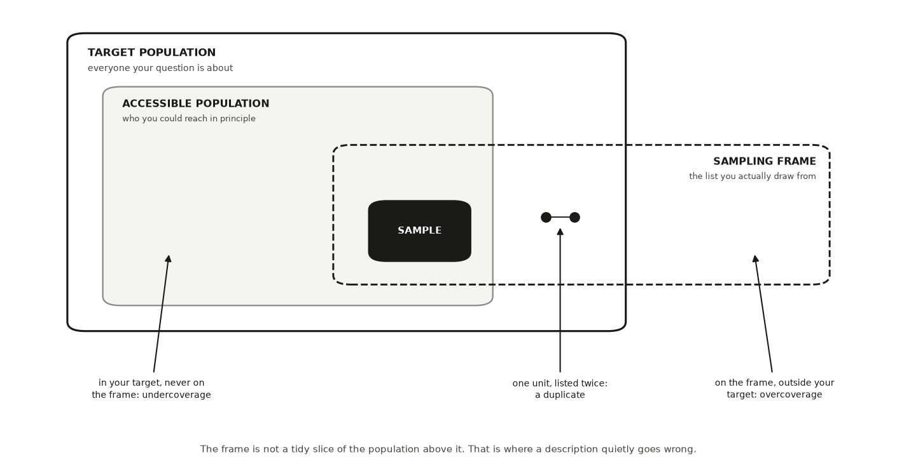
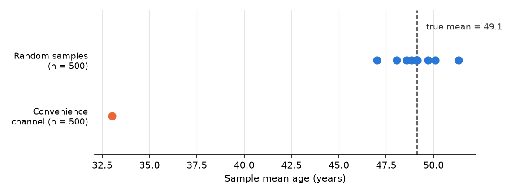
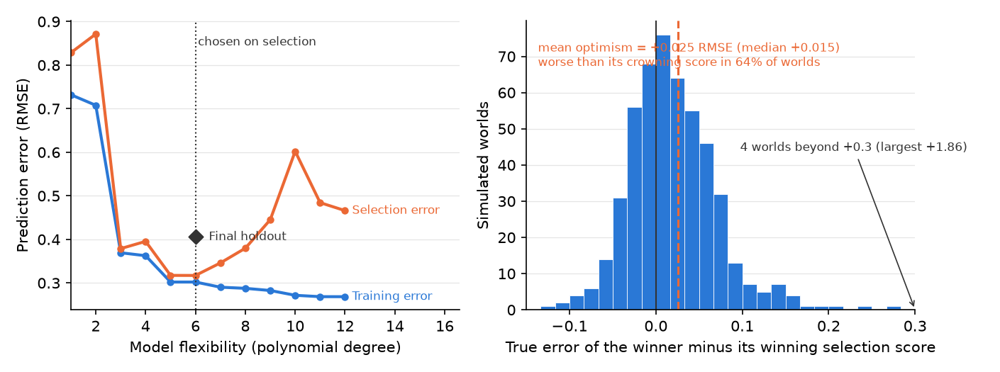
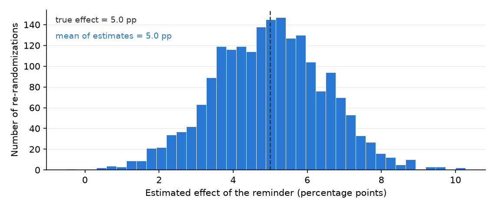
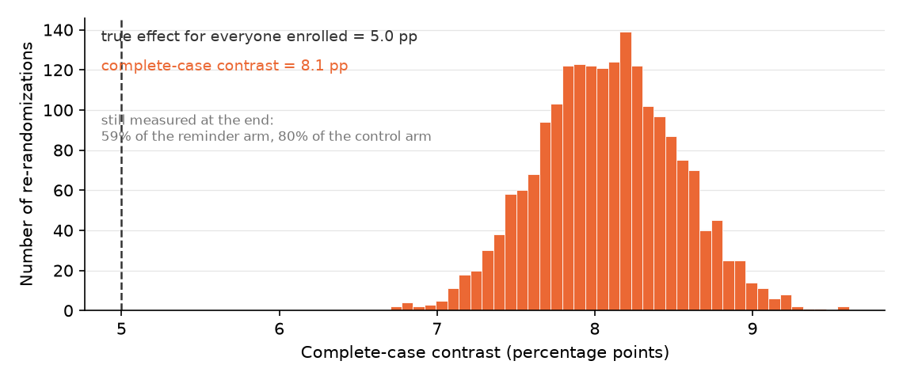

---
# GENERATED FILE — DO NOT EDIT.
# Written by scripts/build_studio_slides.py from the EDR|AI book:
#   book/studios/studio05-develop-the-pathway.qmd      (the studio's promise)
#   the studio's chapters                                 (its argument)
#   book/studios/milestone05-develop-the-pathway.qmd   (its milestone)
# Editorial overlay: planning/BOOK_SLIDE_PLANS/<lesson-id>.yml
# Lessons on this deck: observational-descriptive observational-causal experimental-descriptive prediction-generalization experimental-causal hybrid-complex-designs
# Edit the CHAPTER (or its plan) and rerun the script. Edits made here are
# silently reverted on the next build and fail `--check` in CI.
title: "HONR 46400 · Evidence-Driven Research"
subtitle: "Studio 5 — Develop the pathway"
author: "Davi Moreira"
format:
  revealjs:
    theme: [default, _theme/edrai-slides.scss]
    include-in-header: _theme/head.html
    include-after-body: _theme/fit.html
    width: 1600
    height: 900
    margin: 0.07
    center: false
    slide-number: c/t
    show-slide-number: all
    transition: fade
    background-transition: fade
    transition-speed: fast
    incremental: false
    hash: true
    hash-type: number
    history: false
    progress: true
    controls: true
    controls-layout: bottom-right
    touch: true
    preview-links: auto
    link-external-newwindow: true
    logo: _theme/edrai_logo.png
    footer: "EDR|AI · Studio 5 — Develop the pathway"
    chalkboard:
      buttons: false
    menu:
      side: left
      width: wide
      numbers: true
    code-line-numbers: false
    highlight-style: github
    fig-align: center
---

## What you can defend when you leave {data-menu-title="Studio 5 · What you can defend when you leave"}

::: {.kicker}

Studio 5

:::

::::: {.slide-body}

::: {.decision}

Commit to the research pathway your question and your licence actually
support, and say what that pathway can and cannot establish.

:::

:::::


## The milestone ahead {data-menu-title="Studio 5 · The milestone ahead"}

::: {.kicker}

Studio 5

:::

::::: {.slide-body}

This studio closes with **[Milestone 5: Your pathway,
declared](https://davi-moreira.github.io/2026F_evidence_driven_research_purdue_HONR464/book/studios/milestone05-develop-the-pathway.html)**,
a short chapter of its own after the lessons. **What it asks you to produce.**
Research Contract v1: objective by target and reach by data strategy by
warrant, with the pathway declared and its limits written before any result
exists.

:::::

::: {.notes}

Five pathways run through this book, and your project takes exactly one as its
primary road. This milestone makes the commitment explicit: which pathway,
what licenses it, and what it cannot establish no matter how clean the
execution. Declaring it now protects you later, because a result can only be
defended from inside the pathway that produced it.

Milestone 6 puts data and measurement under governance so the declared pathway
has something trustworthy to run on. The milestone chapter keeps the working
details: the practice steps, the versioned record, and how the artifact is
assessed.

:::


## The lessons in this studio {data-menu-title="Studio 5 · The lessons in this studio"}

::: {.kicker}

Studio 5 · Road map

:::

::::: {.slide-body}

- [Lesson 14 — Observational Descriptive Research](https://davi-moreira.github.io/2026F_evidence_driven_research_purdue_HONR464/book/part3-pathways/11-observational-descriptive-research.html): either your four boxes and selection diagram, if this is your pathway, or the classification drill that rules it out.
- [Lesson 15 — Observational Causal Research](https://davi-moreira.github.io/2026F_evidence_driven_research_purdue_HONR464/book/part3-pathways/12-observational-causal-research.html): either your causal diagram with its leverage named and priced, or the drill that shows why this road is not yours.
- [Lesson 16 — Experimental Descriptive Research](https://davi-moreira.github.io/2026F_evidence_driven_research_purdue_HONR464/book/part3-pathways/13-experimental-descriptive-research.html): either your revealed-characteristic estimand with its demand and instrument threats named, or the drill run on your own question.
- [Lesson 17 — Prediction and Generalization](https://davi-moreira.github.io/2026F_evidence_driven_research_purdue_HONR464/book/part3-pathways/14-prediction-and-generalization.html): either your signed four-part forecasting contract with its boundary, or the contrast drill: the plain rejection line, the prediction-time leakage check run on your own features, and two sentences on why prediction answers a different question.
- [Lesson 18 — Experimental Causal Research](https://davi-moreira.github.io/2026F_evidence_driven_research_purdue_HONR464/book/part3-pathways/15-experimental-causal-research.html): either your treatment, outcome, and potential outcomes with the nearest threat named, or the drill plus the confounder that blocks the causal reading.
- [Lesson 19 — Hybrid and Complex Designs](https://davi-moreira.github.io/2026F_evidence_driven_research_purdue_HONR464/book/part3-pathways/16-hybrid-and-complex-designs.html): if your design has stages: the stage-by-stage map, its weakest link, and the one-sentence justification for keeping or cutting it.

:::::


## Observational Descriptive Research {background-color="#1a1a19" .divider data-menu-title="CHAPTER 14 — Observational Descriptive Research"}

::: {.kicker}

Lesson 1 of this studio · Chapter 14

:::

::: {.divider-line}

which group your data can honestly speak for

:::


## The research decision {data-menu-title="Ch 14 · The research decision"}

::: {.kicker}

Chapter 14

:::

::::: {.slide-body}

::: {.decision}

Which group your observed data can honestly speak for, and where exactly the
line falls past which a description of your sample is no longer allowed to
become a claim about a wider population. You draw that line, and you write
down the sentence on the far side of it that you refuse to say.

:::

:::::


## The words this chapter uses {data-menu-title="Ch 14 · The words this chapter uses"}

::: {.kicker}

Chapter 14 · Key terms

:::

::::: {.slide-body}

:::: {.terms .two}

::: {.term}

[Observational descriptive research]{.t}

[you sample and measure without assigning anyone a condition, then summarize what you found.]{.d}

:::

::: {.term}

[Undercoverage]{.t}

[people who belong in your target and never make the list.]{.d}

:::

::: {.term}

[Overcoverage]{.t}

[records on the list for people outside your target altogether.]{.d}

:::

::: {.term}

[Selection]{.t}

[any process that decides who lands in your data instead of chance alone.]{.d}

:::

::::

:::::

::: {.notes}

Each term is defined in the chapter on first use; these are the definitions as
the book gives them.

:::


## The first question is never about your math {data-menu-title="Ch 14 · The first question is never about your math"}

::: {.kicker}

Chapter 14 · Why this decision matters

:::

::::: {.slide-body}

::: {.lead}

"Which group did your procedure actually reach?"

:::

- A policy stakeholder reads your report before deciding whether it applies to their city.
- The decision on the table: which group your data can honestly speak for.
- That is a question about your procedure, not about your arithmetic.

:::::

::: {.notes}

Open with the stakeholder, because the room expects the objection to be
technical and it is not. Their first question is not the arithmetic; it is
scope, and scope is set by how the data were collected rather than by what was
done to them afterwards. Ask the room what their own project's stakeholder
would be deciding when they read it.

:::


## The most common failure is precise, well formatted, and about the wrong group {data-menu-title="Ch 14 · The most common failure is precise, well formatted, and about the wrong group"}

::: {.kicker}

Chapter 14 · Why this decision matters

:::

::::: {.slide-body}

- A result quietly describes one group while claiming to speak for another.
- Nothing in the estimate looks wrong, and the formatting is fine.
- This chapter has you name the group your data reach.
- Then refuse the sentence that swaps it for a group your data never touched.

:::::

::: {.notes}

Say plainly that this is the most common failure in observational work, not an
exotic one. The reason it goes unnoticed is that the number itself carries no
warning label: an estimate about the wrong group looks exactly like an
estimate about the right one. The whole chapter is one repair, and the repair
is a sentence you write down in advance and refuse to say later.

:::


## You sample and measure; you never assign {data-menu-title="Ch 14 · You sample and measure; you never assign"}

::: {.kicker}

Chapter 14 · The concept

:::

::::: {.slide-body}

- Pull every roll call record in a legislature; report how often each member crossed party lines.
- No one was assigned a condition. You sampled, measured, and summarized.
- Inquiry and answer strategy are both descriptive: distributions and relationships.
- With care, those estimates generalize to a population.
- On their own they do not identify a causal effect.

:::::

::: {.notes}

This is the observational-descriptive pathway of the design library in RDSS
(Blair et al. 2023). Keep the boundary sharp while you have their attention:
descriptive estimates can travel to a population when the sampling supports
it, and they still say nothing about what caused what. Point forward once,
then move on. The next chapter takes the other road, with observational data
again and no assignment again, but a causal inquiry that has to carry an
identification argument to earn its answer.

:::


## Four boxes stand between your question and your data {data-menu-title="Ch 14 · Four boxes stand between your question and your data"}

::: {.kicker}

Chapter 14 · The concept

:::

::::: {.slide-body}

:::: {.terms .two}

::: {.term}

[Target population]{.t}

[everyone your question is about: every customer a streaming service will ever bill]{.d}

:::

::: {.term}

[Accessible population]{.t}

[the part of the target you could reach in principle, given time and cost]{.d}

:::

::: {.term}

[Sampling frame]{.t}

[the concrete list you actually draw from, such as the current subscriber list]{.d}

:::

::: {.term}

[Sample]{.t}

[the customers you actually survey, drawn from the frame and no wider]{.d}

:::

::::

:::::

::: {.notes}

Four groups keep a description honest (Groves et al. 2009). Read them downward
and name what shrinks at each step: the target is the group you wish you could
study, the accessible population is what time and cost leave you, the frame is
the list your tool actually pulls from, and the sample is who you drew from
that list and no wider. Ask the room to say the frame of their own project out
loud, because the chapter calls it the box that misbehaves.

:::


## The frame crosses the edge of your target, and that is where errors live {data-menu-title="Ch 14 · The frame crosses the edge of your target, and that is where errors live"}

::: {.kicker}

Chapter 14 · The concept

:::

::::: {.slide-body}

- **Undercoverage:** people who belong in your target and never make the list.
- **Overcoverage:** records on the list for people outside your target altogether.
- **Duplicate:** one person listed twice, quietly given two chances of being picked.

{fig-align="center" width="52%" fig-alt="sampling_groups.png"}

:::::

::: {.notes}

The frame is the box that misbehaves, and the picture shows why: it is drawn
crossing the edge of the target rather than nested tidily inside it. Treating
the frame as a clean slice of the population above it is one of the quietest
ways a description goes wrong. Walk the three labels on the diagram one at a
time and ask which of the three the room's own list is most likely to have.

:::


## A survey outside one dining hall selects for people who eat there at lunch {data-menu-title="Ch 14 · A survey outside one dining hall selects for people who eat there at lunch"}

::: {.kicker}

Chapter 14 · The concept

:::

::::: {.slide-body}

:::: {.terms}

::: {.term}

[Selection]{.t}

[any process that decides who lands in your data instead of chance alone]{.d}

:::

::: {.term}

[Nonresponse]{.t}

[the units you drew who never gave you data]{.d}

:::

::::

- Two processes decide how the boxes differ. These are the two.
- Of 500 people contacted, 300 reply, and the 200 silent ones are rarely random.

:::::

::: {.notes}

A claim is honest only when the box it describes matches the box it names, so
the useful question is what makes the boxes differ. Both processes are about
who ends up in the data, and neither tells you on its own how the missing
units differ from the ones you kept. The dining hall example is worth pressing
on: the survey never asked anyone where they eat, and it sorted on that
anyway.

:::


## Size shrinks the wobble; it does nothing to a tilt {data-menu-title="Ch 14 · Size shrinks the wobble; it does nothing to a tilt"}

::: {.kicker}

Chapter 14 · The concept

:::

::::: {.slide-body}

- When either process relates to the thing you are measuring, your summary drifts.
- No amount of extra data pulls it back (Bethlehem 2010).
- Size shrinks only the sample-to-sample wobble.
- A systematic tilt in who you reached survives every extra observation (Meng 2018).

:::::

::: {.notes}

This is the line the rest of the chapter tests twice, so state it carefully.
The condition matters: the drift appears when selection or nonresponse relates
to the very thing you are measuring, not whenever anyone is missing. Ask the
room for the instinctive fix, hear "collect more data", and then show them why
it is the wrong lever.

:::


## A 2% billing-error rate, and the headline writes itself {data-menu-title="Ch 14 · A 2% billing-error rate, and the headline writes itself"}

::: {.kicker}

Chapter 14 · A worked example

:::

::::: {.slide-body}

- **Billing-error rate:** the fraction of customers whose monthly charge comes out wrong.
- 2 wrong charges in 100 customers is a 2% billing-error rate.
- The analytics team emails a survey to a random draw from the subscriber list.
- The survey reports 2%. The headline: "the service has a 2% billing-error rate."

:::::

::: {.notes}

Nothing in this procedure is sloppy. The draw is random and the count is
right. Let the room agree that it looks fine before you take it apart, because
the point of the example is that competent execution is not what protects you
here.

:::


## The customers hit hardest quit before the survey went out {data-menu-title="Ch 14 · The customers hit hardest quit before the survey went out"}

::: {.kicker}

Chapter 14 · A worked example

:::

::::: {.slide-body}

- Target population: every customer the service bills (Groves et al. 2009).
- Sampling frame: the current subscriber list, because only those people get the survey.
- Charged twice, or charged after canceling, and most likely to have quit in frustration.
- **Survivorship selection:** a filter that keeps the people least likely to show the problem.

:::::

::: {.notes}

Walk the boxes out loud in the chapter's order, then name the trap. The
customers with the worst billing errors removed themselves from the frame
before anyone surveyed them, which means the filter runs on exactly the
outcome being counted. Current subscribers are the contented end of the
customer base, not a fair slice of it.

:::


## One sentence is licensed; the other is the silent upgrade {data-menu-title="Ch 14 · One sentence is licensed; the other is the silent upgrade"}

::: {.kicker}

Chapter 14 · A worked example

:::

::::: {.slide-body}

- That is the licensed claim. It names the box the data reached.
- The sentence to refuse: "the service's billing-error rate is 2%."
- The true rate across everyone billed is almost certainly higher.
- The worst-hit customers were gone before the survey went out.

::: {.note-card}

among customers still subscribed, the billing-error rate is 2%

:::

:::::

::: {.notes}

Put both sentences on the board and make the room read the difference aloud,
because in speech it is two words. The 2% is honest about one box and
dishonest about another. Note the direction as well as the gap: here you can
say which way the estimate is off, and the chapter's own red-team prompt asks
whether a boundary sentence hides the direction of the drift.

:::


## Build the whole customer base, let the worst-hit quit, then survey {data-menu-title="Ch 14 · Build the whole customer base, let the worst-hit quit, then survey"}

::: {.kicker}

Chapter 14 · A worked example

:::

::::: {.slide-body}

- Two rates print: everyone billed, and the current subscribers the survey can see.
- A third line reports how many customers left the frame.
- Nothing here is a sampling error. The draw is perfect.

```python
import numpy as np, pandas as pd
SEED = 464
rng = np.random.default_rng(SEED)

n = 50_000
# Everyone the service bills. Wrong charges are what we want to count.
wrong_charge = rng.random(n) < 0.060
# Customers hit by a wrong charge quit far more often — and quitters leave the
# subscriber list, which is the frame the survey draws from.
quit = rng.random(n) < np.where(wrong_charge, 0.70, 0.09)

target_rate = wrong_charge.mean()
frame_rate = wrong_charge[~quit].mean()
print(f"target population (everyone billed)   : {target_rate*100:.1f}%")
print(f"sampling frame (current subscribers)  : {frame_rate*100:.1f}%")
print(f"customers who left the frame          : {quit.mean()*100:.0f}%")
print("\nthe survey can only ever see the second number. no sample size,")
print("and no random draw from that list, closes the gap to the first")
```

:::::

::: {.notes}

Read the `wrong_charge` and `quit` lines as the mechanism: wrong charges
happen, and customers who got one quit far more often than customers who did
not. The survey can only ever see the second printed number. No sample size,
and no random draw from that list, closes the gap to the first.

:::


## Ten honest samples and one convenience sample, all of size 500 {data-menu-title="Ch 14 · Ten honest samples and one convenience sample, all of size 500"}

::: {.kicker}

Chapter 14 · A seeded simulation

:::

::::: {.slide-body}

- **Seed:** a fixed starting point for a random-number generator.
- The same seed reproduces the same draws, so your run matches the figure.
- A population of 100,000 whose true mean age is known by construction.
- The convenience channel mostly reaches younger people.

```python
import numpy as np
import matplotlib.pyplot as plt

SEED = 464
rng = np.random.default_rng(SEED)

population = np.clip(rng.normal(49, 17, size=100_000), 18, 90)
truth = population.mean()

random_means = [rng.choice(population, 500, replace=False).mean()
                for _ in range(10)]

weights = np.exp(-(population - 25) ** 2 / (2 * 12 ** 2))  # younger = likelier
convenience = rng.choice(population, 500, replace=False,
                         p=weights / weights.sum())

fig, ax = plt.subplots(figsize=(7.6, 2.9))
ax.scatter(random_means, np.ones(10), s=60, color="#2a78d6", zorder=3)
ax.scatter([convenience.mean()], [0], s=60, color="#eb6834", zorder=3)
ax.axvline(truth, color="#333333", ls="--", lw=1.2)
ax.text(truth + .5, 1.55, f"true mean = {truth:.1f}", color="#333333",
        fontsize=9)
ax.set_yticks([0, 1], ["Convenience\nchannel (n = 500)",
                       "Random samples\n(n = 500)"], fontsize=9)
ax.set_xlabel("Sample mean age (years)")
ax.set_ylim(-.7, 1.9)
plt.show()
```

:::::

::: {.notes}

The worked example argued that who you reach tilts what you measure, and that
a bigger sample does not fix the tilt. Here you watch it happen on a
population you built, where the true mean age is known by construction and
every estimate can be checked against it. Point at the weights line and say
what it does: it makes younger people likelier to be drawn, and nothing else
about the procedure changes.

:::


## Same sample size, about sixteen years off {data-menu-title="Ch 14 · Same sample size, about sixteen years off"}

::: {.kicker}

Chapter 14 · A seeded simulation

:::

::::: {.slide-body}

- The ten random means spread between about 47 and 51, around the truth.
- That spread is honest, quantifiable uncertainty.
- The convenience dot looks as confident as any other, and nothing warns you.

{fig-align="center" width="58%" fig-alt="ch11_sampling_channels.png"}

:::::

::: {.notes}

Read it the way a reviewer would. The ten random samples never agree exactly,
and that disagreement is the kind you can report. The convenience channel has
exactly the same sample size and misses the true mean by about sixteen years.
Only the sampling procedure tells you which kind of dot you have. In the
companion notebook, move the channel's center, the 25 inside weights, and
rerun: the tilt follows the channel, never the sample size.

:::


## An AI failure case {data-menu-title="Ch 14 · An AI failure case"}

::: {.kicker}

Chapter 14

:::

::::: {.slide-body}

::: {.failure}

[Where the tool failed]{.label}

You ask a chatbot: *"My survey of current subscribers shows a 2% billing-error
rate on a large panel. Can I report the service's billing-error rate as 2%?"*
It answers with full confidence: *"Yes. With a sample that large, your
estimate is precise and reliable."* This is wrong in two named ways at once.
It commits a **silent scope change**, quietly upgrading "current subscribers"
to "the service's customers," and it leans on the fallacy that a big sample
cures a tilted one.

:::

:::::


## How it failed {data-menu-title="Ch 14 · How it failed"}

::: {.kicker}

Chapter 14 · An AI failure case

:::

::::: {.slide-body}

- You catch it because you wrote your own answer first, and yours named the frame: the customers still subscribed, not everyone the service bills, so the swap is visible on sight.
- Then you check the mechanism against the data.
- The customers with the worst billing errors canceled before the survey went out, so missingness relates directly to the outcome you count.
- A larger panel of current subscribers only estimates the current subscribers' error rate more precisely.
- It never reaches the people who left.

:::::

::: {.notes}

You catch it because you wrote your own answer first, and yours named the
frame: the customers still subscribed, not everyone the service bills, so the
swap is visible on sight. Then you check the mechanism against the data. The
customers with the worst billing errors canceled before the survey went out,
so missingness relates directly to the outcome you count. A larger panel of
current subscribers only estimates the current subscribers' error rate more
precisely. It never reaches the people who left.

:::


## Do not delegate {data-menu-title="Ch 14 · Do not delegate"}

::: {.kicker}

Chapter 14

:::

::::: {.slide-body}

::: {.rule-human}

[This stays yours]{.label}

Three decisions stay yours alone. First, **which population your project is
really about**: the AI does not know your question's intent. Second, **which
frame you can honestly reach**, and therefore the coverage gap you must
disclose. Third, **the boundary line itself**: the exact sentence where your
description stops and the population claim you refuse to make. You may ask an
AI to attack that line, never to draw it for you.

:::

:::::


## It is your turn {data-menu-title="Ch 14 · It is your turn"}

::: {.kicker}

Chapter 14 · Your move

:::

::::: {.slide-body}

1. Decide which case you are in.
2. **If this is your pathway**, write your four boxes, one line each: target population, accessible population, sampling frame, sample.
3. Draw your selection diagram: an arrow from each box to the next, with the filter that removes people written on the arrow.
4. Write the two sentences that define your claim.
5. **If this is not your pathway**, run the classification drill instead.
6. Log the work in your AI Research Ledger, and verify the key claim with a named method from the [Verification Guide](https://davi-moreira.github.io/2026F_evidence_driven_research_purdue_HONR464/book/verification-guide.html); simulation fits here, because the claim is about how a sampling procedure behaves rather than about a fixed number.

::: {.turn}
Work it in the [companion notebook](https://colab.research.google.com/github/davi-moreira/2026F_evidence_driven_research_purdue_HONR464/blob/main/notebooks/book/ch14_observational_descriptive_research.ipynb) with [Chapter 14](https://davi-moreira.github.io/2026F_evidence_driven_research_purdue_HONR464/book/part3-pathways/11-observational-descriptive-research.html) open beside it. Log every delegation in your AI Research Ledger.
:::

:::::

::: {.notes}

The chapter's numbered steps, in the book's own order. The AI prompts each
step carries live in the companion notebook.

:::


## Observational Causal Research {background-color="#1a1a19" .divider data-menu-title="CHAPTER 15 — Observational Causal Research"}

::: {.kicker}

Lesson 2 of this studio · Chapter 15

:::

::: {.divider-line}

whether your comparison has earned the word *because*

:::


## The research decision {data-menu-title="Ch 15 · The research decision"}

::: {.kicker}

Chapter 15

:::

::::: {.slide-body}

::: {.decision}

Whether your observational comparison has earned the word *because* or must
stop at *associated with*. You settle it by naming the one confounder the
comparison turns on and writing the identification argument that closes the
back door, or by admitting in writing that you have none.

:::

:::::


## Your advisor's reply: after is not because {data-menu-title="Ch 15 · Your advisor's reply: after is not because"}

::: {.kicker}

Chapter 15 · Why this decision matters

:::

::::: {.slide-body}

- You wrote: the treated group did better, so the treatment worked.
- Her reply is the sentence you will hear for the rest of your research life.
- "After is not because."
- "Show me the world where they were not treated, or admit you are guessing."

:::::

::: {.notes}

The decision on the table is whether your comparison has earned the word
*because*. Picture the thesis advisor reading your first draft, and ask the
room how they would answer her today, with the comparison they currently have
on paper. Nothing in the data alone settles it.

:::


## Almost every question worth asking forbids the clean experiment {data-menu-title="Ch 15 · Almost every question worth asking forbids the clean experiment"}

::: {.kicker}

Chapter 15 · Why this decision matters

:::

::::: {.slide-body}

- You cannot assign a person a disease, a country a war, a wild animal a gut microbe.
- So the craft is deciding when a comparison is trustworthy enough to carry a cause.
- You make that decision out loud and in writing.
- Get it wrong and a paper claims more than its data support.
- Get it right and a modest, bounded claim becomes credible.

:::::

::: {.notes}

The clean experiment is not available for most of the questions people care
about, so the honest researcher's work moves from running the study to arguing
for the comparison. Notice what the payoff is: not a bigger claim, a credible
one.

:::


## A causal claim is a claim about a world you never see {data-menu-title="Ch 15 · A causal claim is a claim about a world you never see"}

::: {.kicker}

Chapter 15 · The concept

:::

::::: {.slide-body}

::: {.lead}

The conditions you compare were set by the world rather than by you, so a
causal reading has to be argued rather than assumed (Blair et al. 2023).

:::

:::: {.terms}

::: {.term}

[Counterfactual]{.t}

[the outcome that would have happened under the choice that was *not* made]{.d}

:::

::: {.term}

[Confounder]{.t}

[a third factor that pushes on *both* who gets the treatment and the outcome]{.d}

:::

::::

:::::

::: {.notes}

The coffee example carries both terms. You never see how long a coffee drinker
would have lived if she had not drunk coffee, because she did drink it. And a
health-conscious lifestyle raises both the chance of a daily coffee habit and
lifespan, so coffee drinkers look longer-lived even if coffee did nothing.
This chapter follows the observational-causal pathway of the design library in
RDSS.

:::


## The back door is the path that steals the credit {data-menu-title="Ch 15 · The back door is the path that steals the credit"}

::: {.kicker}

Chapter 15 · The concept

:::

::::: {.slide-body}

- A **causal diagram** is a picture of arrows, each meaning "this directly influences that."
- The confounder opens a **back door**: a path linking treatment and outcome through it.
- That path runs through the confounder instead of through any real effect.
- A raw comparison sees both paths at once, and blames the treatment for the confounder's work.

:::::

::: {.notes}

Draw it before you compute anything. Ask the room to sketch treatment,
outcome, and one third variable for their own project right now. The back door
is the reason the raw difference is the wrong number, not a decoration on top
of it.

:::


## Two moves close the back door without an experiment {data-menu-title="Ch 15 · Two moves close the back door without an experiment"}

::: {.kicker}

Chapter 15 · The concept

:::

::::: {.slide-body}

:::: {.terms}

::: {.term}

[Selection on observables]{.t}

[identifying an effect by adjusting for a set of measured confounders sufficient to block every back-door path]{.d}

:::

::: {.term}

[Natural experiment]{.t}

[a situation where a chance-like force outside anyone's control decided who got treated, making assignment as-if random]{.d}

:::

::::

:::::

::: {.notes}

For the first move, compare coffee drinkers and non-drinkers within the same
lifestyle group, because lifestyle is what pushes on both. It works only for
confounders you can actually see, and the word sufficient is doing real work:
the goal is the right set, not the longest one. For the second, a visa lottery
decides who makes a trip, so winners and losers differ only by luck.

:::


## Adjusting for the wrong variable manufactures bias {data-menu-title="Ch 15 · Adjusting for the wrong variable manufactures bias"}

::: {.kicker}

Chapter 15 · The concept

:::

::::: {.slide-body}

- A **mediator** sits on the causal path itself.
- Coffee may act on lifespan partly through blood pressure, so adjusting throws away part of the effect.
- A **collider** is a variable that treatment and outcome both push on.
- Adjusting for "healthy aging" study membership creates a link that exists nowhere in the world.
- Adjust for common causes, and leave mediators and colliders alone (Pearl 2009).

:::::

::: {.notes}

Adjusting is not free. The temptation, once a data file is open, is to adjust
for everything in it, and that is exactly the move the diagram forbids. Which
variables you must adjust for, and which adjustments open new paths rather
than closing them, is decided by the diagram and not by what you happen to
have measured.

:::


## You owe a reader the argument, not the adjustment {data-menu-title="Ch 15 · You owe a reader the argument, not the adjustment"}

::: {.kicker}

Chapter 15 · The concept

:::

::::: {.slide-body}

- An **identification argument** is your written reason that the comparison recovers a real effect.
- Every design here rests on **load-bearing assumptions** the data can never fully confirm (Hernán & Robins 2020).
- Selection on observables needs a sufficient adjustment set and groups that overlap.
- A visa-lottery design needs a random lottery that touches lifespans only through the trip.
- Name your design's list. One sentence per assumption is enough.

:::::

::: {.notes}

The data can only make these assumptions plausible, never confirm them, which
is why the argument is where the work shows. Ask the room to name the single
assumption their own comparison rests on. Anyone who cannot name it has just
found the next thing to write.

:::


## The word is not the argument {data-menu-title="Ch 15 · The word is not the argument"}

::: {.kicker}

Chapter 15 · The concept

:::

::::: {.slide-body}

- The **causal-language boundary** is the point past which your evidence stops earning *because*.
- Past it, the defensible phrase is *associated with*.
- You hit it when you cannot make the identification argument honestly.
- Typing "natural experiment" over a comparison does not argue its assumption.

:::::

::: {.notes}

Knowing which side of the boundary you are on, and saying so in writing, is
the skill this chapter is built around. The failure it guards against is
design mimicry: borrowing the vocabulary to decorate a comparison whose
assumption was never argued. Ask the room which side their current claim sits
on, out loud.

:::


## Mice carrying the microbe are leaner. Stake a thesis on it? {data-menu-title="Ch 15 · Mice carrying the microbe are leaner. Stake a thesis on it?"}

::: {.kicker}

Chapter 15 · A worked example

:::

::::: {.slide-body}

- You study wild-derived mice in a biology lab.
- Those whose gut carries a particular fiber-digesting bacterium are, on average, leaner.
- The headline writes itself: the microbe causes leanness.

:::::

::: {.notes}

Take the vote before the diagram goes up. The pattern is real and the sentence
is the one almost anyone would write first. What follows is not a correction
of the pattern but a test of the sentence.

:::


## Diet fills the third box, and ten thousand mice do not help {data-menu-title="Ch 15 · Diet fills the third box, and ten thousand mice do not help"}

::: {.kicker}

Chapter 15 · A worked example

:::

::::: {.slide-body}

- Draw three boxes: microbe, leanness, and anything that could drive both.
- Diet is a confounder: high-fiber foragers carry more of the bacterium.
- They also stay leaner for reasons that have nothing to do with the microbe.
- Diet points into both boxes, so the naive comparison mostly measures the diet gap.
- A colony of ten thousand makes that wrong number precise, and no less wrong.

:::::

::: {.notes}

A larger sample shrinks noise, not confounding. Stop on that distinction,
because sample size is the first fix anyone reaches for. The naive
microbe-versus-no-microbe comparison credits the bacterium with work the diet
did.

:::


## "We controlled for diet" is not identification {data-menu-title="Ch 15 · “We controlled for diet” is not identification"}

::: {.kicker}

Chapter 15 · A worked example

:::

::::: {.slide-body}

- If you recorded diet, compare carriers to non-carriers within high-fiber, then within low-fiber.
- Average the two honest within-diet differences.
- If the gap collapses toward zero, the microbe was mostly a passenger of diet.
- An unrecorded trait driving both foraging and metabolism keeps the back door open.
- Then your defensible claim is that the microbe is *associated with* leanness.

:::::

::: {.notes}

The fix works only for the confounder you measured. Temperament is a trait you
may never have recorded, and no adjustment reaches it. The causal question
then waits for a real intervention, such as colonizing genetically identical,
identically fed mice. That boundary is what this chapter teaches you to see
and to say.

:::


## Build mice where the microbe does nothing, then read the gap {data-menu-title="Ch 15 · Build mice where the microbe does nothing, then read the gap"}

::: {.kicker}

Chapter 15 · A worked example

:::

::::: {.slide-body}

- Diet drives both the microbe and leanness. The true microbe effect is planted at zero.
- Watch the naive carrier-versus-noncarrier gap against that planted zero.
- Then watch the two within-diet gaps, and their average, come back toward zero.

```python
import numpy as np, pandas as pd
SEED = 464
rng = np.random.default_rng(SEED)

n = 10_000
# Diet drives BOTH the microbe and leanness. The microbe itself does nothing.
high_fiber = rng.random(n) < 0.5
microbe = rng.random(n) < np.where(high_fiber, 0.75, 0.25)
leanness = 20 - 3.0 * high_fiber + rng.normal(0, 1.5, size=n)   # lower = leaner
df = pd.DataFrame({"high_fiber": high_fiber, "microbe": microbe,
                   "leanness": leanness})

naive = df[df.microbe].leanness.mean() - df[~df.microbe].leanness.mean()
within = (df.groupby("high_fiber")
            .apply(lambda g: g[g.microbe].leanness.mean()
                             - g[~g.microbe].leanness.mean(), include_groups=False))
print(f"true microbe effect              : {0.0:+.2f}")
print(f"naive carrier-vs-noncarrier gap  : {naive:+.2f}")
print(f"within high-fiber mice           : {within[True]:+.2f}")
print(f"within low-fiber mice            : {within[False]:+.2f}")
print(f"average of the two within-diet gaps: {within.mean():+.2f}")
print("\nthe naive gap is the DIET gap wearing the microbe's name;")
print("ten thousand mice make it precise, not true")
```

:::::

::: {.notes}

SEED = 464 and n = 10,000, so the run reproduces exactly. The printed close
says it plainly: the naive gap is the diet gap wearing the microbe's name, and
ten thousand mice make it precise, not true. Run this before you trust any
carrier-versus-noncarrier number, including your own.

:::


## An AI failure case {data-menu-title="Ch 15 · An AI failure case"}

::: {.kicker}

Chapter 15

:::

::::: {.slide-body}

::: {.failure}

[Where the tool failed]{.label}

You paste your mouse comparison into a chatbot and ask, "Is this a natural
experiment, and can I say the microbe causes leanness?" It answers with a
confident, well-formatted yes: your setup "resembles a natural experiment,"
the difference "can be read causally," the write-up "looks rigorous." This is
two named failures at once: **plausible-but-wrong-method**, attaching a design
label to a comparison whose key assumption plainly fails, and **silent scope
change**, upgrading *associated with* to *because* while sounding like it
settled the question. Fluency is not evidence. You catch it by refusing the
label and asking the one question the model cannot answer for you: *how was
treatment actually assigned?* No lottery, no cutoff, no outside force decided
which mice carried the microbe. They sorted themselves by diet and behavior,
so there is no as-if-random assignment, the back door stays open, and
*because* is not earned. Say *associated with*, and log why.

:::

:::::


## Do not delegate {data-menu-title="Ch 15 · Do not delegate"}

::: {.kicker}

Chapter 15

:::

::::: {.slide-body}

::: {.rule-human}

[This stays yours]{.label}

Three decisions stay yours alone. **Whether your design identifies a causal
effect** is a judgment about how treatment was really assigned, and only you
know that. **Which confounder most threatens your comparison** turns on the
mechanism, which a model cannot see in your data. And **whether your finding
earns *because* or must stop at *associated with*** is the whole skill of this
chapter. A tool will happily call your comparison a "natural experiment"
because you typed the words. Earning *because* is your signature, not the
model's.

:::

:::::


## It is your turn {data-menu-title="Ch 15 · It is your turn"}

::: {.kicker}

Chapter 15 · Your move

:::

::::: {.slide-body}

1. Decide which case you are in.
2. **If this is your pathway**, write your causal question as exactly two things: a treatment (the thing that varies) and an outcome (the thing you measure).
3. Draw the causal diagram.
4. Name your leverage and its price.
5. Write down one number you would recompute by a second route to check any estimate a collaborator or an AI hands you, and say what result would make you abandon the causal reading entirely.
6. **If this is not your pathway**, run the classification drill.
7. Log all of it in your AI Research Ledger, and verify with a named method from the [Verification Guide](https://davi-moreira.github.io/2026F_evidence_driven_research_purdue_HONR464/book/verification-guide.html); the causal diagram is the method built for this chapter, and simulation with a confounder you plant yourself is the strong second check.

::: {.turn}
Work it in the [companion notebook](https://colab.research.google.com/github/davi-moreira/2026F_evidence_driven_research_purdue_HONR464/blob/main/notebooks/book/ch15_observational_causal_research.ipynb) with [Chapter 15](https://davi-moreira.github.io/2026F_evidence_driven_research_purdue_HONR464/book/part3-pathways/12-observational-causal-research.html) open beside it. Log every delegation in your AI Research Ledger.
:::

:::::

::: {.notes}

The chapter's numbered steps, in the book's own order. The AI prompts each
step carries live in the companion notebook.

:::


## Experimental Descriptive Research {background-color="#1a1a19" .divider data-menu-title="CHAPTER 16 — Experimental Descriptive Research"}

::: {.kicker}

Lesson 3 of this studio · Chapter 16

:::

::: {.divider-line}

whether the number your randomized study reports is a property the world
already has, or an effect you would go out and cause

:::


## The research decision {data-menu-title="Ch 16 · The research decision"}

::: {.kicker}

Chapter 16

:::

::::: {.slide-body}

::: {.decision}

A coin flip does not decide what kind of question you asked. You decide
whether your randomized study is **measuring** a property the world already
has or **testing** an intervention you would deploy, and you name the
artifacts your measurement still has to guard against before the number means
anything.

:::

:::::


## Your advisor stops at one line of your methods page {data-menu-title="Ch 16 · Your advisor stops at one line of your methods page"}

::: {.kicker}

Chapter 16 · Why this decision matters

:::

::::: {.slide-body}

- Random assignment feels causal by reflex.
- That reflex is the trap this chapter defuses.

::: {.note-card}

"You randomized," they say, "so you wrote *causes*. Show me the question
first."

:::

:::::

::: {.notes}

The decision on the table is whether the number your randomized study reports
is a property the world already has, or an effect you would go out and cause.
Nothing in the coin flip answers that for you. Ask the room to read their lead
question aloud and underline its verb: does it ask how much of something
already sits out there, or what would change after an intervention?

:::


## The question fixes the kind, not the procedure {data-menu-title="Ch 16 · The question fixes the kind, not the procedure"}

::: {.kicker}

Chapter 16 · Why this decision matters

:::

::::: {.slide-body}

- Aim the flip at "what would change if we deployed this?" That is a causal study.
- Aim it at "how much of this property sits in the world right now?" That is a measurement.
- Mislabel the second as the first and you overclaim.
- You promise a lever your evidence never tested.

:::::

::: {.notes}

The same procedure sits under both, so the procedure cannot be what settles
the kind. The cost of the mislabel is not one wrong word: a careful reader who
catches the overclaim stops trusting the rest of your work. This is why the
naming of the kind comes before anything about the randomization itself.

:::


## Random assignment can do the work of a measurement design {data-menu-title="Ch 16 · Random assignment can do the work of a measurement design"}

::: {.kicker}

Chapter 16 · The concept

:::

::::: {.slide-body}

- RDSS calls this the experimental-descriptive pathway (Blair et al. 2023).
- The design reveals a characteristic units do not hand over directly.
- The inquiry stays descriptive, so randomizing alone licenses no causal claim.

:::::

::: {.notes}

This is the pathway's whole shape in one line: the coin flip is there to
expose something, not to test something you would deploy. Keep the bound the
chapter puts on it. Randomizing reveals a property the units never hand over
directly. It does not by itself buy you the word because, and it does not yet
make the reading trustworthy, which is what the next two slides are about.

:::


## An experiment can be an instrument rather than an intervention {data-menu-title="Ch 16 · An experiment can be an instrument rather than an intervention"}

::: {.kicker}

Chapter 16 · The concept

:::

::::: {.slide-body}

::: {.lead}

A latent characteristic: how much a search interface's position pulls clicks,
apart from how good each result is (Joachims et al. 2005).

:::

:::: {.terms}

::: {.term}

[Latent characteristic]{.t}

[a real property you cannot read off directly, so a design has to reveal it]{.d}

:::

::: {.term}

[Controlled stimulus]{.t}

[a version of a prompt, item, or setting that you fix on purpose and assign by chance]{.d}

:::

::: {.term}

[Experiment as a measurement instrument]{.t}

[using randomly assigned controlled stimuli to expose a latent characteristic and report it as a plain description]{.d}

:::

::::

- The controlled stimulus: the same result in slot 1 for some sessions, slot 5 for others.
- Chance decides which, so any difference pins to the version and not to who received it.
- What you report is the estimand: the exact quantity the design is built to state.

:::::

::: {.notes}

The definitions and the slot example are the chapter's own. The estimand here
describes the world as it stands, which is what keeps the inquiry descriptive
even with a coin flip inside it. Have the room name the latent characteristic
in their own project before the next slide.

:::


## A measurement can be confident and still wrong {data-menu-title="Ch 16 · A measurement can be confident and still wrong"}

::: {.kicker}

Chapter 16 · The concept

:::

::::: {.slide-body}

- The setup itself is one of the ingredients of the number.
- Two artifacts do most of the damage.
- Randomizing who sees what does nothing about a bias that hits every unit alike.
- So you design those two out separately.

:::::

::: {.notes}

This is the part people skip once the randomization is in place, because a
randomized number feels finished. It is not, since the instrument and the
situation both leave their marks on the reading. The next slide names the two
artifacts and the property they threaten.

:::


## Demand and instrument effects both threaten construct validity {data-menu-title="Ch 16 · Demand and instrument effects both threaten construct validity"}

::: {.kicker}

Chapter 16 · The concept

:::

::::: {.slide-body}

::: {.lead}

A demand effect: users who notice they are in a study click more carefully
than they would at home (Orne 1962).

:::

:::: {.terms}

::: {.term}

[Demand effect]{.t}

[when the people being measured guess what you are looking for and drift toward it]{.d}

:::

::: {.term}

[Instrument effect]{.t}

[when the measuring device or wording moves the reading on its own]{.d}

:::

::: {.term}

[Construct validity]{.t}

[the degree to which your number estimates the concept you meant rather than something adjacent]{.d}

:::

::::

- An instrument effect: the logger credits position with attention slot 1's larger thumbnail earned.
- Both threaten construct validity, so your number may estimate something adjacent (Cronbach & Meehl 1955).

:::::

::: {.notes}

Randomizing who sees what does nothing about a bias that hits every unit
alike, which is why these two have to be designed out separately. A number can
be confident, well randomized, and still be a reading of the wrong concept.
Ask the room which of the two their own measurement is more exposed to, and
what they would change to rule it out.

:::


## A streaming team needs a number nobody publishes {data-menu-title="Ch 16 · A streaming team needs a number nobody publishes"}

::: {.kicker}

Chapter 16 · A worked example

:::

::::: {.slide-body}

- How much of a track's play count comes from where it sits?
- And how much from how well it matches the listener?
- Nobody prints that number anywhere, so they build an instrument.
- One fixed probe track: identical audio, identical artwork, slot assigned at random.

:::::

::: {.notes}

The shelf is "Recommended for you", and the probe runs on a random slice of
sessions across six slots. Because the track never changes and the slot is
dealt by chance, the spread in play rate across slots isolates the pull of
position alone. The estimand is the shelf's attention curve: how much each
rank commands, described for these sessions.

:::


## There is a causal effect inside the study, and the question stays descriptive {data-menu-title="Ch 16 · There is a causal effect inside the study, and the question stays descriptive"}

::: {.kicker}

Chapter 16 · A worked example

:::

::::: {.slide-body}

- Honest: "for these sessions, slot 1 drew about three times the plays of slot 5, at equal quality."
- Forbidden: "promoting tracks to slot 1 will triple their plays."
- The second sentence is causal and deployable, and the design never tested it.

:::::

::: {.notes}

Slot really does move clicks inside the experiment, so the temptation to write
the deployable sentence is strong and feels earned. Slow down here. The design
put one fixed probe track through six slots, so it never varied which track
goes on top, and it cannot say what promoting a different track would do. The
question asked how much position pulls, and that is the sentence the evidence
supports.

:::


## Guard the two artifacts before you trust even the descriptive number {data-menu-title="Ch 16 · Guard the two artifacts before you trust even the descriptive number"}

::: {.kicker}

Chapter 16 · A worked example

:::

::::: {.slide-body}

::: {.lead}

The redesign renders every slot identically and logs impressions server-side.

:::

- A demand effect if the probe looks like an ad.
- An instrument effect if slot 1's larger art or a slot-keyed logger inflates the count.
- Randomizing the slot does not fix a bias that hits every unit alike.

:::::

::: {.notes}

Randomizing position while holding the item identical is the standard way to
separate presentation from quality in ranked interfaces (Joachims et al.
2005). Notice that both fixes are design moves, which is why the chapter says
you design these out separately rather than correcting them afterwards.

:::


## Run it: the randomization is real, the claim it licenses is still descriptive {data-menu-title="Ch 16 · Run it: the randomization is real, the claim it licenses is still descriptive"}

::: {.kicker}

Chapter 16 · A worked example

:::

::::: {.slide-body}

- 12,000 sessions, one identical probe track, slot dealt by chance.
- Watch the play rate fall from slot 1 down to slot 6.
- The last lines print the slot 1 versus slot 5 ratio, at identical audio and artwork.
- Then they print what the number does not say.

```python
import numpy as np, pandas as pd
SEED = 464
rng = np.random.default_rng(SEED)

n_sessions = 12_000
# The probe track is identical every time; only its slot is dealt by chance.
slot = rng.integers(1, 7, size=n_sessions)
attention = {1: 0.150, 2: 0.104, 3: 0.081, 4: 0.066, 5: 0.055, 6: 0.043}
played = rng.random(n_sessions) < np.array([attention[s] for s in slot])

by_slot = (pd.DataFrame({"slot": slot, "played": played})
           .groupby("slot")["played"].agg(sessions="size", play_rate="mean"))
by_slot["play_rate"] = (by_slot.play_rate * 100).round(1)
print(by_slot.to_string())
r1, r5 = by_slot.play_rate[1], by_slot.play_rate[5]
print(f"\nslot 1 vs slot 5 : {r1/r5:.1f}x, at identical audio and artwork")
print("descriptive, for these sessions. it does not say what promoting a")
print("DIFFERENT track to slot 1 would do")
```

:::::

::: {.notes}

The block deals the probe track's slot at random and reports the attention
curve. The printed disclaimer is the lesson: this says nothing about what
promoting a different track to slot 1 would do. Change the attention values,
rerun, and ask which sentence in the section stops being true.

:::


## An AI failure case {data-menu-title="Ch 16 · An AI failure case"}

::: {.kicker}

Chapter 16

:::

::::: {.slide-body}

::: {.failure}

[Where the tool failed]{.label}

You paste your attention-curve result into an AI tool and ask it to write the
findings sentence. It returns something fluent: "Moving tracks to the top slot
causes a 3x lift in plays, so the team should promote its best matches to slot
1." It reads like a win, but it is a **silent scope change**: you asked how
attention is distributed, and the tool quietly answered a causal, deployable
question about what promoting would do. You catch it by laying its sentence
beside yours, word for word. Yours asked *how much* position pulls; its answer
asked *what to do*. The tells are "causes," "should," and the imagined "lift"
from an intervention you never ran. Reject it, and rewrite the claim bounded
to the units you observed.

:::

:::::


## Do not delegate {data-menu-title="Ch 16 · Do not delegate"}

::: {.kicker}

Chapter 16

:::

::::: {.slide-body}

::: {.rule-human}

[This stays yours]{.label}

Three calls stay yours. Whether your inquiry is **descriptive or causal**,
because the kind lives in your question's words and no tool can read your
intent. Whether the design actually measures **your** construct rather than
something adjacent, which is a judgment about meaning, not about code. And
which **artifacts** you are willing to stake your name on having ruled out. An
AI partner can draft, locate, and attack. You declare and defend.

:::

:::::


## It is your turn {data-menu-title="Ch 16 · It is your turn"}

::: {.kicker}

Chapter 16 · Your move

:::

::::: {.slide-body}

1. Read your lead question aloud and underline the verb.
2. If it is yours, name the latent characteristic your project has to reveal, the property nobody publishes anywhere, and the controlled stimulus you will assign by chance to reveal it.
3. Write your estimand in one sentence: the exact quantity, for which units, described as it stands.
4. Name the one demand effect and the one instrument effect you most fear, each with the redesign that rules it out.
5. If this pathway is not yours, run steps 2 to 4 as a drill anyway, treating your question as if you had to measure it rather than intervene.
6. Log the step in your AI Research Ledger, and verify at least one output with a named method from the [Verification Guide](https://davi-moreira.github.io/2026F_evidence_driven_research_purdue_HONR464/book/verification-guide.html).

::: {.turn}
Work it in the [companion notebook](https://colab.research.google.com/github/davi-moreira/2026F_evidence_driven_research_purdue_HONR464/blob/main/notebooks/book/ch16_experimental_descriptive_research.ipynb) with [Chapter 16](https://davi-moreira.github.io/2026F_evidence_driven_research_purdue_HONR464/book/part3-pathways/13-experimental-descriptive-research.html) open beside it. Log every delegation in your AI Research Ledger.
:::

:::::

::: {.notes}

The chapter's numbered steps, in the book's own order. The AI prompts each
step carries live in the companion notebook.

:::


## Prediction and Generalization {background-color="#1a1a19" .divider data-menu-title="CHAPTER 17 — Prediction and Generalization"}

::: {.kicker}

Lesson 4 of this studio · Chapter 17

:::

::: {.divider-line}

whether you are forecasting unseen cases, and if you are, what score you would
accept as honest

:::


## The research decision {data-menu-title="Ch 17 · The research decision"}

::: {.kicker}

Chapter 17

:::

::::: {.slide-body}

::: {.decision}

Decide whether your question is truly a *forecast* about cases nobody has seen
yet, and if it is, sign a four-part contract before you fit anything: target,
baseline, split, metric, plus a leakage check. That contract is what lets you
defend a modest honest score and say out loud where your forecast stops
working.

:::

:::::


## The words this chapter uses {data-menu-title="Ch 17 · The words this chapter uses"}

::: {.kicker}

Chapter 17 · Key terms

:::

::::: {.slide-body}

:::: {.terms .two}

::: {.term}

[Model-selection bias]{.t}

[that flattery, the gap between a winner's score on the data that crowned it and its honest score on data it has never met (Varma & Simon 2006).]{.d}

:::

::: {.term}

[Data leakage]{.t}

[information reaching your model, or your choice of model, that would not be available at the real forecast moment (Kaufman et al. 2011).]{.d}

:::

::::

:::::

::: {.notes}

Each term is defined in the chapter on first use; these are the definitions as
the book gives them.

:::


## 94% accuracy is not yet a reason to close a beach {data-menu-title="Ch 17 · 94% accuracy is not yet a reason to close a beach"}

::: {.kicker}

Chapter 17 · Why this decision matters

:::

::::: {.slide-body}

- A county public-health officer decides week by week whether to post a swimming advisory.
- Blooms of cyanobacteria can turn a safe beach into a health hazard within days.
- A vendor arrives with a model that flags harmful blooms "with 94% accuracy".
- The officer does not act on that number.

:::::

::: {.notes}

Put the decision on the table before any vocabulary arrives: whether you are
forecasting cases nobody has seen yet, and if you are, what score you would
accept as honest. The officer is not being difficult. A single percentage
carries no information about what it was compared with, or about which weeks
produced it. Ask the room what they would want to know before closing a public
beach on a model's say-so.

:::


## Beat the dumb rule, on weeks the model never saw {data-menu-title="Ch 17 · Beat the dumb rule, on weeks the model never saw"}

::: {.kicker}

Chapter 17 · Why this decision matters

:::

::::: {.slide-body}

- The words are a public-health officer's, burned before by an impressive-sounding number.
- Question one: is it better than the dumbest honest rule?
- Question two: was it earned on cases the model never saw?
- Get those wrong and you cry wolf or miss a real hazard.

::: {.note-card}

Ninety-four percent compared to WHAT? Most weeks this lake is fine, so if I
just say 'no bloom' every single week I am already right about eighty-five
percent of the time.

:::

:::::

::: {.notes}

These are the two questions the whole chapter trains you to answer before you
trust any forecast, and they are worth reading aloud in the officer's voice.
The first asks what a free rule already achieves, the second asks where the
score was earned. Both failures the chapter names are real: get these wrong
and you cry wolf, or you miss a real hazard.

:::


## Prediction is descriptive: what will happen, never why {data-menu-title="Ch 17 · Prediction is descriptive: what will happen, never why"}

::: {.kicker}

Chapter 17 · The concept

:::

::::: {.slide-body}

:::: {.terms}

::: {.term}

[Prediction]{.t}

[a best guess about a case whose outcome you cannot see yet]{.d}

:::

::: {.term}

[Reach]{.t}

[the cases a claim is meant to cover]{.d}

:::

::: {.term}

[Generalization]{.t}

[reach from your sample to a broader population]{.d}

:::

::::

- Forecast whether a lake blooms next week, before next week exists.
- Prediction's reach is unseen cases: units outside your data whose outcome is still unknown.
- Generalization's reach: from the twelve lakes you measured to every lake in the watershed.
- Both go beyond the data in hand. Both need a named crossing that licenses them.

:::::

::: {.notes}

This pathway is the book's own addition. The four pathways around it adapt
RDSS's design library, and prediction extends that library rather than
adapting a part of it, because a forecast is judged by how it performs on
cases nobody has seen yet (Blair et al. 2023). Keep the two cousins apart in
the room's heads: unseen cases and a broader population are different reaches,
and a design that licenses one does not automatically license the other.

:::


## The baseline is free, and it is the bar you must clear {data-menu-title="Ch 17 · The baseline is free, and it is the bar you must clear"}

::: {.kicker}

Chapter 17 · The concept

:::

::::: {.slide-body}

- **Target:** the one column you predict, for example `bloom_next_week`.
- **Baseline:** the dumbest honest rule, usually "always guess the most common answer".
- If 85% of weeks have no bloom, the rule scores 85% for free. That is the bar.
- **Metric:** matched to the target. Accuracy misleads when blooms are rare.
- Score the baseline and every candidate on the same metric, or the comparison means nothing.

:::::

::: {.notes}

A forecast earns trust under a four-part contract in fixed order: target,
baseline, split, metric, plus a leakage check. Three of the four fit on this
slide; the split gets the next two because it is where most honest-looking
forecasts go wrong. On the metric, say what recall is before you use it: the
share of real blooms the model catches. When blooms are rare that number often
matters more than accuracy, because accuracy can stay high while every bloom
is missed.

:::


## Fit on one summer, choose on another, lock the third {data-menu-title="Ch 17 · Fit on one summer, choose on another, lock the third"}

::: {.kicker}

Chapter 17 · The concept

:::

::::: {.slide-body}

- **Training set:** the data each candidate model learns from. Your first summer.
- **Selection set:** separate data you use to choose among candidates. Your second summer.
- **Final holdout:** locked away and opened exactly once. Your third summer.
- Run them in that order: fit, then choose, then score your one choice.

:::::

::: {.notes}

The middle step is the one people skip, and the reason for it is easy to miss.
Comparing three feature lists is itself a use of data, so the data that did
the comparing can no longer act as an exam. Ask the room which of the three
roles their own project currently has, and which of their data would still be
untouched when the final score is due.

:::


## On average, the score that crowned your winner flatters it {data-menu-title="Ch 17 · On average, the score that crowned your winner flatters it"}

::: {.kicker}

Chapter 17 · The concept

:::

::::: {.slide-body}

- Try twelve models and keep the best score you saw.
- Some model was always going to look best on that particular data.
- Partly because its errors fell kindly there. That gap is **model-selection bias** (Varma & Simon 2006).
- On one split the flattery can be large, small, or even reversed. Over many splits it points up.
- Change anything after the final score and the holdout has joined development.

:::::

::: {.notes}

Report the crowning score as final and you promise performance the model
cannot deliver. State the consequence of the last bullet plainly: if the final
holdout makes you go back and change a feature, a threshold, or a model, it
has stopped being an exam, and you need fresh untouched data for the next
final check. In the simple workflow this book teaches, seeing the final score
seals the analysis. Specialists have techniques for careful reuse and they are
beyond this chapter, so hold the simple rule until you have a defended reason
not to.

:::


## A leak is information you could not have at forecast time {data-menu-title="Ch 17 · A leak is information you could not have at forecast time"}

::: {.kicker}

Chapter 17 · The concept

:::

::::: {.slide-body}

- The classic leak: the toxin concentration measured during the bloom.
- A leaked feature inflates your score on today's data and collapses on tomorrow's.
- Time carries its own version. Your exam weeks should come after the weeks you learned from.
- Splitting weeks at random hands the model August while asking it to forecast July.
- Keep the blocks in calendar order, and let the latest block be the one you lock.

:::::

::: {.notes}

Choosing your model on the final holdout is the same failure wearing different
clothes, since that score was supposed to stand in for data you have never
seen. On the calendar point, name what a shuffled split actually answers: how
well the model fills in scattered past weeks, rather than how well it
forecasts the next one. Bound it the way the chapter does. Specialists relax
the calendar default in narrow, argued cases, and none of them starts by
shuffling the calendar.

:::


## Your baseline scores 0.85 before you fit anything {data-menu-title="Ch 17 · Your baseline scores 0.85 before you fit anything"}

::: {.kicker}

Chapter 17 · A worked example

:::

::::: {.slide-body}

- You want to warn swimmers a week ahead.
- Target: `bloom_next_week`, one if the lake exceeds the advisory threshold.
- Across three summers of weekly samples, 85% of weeks are clear.
- "Always say no bloom" scores 0.85 with no model at all.
- Features known a week early: water temperature, recent rainfall, upstream phosphorus load.

:::::

::: {.notes}

Walk the contract in the same order you just taught it, so the room sees the
abstraction land on a real column. The feature list is the first place the
chapter's discipline shows: each of the three is settled before the week you
are forecasting, which is what makes it usable. The model fitted here is a
logistic model, a standard yes-or-no classifier.

:::


## A three-point edge, and its smallness is the honest result {data-menu-title="Ch 17 · A three-point edge, and its smallness is the honest result"}

::: {.kicker}

Chapter 17 · A worked example

:::

::::: {.slide-body}

- The three summers give you your three roles without any shuffling (Hastie et al. 2009).
- Summer one trains. Summer two chooses between a few feature lists. Summer three stays locked.
- You open summer three once, for the winner alone.
- On accuracy, the same metric as the baseline, the model lands around 0.88.
- These scores are constructed for the example.

:::::

::: {.notes}

The three-point edge over 0.85 feels small, and its smallness is the result: a
modest true win beats a dramatic fake one. Keep the bound the chapter states,
because the numbers here were built to teach the ordering rather than measured
on a real lake. You still report recall beside accuracy, since accuracy alone
hides the missed blooms.

:::


## 0.97 with chlorophyll, and it is the outcome in disguise {data-menu-title="Ch 17 · 0.97 with chlorophyll, and it is the outcome in disguise"}

::: {.kicker}

Chapter 17 · A worked example

:::

::::: {.slide-body}

- A collaborator adds `chlorophyll_a`, the pigment reading. The score leaps to 0.97.
- Ask when chlorophyll is measured: during the very bloom you are forecasting.
- It is the outcome wearing a different label.
- Drop it and the score falls back to 0.88. The timing test, not the accuracy, decides.
- Trained on one shallow lake, so it does not yet generalize to a deep, cold reservoir.

:::::

::: {.notes}

This is the move the chapter most wants you to be able to make under pressure,
because 0.97 arrives from a well-meaning colleague rather than from a villain.
No statistic on the table would have caught it. The catching question is about
the timeline of your own data, which is something you know and the numbers do
not. The last bullet is the generalization half of the lesson: naming the
cases your forecast does not cover is part of reporting it, not an apology for
it.

:::


## Three summers in code, and the last one stays locked {data-menu-title="Ch 17 · Three summers in code, and the last one stays locked"}

::: {.kicker}

Chapter 17 · A worked example

:::

::::: {.slide-body}

- The calendar order is the design: it decides the three roles.
- `temp` and `rain` are known a week early. `chl` is measured during the bloom.
- Three scores on the same locked rows: baseline, honest features, leaking feature.

```python
import numpy as np, pandas as pd
SEED = 464
rng = np.random.default_rng(SEED)

# 120 weekly samples across three summers, 40 weeks each, six bloom weeks per
# summer (15%). The calendar order is the design: it decides the three roles.
summer = np.repeat([1, 2, 3], 40)
bloom = np.zeros(120, dtype=bool)
for s in (1, 2, 3):
    weeks = np.where(summer == s)[0]
    bloom[rng.choice(weeks, 6, replace=False)] = True

temp = 22 + 3.0 * bloom + rng.normal(0, 2.0, size=120)     # known a week early
rain = 20 + 4.0 * bloom + rng.normal(0, 6.0, size=120)     # known a week early
chl = 5 + 30 * bloom + rng.normal(0, 8.0, size=120)        # measured DURING it

train, locked = summer == 1, summer == 3
z = lambda v: (v - v[train].mean()) / v[train].std()
acc = lambda pred: float((pred == bloom[locked]).mean())

baseline = acc(np.zeros(locked.sum(), dtype=bool))         # always "no bloom"
score = 0.55 * z(temp) + 0.35 * z(rain)
honest = acc(score[locked] > np.quantile(score[train], 0.85))
leaky = acc(chl[locked] > np.quantile(chl[train], 0.85))

print(f"baseline, always say 'no bloom' : {baseline:.2f}")
print(f"honest features, locked summer  : {honest:.2f}")
print(f"with chlorophyll_a added        : {leaky:.2f}")
print("\nthe third number is not skill. chlorophyll is measured during the")
print("bloom you claim to forecast, so it cannot exist at prediction time")
```

:::::

::: {.notes}

Run it and read the three printed numbers in order. The scores are constructed
for the example; the ordering is the lesson. The third number is not skill,
because chlorophyll cannot exist at prediction time, and the printout says so
itself. Ask the room which single line they would change to break the honesty
of the whole block.

:::


## Twelve polynomials, chosen on selection, scored once {data-menu-title="Ch 17 · Twelve polynomials, chosen on selection, scored once"}

::: {.kicker}

Chapter 17 · A seeded simulation

:::

::::: {.slide-body}

- First half: one world, the three roles, and the winner's single final-holdout score.
- Second half: 500 fresh worlds, comparing the winner's true error with the score that crowned it.
- Each half restarts the seed, so either one runs on its own.

```python
import numpy as np

SEED = 464
degrees = np.arange(1, 13)

def world(rng, n):
    x = rng.uniform(-3, 3, n)
    return x, np.sin(1.5 * x) + rng.normal(0, .35, n)

def rmse(coefs, data):
    x, y = data
    return np.sqrt(np.mean((np.polyval(coefs, x) - y) ** 2))

# Left panel: one world, the three roles.
rng = np.random.default_rng(SEED)
training, selection, final = (world(rng, 40) for _ in range(3))
fits = [np.polyfit(training[0], training[1], d) for d in degrees]
sel_err = np.array([rmse(c, selection) for c in fits])
chosen = int(np.argmin(sel_err))          # chosen on SELECTION, never final
print("chosen degree:", degrees[chosen])
print("selection score that chose it:", round(float(sel_err[chosen]), 3))
print("its one final-holdout score:  ", round(rmse(fits[chosen], final), 3))

# Right panel: optimism in expectation. Restart the seed so this study
# reproduces on its own.
rng = np.random.default_rng(SEED)
gaps = []
for _ in range(500):
    tr, sel, big = world(rng, 40), world(rng, 40), world(rng, 10_000)
    f = [np.polyfit(tr[0], tr[1], d) for d in degrees]
    se = np.array([rmse(c, sel) for c in f])
    pick = int(np.argmin(se))
    gaps.append(rmse(f[pick], big) - se[pick])   # true error minus its crown
gaps = np.asarray(gaps)

print("mean optimism:", round(float(gaps.mean()), 3), "RMSE")
print("median:", round(float(np.median(gaps)), 3))
print("winner truly worse than its crowning score in",
      round(100 * float((gaps > 0).mean()), 1), "% of worlds")
print("largest single gap:", round(float(gaps.max()), 2))
```

:::::

::: {.notes}

The chapter claims two things at once and this code shows both. A model can
get better at data it has already seen while getting worse at cases it has
never seen. And the score that crowned your winner flatters it on average.
Nobody can measure a model's true error exactly, so the code stands in for it
with ten thousand fresh points, which is close enough to trust and far more
than any real study would have.

:::


## Only data the fit never touched can tell you to stop at six {data-menu-title="Ch 17 · Only data the fit never touched can tell you to stop at six"}

::: {.kicker}

Chapter 17 · A seeded simulation

:::

::::: {.slide-body}

- Blue training error only falls. Every extra degree bends the model closer to points it has seen.
- Orange selection error bottoms out near degree six, then climbs as the model memorizes noise.
- Nothing in the blue line alone would ever tell you to stop.

{fig-align="center" width="72%" fig-alt="ch14_overfitting.png"}

:::::

::: {.notes}

Read the left panel first and go slowly, because the shape of the two curves
is the argument. The diamond is the winner's one final-holdout score, taken
after the choice was already settled. Ask the room what they would have
concluded from the blue curve alone, then say the answer: nothing in that
curve ever tells you to stop.

:::


## An honest summary names the lean, the typical case, and the tail {data-menu-title="Ch 17 · An honest summary names the lean, the typical case, and the tail"}

::: {.kicker}

Chapter 17 · A seeded simulation

:::

::::: {.slide-body}

- Across 500 worlds the winner's true error exceeds its crowning score by 0.025 RMSE on average.
- Median 0.015, and the winner comes out worse than its crown in 64 percent of worlds.
- In the other third, luck ran the other way, so no single split can show you the bias.
- In 4 worlds the gap passed +0.3, topping out at +1.86.
- Those worlds are the procedure's real risk showing itself.

:::::

::: {.notes}

Read the right panel as an average, because that is what the bias is: a lean
in the pile, not a property of each run. The extreme worlds happen when a
wildly flexible fit wins selection and then swings hard outside its data, and
any average you report has to own them. An honest summary names the lean, the
typical case, and the tail together. In the companion notebook, rerun the
simulation at several noise levels and compare the mean, the median, the
frequency and the maximum separately: average optimism grows with noise, while
one seeded extreme need not move the same way.

:::


## An AI failure case {data-menu-title="Ch 17 · An AI failure case"}

::: {.kicker}

Chapter 17

:::

::::: {.slide-body}

::: {.failure}

[Where the tool failed]{.label}

You paste your feature list and ask an AI partner which features are safe to
use. It answers with confidence: "`chlorophyll_a` is your strongest predictor,
keep it." The reasoning sounds airtight, because chlorophyll correlates almost
perfectly with blooms. That near-perfect correlation is exactly the tell. This
is the **plausible-but-wrong-method** failure: the tool ranked the feature on
how well it *fits* the past, not on whether it could *exist in time* for a
forecast. You catch it with one question statistics alone cannot answer. When
is chlorophyll measured? During the bloom, so no forecast made a week earlier
could have it. Drop it, watch the score fall back to 0.88, and keep the honest
model.

:::

:::::


## Do not delegate {data-menu-title="Ch 17 · Do not delegate"}

::: {.kicker}

Chapter 17

:::

::::: {.slide-body}

::: {.rule-human}

[This stays yours]{.label}

Four calls stay yours. **The target**: what you forecast and why it matters.
**The baseline**: the honest rule the model must beat. **The timing of every
feature**: whether a value would truly exist at the forecast moment, which
only you, who knows your data's timeline, can settle. And **the verdict** on
whether your project should predict at all. A tool that has never seen your
timeline cannot make these calls for you.

:::

:::::


## It is your turn {data-menu-title="Ch 17 · It is your turn"}

::: {.kicker}

Chapter 17 · Your move

:::

::::: {.slide-body}

1. Ask the blunt version of your question: does your project need to guess an outcome for a case whose outcome does not exist yet?
2. If yes, sign the four-part contract, in order.
3. List your features and write beside each one the moment its value is settled.
4. Write the boundary in one sentence: the cases your forecast covers, and the ones a reader should not assume it covers.
5. If prediction is not your question, write the line that says so plainly, then run step 3 anyway.
6. Log the step in your AI Research Ledger, and verify at least one output with a named method from the [Verification Guide](https://davi-moreira.github.io/2026F_evidence_driven_research_purdue_HONR464/book/verification-guide.html).

::: {.turn}
Work it in the [companion notebook](https://colab.research.google.com/github/davi-moreira/2026F_evidence_driven_research_purdue_HONR464/blob/main/notebooks/book/ch17_prediction_and_generalization.ipynb) with [Chapter 17](https://davi-moreira.github.io/2026F_evidence_driven_research_purdue_HONR464/book/part3-pathways/14-prediction-and-generalization.html) open beside it. Log every delegation in your AI Research Ledger.
:::

:::::

::: {.notes}

The chapter's numbered steps, in the book's own order. The AI prompts each
step carries live in the companion notebook.

:::


## Experimental Causal Research {background-color="#1a1a19" .divider data-menu-title="CHAPTER 18 — Experimental Causal Research"}

::: {.kicker}

Lesson 5 of this studio · Chapter 18

:::

::: {.divider-line}

whether your difference in outcomes has earned the word "because", and whose
effect that difference actually describes

:::


## The research decision {data-menu-title="Ch 18 · The research decision"}

::: {.kicker}

Chapter 18

:::

::::: {.slide-body}

::: {.decision}

Decide whether the way treatment was assigned in your study lets you read a
plain difference in outcomes as a cause, and then name exactly which quantity
that difference estimates and whose effect it is. Nobody else can confirm how
you sorted your units, so no tool gets to declare that your design proves
cause.

:::

:::::


## The words this chapter uses {data-menu-title="Ch 18 · The words this chapter uses"}

::: {.kicker}

Chapter 18 · Key terms

:::

::::: {.slide-body}

:::: {.terms .two}

::: {.term}

[Attrition]{.t}

[a unit's outcome going missing after assignment.]{.d}

:::

::: {.term}

[Noncompliance]{.t}

[assigned units that never take the treatment, like patients who changed numbers and never got a text.]{.d}

:::

::: {.term}

[Spillover]{.t}

[treatment reaching the control arm, like a texted patient reminding an untreated friend.]{.d}

:::

::::

:::::

::: {.notes}

Each term is defined in the chapter on first use; these are the definitions as
the book gives them.

:::


## "Better after treatment" is not "the treatment worked" {data-menu-title="Ch 18 · “Better after treatment” is not “the treatment worked”"}

::: {.kicker}

Chapter 18 · Why this decision matters

:::

::::: {.slide-body}

- A clinical-trial reviewer, reading a claim that a reminder improved medication adherence.
- The treated group did better. So did the healthier, the more organized, the younger.
- The decision: has your difference earned the word *because*, and whose effect is it?

::: {.note-card}

"Better after treatment" is not "the treatment worked." Show me that chance,
not the kind of patient, decided who got treated, and tell me exactly who your
number speaks for.

:::

:::::

::: {.notes}

The reviewer is not disputing the arithmetic. They are disputing what produced
the two groups being compared, because patients who were healthier to begin
with, or more organized, or younger, also do better without any treatment at
all. Ask the room what would have to be true about the assignment before
"better after treatment" becomes "the treatment worked". Notice that the
reviewer asks two things, not one: how treatment was assigned, and who the
number speaks for.

:::


## The speed that hands you a number is the danger {data-menu-title="Ch 18 · The speed that hands you a number is the danger"}

::: {.kicker}

Chapter 18 · Why this decision matters

:::

::::: {.slide-body}

- A tool can clean your data, run the comparison, and hand you a number.
- That speed is the danger.
- Paste back "the treatment worked" and you signed a claim you have not earned.
- The reviewer does not care how fluent the output sounded.

:::::

::: {.notes}

A causal claim is the hardest thing you will assert in this book, and a tool
will now hand you one in seconds. Nothing in the output tells you whether
chance sorted the arms, because the tool never saw that step. This chapter
gives one move that earns the word because, and the discipline to say who it
applies to.

:::


## A causal question asks what would change if you intervened {data-menu-title="Ch 18 · A causal question asks what would change if you intervened"}

::: {.kicker}

Chapter 18 · The concept

:::

::::: {.slide-body}

:::: {.terms}

::: {.term}

[Causal question]{.t}

[a question about what would change if you intervened rather than what merely goes together]{.d}

:::

::: {.term}

[Potential outcome Y(1)]{.t}

[what that unit would show with the treatment]{.d}

:::

::: {.term}

[Potential outcome Y(0)]{.t}

[what the same unit would show without it]{.d}

:::

::::

- Causal: does a text reminder raise the share of patients who refill on time?
- Not causal: do patients who got reminders refill more?
- For Ms. R, Y(1) is refilling with the texts, Y(0) is refilling with nothing.

:::::

::: {.notes}

This chapter follows the experimental-causal pathway of the design library in
RDSS, where you assign the conditions yourself, and the potential-outcomes
vocabulary follows Holland (Blair et al. 2023; Holland 1986). Read the two
questions aloud and let the room hear the difference: one asks what an
intervention would do, the other asks what already goes together. The two
potential outcomes belong to the same person under two different worlds, which
is the idea the next slide takes away from you.

:::


## You will only ever see one of Ms. R's two numbers {data-menu-title="Ch 18 · You will only ever see one of Ms. R's two numbers"}

::: {.kicker}

Chapter 18 · The concept

:::

::::: {.slide-body}

- Her causal effect is Y(1) minus Y(0).
- She was either texted or not, never both.
- **Fundamental problem of causal inference:** for one unit you see one of the two (Holland 1986).
- So her individual effect is unrecoverable.

:::::

::: {.notes}

This is the rule that governs the whole field, and it is not a limitation of
your budget or your instruments. The missing number is missing in principle,
because Ms. R lived only one of the two worlds. Ask the room what is left once
the individual effect is gone, and let someone reach for the average before
you put it on the screen.

:::


## Give up the individual effect and chase the average {data-menu-title="Ch 18 · Give up the individual effect and chase the average"}

::: {.kicker}

Chapter 18 · The concept

:::

::::: {.slide-body}

- **Average treatment effect (ATE):** the average of Y(1) minus Y(0) across all your units.
- The typical effect, not any one unit's.
- Example: on average, the reminder raised on-time refills by a few points.

:::::

::: {.notes}

Name the trade plainly: you give up the individual effect, which you cannot
recover, and chase the average instead. What the ATE gives back is that an
honest estimate of it is within reach, which the individual effect never was.
Everything after this slide is about what makes that estimate honest.

:::


## Random assignment breaks the link between traits and treatment {data-menu-title="Ch 18 · Random assignment breaks the link between traits and treatment"}

::: {.kicker}

Chapter 18 · The concept

:::

::::: {.slide-body}

- **Random assignment:** pure chance, a coin flip, decides which units get treated.
- Chance knows nothing about health or organization, so the groups are alike on average.
- **Confounder:** a third trait that pushes on both who gets treated and the outcome.
- Organized patients refill anyway and enroll easily, so a reminder looks effective even when it did nothing.
- That broken link is the entire reason an experiment can say *because*.

:::::

::: {.notes}

Walk the mechanism rather than asserting it. A computer flips the fair coin,
and because chance decided, the untreated group's outcome honestly stands in
for what the treated group would have done untreated. That substitution is the
whole trick. The confounder example is the one to slow down on: more organized
patients both refill anyway and are easier to enroll, so the reminder inherits
credit it did not earn. Randomizing breaks the link between any trait and who
gets treated.

:::


## Eight hundred patients, a coin flip, and a 9-point gap {data-menu-title="Ch 18 · Eight hundred patients, a coin flip, and a 9-point gap"}

::: {.kicker}

Chapter 18 · A worked example

:::

::::: {.slide-body}

- You want to know whether a daily text reminder raises on-time refills.
- You enroll 800 hypertension patients: 400 to the reminder arm, 400 to control.
- The reminder arm refills at 71 percent, the control arm at 62 percent.
- The coin, not the patient's organization, sorted the arms.

:::::

::: {.notes}

Everything the chapter has taught so far arrives here as one number. For Ms. R
you will see Y(1) or Y(0) and never both, but across all 800 the difference in
on-time refill rates estimates the ATE. Say plainly why the 9 points is honest
here: a computer flipped the coin, so no trait of the patient decided the arm.
Then warn the room that the chapter is about to take the number apart.

:::


## Each arm produced its own set of stayers {data-menu-title="Ch 18 · Each arm produced its own set of stayers"}

::: {.kicker}

Chapter 18 · A worked example

:::

::::: {.slide-body}

- Some patients stopped answering follow-up before the final measurement.
- The reminder arm shows who stayed with reminders; control shows who stayed without them.
- **Complete-case contrast:** a comparison of whoever happened to be measured in each arm.
- Those two observed groups need not be the same kind of people.
- An effect for the stayers may exist, but only under assumptions you state and defend.

:::::

::: {.notes}

The tempting sentence is "the 9-point gap holds for the patients who stayed",
and the chapter tells you to be careful with it. When the treatment itself can
change who stays, each arm produced its own set of stayers, so the contrast
compares two differently built groups. Keep the chapter's bound: an effect for
some shared group of stayers may well exist as an idea, but this contrast does
not deliver it without assumptions you would have to state and defend.

:::


## Retention by arm is a warning light, not a verdict {data-menu-title="Ch 18 · Retention by arm is a warning light, not a verdict"}

::: {.kicker}

Chapter 18 · A worked example

:::

::::: {.slide-body}

- The damage comes when who leaves is tied to what their outcome would have been.
- Different shares of similar patients can cost little; identical shares of very different patients, a lot.
- Report retention by arm first, before any effect.
- Say a quarter of the reminder arm went unmeasured and would have refilled at 50 percent.
- The arm then averages about 66, and the 9-point gap shrinks to about 4.

:::::

::: {.notes}

Nothing about attrition is automatically fatal, and nothing about it is
automatically fine. If the reminder arm loses its sickest patients, the
survivors' average rises for reasons that have nothing to do with the reminder
working. The rates alone cannot convict or acquit; they tell you where to dig.
Then run the digging as arithmetic: if the unmeasured quarter would have
matched the patients you did measure, the gap holds at 9, and working two or
three such what-ifs tells you whether the finding survives honest pessimism.
That range belongs in the write-up.

:::


## Run the trial twice: everyone randomized, then only those measured {data-menu-title="Ch 18 · Run the trial twice: everyone randomized, then only those measured"}

::: {.kicker}

Chapter 18 · A worked example

:::

::::: {.slide-body}

- Watch the retention line while you read the second gap.
- The organized share of those still seen is the line that gives it away.
- The two arms no longer describe the same kind of patient.

```python
import numpy as np, pandas as pd
SEED = 464
rng = np.random.default_rng(SEED)

n_arm = 400
arms = {}
for arm, refills, dropout_if_disorganized in (("reminder", 284, 0.16),
                                              ("control", 248, 0.38)):
    organized = rng.random(n_arm) < 0.5        # a trait you never observe
    priority = organized + rng.normal(0, 0.6, size=n_arm)
    refill = np.zeros(n_arm, dtype=bool)
    refill[np.argsort(-priority)[:refills]] = True
    # attrition the TREATMENT changes: reminders keep disorganized patients in
    dropped = rng.random(n_arm) < np.where(organized, 0.04,
                                           dropout_if_disorganized)
    arms[arm] = {"refill": refill, "seen": ~dropped, "organized": organized}

r, c = arms["reminder"], arms["control"]
print(f"reminder arm, everyone randomized : {r['refill'].mean()*100:.0f}%")
print(f"control arm, everyone randomized  : {c['refill'].mean()*100:.0f}%")
print(f"gap                               : "
      f"{(r['refill'].mean() - c['refill'].mean())*100:+.0f} pp")
cc = r["refill"][r["seen"]].mean() - c["refill"][c["seen"]].mean()
print(f"\ngap among those still measurable  : {cc*100:+.0f} pp")
print(f"retention                         : {r['seen'].mean()*100:.0f}% vs "
      f"{c['seen'].mean()*100:.0f}%")
print(f"organized share of those seen     : "
      f"{r['organized'][r['seen']].mean()*100:.0f}% vs "
      f"{c['organized'][c['seen']].mean()*100:.0f}%")
print("\nthe last line is the problem: the two arms no longer describe the")
print("same kind of patient, so the second gap is not an effect on anyone")
```

:::::

::: {.notes}

The trait driving both dropout and refilling is called organized here, and the
comment marks it as a trait you never observe, which is the realistic case.
Attrition has two siblings the lab drills: noncompliance, assigned units that
never take the treatment, and spillover, treatment reaching the control arm.
Each leaves the coin flip untouched and still changes which quantity your
number describes. Naming that quantity is the decision this chapter equips.

:::


## Two thousand coin flips over the same 200 patients {data-menu-title="Ch 18 · Two thousand coin flips over the same 200 patients"}

::: {.kicker}

Chapter 18 · A seeded simulation

:::

::::: {.slide-body}

- Every patient gets both refill rates: without a reminder, and with one adding 5 points.
- The random assignment is rerun 2,000 times, and each estimate is recorded.
- The seed makes every rerun reproduce this exact figure.

```python
import numpy as np
import matplotlib.pyplot as plt

SEED = 464
rng = np.random.default_rng(SEED)

n, tau = 200, 5.0                              # true effect: +5 points
y0 = np.clip(rng.normal(70, 12, n), 20, 95)    # refill rate, no reminder
y1 = y0 + tau                                  # exactly +5 for every patient

estimates = []
for _ in range(2000):
    treated = rng.permutation(n) < n // 2      # a fresh coin-flip assignment
    estimates.append(y1[treated].mean() - y0[~treated].mean())
estimates = np.array(estimates)

fig, ax = plt.subplots(figsize=(7.6, 3.2))
ax.hist(estimates, bins=40, color="#2a78d6", edgecolor="white", lw=.4)
ax.axvline(tau, color="#333333", ls="--", lw=1.2)
ax.text(.02, .92, f"true effect = {tau:.1f} pp", color="#333333",
        fontsize=9, transform=ax.transAxes)
ax.text(.02, .82, f"mean of estimates = {estimates.mean():.1f} pp",
        color="#2a78d6", fontsize=9, transform=ax.transAxes)
ax.set_xlabel("Estimated effect of the reminder (percentage points)")
ax.set_ylabel("Number of re-randomizations")
plt.show()
```

:::::

::: {.notes}

Randomization is a promise about procedure: assign treatment by coin flip, and
the difference in means is right on average, with a wobble you can quantify.
This code can check the promise only because both potential outcomes were
written down by hand, which the fundamental problem denies a real trial. Ask
the room what the loop is varying, since the patients and the true effect
never change: only the coin flip does.

:::


## The estimates center on the truth, and they still wobble {data-menu-title="Ch 18 · The estimates center on the truth, and they still wobble"}

::: {.kicker}

Chapter 18 · A seeded simulation

:::

::::: {.slide-body}

- **Randomization distribution:** every estimate this trial could have produced under a different coin flip.
- It centers almost exactly on the truth: mean of estimates 5.0 against a true 5.0.
- Most runs landed between about 2 and 8 points, and the extremes ran below zero and above 10.

{fig-align="center" width="70%" fig-alt="ch15_randomization.png"}

:::::

::: {.notes}

Point at one bar and say that this is somebody's entire trial. Your one
realized trial is a single draw from this histogram, and that spread is the
uncertainty an honest report must carry next to the estimate. In the companion
notebook, double n and watch the histogram narrow: sample size buys precision,
and it is randomization that buys truth on average.

:::


## Keep the coin flip honest and change only who is measurable {data-menu-title="Ch 18 · Keep the coin flip honest and change only who is measurable"}

::: {.kicker}

Chapter 18 · What attrition does to that promise

:::

::::: {.slide-body}

- All 2,000 patients get a true benefit of 5 points.
- Under control, patients drop out only if their health is poor.
- Under the reminder the cut is harsher, so more of the sickest go unmeasured.
- Each of 2,000 re-randomizations takes the difference between the patients still seen.

```python
import numpy as np
import matplotlib.pyplot as plt

SEED = 464
rng = np.random.default_rng(SEED)

N, reps, tau = 2000, 2000, 5.0
health = rng.normal(size=N)
y0 = 60 + 10 * health + rng.normal(0, 5, size=N)   # refill rate, no reminder
y1 = y0 + tau                                      # ... with the reminder
r0 = health > -0.8        # still measurable under control
r1 = health > -0.2        # ... under the reminder: the sickest drop out

contrasts = []
for _ in range(reps):
    z = rng.permutation(N) < N // 2                # an honest coin flip
    y = np.where(z, y1, y0)
    retained = np.where(z, r1, r0)
    contrasts.append(y[z & retained].mean() - y[(~z) & retained].mean())
contrasts = np.asarray(contrasts)

print("true effect for everyone enrolled:", np.mean(y1 - y0))
print("average complete-case contrast:   ", contrasts.mean().round(2))
```

:::::

::: {.notes}

One thing separates this simulation from the last one: who is still measurable
at the end (National Research Council 2010). The coin flip stays exactly as
honest as before. Have the room predict the answer before you run it: the
effect is 5 for everybody, and the assignment is a fair coin flip, so what
could the average contrast be? Then show them.

:::


## Not one of 2,000 re-randomizations landed near the truth {data-menu-title="Ch 18 · Not one of 2,000 re-randomizations landed near the truth"}

::: {.kicker}

Chapter 18 · What attrition does to that promise

:::

::::: {.slide-body}

- The truth is 5 points. The contrasts pile up around 8.1.
- Retention was 59 percent in the reminder arm against 80 percent in control.
- Leaving was tied to health, and health also drives the outcome.

{fig-align="center" width="70%" fig-alt="ch15_attrition.png"}

:::::

::: {.notes}

Look at where the dashed line sits, far to the left of the whole distribution.
Nothing here is a fluke of one unlucky sample, and no amount of extra data
would pull the pile leftward, because the tilt is not noise: dropping the
sickest patients from one arm raises that arm's average, and the gap inherits
the lift. Notice what the simulation did not do. It never touched the coin
flip, and it never made the reminder work better than 5 points for anybody, so
random assignment did its whole job and the damage happened afterward. Read
the retention gap as a warning light rather than a verdict, and then do the
digging, which is the sensitivity work from the honesty test.

:::


## An AI failure case {data-menu-title="Ch 18 · An AI failure case"}

::: {.kicker}

Chapter 18

:::

::::: {.slide-body}

::: {.failure}

[Where the tool failed]{.label}

You paste your trial into the tool and it reports, with full confidence, "the
reminder raised on-time refills by 12 points, and the effect is significant."
The code runs without a single error. Here is the trap. A third of the
reminder arm, the patients whose blood pressure was worst, stopped answering
follow-up and left the study, so the tool computed the gap among the patients
who *stayed* and labeled it "the effect of the reminder." That is a silent
scope change. The number is a complete-case contrast: it is not the effect for
everyone you enrolled, and dropping the sickest patients from one arm pushed
it up.

:::

:::::


## How it failed {data-menu-title="Ch 18 · How it failed"}

::: {.kicker}

Chapter 18 · An AI failure case

:::

::::: {.slide-body}

- You catch it by checking retention by arm and who was lost, not by re-reading the fluent paragraph.
- The reminder arm lost far more patients, and the ones it lost were the sickest, so who stayed was tied to what the outcome would have been.
- That makes the 12 points a complete-case contrast: not the effect for everyone enrolled, and not automatically an effect for any shared group of stayers, since each arm produced its own.
- A green check is not a correct result.
- You rewrite the sentence to report retention in both arms, to say plainly that this trial as run does not deliver the effect for everyone enrolled, and to run the what-if from the honesty test: how low would the missing patients' refill rates have to be before the finding flips?

:::::

::: {.notes}

You catch it by checking retention by arm and who was lost, not by re-reading
the fluent paragraph. The reminder arm lost far more patients, and the ones it
lost were the sickest, so who stayed was tied to what the outcome would have
been. That makes the 12 points a complete-case contrast: not the effect for
everyone enrolled, and not automatically an effect for any shared group of
stayers, since each arm produced its own. A green check is not a correct
result. You rewrite the sentence to report retention in both arms, to say
plainly that this trial as run does not deliver the effect for everyone
enrolled, and to run the what-if from the honesty test: how low would the
missing patients' refill rates have to be before the finding flips?

:::


## Do not delegate {data-menu-title="Ch 18 · Do not delegate"}

::: {.kicker}

Chapter 18

:::

::::: {.slide-body}

::: {.rule-human}

[This stays yours]{.label}

Three calls never leave your hands. You decide **whether random assignment
actually happened** in your study, because a tool cannot see how you sorted
the arms. You decide **which quantity your number estimates and for whom**,
the effect for everyone enrolled, or whether attrition has left you without a
causal number at all until you state an assumption and test how much it
matters. And you decide **whether the effect is large enough to act on**, and
whether it is even ethical to randomize real patients and withhold something
from the control arm. You own the final sentence, its boundary, and its
uncertainty.

:::

:::::


## It is your turn {data-menu-title="Ch 18 · It is your turn"}

::: {.kicker}

Chapter 18 · Your move

:::

::::: {.slide-body}

1. Write your treatment and your outcome as two short phrases.
2. Take one real unit from your study and write Y(1) and Y(0) for it in plain words.
3. Name the quantity your estimate targets and for whom, in one sentence a stranger could repeat back to you correctly. "Everyone I enrolled" is the default. "Only those who complied" and "only those who stayed" are both groups your treatment may have helped create, so neither is available from a simple subgroup comparison: naming one commits you to assumptions you must state.
4. Name the threat nearest your design, whether attrition, noncompliance, or spillover, and the check you will run in your own data to see how bad it is: retention by arm, take-up by arm, contact between arms.
5. If you cannot randomize, run steps 1 to 4 as a drill, then name the confounder that random assignment would have killed for you and the observational move you will use in its place.
6. Log the step in your AI Research Ledger, and verify at least one output with a named method from the [Verification Guide](https://davi-moreira.github.io/2026F_evidence_driven_research_purdue_HONR464/book/verification-guide.html).

::: {.turn}
Work it in the [companion notebook](https://colab.research.google.com/github/davi-moreira/2026F_evidence_driven_research_purdue_HONR464/blob/main/notebooks/book/ch18_experimental_causal_research.ipynb) with [Chapter 18](https://davi-moreira.github.io/2026F_evidence_driven_research_purdue_HONR464/book/part3-pathways/15-experimental-causal-research.html) open beside it. Log every delegation in your AI Research Ledger.
:::

:::::

::: {.notes}

The chapter's numbered steps, in the book's own order. The AI prompts each
step carries live in the companion notebook.

:::


## Hybrid and Complex Designs {background-color="#1a1a19" .divider data-menu-title="CHAPTER 19 — Hybrid and Complex Designs"}

::: {.kicker}

Lesson 6 of this studio · Chapter 19

:::

::: {.divider-line}

whether the extra moving piece in your design earns its place, or just adds an
error you cannot account for

:::


## The research decision {data-menu-title="Ch 19 · The research decision"}

::: {.kicker}

Chapter 19

:::

::::: {.slide-body}

::: {.decision}

When your answer has to be stitched together from several measurements or
stages, decide whether the combined design is still one aligned thing you can
diagnose before you run it. Stacking careful pieces does not automatically
produce a careful result, and deciding to *cut* a piece you cannot
characterize is as much a design decision as adding one.

:::

:::::


## The economist wants the error budget, not the headline number {data-menu-title="Ch 19 · The economist wants the error budget, not the headline number"}

::: {.kicker}

Chapter 19 · Why this decision matters

:::

::::: {.slide-body}

- Your reviewer: an antitrust economist reviewing a report on how concentrated a market is.
- "Hand me the error budget: every quantity you measured, how you measured it."
- "And how each one's uncertainty flowed into the final answer."

::: {.note-card}

A precise result built on one uncharacterized step is a precise wrong answer.

:::

:::::

::: {.notes}

The reviewer here is an antitrust economist, and the demand is specific: not
the number, the error budget behind it. Read the quote out loud and stop on
the last sentence, because it is the whole chapter in one line. Ask the room
who could hand over that budget for their own project this morning, quantity
by quantity.

:::


## A complex design fails quietly, because every piece looks careful {data-menu-title="Ch 19 · A complex design fails quietly, because every piece looks careful"}

::: {.kicker}

Chapter 19 · Why this decision matters

:::

::::: {.slide-body}

- Each piece looks careful on its own, so the whole looks careful too.
- An assembled answer is only as trustworthy as its worst-characterized piece.
- The assembly can amplify a small mistake into a large one.
- The decision: does the extra moving piece earn its place?

:::::

::: {.notes}

This is the failure mode to keep in front of you for the rest of the chapter.
Nothing looks broken, because nothing is broken locally. The chapter's
decision runs in both directions: an extra piece either buys you something and
can be characterized, or it adds an error you cannot account for. Cutting a
piece you cannot characterize is as much a design decision as adding one.

:::


## MIDA names the four parts; a hybrid design puts more than one piece in them {data-menu-title="Ch 19 · MIDA names the four parts; a hybrid design puts more than one piece in them"}

::: {.kicker}

Chapter 19 · The concept

:::

::::: {.slide-body}

::: {.lead}

Blair, Cooper, Coppock and Humphreys named the four (Blair et al. 2019); RDSS
develops them (Blair et al. 2023).

:::

- **Model:** your written picture of how the world could work.
- **Inquiry:** the one exact quantity you want from it.
- **Data strategy:** every procedure that makes the data, from sampling to measurement.
- **Answer strategy:** what turns those data into an answer, uncertainty included.

:::::

::: {.notes}

The Colab lab builds all four of these from scratch, so this is a recall
slide, not a first meeting. What changes here is the count. Every part below
is about what happens when one of these four holds more than one piece, and
the pieces have to be characterized separately before they are allowed to
combine.

:::


## A hybrid design is one with more than one moving piece {data-menu-title="Ch 19 · A hybrid design is one with more than one moving piece"}

::: {.kicker}

Chapter 19 · The concept

:::

::::: {.slide-body}

:::: {.terms}

::: {.term}

[Complex, or hybrid, design]{.t}

[a research design whose four MIDA parts have more than one moving piece: several measurements, stages, or sub-questions stitched into a single answer]{.d}

:::

::: {.term}

[Alignment]{.t}

[all four parts point at the same single quantity]{.d}

:::

::: {.term}

[Error propagation]{.t}

[each measured input's uncertainty flows into the final answer, sometimes amplified]{.d}

:::

::::

:::::

::: {.notes}

Give the chapter's example as soon as the first card is up: a market's
concentration score computed from two separate measurements, each drawn from
its own source and carrying its own error. The chapter takes the definition
itself from RDSS (Blair et al. 2023). The second and third cards are the two
ideas that decide whether such a design holds together, and the rest of the
chapter is those two ideas applied to one number.

:::


## Two careful pieces can quietly target different quantities {data-menu-title="Ch 19 · Two careful pieces can quietly target different quantities"}

::: {.kicker}

Chapter 19 · The concept

:::

::::: {.slide-body}

- Complexity breaks alignment in a fresh way.
- Each sub-measurement can be built well and be fine on its own.
- They can still target slightly different quantities.
- Those never combine into the one you named.

:::::

::: {.notes}

This is the part checking the arithmetic will not catch, because the
arithmetic is not what broke. Both sub-measurements pass their own review, and
the combination still returns a number. Ask two people to name the single
quantity their inquiry asks for, then ask whether every piece of their design
is aimed at that same one.

:::


## Square a measured share and you roughly double its error {data-menu-title="Ch 19 · Square a measured share and you roughly double its error"}

::: {.kicker}

Chapter 19 · The concept

:::

::::: {.slide-body}

- Each measured input's uncertainty flows into the answer, sometimes amplified (Joint Committee for Guides in Metrology 2008).
- Say your answer depends on the square of a measured share.
- A 1% error in that share becomes roughly a 2% error in the result.

:::::

::: {.notes}

Keep the bound the chapter states: uncertainty flows in and is sometimes
amplified, not always. What decides it is the arithmetic the input passes
through, so squaring, dividing and ratios are the places to look for
amplification. Ask the room to point at the step in their own design where a
measured value gets squared, divided or ratioed.

:::


## A small systematic error can hide behind a small random one {data-menu-title="Ch 19 · A small systematic error can hide behind a small random one"}

::: {.kicker}

Chapter 19 · The concept

:::

::::: {.slide-body}

:::: {.terms}

::: {.term}

[Bias]{.t}

[a systematic tilt that more data does not shrink]{.d}

:::

::: {.term}

[Variance]{.t}

[run-to-run wobble that more data does shrink]{.d}

:::

::::

- Keep the lab's two failure words close.
- Complexity lets a small systematic error hide behind an impressively small random one.

:::::

::: {.notes}

These two words come straight from the lab, and the worked example is about to
turn them against you. Say the last line twice, because a tight interval reads
as care and can be produced by a design that never looked at its own tilt. The
whole trap on the next four slides is one of these two shrinking while the
other sits exactly where it was.

:::


## Your city's grocery market gets one score, stitched from two measurements {data-menu-title="Ch 19 · Your city's grocery market gets one score, stitched from two measurements"}

::: {.kicker}

Chapter 19 · A worked example

:::

::::: {.slide-body}

- Does a handful of chains dominate the market, or is it split among many sellers?
- A **concentration index** rises as a market's sales pile up in fewer hands (U.S. Department of Justice & Federal Trade Commission 2023).
- Square each seller's market share, add the squares.
- `share = its revenue / total market revenue`.

:::::

::: {.notes}

That one formula is a complex design in miniature. It stitches two
sub-measurements into a single answer: each chain's revenue, which you take
from a monthly industry survey, and the total market revenue in the
denominator, which you have to measure separately. Ask the room which of those
two they would check first.

:::


## Averaging twelve months buys precision, and the index stops wobbling {data-menu-title="Ch 19 · Averaging twelve months buys precision, and the index stops wobbling"}

::: {.kicker}

Chapter 19 · A worked example

:::

::::: {.slide-body}

- A single month of reported revenue is noisy.
- A holiday week or a late filing pushes any one chain's figure up or down.
- So average twelve months for each chain before you compute shares.
- That crushes the variance: swap the months and the index moves a point or two at most.

:::::

::: {.notes}

Say plainly that this is a smart data-strategy move, because it is. It does
exactly what it targets. The repeatability is real, and it is also the thing
that will make the result feel trustworthy in a moment when it should not.

:::


## Repetition does nothing for bias, and squaring amplifies it {data-menu-title="Ch 19 · Repetition does nothing for bias, and squaring amplifies it"}

::: {.kicker}

Chapter 19 · A worked example

:::

::::: {.slide-body}

- The survey covers the chains, not the independent corner stores or online deliveries.
- So the total market revenue you divide by is systematically too small.
- Every share is therefore systematically too large, and shares get squared.
- Your data strategy and your model have drifted apart.

:::::

::: {.notes}

An index that reads 2,862 and never wobbles is not a correct index, only a
confidently wrong one, and it can push a market across the line competition
authorities treat as highly concentrated. The fix is not one more year of the
same survey. It is a redesign of the data strategy, taking the denominator
from a source built to cover every seller, such as a government economic
census.

:::


## Run the index both ways and watch the wrong number hold still {data-menu-title="Ch 19 · Run the index both ways and watch the wrong number hold still"}

::: {.kicker}

Chapter 19 · A worked example

:::

::::: {.slide-body}

- The block computes the index with the survey's total and with the true one.
- `uncovered = 22.0` is real sales the survey never reaches.
- Rerun it with different months and watch how little the wrong number moves.

```python
import numpy as np, pandas as pd
SEED = 464
rng = np.random.default_rng(SEED)

months = 12
chains = {"chain A": 38.5, "chain B": 29.5, "chain C": 21.0, "chain D": 13.5}
uncovered = 22.0     # independents + online delivery: real sales, never surveyed

avg = {c: rng.normal(rev, rev * 0.09, size=months).mean()
       for c, rev in chains.items()}
surveyed_total = sum(avg.values())

def index(total):
    return sum((rev / total * 100) ** 2 for rev in avg.values())

print(pd.DataFrame({"avg monthly revenue ($m)":
                    pd.Series(avg).round(1)}).to_string())
print(f"\nindex using the SURVEYED total : {index(surveyed_total):,.0f}")
print(f"index using the true total     : {index(surveyed_total + uncovered):,.0f}")
print("\naveraging twelve months bought precision, not correctness. the")
print("denominator is missing sales, so every share, and the index, tilts up")
```

:::::

::: {.notes}

SEED is 464, so the printed lines come out the same for you as for everyone
else. Read the two index values together, then the closing print: averaging
twelve months bought precision, not correctness. Ask which line of code you
would have to change to fix the result, and refuse any answer that only
changes the months.

:::


## An AI failure case {data-menu-title="Ch 19 · An AI failure case"}

::: {.kicker}

Chapter 19

:::

::::: {.slide-body}

::: {.failure}

[Where the tool failed]{.label}

You paste your revenue table into an AI tool and ask for the concentration
index. It returns, with total confidence, `index = 2,862 ± 18`. The number
looks plausible for a market with a few big chains, the interval is tiny, and
the code ran without an error. It is wrong. The tool propagated only the
*month-to-month* revenue variance, the part you already crushed by averaging
twelve months, and never modeled the *systematic* bias from a denominator that
leaves out every seller your survey does not reach. That tight `± 18`
describes wobble it could see and stays silent about the tilt it could not.

:::

:::::


## How it failed {data-menu-title="Ch 19 · How it failed"}

::: {.kicker}

Chapter 19 · An AI failure case

:::

::::: {.slide-body}

- You catch it in two moves.
- First, check the assumption the number rests on: does the total your shares divide by actually cover the whole market?
- Second, run a falsification move: recompute the index from a deliberately narrower survey, dropping the smallest chains too, and watch the "precise" index drift systematically upward.
- A quantity that shifts well outside its own stated interval had an uncertainty that was never honest.
- Verify the number, not the tidy interval beside it.

:::::

::: {.notes}

You catch it in two moves. First, check the assumption the number rests on:
does the total your shares divide by actually cover the whole market? Second,
run a falsification move: recompute the index from a deliberately narrower
survey, dropping the smallest chains too, and watch the "precise" index drift
systematically upward. A quantity that shifts well outside its own stated
interval had an uncertainty that was never honest. Verify the number, not the
tidy interval beside it.

:::


## Do not delegate {data-menu-title="Ch 19 · Do not delegate"}

::: {.kicker}

Chapter 19

:::

::::: {.slide-body}

::: {.rule-human}

[This stays yours]{.label}

Three calls stay yours. You decide **what single quantity your inquiry names**
(which market, over what geography and time window), **whether each sub-design
actually targets that same quantity** so the parts align, and **whether to
trust a combined number your diagnosis says a systematic error dominates**. A
tool can propagate the arithmetic, but it cannot decide that a precise number
is a correct one. That judgment is the whole point of the chapter, and it is
yours.

:::

:::::


## It is your turn {data-menu-title="Ch 19 · It is your turn"}

::: {.kicker}

Chapter 19 · Your move

:::

::::: {.slide-body}

1. Write your design as an ordered list of the measurements and stages it takes to get from raw data to your answer.
2. For each line, name which MIDA part it lives in and the single quantity it targets.
3. Pick the piece whose error would hurt most and trace how its uncertainty reaches your final answer.
4. Decide, and write the one-sentence justification.
5. Name the systematic error in what remains that more data will never shrink, and what you would have to change instead: a different source, a wider sampling frame, a better instrument.
6. Log the step in your AI Research Ledger, and verify at least one output with a named method from the [Verification Guide](https://davi-moreira.github.io/2026F_evidence_driven_research_purdue_HONR464/book/verification-guide.html).

::: {.turn}
Work it in the [companion notebook](https://colab.research.google.com/github/davi-moreira/2026F_evidence_driven_research_purdue_HONR464/blob/main/notebooks/book/ch19_hybrid_and_complex_designs.ipynb) with [Chapter 19](https://davi-moreira.github.io/2026F_evidence_driven_research_purdue_HONR464/book/part3-pathways/16-hybrid-and-complex-designs.html) open beside it. Log every delegation in your AI Research Ledger.
:::

:::::

::: {.notes}

The chapter's numbered steps, in the book's own order. The AI prompts each
step carries live in the companion notebook.

:::


## Milestone 5: Your pathway, declared {background-color="#1a1a19" .divider data-menu-title="MILESTONE 5 — Milestone 5: Your pathway, declared"}

::: {.kicker}

Studio 5 closes here

:::

::: {.divider-line}

What the lessons handed you becomes one artifact you can defend.

:::


## What this milestone produces {data-menu-title="M5 · What this milestone produces"}

::: {.kicker}

Milestone 5

:::

::::: {.slide-body}

::: {.decision}

[The artifact]{.label}

**What this milestone produces.** Research Contract v1: objective by target and reach by data strategy by warrant, with the pathway declared and its limits written before any result exists.

:::

:::::


## What you bring {data-menu-title="M5 · What you bring"}

::: {.kicker}

Milestone 5 · Check before you start

:::

::::: {.slide-body}

- [Lesson 14 — Observational Descriptive Research](https://davi-moreira.github.io/2026F_evidence_driven_research_purdue_HONR464/book/part3-pathways/11-observational-descriptive-research.html): either your four boxes and selection diagram, if this is your pathway, or the classification drill that rules it out.
- [Lesson 15 — Observational Causal Research](https://davi-moreira.github.io/2026F_evidence_driven_research_purdue_HONR464/book/part3-pathways/12-observational-causal-research.html): either your causal diagram with its leverage named and priced, or the drill that shows why this road is not yours.
- [Lesson 16 — Experimental Descriptive Research](https://davi-moreira.github.io/2026F_evidence_driven_research_purdue_HONR464/book/part3-pathways/13-experimental-descriptive-research.html): either your revealed-characteristic estimand with its demand and instrument threats named, or the drill run on your own question.
- [Lesson 17 — Prediction and Generalization](https://davi-moreira.github.io/2026F_evidence_driven_research_purdue_HONR464/book/part3-pathways/14-prediction-and-generalization.html): either your signed four-part forecasting contract with its boundary, or the contrast drill: the plain rejection line, the prediction-time leakage check run on your own features, and two sentences on why prediction answers a different question.
- [Lesson 18 — Experimental Causal Research](https://davi-moreira.github.io/2026F_evidence_driven_research_purdue_HONR464/book/part3-pathways/15-experimental-causal-research.html): either your treatment, outcome, and potential outcomes with the nearest threat named, or the drill plus the confounder that blocks the causal reading.
- [Lesson 19 — Hybrid and Complex Designs](https://davi-moreira.github.io/2026F_evidence_driven_research_purdue_HONR464/book/part3-pathways/16-hybrid-and-complex-designs.html): if your design has stages: the stage-by-stage map, its weakest link, and the one-sentence justification for keeping or cutting it.

:::::


## The practice {data-menu-title="M5 · The practice"}

::: {.kicker}

Milestone 5 · In the studio

:::

::::: {.slide-body}

1. Use the route guide on the studio opener to choose your pathway, then read that lesson and at least one that does not fit, so you can say why yours does.
2. Declare your pathway and write the crossing that licenses it: what makes your comparison mean what you claim.
3. Write the limits: what this pathway cannot establish no matter how clean the execution.
4. Update your claim boundary to match the pathway, and mark the change as a new Contract version.

:::::


## The four rails, here {data-menu-title="M5 · The four rails, here"}

::: {.kicker}

Milestone 5 · Every studio, these four

:::

::::: {.slide-body}

:::: {.rails}

::: {.rail}

[Ethics, permissions, and data exposure]{.t}

[A change of pathway can change your permission status; recheck rather than assume.]{.d}

:::

::: {.rail}

[Evidence, provenance, and reproducibility]{.t}

[Name the prior work that used this pathway on a comparable question.]{.d}

:::

::: {.rail}

[AI activity, verification, and human decisions]{.t}

[Ask an assistant to argue for a different pathway, then answer the argument yourself.]{.d}

:::

::: {.rail}

[Uncertainty, claim boundary, and revision history]{.t}

[Different pathways carry different sources of uncertainty; name yours here.]{.d}

:::

::::

:::::


## A version, not a pass {data-menu-title="M5 · A version, not a pass"}

::: {.kicker}

Milestone 5

:::

::::: {.slide-body}

::: {.note-card}

[How the record works]{.label}

Your milestone artifact is a dated, numbered **version** with the reason for
the version attached. When later evidence changes it, you write the next
version rather than editing the last one, because the sequence of changes is
itself part of your research record.

:::

:::::


## The one rule {background-color="#1a1a19" .divider data-menu-title="THE ONE RULE"}

::: {.creed}
AI is your arm and your research assistant, not your brain.
:::

::: {.divider-line}
AI can review AI, and a second model is a real auditor of the first. The
last decision is always human.
:::

::: {.deck-links}
[Studio 5 in EDR|AI](https://davi-moreira.github.io/2026F_evidence_driven_research_purdue_HONR464/book/studios/studio05-develop-the-pathway.html) · [Milestone 5](https://davi-moreira.github.io/2026F_evidence_driven_research_purdue_HONR464/book/studios/milestone05-develop-the-pathway.html) · [Verification Guide](https://davi-moreira.github.io/2026F_evidence_driven_research_purdue_HONR464/book/verification-guide.html)
:::
