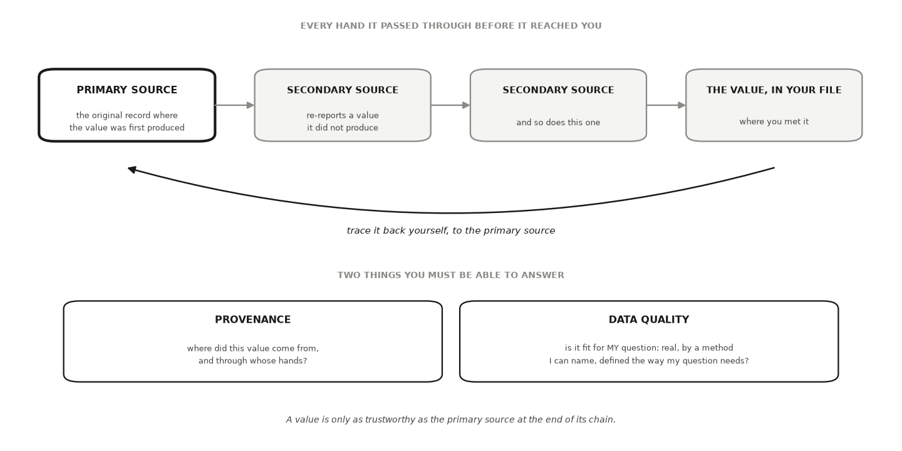

---
# GENERATED FILE — DO NOT EDIT.
# Written by scripts/build_studio_slides.py from the EDR|AI book:
#   book/studios/studio06-govern-data-measurement.qmd      (the studio's promise)
#   the studio's chapters                                 (its argument)
#   book/studios/milestone06-govern-data-measurement.qmd   (its milestone)
# Editorial overlay: planning/BOOK_SLIDE_PLANS/<lesson-id>.yml
# Lessons on this deck: data-provenance measurement
# Edit the CHAPTER (or its plan) and rerun the script. Edits made here are
# silently reverted on the next build and fail `--check` in CI.
title: "HONR 46400 · Evidence-Driven Research"
subtitle: "Studio 6 — Govern data and measurement"
author: "Davi Moreira"
format:
  revealjs:
    theme: [default, _theme/edrai-slides.scss]
    include-in-header: _theme/head.html
    include-after-body: _theme/fit.html
    width: 1600
    height: 900
    margin: 0.07
    center: false
    slide-number: c/t
    show-slide-number: all
    transition: fade
    background-transition: fade
    transition-speed: fast
    incremental: false
    hash: true
    hash-type: number
    history: false
    progress: true
    controls: true
    controls-layout: bottom-right
    touch: true
    preview-links: auto
    link-external-newwindow: true
    logo: _theme/edrai_logo.png
    footer: "EDR|AI · Studio 6 — Govern data and measurement"
    chalkboard:
      buttons: false
    menu:
      side: left
      width: wide
      numbers: true
    code-line-numbers: false
    highlight-style: github
    fig-align: center
---

## What you can defend when you leave {data-menu-title="Studio 6 · What you can defend when you leave"}

::: {.kicker}

Studio 6

:::

::::: {.slide-body}

::: {.decision}

Establish where your numbers came from and whether they measure what you say
they measure.

:::

:::::


## The milestone ahead {data-menu-title="Studio 6 · The milestone ahead"}

::: {.kicker}

Studio 6

:::

::::: {.slide-body}

This studio closes with **[Milestone 6: Your data and measurement,
governed](https://davi-moreira.github.io/2026F_evidence_driven_research_purdue_HONR464/book/studios/milestone06-govern-data-measurement.html)**,
a short chapter of its own after the lessons. **What it asks you to produce.**
Provenance documentation, a data-management record, your measurement
specification, and a route-specific permission recheck.

:::::

::: {.notes}

Results inherit the quality of the data and the measures beneath them, and no
later check can repair what goes wrong here. This milestone settles how data
reach you, where every number came from, and whether your instruments measure
what your contract says they measure. The work is deliberately unglamorous. It
is also where more projects quietly fail than anywhere else in the book.

Milestone 7 runs the declared analysis on these governed data and produces
your first reproducible result. The milestone chapter keeps the working
details: the practice steps, the versioned record, and how the artifact is
assessed.

:::


## The lessons in this studio {data-menu-title="Studio 6 · The lessons in this studio"}

::: {.kicker}

Studio 6 · Road map

:::

::::: {.slide-body}

- [Lesson 20 — Data Provenance and Data Quality](https://davi-moreira.github.io/2026F_evidence_driven_research_purdue_HONR464/book/part4-credible-evidence/17-data-provenance-and-data-quality.html): your acquisition route, written and dated, your provenance record for every dataset and borrowed number (the primary source behind your headline claim opened and read), your data-management update, and the permission recheck against the data as they actually arrived.
- [Lesson 21 — Measurement and Operationalization](https://davi-moreira.github.io/2026F_evidence_driven_research_purdue_HONR464/book/part4-credible-evidence/18-measurement-and-operationalization.html): your measurement specification: concept, construct, indicator, the meaning sentence for each number, the reliability check's result, the indicator-to-use validity argument with its strongest rival reading, and the boundary that follows.

:::::


## Data Provenance and Data Quality {background-color="#1a1a19" .divider data-menu-title="CHAPTER 20 — Data Provenance and Data Quality"}

::: {.kicker}

Lesson 1 of this studio · Chapter 20

:::

::: {.divider-line}

whether a number you did not produce yourself is solid enough to carry your
project's weight

:::


## The research decision {data-menu-title="Ch 20 · The research decision"}

::: {.kicker}

Chapter 20

:::

::::: {.slide-body}

::: {.decision}

For every number, dataset, and source your project leans on, decide whether it
is solid enough to build on. You make that call twice: once on where the value
came from and whose hands it passed through, its provenance, and once on
whether it was produced well enough, under the right definition, for the
specific use you have in mind, its quality.

:::

:::::


## The words this chapter uses {data-menu-title="Ch 20 · The words this chapter uses"}

::: {.kicker}

Chapter 20 · Key terms

:::

::::: {.slide-body}

:::: {.terms .two}

::: {.term}

[Data provenance]{.t}

[the documented origin of a value and every hand it passed through before it reached you (Lebo et al. 2013) (Wilkinson et al. 2016).]{.d}

:::

::: {.term}

[Data quality]{.t}

[whether a value is fit for *your* specific use: real, produced by a method you can name, and defined the way your question needs (Wang & Strong 1996).]{.d}

:::

::::

:::::

::: {.notes}

Each term is defined in the chapter on first use; these are the definitions as
the book gives them.

:::


## Your advisor asks where the 72 percent came from {data-menu-title="Ch 20 · Your advisor asks where the 72 percent came from"}

::: {.kicker}

Chapter 20 · Why this decision matters

:::

::::: {.slide-body}

- You wrote that turnout in this county was 72 percent.
- The question is not which website you copied it off.
- Bring the office that certified the count, or take the number out.

::: {.note-card}

Who counted the ballots, and 72 percent of what? Of registered voters, of
adults, of adults actually eligible to vote?

:::

:::::

::: {.notes}

The scene is the first draft of a background section, read by the researcher
who will eventually sign off on your project. Two things are being asked at
once: who produced the count, and 72 percent of which population. Ask the room
which borrowed number in their own project would survive that question today.

:::


## Precision is not the same as trust {data-menu-title="Ch 20 · Precision is not the same as trust"}

::: {.kicker}

Chapter 20 · Why this decision matters

:::

::::: {.slide-body}

- A value with no traceable origin is a rumor with a decimal point.
- A number does not become true by arriving looking tidy.
- Ask two questions of everything you borrow.
- Where did it come from, and is it any good for what I need it for?

:::::

::: {.notes}

The decision on the table is whether a number you did not produce yourself is
solid enough to carry your project's weight. You make that call twice, once on
where the value came from and whose hands it passed through, and once on
whether it was produced well enough for the use you have in mind. Those are
two different tests, and a citation can pass the first and fail the second.

:::


## A turnout figure traces back to the office that certified the count {data-menu-title="Ch 20 · A turnout figure traces back to the office that certified the count"}

::: {.kicker}

Chapter 20 · The concept

:::

::::: {.slide-body}

- The news story reports the figure.
- A state summary table re-reports it.
- The county election office certified the count that produced it.
- A value is only as trustworthy as the primary source at the end of its chain.

:::::

::: {.notes}

Provenance is a chain, and the chain has a direction and an end. Walk it
backwards with the room, one link at a time. Each link either produced the
value or copied it, and only one of them did the producing. Stop at the link
that produced the value, because that is where the number's trustworthiness
rests.

:::


## One link produced the value. The rest copied it. {data-menu-title="Ch 20 · One link produced the value. The rest copied it."}

::: {.kicker}

Chapter 20 · The concept

:::

::::: {.slide-body}

:::: {.terms}

::: {.term}

[Primary source]{.t}

[the original record where a value was first produced, such as the county's certified canvass reporting the final vote totals]{.d}

:::

::: {.term}

[Secondary source]{.t}

[a source that re-reports a value it did not produce, such as a newspaper table, an encyclopedia entry, or a data aggregator]{.d}

:::

::::

:::::

::: {.notes}

These two words do the work for the rest of the chapter, so define them before
anyone uses them. The certified canvass is the official document where the
totals were settled. The newspaper table, the encyclopedia entry and the
aggregator all sit in the same category: they copy. That is why the chain has
to be walked to its end before the number counts.

:::


## Every value arrives at the end of a chain someone else wrote {data-menu-title="Ch 20 · Every value arrives at the end of a chain someone else wrote"}

::: {.kicker}

Chapter 20 · The concept

:::

::::: {.slide-body}

- Only the primary source produced the value. Every later link copied it.
- Tracing back to it is your job, not the tool's.
- Provenance asks where it came from; quality asks whether it fits your question.

{fig-align="center" width="100%" fig-alt="provenance_chain.png"}

:::::

::: {.notes}

The heavy rule is on the primary source for a reason: a value is only as
trustworthy as the record at the end of its chain. Have the room name a number
they used last week and say out loud which link they actually opened.

:::


## The same real number can be right for one question and wrong for yours {data-menu-title="Ch 20 · The same real number can be right for one question and wrong for yours"}

::: {.kicker}

Chapter 20 · The concept

:::

::::: {.slide-body}

- Turnout over registered voters answers whether registered people showed up.
- It is the wrong number for how much of the adult population takes part.
- Quality is fitness for *your* use: real, method you can name, definition your question needs.
- A **mischaracterized value** is a real number attached to the wrong definition or method.

:::::

::: {.notes}

Nothing is wrong with the registered-voter rate itself. It was produced
correctly and it reports exactly what it says it reports. The defect appears
only when it is carried into a question about everyone eligible. The chapter's
two examples of mischaracterization are a survey's self-reported turnout
presented as an official count, and a registered-voter rate cited as though it
covered the whole eligible population.

:::


## A file with no answers to those questions is not yet data {data-menu-title="Ch 20 · A file with no answers to those questions is not yet data"}

::: {.kicker}

Chapter 20 · The concept

:::

::::: {.slide-body}

- Whole datasets carry the same two questions, column by column.
- Who produced this variable, and who cleaned it?
- What did they drop?
- Does the definition behind the column match the one in your question?

:::::

::: {.notes}

The chapter's line is blunt: a file that lands in your folder with no answers
to those questions is a rumor in a spreadsheet. Nothing about the file format
tells you any of this, which is why a clean download feels finished when it is
not. Have the room run these four questions against one column of a dataset a
collaborator handed them.

:::


## A citation you have not opened is a lead, not a source {data-menu-title="Ch 20 · A citation you have not opened is a lead, not a source"}

::: {.kicker}

Chapter 20 · The concept

:::

::::: {.slide-body}

::: {.lead}

One habit settles both questions: the retrieval-verification loop.

:::

- **Ask** a tool to surface a value and its source.
- **Retrieve** the primary source yourself.
- **Verify** that it exists and reports that value under that definition.
- **Document** where you found it.

:::::

::: {.notes}

The loop settles both questions with one habit. The step that gets skipped is
the second, because the first already produced something that looks finished,
and the chapter says plainly that opening a source is still your job. Finish
the rule as the chapter writes it: a lead, not a source, however confident the
tool that handed it to you.

:::


## A source that looks entirely real is where the loop starts {data-menu-title="Ch 20 · A source that looks entirely real is where the loop starts"}

::: {.kicker}

Chapter 20 · A worked example

:::

::::: {.slide-body}

- You are studying whether a local election reform changed participation.
- You need one number for your background section: county turnout in a recent presidential election.
- The assistant answers in about a second: seventy-two percent, with a source that looks entirely real.
- You run the loop instead of copying the number.

:::::

::: {.notes}

Set the scene as a small, ordinary task, because that is when the check gets
skipped. Nothing about the answer looks suspicious, and that is the point of
choosing it. The loop is not a way of distrusting the tool. It is what turns
the lead the tool gave you into a source you can cite.

:::


## Provenance: search the exact title, then walk one link back {data-menu-title="Ch 20 · Provenance: search the exact title, then walk one link back"}

::: {.kicker}

Chapter 20 · A worked example

:::

::::: {.slide-body}

- If the source resolves nowhere, the value is orphaned and you drop it.
- If the page is real, ask whether it produced the number or republished it.
- That question usually sends you back to the state's official results summary.
- Behind that sits the county clerk's certified canvass, where the totals were settled.

:::::

::: {.notes}

Two tests, in this order. The first is existence, and it is fast. The second
is production, and it is the one that moves you down the chain. Name the end
of this particular chain out loud, then ask the room what the end of the chain
looks like for the number their own headline claim leans on hardest.

:::


## Three denominators, three turnout numbers, one election {data-menu-title="Ch 20 · Three denominators, three turnout numbers, one election"}

::: {.kicker}

Chapter 20 · A worked example

:::

::::: {.slide-body}

- Open the canvass and read what the percentage is *of*.
- Registered voters, all adults, or adults eligible to vote?
- Eligible excludes noncitizens and, in some states, people with certain felony convictions.
- The gaps between those three are not small.

:::::

::: {.notes}

Then ask a second question of the same figure: was it counted or estimated?
Ballots cast are counted. Eligible-population denominators are estimated from
census data. Survey turnout is self-reported, and people reliably overstate
whether they voted, so that is a third kind of number again. A figure is not
comparable to another until you know which of the three you are holding.

:::


## When two documented sources disagree, the disagreement is the finding {data-menu-title="Ch 20 · When two documented sources disagree, the disagreement is the finding"}

::: {.kicker}

Chapter 20 · A worked example

:::

::::: {.slide-body}

- Cross-check against an independent source that documents its own methods.
- The United States Elections Project publishes voting-eligible-population turnout estimates and explains its denominator.
- The Census Bureau's Current Population Survey Voting and Registration Supplement reports self-reported turnout.
- Report both, name the definition behind each, and say which one your question needs and why.

:::::

::: {.notes}

Agreement is the easy case: when the certified canvass and an independent
reference agree on both the count and the definition, the number has earned a
place in your project. Disagreement is not a failure of the check, and it is
not a reason to pick the friendlier figure. You report both and defend the
choice. That a value's usefulness depends on its documented origin and on
fitness for the specific use, not on precision alone, is the standard framing
of data quality (Wang & Strong 1996).

:::


## One numerator, three denominators, and the spread the label decides {data-menu-title="Ch 20 · One numerator, three denominators, and the spread the label decides"}

::: {.kicker}

Chapter 20 · A worked example

:::

::::: {.slide-body}

- Nothing is randomly drawn here. Provenance is a chain, not a sample.
- Watch the spread in percentage points across the three published figures.
- Replace the placeholders with numbers you retrieve from the canvass and a named census table.

```python
import pandas as pd
SEED = 464   # no random draw here: provenance is a chain, not a sample

# One county, one election, three denominators — each a real kind of published
# figure, each answering a different question. Replace these with the numbers
# you retrieve from the canvass and the census table you name.
ballots_cast = 214_318
denominators = {
    "registered voters (clerk's canvass)": 297_664,
    "voting-age population (census estimate)": 341_902,
    "voting-eligible population (estimate)": 312_540,
}
rows = [{"denominator": k, "count": v,
         "turnout %": round(ballots_cast / v * 100, 1)}
        for k, v in denominators.items()]
print(pd.DataFrame(rows).to_string(index=False))
print(f"\nspread across the three : "
      f"{max(r['turnout %'] for r in rows) - min(r['turnout %'] for r in rows):.1f} "
      f"percentage points")
print("one election, one numerator, three published turnout numbers.")
print("a figure with no stated denominator is not yet evidence")
```

:::::

::: {.notes}

Say plainly that this block is not a simulation. It is the same numerator
divided by the three denominators a real turnout figure might be resting on,
so the size of the labelling decision is visible rather than argued. Run it,
then read the last printed line to the room: a figure with no stated
denominator is not yet evidence.

:::


## An AI failure case {data-menu-title="Ch 20 · An AI failure case"}

::: {.kicker}

Chapter 20

:::

::::: {.slide-body}

::: {.failure}

[Where the tool failed]{.label}

You ask for county turnout and the tool returns "72 percent," with a citation
to a real state elections page. Seven details look right, so it is tempting to
paste it straight in. You open the page instead, and the table header reads
*percent of registered voters*, not percent of everyone eligible. The number
is real. The denominator is the wrong one for your question, and the tool
swapped it silently. You catch it two ways. You had written your own
expectation first, so a figure that sits well above what you knew about
participation in that county already looked suspect. Then you read the actual
column header rather than the tool's summary of it, and the mismatch is plain.
The value goes into your notes as a registered-voter rate, and your original
question stays open.

:::

:::::


## Do not delegate {data-menu-title="Ch 20 · Do not delegate"}

::: {.kicker}

Chapter 20

:::

::::: {.slide-body}

::: {.rule-human}

[This stays yours]{.label}

Three calls stay yours. **Whether a value counts as verified** is settled by a
source you opened, not by the tool's confidence. **Whether its definition fits
your use** is a judgment about your specific question, and no lookup makes it
for you. And **how much uncertainty you report** when your sources disagree is
yours to state and defend, because your name goes on the claim the number
supports.

:::

:::::


## It is your turn {data-menu-title="Ch 20 · It is your turn"}

::: {.kicker}

Chapter 20 · Your move

:::

::::: {.slide-body}

1. List every dataset, table, and borrowed number your project uses.
2. For each, write four things: who produced it, when, from what original record, and every hand it passed through on the way to you.
3. Open the primary source behind the entry your headline claim leans on hardest.
4. Beside each entry, write its definition in your own words and mark whether it matches the definition your question needs.
5. Save the record as a file that travels with your project, and note the date you retrieved each source.
6. Close with the studio's governance trio: write and date your acquisition route, update where the data live and who can open them, and recheck the permission status against the data as they actually arrived.
7. Log the step in your AI Research Ledger, and verify at least one entry with a named method from the [Verification Guide](https://davi-moreira.github.io/2026F_evidence_driven_research_purdue_HONR464/book/verification-guide.html).

::: {.turn}
Work it in the [companion notebook](https://colab.research.google.com/github/davi-moreira/2026F_evidence_driven_research_purdue_HONR464/blob/main/notebooks/book/ch20_data_provenance_and_data_quality.ipynb) with [Chapter 20](https://davi-moreira.github.io/2026F_evidence_driven_research_purdue_HONR464/book/part4-credible-evidence/17-data-provenance-and-data-quality.html) open beside it. Log every delegation in your AI Research Ledger.
:::

:::::

::: {.notes}

The chapter's numbered steps, in the book's own order. The AI prompts each
step carries live in the companion notebook.

:::


## Measurement and Operationalization {background-color="#1a1a19" .divider data-menu-title="CHAPTER 21 — Measurement and Operationalization"}

::: {.kicker}

Lesson 2 of this studio · Chapter 21

:::

::: {.divider-line}

which specific number you will let stand in for the big idea your question is
about

:::


## The research decision {data-menu-title="Ch 21 · The research decision"}

::: {.kicker}

Chapter 21

:::

::::: {.slide-body}

::: {.decision}

Decide how to turn the abstract idea your question is about into one concrete
number you can record, repeat, and defend. Name the concept, name the narrower
construct that will stand in for it, name the indicator you will actually
measure, and then say plainly what that indicator captures and what it quietly
leaves out.

:::

:::::


## The words this chapter uses {data-menu-title="Ch 21 · The words this chapter uses"}

::: {.kicker}

Chapter 21 · Key terms

:::

::::: {.slide-body}

:::: {.terms .two}

::: {.term}

[Operationalization]{.t}

[the act of turning an abstract idea into a specific, repeatable measurement procedure.]{.d}

:::

::: {.term}

[Measurement validity]{.t}

[asks whether accumulated evidence supports the specific meaning you attach to your number, for the specific use you have in mind (American Educational Research Association et al. 2014).]{.d}

:::

::: {.term}

[Measurement reliability]{.t}

[asks whether your number holds still when you repeat the measurement, and it means nothing until you say *what* repeats.]{.d}

:::

::::

:::::

::: {.notes}

Each term is defined in the chapter on first use; these are the definitions as
the book gives them.

:::


## "Engaged" is a word. Which number did you record? {data-menu-title="Ch 21 · “Engaged” is a word. Which number did you record?"}

::: {.kicker}

Chapter 21 · Why this decision matters

:::

::::: {.slide-body}

- A people-analytics lead, reading the first draft of a workplace study.
- The decision on the table: which specific number stands in for the big idea.

::: {.note-card}

Before you tell me the pilot made people more engaged, tell me exactly what
you put a number on. 'Engaged' is a word. I need to know which question you
asked, on what scale, and what that number quietly ignores.

:::

:::::

::: {.notes}

Read the quote aloud and let it sit. The analyst is not attacking the finding,
but asking a question the draft cannot answer. Ask the room what the analyst
would have to hear before believing the headline. That is the whole chapter:
the question that was asked, the scale it was asked on, and what the number
quietly ignores.

:::


## Your finding is only as trustworthy as the swap {data-menu-title="Ch 21 · Your finding is only as trustworthy as the swap"}

::: {.kicker}

Chapter 21 · Why this decision matters

:::

::::: {.slide-body}

- Every result answers a question about some idea: engagement, market power, wellbeing, participation.
- You never measure the idea. You measure a number that stands in for it.
- That substitution is the swap, and it is where trust is won or lost.
- So say which number you recorded and what it quietly leaves out.

:::::

::: {.notes}

This is worth slowing down on, because it is easy to nod at and easy to skip
in practice. Nobody has ever measured engagement. People have measured answers
to questions about engagement. The chapter's move is to make the swap explicit
and defensible rather than silent, and everything after this slide is
machinery for doing that.

:::


## "Employee engagement" becomes the mean of one 1 to 7 item {data-menu-title="Ch 21 · “Employee engagement” becomes the mean of one 1 to 7 item"}

::: {.kicker}

Chapter 21 · The concept

:::

::::: {.slide-body}

::: {.lead}

Employee engagement, then willingness to recommend the workplace, then the
mean of one item.

:::

:::: {.terms}

::: {.term}

[Concept]{.t}

[the abstract idea your question is really about; rich, fuzzy, and not measurable directly]{.d}

:::

::: {.term}

[Construct]{.t}

[the one specific, named facet of the concept you decide to measure]{.d}

:::

::: {.term}

[Indicator]{.t}

[the exact number a procedure produces]{.d}

:::

::::

:::::

::: {.notes}

Climb down the ladder one rung at a time and say the example out loud at each
rung. The concept is employee engagement. The construct is willingness to
recommend the workplace, which is how strongly someone would tell a friend to
work there. The indicator is the mean response to the item "I would recommend
this company as a place to work," rated 1 to 7, averaged over everyone who
answered. You pick a construct because it is concrete enough to attach a
procedure to.

:::


## Validity belongs to a claim, not to the instrument {data-menu-title="Ch 21 · Validity belongs to a claim, not to the instrument"}

::: {.kicker}

Chapter 21 · The concept

:::

::::: {.slide-body}

- Ask whether accumulated evidence supports the meaning you attach to your number (American Educational Research Association et al. 2014).
- And for the specific use you have in mind, not for any use at all.
- May well support: people who answered expressed more willingness to recommend this workplace.
- Does not by itself support: employees here are more engaged.
- Change the reading or the use, and you need evidence again.

:::::

::: {.notes}

Engagement includes burnout and whether people feel their work matters, so one
recommend-a-friend rating cannot carry the word by itself. Keep the chapter's
bound in place when you say it: a broader argument, with more evidence behind
it, might eventually reach further. What is ruled out is treating validity as
a stamp the rating carries around. It belongs to a claim: this number, read
this way, used for this purpose, with evidence behind it.

:::


## Reliability means nothing until you say what repeats {data-menu-title="Ch 21 · Reliability means nothing until you say what repeats"}

::: {.kicker}

Chapter 21 · The concept

:::

::::: {.slide-body}

- **Repeat the occasion:** re-ask the same people two weeks later.
- **Repeat the rater:** have two trained coders score the same speeches.
- **Repeat the items:** split a many-question scale for one construct into comparable halves.
- For a fast-moving mood, a different answer is news, not error.

:::::

::: {.notes}

Push on the occasion check, because it is the one people run without thinking.
It only means something if the thing you measure should have held still over
those two weeks, and if the first asking did not change the second answer. Ask
the room which of the three repeats their own instrument could actually
support, and what a disagreement would mean if it appeared.

:::


## Split-half compares two halves of your items, on the same people {data-menu-title="Ch 21 · Split-half compares two halves of your items, on the same people"}

::: {.kicker}

Chapter 21 · The concept

:::

::::: {.slide-body}

- A twelve-item scale gives each employee an odd-item score and an even-item score.
- Check that a person scoring high on one scores high on the other.
- The halves have to be comparable, not odd-and-even by accident of order.
- Each half is only half as long, so raw agreement understates the full scale.

:::::

::: {.notes}

Split-half reliability is agreement between two halves of the items on the
same people. The two cautions are not footnotes. If the items happen to be
ordered by topic, an odd-even split may compare two different things. And
because shorter scales are noisier, the raw agreement between halves runs low;
statisticians apply a standard length correction to get from the half-scale
number to the full-scale one.

:::


## You split items, never people {data-menu-title="Ch 21 · You split items, never people"}

::: {.kicker}

Chapter 21 · The concept

:::

::::: {.slide-body}

- You could compare the average of one half of your respondents against the other.
- That tells you how much a group average wobbles between samples of people.
- It is a real thing to know, and an entirely different question.
- It says nothing about whether your instrument reads consistently.

:::::

::: {.notes}

This is the warning that saves a common wasted afternoon, so say it plainly
and then ask the room to repeat it back. The error is easy to make because
both procedures involve splitting something in two and correlating the halves.
Only one of them is about the instrument. Step 6 of the It is your turn
section forbids the wrong one by name.

:::


## A bathroom scale is reliable and still a poor stand-in for fitness {data-menu-title="Ch 21 · A bathroom scale is reliable and still a poor stand-in for fitness"}

::: {.kicker}

Chapter 21 · The concept

:::

::::: {.slide-body}

- The scale reads your weight the same way five times in a row.
- Weight is still a poor stand-in for "fitness" (Cronbach & Meehl 1955).
- Reliability feeds validity without settling it.
- An indicator can be perfectly reliable and still support the wrong claim.

:::::

::: {.notes}

Keep this example on the board for the rest of the lesson. A repeatable number
earns you the right to ask the validity question; it does not answer it. When
the retest correlation comes back high in the worked example, this is the
slide to point back to.

:::


## Sixteen sites, and one question about the flexible-scheduling pilot {data-menu-title="Ch 21 · Sixteen sites, and one question about the flexible-scheduling pilot"}

::: {.kicker}

Chapter 21 · A worked example

:::

::::: {.slide-body}

- Are the sites that ran the pilot more engaged than the sites that kept fixed shifts?
- **Concept:** employee engagement. No instrument reads "engagement."
- **Construct:** willingness to recommend the workplace.
- **Indicator:** mean of one 1 to 7 agreement item, at eight pilot and eight comparison sites.

:::::

::: {.notes}

Several facets of engagement would have been honest choices here. This one is
chosen because someone who would tell a friend to work here is telling you
something real about their attachment to the job. Say why out loud, because
step 2 of the It is your turn section asks for exactly that line: this facet,
and not a neighboring one, for this reason.

:::


## Check reliability first, then name what the item ignores {data-menu-title="Ch 21 · Check reliability first, then name what the item ignores"}

::: {.kicker}

Chapter 21 · A worked example

:::

::::: {.slide-body}

- Re-ask a random tenth two weeks later and compare their two answers.
- They land close, so the item is repeatable rather than a coin flip dressed as data.
- It says nothing about burnout, about whether pay feels fair, or about work that matters.
- It cannot hear from the people who already quit.
- Naming omissions begins the validity argument. It does not finish it.

:::::

::: {.notes}

The group who already left is the sharpest omission, because it is exactly the
group an engagement question most wants to reach, and it is structurally
absent from a survey of current employees. Ask the room which omission on
their own project has that shape. The indicator is one true facet, not the
whole of engagement.

:::


## The number is real, and its meaning stops where the construct stops {data-menu-title="Ch 21 · The number is real, and its meaning stops where the construct stops"}

::: {.kicker}

Chapter 21 · A worked example

:::

::::: {.slide-body}

- Defensible: pilot sites averaged higher willingness to recommend than comparison sites.
- With the boundary attached: one facet of engagement, measured with a repeatable single item.
- Not defensible: "the pilot made employees more engaged."
- You never measured the facets your indicator skips, and never heard from the people who left.

:::::

::: {.notes}

That validity is an argument about a particular interpretation and use, and
never a property the instrument owns, is the position of the testing standards
(American Educational Research Association et al. 2014). Have someone read the
defensible sentence and the indefensible one back to back. The difference is a
few words, and those words are the whole claim boundary.

:::


## Watch what the reliability number does not license {data-menu-title="Ch 21 · Watch what the reliability number does not license"}

::: {.kicker}

Chapter 21 · A worked example

:::

::::: {.slide-body}

- The block builds the sixteen sites, reads the indicator, and runs the retest.
- The retest re-asks the same people the same item, never a second group of people.
- The printed correlation says the item is repeatable, and stops there.

```python
import numpy as np, pandas as pd
SEED = 464
rng = np.random.default_rng(SEED)

n_per_site, sites = 60, 16
pilot = np.repeat([True] * 8 + [False] * 8, n_per_site)
site = np.repeat(np.arange(sites), n_per_site)

# The construct is willingness to recommend; the indicator is one 1-7 item.
site_effect = rng.normal(0, 0.25, size=sites)
person = (4.3 + 0.35 * pilot + site_effect[site]
          + rng.normal(0, 1.2, size=len(site)))          # people differ, stably
item = np.clip(np.round(person + rng.normal(0, 0.5, size=len(person))), 1, 7)

# Reliability: re-ask a random tenth two weeks later. Same PEOPLE, same item.
retest_idx = rng.choice(len(item), size=len(item) // 10, replace=False)
retest = np.clip(np.round(person[retest_idx]
                          + rng.normal(0, 0.5, size=len(retest_idx))), 1, 7)
r = np.corrcoef(item[retest_idx], retest)[0, 1]

print(pd.DataFrame({"pilot site": pilot, "item": item})
      .groupby("pilot site")["item"].agg(["size", "mean"]).round(2).to_string())
print(f"\ntest-retest correlation on the re-asked tenth : {r:.2f}")
print("that number says the item is repeatable. it says NOTHING about whether")
print("recommend-a-friend captures engagement, or about the people who quit")
```

:::::

::: {.notes}

Run it at SEED 464 so the numbers reproduce, then read the two printed lines
against each other. The site means answer the comparison question; the
correlation answers the repeatability question. Neither says whether
recommend-a-friend captures engagement, and neither reaches the people who
quit. Ask what you would have to add to the study to move either of those.

:::


## An AI failure case {data-menu-title="Ch 21 · An AI failure case"}

::: {.kicker}

Chapter 21

:::

::::: {.slide-body}

::: {.failure}

[Where the tool failed]{.label}

You ask, "operationalize employee engagement for my pilot study," and the tool
answers with total confidence: "Ask whether people would recommend the company
on a 0 to 10 scale and take the share who answer 9 or 10. That is engagement."
The recipe is clean, correct-sounding, and easy to field. Here is the trap.
Engagement is a broad concept with several independent facets, and the tool
silently narrowed it to one construct, then handed you the indicator as if it
were the whole idea. This is a scope change wearing the costume of a complete
answer.

:::

:::::


## How it failed {data-menu-title="Ch 21 · How it failed"}

::: {.kicker}

Chapter 21 · An AI failure case

:::

::::: {.slide-body}

- You catch it by reading the answer's claim next to your question, word for word.
- Your question was about "engagement"; the answer is about "would recommend," and those are not the same box.
- Then you confirm it with a real source: open a published engagement framework and find the several facets the recipe never mentioned.
- A confident recipe is not a valid operationalization.
- You verify the construct, not the fluency of the paragraph that proposed it.

:::::

::: {.notes}

You catch it by reading the answer's claim next to your question, word for
word. Your question was about "engagement"; the answer is about "would
recommend," and those are not the same box. Then you confirm it with a real
source: open a published engagement framework and find the several facets the
recipe never mentioned. A confident recipe is not a valid operationalization.
You verify the construct, not the fluency of the paragraph that proposed it.

:::


## Do not delegate {data-menu-title="Ch 21 · Do not delegate"}

::: {.kicker}

Chapter 21

:::

::::: {.slide-body}

::: {.rule-human}

[This stays yours]{.label}

Which **concept** your question is about, which **construct** honestly stands
for it, and where your **indicator's** meaning must stop are yours alone. The
tool can list instruments and name limitations, but only you decide that a
recommend-a-friend rating is a fair stand-in for the facet of engagement you
actually care about, and only you write the sentence that refuses to call one
facet the whole concept. Naming what your number leaves out is the
researcher's job, not the model's.

:::

:::::


## It is your turn {data-menu-title="Ch 21 · It is your turn"}

::: {.kicker}

Chapter 21 · Your move

:::

::::: {.slide-body}

1. List every concept your question contains and circle the abstract ones, the words no instrument reads: engagement, health, participation, quality, competitiveness.
2. Under each circled concept write the construct you will really measure, plus one line on why that facet and not a neighboring one.
3. Under each construct write the indicator: the exact procedure and the exact number it produces, specific enough that a stranger could repeat it and get a comparable value.
4. Under each indicator finish this sentence in your own words: "this number does not capture ___." Use the facet that worries you most, and add who your measurement never reaches.
5. Write one sentence saying what your number means and one saying what you will do with it.
6. Plan one reliability check that matches an error source you actually worry about, then run it: the same units measured twice (occasions), two coders on the same material (raters), or two halves of your *items* scored for the same people (split-half).
7. Log the step in your AI Research Ledger, and verify at least one measure with a named method from the [Verification Guide](https://davi-moreira.github.io/2026F_evidence_driven_research_purdue_HONR464/book/verification-guide.html).

::: {.turn}
Work it in the [companion notebook](https://colab.research.google.com/github/davi-moreira/2026F_evidence_driven_research_purdue_HONR464/blob/main/notebooks/book/ch21_measurement_and_operationalization.ipynb) with [Chapter 21](https://davi-moreira.github.io/2026F_evidence_driven_research_purdue_HONR464/book/part4-credible-evidence/18-measurement-and-operationalization.html) open beside it. Log every delegation in your AI Research Ledger.
:::

:::::

::: {.notes}

The chapter's numbered steps, in the book's own order. The AI prompts each
step carries live in the companion notebook.

:::


## Milestone 6: Your data and measurement, governed {background-color="#1a1a19" .divider data-menu-title="MILESTONE 6 — Milestone 6: Your data and measurement, governed"}

::: {.kicker}

Studio 6 closes here

:::

::: {.divider-line}

What the lessons handed you becomes one artifact you can defend.

:::


## What this milestone produces {data-menu-title="M6 · What this milestone produces"}

::: {.kicker}

Milestone 6

:::

::::: {.slide-body}

::: {.decision}

[The artifact]{.label}

**What this milestone produces.** Provenance documentation, a data-management record, your measurement specification, and a route-specific permission recheck.

:::

:::::


## What you bring {data-menu-title="M6 · What you bring"}

::: {.kicker}

Milestone 6 · Check before you start

:::

::::: {.slide-body}

- [Lesson 20 — Data Provenance and Data Quality](https://davi-moreira.github.io/2026F_evidence_driven_research_purdue_HONR464/book/part4-credible-evidence/17-data-provenance-and-data-quality.html): your acquisition route, written and dated, your provenance record for every dataset and borrowed number (the primary source behind your headline claim opened and read), your data-management update, and the permission recheck against the data as they actually arrived.
- [Lesson 21 — Measurement and Operationalization](https://davi-moreira.github.io/2026F_evidence_driven_research_purdue_HONR464/book/part4-credible-evidence/18-measurement-and-operationalization.html): your measurement specification: concept, construct, indicator, the meaning sentence for each number, the reliability check's result, the indicator-to-use validity argument with its strongest rival reading, and the boundary that follows.

:::::


## The practice {data-menu-title="M6 · The practice"}

::: {.kicker}

Milestone 6 · In the studio

:::

::::: {.slide-body}

1. Settle your acquisition route first, using the guidance on the studio opener, and write down which route you took and why.
2. Document provenance for every source: who produced it, how, when, and under what terms.
3. Write your measurement specification: the construct, the operationalization, and the gap between them.
4. Assess reliability and validity for your own instrument, on the evidence you actually have.
5. Recheck permissions against the data as they actually arrived, not as planned.

:::::


## The four rails, here {data-menu-title="M6 · The four rails, here"}

::: {.kicker}

Milestone 6 · Every studio, these four

:::

::::: {.slide-body}

:::: {.rails}

::: {.rail}

[Ethics, permissions, and data exposure]{.t}

[Data that arrived differently from the plan can carry permissions the plan did not cover.]{.d}

:::

::: {.rail}

[Evidence, provenance, and reproducibility]{.t}

[Provenance is the evidence rail applied to your own data.]{.d}

:::

::: {.rail}

[AI activity, verification, and human decisions]{.t}

[An assistant can describe a dataset it has never seen; verify every claim against the file.]{.d}

:::

::: {.rail}

[Uncertainty, claim boundary, and revision history]{.t}

[Measurement error is uncertainty; state it alongside sampling uncertainty, not instead of it.]{.d}

:::

::::

:::::


## A version, not a pass {data-menu-title="M6 · A version, not a pass"}

::: {.kicker}

Milestone 6

:::

::::: {.slide-body}

::: {.note-card}

[How the record works]{.label}

Your milestone artifact is a dated, numbered **version** with the reason for
the version attached. When later evidence changes it, you write the next
version rather than editing the last one, because the sequence of changes is
itself part of your research record.

:::

:::::


## The one rule {background-color="#1a1a19" .divider data-menu-title="THE ONE RULE"}

::: {.creed}
AI is your arm and your research assistant, not your brain.
:::

::: {.divider-line}
AI can review AI, and a second model is a real auditor of the first. The
last decision is always human.
:::

::: {.deck-links}
[Studio 6 in EDR|AI](https://davi-moreira.github.io/2026F_evidence_driven_research_purdue_HONR464/book/studios/studio06-govern-data-measurement.html) · [Milestone 6](https://davi-moreira.github.io/2026F_evidence_driven_research_purdue_HONR464/book/studios/milestone06-govern-data-measurement.html) · [Verification Guide](https://davi-moreira.github.io/2026F_evidence_driven_research_purdue_HONR464/book/verification-guide.html)
:::
