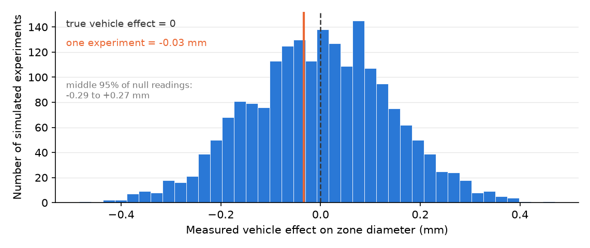

---
# GENERATED FILE — DO NOT EDIT.
# Written by scripts/build_studio_slides.py from the EDR|AI book:
#   book/studios/studio08-stress-test.qmd      (the studio's promise)
#   the studio's chapters                                 (its argument)
#   book/studios/milestone08-stress-test.qmd   (its milestone)
# Editorial overlay: planning/BOOK_SLIDE_PLANS/<lesson-id>.yml
# Lessons on this deck: robustness-sensitivity negative-tests ai-adversarial-reviewer false-confidence
# Edit the CHAPTER (or its plan) and rerun the script. Edits made here are
# silently reverted on the next build and fail `--check` in CI.
title: "HONR 46400 · Evidence-Driven Research"
subtitle: "Studio 8 — Stress-test and adjudicate"
author: "Davi Moreira"
format:
  revealjs:
    theme: [default, _theme/edrai-slides.scss]
    include-in-header: _theme/head.html
    include-after-body: _theme/fit.html
    width: 1600
    height: 900
    margin: 0.07
    center: false
    slide-number: c/t
    show-slide-number: all
    transition: fade
    background-transition: fade
    transition-speed: fast
    incremental: false
    hash: true
    hash-type: number
    history: false
    progress: true
    controls: true
    controls-layout: bottom-right
    touch: true
    preview-links: auto
    link-external-newwindow: true
    logo: _theme/edrai_logo.png
    footer: "EDR|AI · Studio 8 — Stress-test and adjudicate"
    chalkboard:
      buttons: false
    menu:
      side: left
      width: normal
    code-line-numbers: false
    highlight-style: github
    fig-align: center
---

## What you can defend when you leave

::: {.kicker}

Studio 8

:::

::::: {.slide-body}

::: {.decision}

Attack your own result the way a hostile reviewer would, and record what
survived.

:::

:::::


## The milestone ahead

::: {.kicker}

Studio 8

:::

::::: {.slide-body}

This studio closes with **[Milestone 8: Your robustness
audit](https://davi-moreira.github.io/2026F_evidence_driven_research_purdue_HONR464/book/studios/milestone08-stress-test.html)**,
a short chapter of its own after the lessons. **What it asks you to produce.**
A pre-listed robustness grid, negative tests with their assumptions stated,
diagnostics, an adversarial-review record, and your adjudication of what
survived.

:::::

::: {.notes}

A result you have not tried to break is a result you do not yet know. This
milestone attacks your own finding the way a hostile reviewer would:
pre-listed robustness checks, negative tests with predictions written before
the run, an adversarial review, and an audit of where your confidence actually
comes from. What survives, you can defend. What does not, you now know before
a reader finds it for you.

Milestone 9 writes down only the claims this audit licenses, at the strength
it licenses them. The milestone chapter keeps the working details: the
practice steps, the versioned record, and how the artifact is assessed.

:::


## The lessons in this studio

::: {.kicker}

Studio 8 · Road map

:::

::::: {.slide-body}

- [Lesson 24 — Robustness and Sensitivity](https://davi-moreira.github.io/2026F_evidence_driven_research_purdue_HONR464/book/part4-credible-evidence/21-robustness-and-sensitivity.html): your pre-listed robustness grid with its full results, direction and size, plus the named null check.
- [Lesson 25 — Diagnostics and Negative Tests](https://davi-moreira.github.io/2026F_evidence_driven_research_purdue_HONR464/book/part4-credible-evidence/22-diagnostics-and-negative-tests.html): your negative test and diagnostic, each with the prediction you wrote before running it.
- [Lesson 26 — AI as Adversarial Reviewer](https://davi-moreira.github.io/2026F_evidence_driven_research_purdue_HONR464/book/part4-credible-evidence/23-ai-as-adversarial-reviewer.html): your commissioned adversarial review with every flag adjudicated against the data, confirmed or refuted.
- [Lesson 27 — Recognizing False Confidence](https://davi-moreira.github.io/2026F_evidence_driven_research_purdue_HONR464/book/part4-credible-evidence/24-recognizing-false-confidence.html): your confidence audit: the not-yet-recomputed list, where belief in the headline number comes from, and your boundary sentence.

:::::


## Robustness and Sensitivity {background-color="#1a1a19" .divider}

::: {.kicker}

Lesson 1 of this studio · Chapter 24

:::

::: {.divider-line}

which alternative versions of your analysis you commit to running and
reporting, chosen before you see any of their answers

:::


## The research decision

::: {.kicker}

Chapter 24

:::

::::: {.slide-body}

::: {.decision}

You decide **the full list of robustness and sensitivity checks you will run,
and you decide it before you look at a single result**, then report every one
of them. Two things separate a defensible finding from a lucky slice: each
version has to be a valid analysis on its own, and the looking has to come
after the deciding. Pre-listing protects the second; nothing rescues the
first. A check you think of later is still worth running, as long as you label
it as one you added after seeing results and report it with the rest.

:::

:::::


## The words this chapter uses

::: {.kicker}

Chapter 24 · Key terms

:::

::::: {.slide-body}

:::: {.terms .two}

::: {.term}

[Shared bias]{.t}

[that common error running underneath an entire curve.]{.d}

:::

::: {.term}

[Specification searching]{.t}

[running many analyses and reporting only the one that gave the result you wanted, without disclosing the search.]{.d}

:::

::::

:::::

::: {.notes}

Each term is defined in the chapter on first use; these are the definitions as
the book gives them.

:::


## A reviewer's first question is about the versions you did not show

::: {.kicker}

Chapter 24 · Why this decision matters

:::

::::: {.slide-body}

- The decision on the table: which alternative versions you commit to running and reporting.
- You choose them before you see any of their answers.
- Then you report every one of them.

::: {.note-card}

Everyone shows me the version of the analysis that worked. I assume that one
exists. My real question is what happened to all the reasonable versions you
could have run instead, and whether you looked at them before or after you saw
this answer.

:::

:::::

::: {.notes}

The line belongs to a journal reviewer, opening the first serious read your
work will get. That reviewer is not accusing you of cheating. The question
that matters is the last sentence of the card, so read it out slowly and let
it sit before you show anyone a method.

:::


## Without the list, a delicate truth and a lucky slice look identical

::: {.kicker}

Chapter 24 · Why this decision matters

:::

::::: {.slide-body}

- Almost every real estimate depends on choices you could have made differently.
- Any single choice can flatter the result.
- Report only the version that worked and nobody can separate a delicate truth from luck (Simmons et al. 2011).

:::::

::: {.notes}

This is a plain fact about analysis, not a claim about anyone's honesty. The
chapter's answer is a habit that answers the reviewer's question before it is
asked. Keep the decision card's bound in view while you say it: a check you
think of later is still worth running, as long as you label it as one you
added after seeing results and report it with the rest.

:::


## Two named attacks, and people mix them up constantly

::: {.kicker}

Chapter 24 · The concept

:::

::::: {.slide-body}

:::: {.terms}

::: {.term}

[Robustness check]{.t}

[re-running the same finding under a different but equally defensible choice, to see whether the answer stays]{.d}

:::

::: {.term}

[Sensitivity check]{.t}

[deliberately changing an assumption to see how far the answer moves (Rosenbaum 2002)]{.d}

:::

::::

- You reported an average order value, so recompute it without the wholesale buyer.
- You assumed checkout logged every purchase, so ask what a missed two percent does.
- An estimate is one number that depends on several choices, and a critic attacks them.

:::::

::: {.notes}

Some fields call the second one a sensitivity analysis, and the two names
travel together for a reason: both attacks aim at the same target. Say the
difference in one line and make the room repeat it. A robustness check swaps a
choice you could have made either way. A sensitivity check moves an assumption
you cannot check at all and asks how far the answer travels. Since a critic
will attack your choices, you attack them first.

:::


## The headline estimate has four handles you can turn

::: {.kicker}

Chapter 24 · The concept

:::

::::: {.slide-body}

::: {.lead}

**Headline estimate:** the single number that stands in for your whole finding.

:::

- **Sample:** which data you keep.
- **Measurement:** how you turn a concept into a number.
- **Specification:** the bundle of modeling choices behind the estimate.
- **Metric:** the yardstick you report.
- Any honest plan turns one or more of them.

:::::

::: {.notes}

These four words carry the rest of the chapter, so spend a minute here. Ask
each person to name the four handles on their own project out loud before the
worked example arrives, because the example will move much faster than the
vocabulary does. A plan that turns none of them is not a plan.

:::


## Before a dot joins the curve it passes a three-part gate

::: {.kicker}

Chapter 24 · The concept

:::

::::: {.slide-body}

::: {.lead}

A **specification curve** plots one estimate under many defensible choices,
side by side (Simonsohn et al. 2020) (Steegen et al. 2016).

:::

- Same substantive claim: every version tests the one question the curve is about.
- Commensurable inside a panel: same units, same group, same kind of quantity.
- Changing who is counted, what the outcome means, or its scale opens another panel.
- No version may define its group by something the treatment could have changed.

:::::

::: {.notes}

The chapter's example question is whether the offer raises shoppers' spending,
and every dot has to be an answer to that. A choice that changes who is
counted does not disqualify the analysis; it belongs in its own labeled panel
rather than mixed silently into this one. The strict third rule rules out
"average order value among the shoppers who actually bought something",
because whether someone bought is downstream of the offer. Keep the chapter's
bound: that comparison may be worth reporting, in its own place, clearly
labeled for what it is, and specialists do define careful causal quantities
for post-treatment subgroups with different assumptions and different
machinery. What is ruled out is treating a raw survivor-style contrast as one
more dot.

:::


## A curve that agrees cannot see the flaw every version shares

::: {.kicker}

Chapter 24 · The concept

:::

::::: {.slide-body}

- A curve entirely on one side of zero shows stability across the choices you listed.
- Choose the comparison group wrong and all sixteen versions inherit that error.
- They lean the same way together, and the picture looks reassuring.
- **Shared bias:** the common error running underneath an entire curve.

:::::

::: {.notes}

The picture looks most reassuring exactly when it should not, which is why
this slide follows the gate rather than closing the chapter. Ask the room what
every version of their own analysis has in common, since the curve cannot test
that thing. Naming the shared threat in one sentence is all the curve leaves
you able to do about it.

:::


## The spread says what your choices did, not what chance could do

::: {.kicker}

Chapter 24 · The concept

:::

::::: {.slide-body}

- **Specification spread:** the span your answer covered across the versions you ran.
- It runs from lowest dot to highest, and says only how far your choices moved it.
- Every dot still carries sampling wobble of its own.
- Keep the lead estimate's uncertainty a separate, labeled thing.

:::::

::: {.notes}

The wobble on each dot is the uncertainty you already learned to state with a
standard error and an interval, and the spread is not a substitute for it. Two
facts, two sentences, never merged. Report the spread as what your choices
did, and report the uncertainty of your lead estimate beside it under its own
name.

:::


## Twenty turns of the AI loop is twenty specifications

::: {.kicker}

Chapter 24 · The concept

:::

::::: {.slide-body}

- **Specification searching:** running many analyses, reporting only the one you wanted, without disclosing the search.
- Its opposite is **pre-listed checks**: written down and all reported, before any result.
- Each prompt-and-refine cycle can change a filter, a variable, or a model.
- Re-prompt because the number disappointed you and you have run a search.
- Keep your own log of the cycles; the tool kept none for you.

:::::

::: {.notes}

The most notorious version of specification searching is hunting for a
statistically significant result, which researchers call p-hacking, and it is
not the only version. Working with an assistant means working in a loop of
prompt, read, interrogate, refine, run again, with agentic tools now spinning
those cycles on their own. That is why the log is yours to keep. Ask the room
how many analyses their last assistant session actually ran, and watch how few
can say.

:::


## A discount, and a twelve percent headline you attack before defending

::: {.kicker}

Chapter 24 · A worked example

:::

::::: {.slide-body}

- Your team randomly assigns a loyalty discount and asks whether the offer raises spending.
- Target fixed before anything ran: 30-day spending per shopper you assigned.
- Shoppers who spent nothing are counted in.
- Headline: about twelve percent more than those not offered; these numbers are constructed.

:::::

::: {.notes}

Say the target in the chapter's exact words, because the whole example depends
on it staying the same across every version that follows. Counting the
shoppers who spent nothing is part of the definition, not a detail. The
constructed-numbers bound sits on the slide because the chapter states it in
the same breath as the headline. Then attack the number across the four
handles before anyone else gets the chance.

:::


## Four handles turned, and one comparison kept off the curve

::: {.kicker}

Chapter 24 · A worked example

:::

::::: {.slide-body}

- Sample: all shoppers, or all except the wholesale account placing bulk orders.
- Measurement: the total amount charged, or shipping and taxes stripped out.
- Specification: no adjustment, or adjusted for spending in the weeks before.
- Metric: the gain in dollars, or the gain as a percent.
- Averaging only over shoppers who ordered goes in its own labeled section.

:::::

::: {.notes}

The wholesale exclusion is legitimate on your definition of a customer, not a
convenient one, and saying which it is out loud is the whole difference. The
last line is the gate doing its work: the discount can change who places an
order, so that comparison answers a different question about a different
group.

:::


## One span per panel, never a span across them

::: {.kicker}

Chapter 24 · A worked example

:::

::::: {.slide-body}

- Adjustment keeps the same people, outcome and units, so its versions share a panel.
- Dropping the wholesale account changes who is counted, so it opens a second.
- Stripping shipping and taxes changes what spending means, so it opens a third.
- Primary panel: positive in every pre-listed version, about eight to twelve percent.
- Excluding the wholesale account, the same versions ran ten to fifteen percent.

:::::

::: {.notes}

Dollars versus percent is one comparison shown on two scales, not two pieces
of evidence, so it never adds a dot at all. A single eight-to-fifteen range
stretched across all three panels would compare a net-of-tax number to a gross
one, over different sets of shoppers, and mean nothing. Read the chapter's
reporting sentence aloud and then name what sits beside it: the lead estimate
is twelve percent, with its own sampling uncertainty stated with it.
Collapsing the two into "the honest range is eight to fifteen" claims a
precision nobody computed.

:::


## Three null checks get muddled, and each has its own procedure

::: {.kicker}

Chapter 24 · A worked example

:::

::::: {.slide-body}

:::: {.terms}

::: {.term}

[Assignment-based null check]{.t}

[re-runs the assignment your study actually performed, with the same group sizes and the same blocking]{.d}

:::

::: {.term}

[Permutation check]{.t}

[shuffles labels that were not randomly assigned, and answers something only if the groups were exchangeable]{.d}

:::

::: {.term}

[Negative control]{.t}

[points your analysis at an exposure, outcome, or period that should be causally null]{.d}

:::

::::

- One redraw proves nothing, so you build a pile of fake gaps.
- That pile is what your machinery produces when the offer does nothing at all.
- This trial randomized, so use the first to build the pile.

:::::

::: {.notes}

Statisticians call the first one randomization inference: keep every enrolled
shopper and their observed outcomes, re-draw who is offered using the exact
procedure the real study used, and recompute the gap many times. In most
observational data you cannot argue the groups were exchangeable, and
shuffling anyway builds a pile describing a world you never had. A negative
control runs through the same measurement and bias pathways, such as checking
for an effect of the offer in the weeks before it launched, and it works
whether or not anything was randomized. Here the comparison is a smell test
that the uncertainty chapter later finishes: a real gap the no-effect pile
produces routinely warns you that your machinery, not the discount, may be
doing the work.

:::


## Check that every row answers the same question before reading a number

::: {.kicker}

Chapter 24 · A worked example

:::

::::: {.slide-body}

- All eight rows share one **estimand**, the quantity estimated: spending per shopper assigned.
- The printed range is a spread of defensible answers, not a confidence interval.
- The last block averages over orderers only, on a group the offer itself selected.

```python
import numpy as np, pandas as pd
SEED = 464
rng = np.random.default_rng(SEED)

n = 4000
offered = rng.random(n) < 0.5
prior = rng.gamma(2.0, 30.0, size=n)                    # spending before the offer
ordered = rng.random(n) < (0.42 + 0.025 * offered)      # the offer moves WHO orders
spend = np.where(ordered, rng.gamma(2.0, 33.0, size=n) * (1 + 0.12 * offered)
                 + 0.25 * prior, 0.0)                   # past spending carries over
ship_tax = np.where(ordered, 6.0 + 0.07 * spend, 0.0)
gross = spend + ship_tax
wholesale = np.zeros(n, dtype=bool); wholesale[0] = True
gross[0] = 9_400.0                                      # the bulk buyer

df = pd.DataFrame({"offered": offered, "gross": gross, "net": spend,
                   "prior": prior, "ordered": ordered, "wholesale": wholesale})

def pct_gain(d, col, adjust=False):
    v = d[col] - (np.polyval(np.polyfit(d.prior, d[col], 1), d.prior)
                  if adjust else 0)
    a, b = v[d.offered].mean(), v[~d.offered].mean()
    base = d.loc[~d.offered, col].mean()
    return (a - b) / base * 100

grid = []
for s_label, d in (("all shoppers", df), ("minus the wholesale account",
                                          df[~df.wholesale])):
    for m_label, col in (("charged total", "gross"), ("net of shipping/tax", "net")):
        for sp_label, adj in (("unadjusted", False), ("adj. prior spend", True)):
            grid.append({"sample": s_label, "measurement": m_label,
                         "specification": sp_label,
                         "gain %": round(pct_gain(d, col, adj), 1)})
g = pd.DataFrame(grid)
print(g.to_string(index=False))
print(f"\nall eight share ONE estimand: spending per shopper ASSIGNED.")
print(f"range {g['gain %'].min():.1f}% to {g['gain %'].max():.1f}% — a spread of "
      f"defensible answers, not a confidence interval")

# the specification that does NOT belong: conditioning on ordering
bad = pct_gain(df[df.ordered], "gross")
print(f"\naveraging over ORDERERS only: {bad:.1f}% — a different estimand, on a")
print("group the offer itself selected. it does not belong on the curve")
```

:::::

::: {.notes}

The block turns all four handles and prints the whole grid, plus the one
comparison that must stay off it. Walk the three nested loops as sample, then
measurement, then specification, which is where the eight rows come from,
rather than reading the syntax line by line. Then stop on the final print and
ask the room to say, using the gate, why that number does not belong on the
curve.

:::


## An AI failure case

::: {.kicker}

Chapter 24

:::

::::: {.slide-body}

::: {.failure}

[Where the tool failed]{.label}

You paste your four-handle grid and ask an AI to write your robustness
section. Back comes a long, well-organized passage that runs the sample
handle, the specification handle, and the metric handle, and closes with "the
twelve percent result is robust across all standard specifications." It reads
as thorough and complete. The trap is that it never listed the **measurement**
handle, the total amount charged versus shipping and taxes stripped out, and
that is precisely the choice that moves your estimate the most. The section
looks exhaustive while omitting the one check a reviewer would reach for
first.

:::

:::::


## How it failed

::: {.kicker}

Chapter 24 · An AI failure case

:::

::::: {.slide-body}

- You catch it because you pre-listed all four handles yourself before opening the tool.
- Reading its section against your own list, you notice measurement is missing, run that comparison, and watch the estimate slide toward the low end of your range.
- A passage that looks complete is not the same as one that is complete.
- You check its list against yours, not against how finished it sounds.

:::::

::: {.notes}

You catch it because you pre-listed all four handles yourself before opening
the tool. Reading its section against your own list, you notice measurement is
missing, run that comparison, and watch the estimate slide toward the low end
of your range. A passage that looks complete is not the same as one that is
complete. You check its list against yours, not against how finished it
sounds.

:::


## Do not delegate

::: {.kicker}

Chapter 24

:::

::::: {.slide-body}

::: {.rule-human}

[This stays yours]{.label}

Three calls stay yours. You decide **which checks you commit to before you
look**, **which flagged issues the data actually confirms**, and **the final
claim, with its per-panel span and its boundary, that you defend**. A
reviewer, human or AI, proposes. You verify against your own data, and the
evidence decides.

:::

:::::


## It is your turn

::: {.kicker}

Chapter 24 · Your move

:::

::::: {.slide-body}

1. Write your headline estimate in one sentence.
2. Pre-list the checks you will run, at least two, aimed at the handles a hostile reader would attack first.
3. Before you run anything, run your list through the gate.
4. Run every check on your list.
5. Ask what every version on your list has in common.
6. Add one null check, and name it with the chapter's three labels, because each label comes with its own procedure and its own reading.
7. Read back your AI cycle log and mark any re-prompt that followed a disappointing number.
8. Log the pre-listed plan and its full results in your AI Research Ledger, and verify at least one output with a named method from the [Verification Guide](https://davi-moreira.github.io/2026F_evidence_driven_research_purdue_HONR464/book/verification-guide.html).

::: {.turn}
Work it in the [companion notebook](https://colab.research.google.com/github/davi-moreira/2026F_evidence_driven_research_purdue_HONR464/blob/main/notebooks/book/ch24_robustness_and_sensitivity.ipynb) with [Chapter 24](https://davi-moreira.github.io/2026F_evidence_driven_research_purdue_HONR464/book/part4-credible-evidence/21-robustness-and-sensitivity.html) open beside it. Log every delegation in your AI Research Ledger.
:::

:::::

::: {.notes}

The chapter's numbered steps, in the book's own order. The AI prompts each
step carries live in the companion notebook.

:::


## Diagnostics and Negative Tests {background-color="#1a1a19" .divider}

::: {.kicker}

Lesson 2 of this studio · Chapter 25

:::

::: {.divider-line}

which check aimed at a guaranteed zero you run, and what passing it earns you

:::


## The research decision

::: {.kicker}

Chapter 25

:::

::::: {.slide-body}

::: {.decision}

You decide **which negative test your design actually needs**, a check aimed
at a place where the answer must be zero, and you decide what a clean pass
does and does not license you to say. Picking the test is the research.
Running it is the easy part.

:::

:::::


## A clear ring can mean your solvent is toxic

::: {.kicker}

Chapter 25 · Why this decision matters

:::

::::: {.slide-body}

- A microbiology lab advisor, on the first plate they ask to see.

::: {.note-card}

Before you tell me the extract works, show me the plate with no extract on it.
If the blank disk also cleared the bacteria, you have not discovered a drug.
You have discovered that your solvent is toxic.

:::

:::::

::: {.notes}

The advisor asks for the control plate before the result plate, and the reason
sits in the second sentence. A clear ring around a disk that never held the
extract says nothing about the plant. Ask the room what their own blank disk
would be: the version of their procedure with the thing they are studying
taken out.

:::


## Your own pipeline can manufacture the result you are about to report

::: {.kicker}

Chapter 25 · Why this decision matters

:::

::::: {.slide-body}

- How you handled the samples. How you measured. How you coded the groups.
- Any one of them can produce a signal unrelated to what you set out to study.
- A negative test tells you whether the world made your result or your pipeline did.
- Skip it and you can spend months defending an artifact.

:::::

::: {.notes}

A result that looks real is the easiest thing in the world to produce by
accident, because a procedure has many moving parts. The chapter names three
of them, and each can manufacture a signal on its own. The negative test is
how you find out which of the two explanations you are living with. The cost
of skipping it is not embarrassment at the end; it is months of work built on
something that was never there.

:::


## A negative test aims your exact analysis at a guaranteed zero

::: {.kicker}

Chapter 25 · The concept

:::

::::: {.slide-body}

:::: {.terms}

::: {.term}

[Negative test]{.t}

[a check that runs your exact analysis on a situation where the true answer has to be zero]{.d}

:::

::: {.term}

[Artifact]{.t}

[a signal produced by your procedure rather than by the thing you study]{.d}

:::

::::

- Example: measure your "effect" in a group that received no treatment at all.
- Example of an artifact: a clear ring caused by the solvent, not the extract.

:::::

::: {.notes}

Take the two terms together, because the first one hunts for the second. Hold
on to the word "exact" in the definition: a check that runs a different
analysis from your real one tests nothing you care about. The no-treatment
group is the plainest case, since a treatment nobody received cannot have
moved anything.

:::


## The true answer is zero; your reading almost never will be

::: {.kicker}

Chapter 25 · The concept

:::

::::: {.slide-body}

- The true answer is zero. The number your sample returns will almost never be.
- Different samples wobble, so a clean pass is a small reading, not a blank one.
- Clean means it sits among the readings your procedure gives when nothing is happening.
- Worrying means far out from that pile, where ordinary wobble is a strained explanation.
- Chance does occasionally produce a large reading, so no cutoff turns this into a verdict.

:::::

::: {.notes}

This is where the test is most often misread, so slow down here. A clean pass
is a reading small enough to sit comfortably among the readings your own
procedure produces when nothing is happening, and what should worry you is a
reading far out from that pile. Notice the hedge in both sentences. Demand
exact zeros and you will fail perfectly healthy machinery, or worse, tinker
until a readout prints 0.00 and call the tinkering a fix.

:::


## Three conditions, or your control is not a test

::: {.kicker}

Chapter 25 · The concept

:::

::::: {.slide-body}

::: {.lead}

A good negative control has to satisfy three conditions, and all three matter
(Lipsitch et al. 2010).

:::

- Your proposed cause must not be able to reach it, or it is not negative.
- The artifact you fear must be able to reach it, or it is not a test.
- Fear a toxic solvent? The control disk carries the solvent, minus only the extract.
- The check must be sensitive enough to show an artifact that would actually matter.
- A quiet control from an insensitive check is no evidence of a clean pipeline.

:::::

::: {.notes}

The first two conditions are both about reach, in opposite directions: a
control your cause can touch is not null, and a control your pipeline never
touches cannot catch your pipeline. The third is the one people skip. Run too
few plates, or measure too coarsely, and a control sits near zero no matter
what is going on. That quiet reading is not evidence of a clean pipeline; it
is no evidence at all.

:::


## Three tests aim at zero, and the vehicle control matches your solvent

::: {.kicker}

Chapter 25 · The concept

:::

::::: {.slide-body}

:::: {.terms .two}

::: {.term}

[Placebo test]{.t}

[you replace the real cause with a fake one that cannot act, and confirm the effect disappears]{.d}

:::

::: {.term}

[Falsification test]{.t}

[you check a consequence that must be false if your explanation is right, and confirm it is false]{.d}

:::

::: {.term}

[Negative control]{.t}

[you point the same machinery at an outcome your cause could not possibly touch]{.d}

:::

::: {.term}

[Vehicle control]{.t}

[the negative control matched to how you delivered the cause: the carrier with the active ingredient left out]{.d}

:::

::::

- Swap the real labels for a coin flip; the estimate should collapse toward zero.
- Dissolved your extract in ethanol? The vehicle control is a disk soaked in ethanol alone.

:::::

::: {.notes}

Three members of this family show up in almost every audit, and the vehicle
control is the one matched to delivery. The falsification example is worth
saying aloud: your compound can only act after you add it, so a reading taken
before you added it should show nothing. The negative-control example runs the
other way: an antibiotic cannot change the diameter of the agar dish, so a
shrinking-dish reading would mean the measurement is talking, not the drug.

:::


## Leave-one-out asks whether a single point carries your finding

::: {.kicker}

Chapter 25 · The concept

:::

::::: {.slide-body}

- The cheapest diagnostic in research: drop each case in turn and recompute.
- See whether one observation is quietly carrying your whole finding.
- A negative test asks whether your procedure invents signal.
- Leave-one-out asks whether your result rests on a single point.

:::::

::: {.notes}

Keep these two questions apart, because a project can pass one and fail the
other. The negative test is about a procedure that manufactures signal out of
nothing. Leave-one-out is about a real number that only one observation is
holding up. Both are cheap, and step four of the practice section asks for the
second one beside the first.

:::


## A clean pass lowers one worry, and never more than that

::: {.kicker}

Chapter 25 · The concept

:::

::::: {.slide-body}

::: {.lead}

The negative tests all share one move: aim the machinery where the answer must
be zero, and check that what comes back is ordinary for a world where it is
(Rosenbaum 2002).

:::

- It reduces concern about one artifact, as far as that check could have detected it.
- It does not prove the artifact is absent.
- It does not prove your effect is real.
- It never turns a correlation into a cause.
- Report what the check could and could not have caught, not just that it passed.

:::::

::: {.notes}

This is the boundary the chapter says you must never blur, so read the five
lines slowly. All the negative tests share one move, aiming the machinery
where the answer must be zero and checking that what comes back is ordinary
for a world where it is. What that buys is one specific worry made smaller,
bounded by what the check was able to see. Ask the room to say out loud what
their own passed check would still leave unanswered.

:::


## A wide ring is tempting, so read the ethanol disk first

::: {.kicker}

Chapter 25 · A worked example

:::

::::: {.slide-body}

- You soak a paper disk in plant extract, lay it on a bacterial lawn, incubate overnight.
- Next morning you measure the zone of inhibition, the clear ring where bacteria failed to grow.
- The extract was dissolved in 70% ethanol, so the vehicle control is an ethanol-only disk.
- A bare, uninhibited lawn around it: the ring is not a solvent artifact.
- Its own clear ring: the finding is an artifact until you redo it at lower concentration.

:::::

::: {.notes}

Walk the plate through in order, because the temptation is to write the wide
ring down before anything else happens. The vehicle disk sits on an identical
plate and is treated exactly the same way, which is what makes its reading
comparable. If the ethanol disk clears its own ring you can no longer tell how
much of the extract's ring is the extract and how much is the solvent, and
that is a failure with a fix rather than a finding. Say what the pass buys,
too, because the chapter stops the claim right there: the effect survives one
specific worry, and no more than that.

:::


## An assay that catches a strong antibiotic can still miss a small artifact

::: {.kicker}

Chapter 25 · A worked example

:::

::::: {.slide-body}

- A positive control is a condition you know produces a signal, run through the same machinery.
- A disk soaked in a standard antibiotic should clear a wide ring.
- If even that disk reads flat, your assay is broken today and the quiet vehicle told you nothing.
- Clearing a ring shows the system answers a strong inhibitor, not that it notices a small one.
- Decide how big a solvent effect would change your conclusion, then show the assay sees it.

:::::

::: {.notes}

The gap between those last two bullets matters, because the artifact you fear
is usually small. The chapter's move is to fix the size that would change your
conclusion first, then run a dilution series down toward that magnitude and
check that the rings still track the dose and that repeat plates agree closely
enough to tell that difference from noise. An assay that detects a strong
antibiotic and loses a one-millimetre shift has not cleared your vehicle; it
has only failed to notice. And even a clean pass does not tell you the extract
works inside a living animal, or which molecule is responsible.

:::


## Both controls get read before the extract's ring means anything

::: {.kicker}

Chapter 25 · A worked example

:::

::::: {.slide-body}

- Four conditions, ten plates each: extract, vehicle only, standard antibiotic, extract at 20% ethanol.
- Watch the vehicle mean: under 1 mm passes, above it the solvent is doing work.
- Watch the positive control: a flat reading means the assay cannot detect anything.
- A negative control that passes on a broken assay proves nothing.

```python
import numpy as np, pandas as pd
SEED = 464
rng = np.random.default_rng(SEED)

# Zone of inhibition (mm) on identical plates, ten replicates each.
conditions = {
    "plant extract in 70% ethanol": 14.0,   # what you want to claim
    "vehicle only (70% ethanol)": 0.0,      # negative control: must be bare
    "standard antibiotic": 22.0,            # positive control: must show a ring
    "extract in 20% ethanol": 11.5,         # the redo at lower solvent
}
plates = {c: np.clip(rng.normal(mu, 1.2, size=10), 0, None)
          for c, mu in conditions.items()}
print(pd.DataFrame({"condition": list(plates),
                    "mean zone (mm)": [v.mean().round(1) for v in plates.values()],
                    "max zone (mm)": [v.max().round(1) for v in plates.values()]})
      .to_string(index=False))

vehicle, positive = plates["vehicle only (70% ethanol)"], plates["standard antibiotic"]
print(f"\nnegative control ring : {vehicle.mean():.1f} mm  -> "
      f"{'PASS' if vehicle.mean() < 1 else 'FAIL, the solvent is doing work'}")
print(f"positive control ring : {positive.mean():.1f} mm  -> "
      f"{'PASS' if positive.mean() > 5 else 'FAIL, the assay cannot detect anything'}")
print("\nboth controls must be read before the extract's ring means anything.")
print("a negative control that passes on a broken assay proves nothing")
```

:::::

::: {.notes}

Run the block and read the two verdict lines aloud. The fourth condition is
the redo at lower solvent, which is what a failed vehicle control sends you
back to. A negative control means nothing until you have also seen that the
assay can detect something, which is why all four plates are read at once here
rather than one at a time.

:::


## Build a world where the vehicle does nothing, then run it 2,000 times

::: {.kicker}

Chapter 25 · A seeded simulation

:::

::::: {.slide-body}

- Each run measures twelve matched vehicle and blank disks.
- A shared plate-to-plate wobble, plus ordinary measurement noise.
- The true vehicle effect is exactly zero by construction.
- Watch the first line: how many of the 2,000 readings come back exactly zero.

```python
import numpy as np
import matplotlib.pyplot as plt

SEED = 464
rng = np.random.default_rng(SEED)

reps, pairs = 2000, 12
plate = rng.normal(0, 0.4, size=(reps, pairs))            # shared plate effect
blank   = 6.3 + plate + rng.normal(0, .35, size=(reps, pairs))
vehicle = 6.3 + plate + rng.normal(0, .35, size=(reps, pairs))

nulls = (vehicle - blank).mean(axis=1)   # true vehicle effect: exactly zero

print("exactly zero:", int((nulls == 0).sum()), "of", reps, "experiments")
print("rounds to 0.00 at two decimals:", int((nulls.round(2) == 0).sum()))
print("typical spread (middle 95%):", np.percentile(nulls, [2.5, 97.5]).round(2))
print("this run's reading:", round(float(nulls[0]), 3), "mm")
```

:::::

::: {.notes}

Ask the room to predict the first number before you run it. The world is built
so the vehicle truly has no effect at all, so the intuition many people carry
is that the readings should be zeros. Everything the section teaches follows
from that prediction being wrong.

:::


## In 2,000 honest experiments, not one reading was exactly zero

::: {.kicker}

Chapter 25 · A seeded simulation

:::

::::: {.slide-body}

- Sixty-two round to 0.00 at two decimals, so a printed "0.00" is rounding, not nothing.
- The central 95 percent runs from about -0.29 to +0.27 mm.
- Rarer runs reach roughly -0.48 and +0.47. The first run returned -0.03.
- A researcher demanding a true zero would have failed all two thousand of them.

{fig-align="center" width="70%" fig-alt="The null readings pile up around zero and spread from about -0.29 to +0.27 mm; none is exactly zero."}

::: {.figure-caption}

The null readings pile up around zero and spread from about -0.29 to +0.27 mm;
none is exactly zero.

:::

:::::

::: {.notes}

Count them out loud. In a world built so the vehicle does nothing whatsoever,
not one of two thousand readings came back exactly zero, and the sixty-two
that print as 0.00 are rounded numbers rather than measurements of nothing.
That pile is what you compare a real control against. A reading of -0.03 is
unremarkable there; a reading of +1.2 mm sits far outside anything this null
world produced, and now you have something to investigate.

:::


## The pile shows ordinary variation; it is never a pass line

::: {.kicker}

Chapter 25 · A seeded simulation

:::

::::: {.slide-body}

- Simulate your null world at your own sample size, then ask where your control sits.
- The pile is only as trustworthy as the assumptions that built it.
- The middle 95 percent excludes one honest experiment in twenty by construction.
- Drawing a cutoff there is a statistical decision, and no single cutoff settles it.
- Ask the three questions first, then report the evidence with its assumptions.

:::::

::: {.notes}

Building your own null pile is the habit worth keeping, and turning it into a
rule is the mistake worth naming. The three questions come first: could my
cause have reached this control, could the artifact I fear have reached it,
and could this check have detected an artifact big enough to matter. Only then
use the standard error and the interval you already met to say how unusual
this control is. Report that evidence with its assumptions rather than a
verdict.

:::


## An AI failure case

::: {.kicker}

Chapter 25

:::

::::: {.slide-body}

::: {.failure}

[Where the tool failed]{.label}

You ask an AI to design a negative control for your ethanol-based assay. It
answers, with complete confidence, "use a disk soaked in sterile water." You
run it, the water disk comes back perfectly clean, and the tidy conclusion
writes itself: control passed, effect confirmed. Here is the trap. Water is
not the vehicle you used. You delivered the extract in ethanol, so the
artifact you needed to catch is ethanol toxicity, and a water disk can never
show it. The clean result told you nothing at all.

:::

:::::


## How it failed

::: {.kicker}

Chapter 25 · An AI failure case

:::

::::: {.slide-body}

- You catch it with one question the tool never asked itself: which artifact could this control actually have detected?
- A valid vehicle control matches how you delivered the cause, solvent for solvent.
- The moment you see the mismatch you swap water for 70% ethanol and run the test that can genuinely fail.
- This is a *plausible-but-wrong-method*: the advice sounded like textbook practice and was wrong for your case.

:::::

::: {.notes}

You catch it with one question the tool never asked itself: which artifact
could this control actually have detected? A valid vehicle control matches how
you delivered the cause, solvent for solvent. The moment you see the mismatch
you swap water for 70% ethanol and run the test that can genuinely fail. This
is a *plausible-but-wrong-method*: the advice sounded like textbook practice
and was wrong for your case.

:::


## Do not delegate

::: {.kicker}

Chapter 25

:::

::::: {.slide-body}

::: {.rule-human}

[This stays yours]{.label}

You decide **which negative test your design actually needs**, **whether the
control is genuinely null** (a place your cause truly cannot reach), and
**what a clean pass licenses you to claim**. A tool can list candidate
controls, but only you know the mechanism well enough to certify that your
cause cannot touch the one you chose. The judgment about what a passed
negative test bought you, and how far its sensitivity reached, stays yours.

:::

:::::


## It is your turn

::: {.kicker}

Chapter 25 · Your move

:::

::::: {.slide-body}

1. Name the artifact you are most afraid of: the one way your procedure, rather than your subject, could have manufactured your result.
2. Choose the negative test that could catch it, whether that is a placebo label, a falsification outcome measured where the effect cannot yet exist, or a negative control your cause could not possibly touch.
3. Before you run anything, write down two things.
4. Run one diagnostic beside it.
5. Record what you got against what you predicted, and if the estimate moved, say by how much.
6. Log both tests in your AI Research Ledger, and verify at least one output with a named method from the [Verification Guide](https://davi-moreira.github.io/2026F_evidence_driven_research_purdue_HONR464/book/verification-guide.html). **Simulation** is the one useful tool for a negative test: build a dataset by hand where no effect exists, run your test machinery on it many times, and see the readings scatter around zero.

::: {.turn}
Work it in the [companion notebook](https://colab.research.google.com/github/davi-moreira/2026F_evidence_driven_research_purdue_HONR464/blob/main/notebooks/book/ch25_diagnostics_and_negative_tests.ipynb) with [Chapter 25](https://davi-moreira.github.io/2026F_evidence_driven_research_purdue_HONR464/book/part4-credible-evidence/22-diagnostics-and-negative-tests.html) open beside it. Log every delegation in your AI Research Ledger.
:::

:::::

::: {.notes}

The chapter's numbered steps, in the book's own order. The AI prompts each
step carries live in the companion notebook.

:::


## AI as Adversarial Reviewer {background-color="#1a1a19" .divider}

::: {.kicker}

Lesson 3 of this studio · Chapter 26

:::

::: {.divider-line}

which of the flaws a reviewer names are real, settled by a check you run
rather than by how sure the reviewer sounded

:::


## The research decision

::: {.kicker}

Chapter 26

:::

::::: {.slide-body}

::: {.decision}

When a reviewer hands you a list of flaws in your own analysis, you decide
**which flaws are real, and you decide it by running the one data check that
confirms or refutes each**, never by going with whichever reviewer sounded
most certain. Confidence is not evidence, and a panel of confident reviewers
is not three pieces of evidence.

:::

:::::


## The words this chapter uses

::: {.kicker}

Chapter 26 · Key terms

:::

::::: {.slide-body}

:::: {.terms .two}

::: {.term}

[Specification searching]{.t}

[trying many versions of an analysis and reporting only the one that gave the answer you wanted, without disclosing the search (Simmons et al. 2011).]{.d}

:::

::: {.term}

[Correlated error]{.t}

[two reviewers wrong in the same way, so their agreement is an echo, not a confirmation (Peker 2023).]{.d}

:::

::::

:::::

::: {.notes}

Each term is defined in the chapter on first use; these are the definitions as
the book gives them.

:::


## The person who signs off is the one fielding the complaints

::: {.kicker}

Chapter 26 · Why this decision matters

:::

::::: {.slide-body}

- You propose rolling a store change out to every store in the chain.
- The operations manager's sign-off is what lets it get there.
- That manager also answers for it when the checkout lines say otherwise.
- Example: complaints about backed-up queues on the first busy Saturday.

:::::

::: {.notes}

Open on the person, not on the method. The operations manager is the one whose
sign-off carries your change to every store, and the one fielding the
complaints when the new self-checkout layout backs the queues up. That is why
their concern is blunt, and why you read it out before anyone hears the word
"reviewer".

:::


## "I trust the check, not the graph"

::: {.kicker}

Chapter 26 · Why this decision matters

:::

::::: {.slide-body}

- The decision on the table: which of the flaws a reviewer names are real.
- Settled by a check you run, not by how sure the reviewer sounded.

::: {.note-card}

Do not tell me the numbers got better. Tell me which check you ran that would
have caught it if they hadn't. I trust the check, not the graph.

:::

:::::

::: {.notes}

Read the manager's line aloud, then say what it is asking for. It is not
asking whether the numbers improved. It is asking which check you ran that
would have caught the failure had there been one. Put that to the room as a
question: what would your own check have to look like before this manager
believed your result?

:::


## A confident number and a fluent critique fail the same way

::: {.kicker}

Chapter 26 · Why this decision matters

:::

::::: {.slide-body}

- A confident measurement can be wrong.
- So can a fluent AI critique, and so can a clean-looking table.
- All three can be wrong in the same convincing way.
- What the manager wants sounds least impressive and matters most.
- The check you committed to before you looked, and the flag you verified.

:::::

::: {.notes}

The three things that can fail here look nothing alike on the page, and they
fail identically: convincingly. That is the reason the chapter puts the
committed check ahead of the result. Confidence is not evidence, so the only
thing that separates a real flaw from an invented one is a measurement you ran
against your own data.

:::


## A reviewer's job is to attack your result, not to praise it

::: {.kicker}

Chapter 26 · The concept

:::

::::: {.slide-body}

:::: {.terms}

::: {.term}

[Adversarial reviewer]{.t}

[a reader whose job is to attack your result and find where it breaks, not to praise it]{.d}

:::

::: {.term}

[Robustness check]{.t}

[re-runs the same finding under a different but equally defensible choice, and sees whether the answer holds]{.d}

:::

::: {.term}

[Placebo test]{.t}

[runs your exact procedure where the effect cannot exist, and asks whether what comes back is ordinary for a world with nothing in it]{.d}

:::

::::

- The reviewer can be a colleague, one AI tool, or a panel of models.
- Each of the three fails in its own way.
- You defend a result by trying to break it first.

:::::

::: {.notes}

The chapter's example of an adversarial reviewer is a peer who tries to show
your measured improvement was luck rather than a real change. Keep the two
checks apart in the room's heads. A robustness check asks whether the answer
holds under a different defensible choice; a placebo test asks what your
machinery returns in a world where there is nothing to find.

:::


## You measured at one time of day, so measure at two more

::: {.kicker}

Chapter 26 · The concept

:::

::::: {.slide-body}

- Robustness: you measured the improvement during one time of day.
- So measure it in two other realistic time blocks as well.
- Placebo: compare two stretches of the old layout against each other.
- Repeat over many pairs, since any two stretches differ a little by chance.
- An "improvement" far larger than the rest of that pile is your measurement lying.

:::::

::: {.notes}

The placebo needs the repetition to mean anything, so do not skip the last
line. Two stretches of an unchanged layout will never come back exactly equal,
and the question is not whether the gap is zero. It is whether your gap is
ordinary for a world with nothing in it, which you can only answer once you
have a pile of such gaps to compare against.

:::


## Reporting only the hour where your change wins has a name

::: {.kicker}

Chapter 26 · The concept

:::

::::: {.slide-body}

- **Specification searching:** many versions run, only the flattering one reported, the search undisclosed (Simmons et al. 2011).
- Its everyday name is p-hacking.
- Example: you measure ten different hours and show only the hour that wins.
- The cure is **pre-listed checks**, committed to before you see any result (Nosek et al. 2018).
- Example: write down three time blocks and one placebo, run all four, report every number.

:::::

::: {.notes}

The habit that keeps an attack honest is order, not effort. Running ten
analyses is not the problem; running ten and disclosing one is. Say plainly
what the pre-listed set buys you: every number in it gets reported, including
the ones that did not help, so nobody has to take your word for what else you
tried.

:::


## Two reviewers wrong the same way is an echo, not a confirmation

::: {.kicker}

Chapter 26 · The concept

:::

::::: {.slide-body}

- **Correlated error:** two reviewers wrong in the same way (Peker 2023).
- Their agreement is an echo, not a confirmation.
- Example: two AI models share a blind spot and flag the same non-issue.
- Both sound equally certain while doing it.
- A panel of confident reviewers is not three pieces of evidence.

:::::

::: {.notes}

This failure earns its own name because AI reviewers make it constantly. Two
models can share a blind spot and flag the same non-issue with equal
confidence, so what looks like a second opinion is the first one repeated.
Treat matching answers as one candidate to check, and ask the room how they
would tell an echo from a confirmation without running anything.

:::


## An agentic reviewer finds more, and still does not get a vote

::: {.kicker}

Chapter 26 · The concept

:::

::::: {.slide-body}

- Point a tool at your whole analysis: it reads your code, reruns it, tries variants.
- It returns a ranked list of problems, and it will find real errors you missed.
- Every item on that list is still a proposal.
- Each still needs the same treatment: name the check, run it, read your own output.
- A longer, better organized list is more tempting to accept wholesale.

:::::

::: {.notes}

Give the tool its due first, because the chapter does: this is a genuine
upgrade over a single prompt. What it does not change is who adjudicates. The
better the list looks, the harder you hold the line, because a reviewer
proposes a flaw and the data decide whether it is real. Confidence, human or
machine, tells you nothing about whether the flaw exists.

:::


## You attack the p95 drop from 210 to 137 before you defend it

::: {.kicker}

Chapter 26 · A worked example

:::

::::: {.slide-body}

- Your store installed a new self-checkout layout, and your data say lines moved faster.
- **p95 wait time:** the wait 95 out of 100 customers come in under.
- Fairer than the average, because it catches the long waits people complain about.
- A p95 of 210 seconds means only the slowest 5 percent waited longer.
- Your headline is a p95 drop from 210 seconds to 137.

:::::

::: {.notes}

Define p95 before the headline lands, because the whole example is about the
tail rather than the typical customer. The average hides exactly the waits the
operations manager hears about. Then state the move the chapter is teaching:
the attack comes from you, first, before anyone else gets the chance.

:::


## Three reviewers, three fatal flaws, all confident and all different

::: {.kicker}

Chapter 26 · A worked example

:::

::::: {.slide-body}

- The first says the win is driven by a single unusually quiet morning.
- The second says you cherry-picked the one customer mix where the layout helps.
- The third says you compared a fully staffed week against a short-handed one.
- On the third reading, you measured staffing rather than the layout.
- All three are confident, and all three disagree.

:::::

::: {.notes}

Stop here and ask the room which reviewer they would believe. The point of the
disagreement is that certainty cannot be the tiebreaker, because all three
have it and all three point somewhere different. Each objection is specific
enough to name a measurement, which is what makes the next slide possible.

:::


## Turn each flaw into a check, and two of them dissolve

::: {.kicker}

Chapter 26 · A worked example

:::

::::: {.slide-body}

- Leave-one-out drops the quiet morning and recomputes the p95: it barely moves.
- So the first flaw is refuted.
- Your pre-listed grid reruns the drop across three customer mixes: it holds in all three.
- The placebo compares two stretches of the old layout, and comes back near zero.
- The two loudest flags dissolved the moment a check touched them.

:::::

::: {.notes}

Walk the placebo logic slowly, since it is the least obvious of the three. An
improvement between two stretches of the unchanged old layout would have
proved the third reviewer right, because it would show the machinery
manufacturing gaps out of nothing. It came back near zero, so the machinery is
clean. You did not trust the loudest voice; you turned each flaw into
something you could run.

:::


## Watch which line decides, not which reviewer sounded surest

::: {.kicker}

Chapter 26 · A worked example

:::

::::: {.slide-body}

- Watch the leave-one-out range: the drop survives dropping any single morning.
- Watch the three mixes side by side, old p95 against new.
- Watch the placebo: the old layout against itself should come back near zero.

```python
import numpy as np, pandas as pd
SEED = 464
rng = np.random.default_rng(SEED)

def waits(n, scale, staffed):
    return rng.gamma(2.2, scale * (1.0 if staffed else 1.18), size=n)

mornings = 20
old = pd.DataFrame({"morning": np.repeat(np.arange(mornings), 60),
                    "wait": np.concatenate([waits(60, 40, m % 5 != 0)
                                            for m in range(mornings)]),
                    "mix": np.tile(["commuter", "shopper", "family"], 400)})
new = pd.DataFrame({"morning": np.repeat(np.arange(mornings), 60),
                    "wait": np.concatenate([waits(60, 27, m % 5 != 0)
                                            for m in range(mornings)]),
                    "mix": np.tile(["commuter", "shopper", "family"], 400)})
p95 = lambda d: np.quantile(d.wait, 0.95)
print(f"headline p95: {p95(old):.0f} s  ->  {p95(new):.0f} s")

# flaw 1: one unusually quiet morning is carrying the win
loo = [p95(new[new.morning != m]) for m in range(mornings)]
print(f"\nleave-one-out p95 range : {min(loo):.0f}-{max(loo):.0f} s "
      f"(the drop survives dropping any single morning)")

# flaw 2: it only holds for one customer mix
by_mix = pd.DataFrame({"old p95": old.groupby("mix").wait.quantile(0.95),
                       "new p95": new.groupby("mix").wait.quantile(0.95)}).round(0)
print("\n" + by_mix.to_string())

# flaw 3: the placebo — two stretches of the OLD layout against each other
placebo = p95(old[old.morning < 10]) - p95(old[old.morning >= 10])
print(f"\nplacebo, old layout vs itself : {placebo:+.0f} s "
      f"({'clean' if abs(placebo) < 25 else 'the machinery manufactures gaps'})")
print("three confident reviewers, three checks, and only the checks decide")
```

:::::

::: {.notes}

Run it as three answers to three named objections, in the order the reviewers
raised them. Committing to the checks before seeing the results is what keeps
this from becoming a search for the version you liked (Nosek et al. 2018).
Change one input and ask which printed line would have caught it.

:::


## The flaw that survives is the one no measurement can remove

::: {.kicker}

Chapter 26 · A worked example

:::

::::: {.slide-body}

- None of the three reviewers raised it.
- This ran at one store, on weekdays, not across the chain.
- No further measurement removes that, so the honest claim is bounded.
- You measured a p95 improvement for these three customer mixes, at this store.
- Not a guarantee for every location your company runs.

:::::

::: {.notes}

Separate the two kinds of flaw out loud, because the difference decides what
you do next. A measurement problem is answered by running something; a
boundary problem is answered only by narrowing the claim until the claim is
true. Notice that the surviving flaw is the one no reviewer named, which is a
reason to keep adjudicating after the panel goes quiet.

:::


## An AI failure case

::: {.kicker}

Chapter 26

:::

::::: {.slide-body}

::: {.failure}

[Where the tool failed]{.label}

You paste your wait-time summary into an AI reviewer, and it answers with
total certainty: your improvement is an artifact of one unusually quiet
morning, drop that morning and it vanishes. The claim is specific,
mechanistic, and stated without a hedge. It reads exactly like a reviewer who
has seen this mistake a hundred times.

:::

:::::


## How it failed

::: {.kicker}

Chapter 26 · An AI failure case

:::

::::: {.slide-body}

- Here is how you catch it.
- You do not act on the verdict.
- You run the leave-one-out yourself, dropping the quiet morning and recomputing the p95.
- The improvement barely moves.
- The confident flaw was fabricated, a real-sounding mechanism bolted onto a problem your data do not have.

:::::

::: {.notes}

Here is how you catch it. You do not act on the verdict. You run the
leave-one-out yourself, dropping the quiet morning and recomputing the p95.
The improvement barely moves. The confident flaw was fabricated, a
real-sounding mechanism bolted onto a problem your data do not have. Trust the
certainty and you throw away a genuine result on a hunch. Pointing the check
at your own numbers is the only thing that settled it.

:::


## Do not delegate

::: {.kicker}

Chapter 26

:::

::::: {.slide-body}

::: {.rule-human}

[This stays yours]{.label}

These stay yours, no matter how fluent the reviewer sounds. Which robustness
checks you commit to before you look, because only those carry confirmatory
weight. A check you think of after seeing the result is still worth running;
it is exploratory, and it counts only if you label it that way and report it
with the rest. Which flagged flaws your data actually confirm, decided by the
measurement and not by the confidence. Whether a flaw is a claim-boundary
problem that no further measurement can fix and only a narrower claim can
answer. And the one bounded result you will defend, with its uncertainty
stated. A reviewer proposes; you verify, and the evidence decides.

:::

:::::


## It is your turn

::: {.kicker}

Chapter 26 · Your move

:::

::::: {.slide-body}

1. Write a one-paragraph summary of your design, your headline claim, and the checks you have already run.
2. Commission the review: ask for the single most serious flaw and the exact measurement that would confirm or refute it.
3. Take the three hardest points you got back.
4. Run all three checks against your own data.
5. Find the flaw that no check can fix, the one that is a boundary problem rather than a measurement problem, and narrow your claim until the claim is true.
6. Log the review and every adjudicated flag in your AI Research Ledger, and verify at least one output with a named method from the [Verification Guide](https://davi-moreira.github.io/2026F_evidence_driven_research_purdue_HONR464/book/verification-guide.html). **Peer reasoning** belongs here: walk your narrowed claim past a person and see whether it survives their first question.

::: {.turn}
Work it in the [companion notebook](https://colab.research.google.com/github/davi-moreira/2026F_evidence_driven_research_purdue_HONR464/blob/main/notebooks/book/ch26_ai_as_adversarial_reviewer.ipynb) with [Chapter 26](https://davi-moreira.github.io/2026F_evidence_driven_research_purdue_HONR464/book/part4-credible-evidence/23-ai-as-adversarial-reviewer.html) open beside it. Log every delegation in your AI Research Ledger.
:::

:::::

::: {.notes}

The chapter's numbered steps, in the book's own order. The AI prompts each
step carries live in the companion notebook.

:::


## Recognizing False Confidence {background-color="#1a1a19" .divider}

::: {.kicker}

Lesson 4 of this studio · Chapter 27

:::

::: {.divider-line}

what you require of a confident-sounding result before you put your name on it

:::


## The research decision

::: {.kicker}

Chapter 27

:::

::::: {.slide-body}

::: {.decision}

When a tool hands you a fluent, confident finding, you decide **whether its
confidence counts as evidence** (it never does) and **which independent check
you run on the number underneath it** before you repeat the claim as your own.
Nothing about how sure the sentence sounds tells you whether it is true.

:::

:::::


## The words this chapter uses

::: {.kicker}

Chapter 27 · Key terms

:::

::::: {.slide-body}

:::: {.terms .two}

::: {.term}

[False confidence]{.t}

[when fluent, detailed output makes you feel sure of something you never actually verified (Ji et al. 2023).]{.d}

:::

::: {.term}

[Automation bias]{.t}

[the tendency to over-trust an automated system and stop checking, precisely because a machine produced the answer (Goddard et al. 2012).]{.d}

:::

::: {.term}

[Illusion of understanding]{.t}

[mistaking a smooth explanation for real comprehension (Rozenblit & Keil 2002).]{.d}

:::

::: {.term}

[Verification]{.t}

[an independent check, run by a method outside the model, that a result is actually true.]{.d}

:::

::::

:::::

::: {.notes}

Each term is defined in the chapter on first use; these are the definitions as
the book gives them.

:::


## The reviewer acts on the number, not on the sentence

::: {.kicker}

Chapter 27 · Why this decision matters

:::

::::: {.slide-body}

- A fisheries biologist reviews stream-restoration reports for a state agency.
- Every year the summaries announce success in polished, sure prose.
- Their ask: the measurement, how you computed the change, why the project gets the credit.

::: {.note-card}

I don't act on the sentence. I act on the number behind it.

:::

:::::

::: {.notes}

Open with the person, not the concept. This reviewer has read a hundred
confident paragraphs, so polish has stopped carrying any information for them.
Read their standard aloud and notice that it is three separate demands: the
measurement itself, the computation that turned it into a change, and the
reason the project rather than something else gets the credit. Ask the room
which of the three their own project currently answers.

:::


## An AI partner writes you a sure-sounding finding in seconds

::: {.kicker}

Chapter 27 · Why this decision matters

:::

::::: {.slide-body}

- A confident paragraph moves nobody who has read a hundred confident paragraphs.
- What moves them is a number you recomputed and can defend.
- Treat the confidence as worth nothing until you check what sits under it.
- The decision: what you require of a confident result before your name goes on it.

:::::

::: {.notes}

The speed is the new part. An AI partner writes a beautiful, sure-sounding
finding in seconds, so polish now tells you nothing about the care behind it.
Put the decision on the table plainly, because it is the one the whole lesson
turns on: you are setting your own standard for what a confident result has to
survive before you repeat it as your own.

:::


## "Cut nitrate by roughly 40 percent" feels settled before you look

::: {.kicker}

Chapter 27 · The concept

:::

::::: {.slide-body}

- An AI summary reports that a stream cleanup cut nitrate by roughly 40 percent.
- The crisp figure and the smooth wording make the claim feel settled.
- You have not looked at a single measurement yet.
- **False confidence:** fluent, detailed output makes you feel sure of what you never verified (Ji et al. 2023).

:::::

::: {.notes}

Give the example before the name, because the feeling is the thing being
taught. A round number and clean prose do work on a reader that neither one
has earned. Say what the trap is not: it is not the tool lying to you on
purpose, and it is not a failure you can spot by rereading the sentence more
carefully. It is your own sense of certainty arriving before any check did.

:::


## Two habits make the trap dangerous

::: {.kicker}

Chapter 27 · The concept

:::

::::: {.slide-body}

:::: {.terms}

::: {.term}

[Automation bias]{.t}

[the tendency to over-trust an automated system and stop checking, precisely because a machine produced the answer]{.d}

:::

::: {.term}

[Illusion of understanding]{.t}

[mistaking a smooth explanation for real comprehension]{.d}

:::

::::

- You would double-check a lab partner's arithmetic without thinking twice.
- You paste the AI's percentage straight into your report because the tool computed it (Goddard et al. 2012).
- You nod along line by line, then could not defend the number without rerunning it (Rozenblit & Keil 2002).

:::::

::: {.notes}

Both habits are ordinary, which is what makes them hard to see in yourself.
Automation bias is a double standard: the same arithmetic gets checked from a
person and waved through from a machine. The illusion of understanding is
subtler, because following an explanation feels almost exactly like being able
to reproduce it. The test that separates them is whether you could rerun the
calculation alone and get the same answer. Ask the room to name a number in
their own project that would fail that test today.

:::


## A number wrong on turn one is usually still wrong on turn six

::: {.kicker}

Chapter 27 · The concept

:::

::::: {.slide-body}

- You prompt, read, refine, and run again, and agentic tools spin those cycles on their own.
- Each pass comes back cleaner and surer than the last.
- That polish feels like convergence on the truth. It is nothing of the kind.
- Confidence grows across the loop whether or not accuracy does.

:::::

::: {.notes}

This is the part the loop era adds, so spend a minute on it. Nobody stops at a
first answer any more, and every extra turn improves the writing whether or
not it touches the number. A wrong figure on turn one usually survives to turn
six, only better dressed. The practical instruction is narrow and worth
stating exactly: check the number on the turn you actually intend to use, not
on some earlier turn that looked rougher.

:::


## Verify the number, not the paragraph

::: {.kicker}

Chapter 27 · The concept

:::

::::: {.slide-body}

:::: {.terms}

::: {.term}

[Verification]{.t}

[an independent check, run by a method outside the model, that a result is actually true]{.d}

:::

::::

- Do not trust the AI's "40 percent."
- Recompute the average nitrate before and after the cleanup from the raw readings.
- Then see what the data really show.

:::::

::: {.notes}

The word doing the work in that definition is independent: the check has to
come from outside the model, or it is the same source agreeing with itself.
Asking the tool whether it is sure is not verification. Recomputing the mean
from the readings yourself is. Keep this rule short enough that the room can
carry it out of the door.

:::


## Code that runs is not code that is correct

::: {.kicker}

Chapter 27 · The concept

:::

::::: {.slide-body}

- A summary that reads beautifully is not a summary that is right.
- Nothing about how sure a sentence sounds tells you whether it is true.
- Decide which independent check you run before you repeat the claim as your own.

:::::

::: {.notes}

Two different mistakes get made here and both are common. Code that executes
cleanly has proved only that it ran, and prose that reads well has proved only
that it was written well. Neither is evidence about the number. Close the
concept by naming the choice that remains yours: which check, run by what
method, before you say the claim out loud.

:::


## One small stream, a buffer planted last year, two years of readings

::: {.kicker}

Chapter 27 · A worked example

:::

::::: {.slide-body}

- **Riparian buffer:** a strip of trees and grasses planted along a bank to filter runoff.
- **Nitrate:** a fertilizer nutrient that in excess fuels algal blooms and starves water of oxygen.
- You have weekly nitrate readings in milligrams per liter, the year before and the year after.
- The agency cares because low oxygen kills the trout the restoration was meant to bring back.

:::::

::: {.notes}

Set the stakes before the numbers, because they explain why anyone would want
the confident answer to be true. The restoration was meant to bring the trout
back, and low oxygen is what kills them, so a clean 40 percent is the result
everyone involved is hoping for. That hope is exactly the condition under
which a fluent summary slips through unchecked.

:::


## Reaching to quote the clean result is where false confidence would win

::: {.kicker}

Chapter 27 · A worked example

:::

::::: {.slide-body}

- You asked an AI to summarize the dataset, and this came back.
- The sentence is fluent and sure.
- You feel the relief of a clean result and reach to quote it.

::: {.note-card}

The riparian buffer reduced average nitrate by about 40 percent, a clear
environmental success.

:::

:::::

::: {.notes}

Name the moment rather than the error. The failure is not that the tool
produced this sentence; it is the reach for the quote, which happens before
any check and feels like efficiency. Ask the room to say what they would have
done next with this sentence in hand, and whether that step would have caught
anything.

:::


## The real drop is 1.2 mg/L, about 15 percent, not 40

::: {.kicker}

Chapter 27 · A worked example

:::

::::: {.slide-body}

- Before-mean 8.1 mg/L. After-mean 6.9 mg/L. Subtract.
- The confident summary overstated the change by more than double.
- Two means and a subtraction from the raw readings settle the number.

:::::

::: {.notes}

Do the arithmetic on the board, slowly, because its smallness is the point.
Two means and a subtraction is all that stood between the inflated figure and
a report carrying your name. Overstating by more than double is not a rounding
difference, and nothing in the wording of the summary hinted at it.

:::


## Even the true 15 percent cannot be pinned on the buffer alone

::: {.kicker}

Chapter 27 · A worked example

:::

::::: {.slide-body}

- The readings come from one site with no comparison stream.
- A wet spring could move nitrate just as much.
- So could a change in fertilizer practice upstream.
- Keep this: nitrate fell about 15 percent at this site over one year.
- Drop the inflated figure, and drop the word "success."

:::::

::: {.notes}

The second problem hid behind the same polish and is the harder one, because
fixing the number does not fix it. With one site and no comparison stream,
even an honest 15 percent could come from the weather rather than the
planting. Read the kept sentence aloud and have the room notice what it does
not say: it reports that nitrate fell, and it credits nobody for it.

:::


## Recomputing the drop takes about as long as reading the confident sentence

::: {.kicker}

Chapter 27 · A worked example

:::

::::: {.slide-body}

- Watch the two printed means, then the drop in mg/L and in percent.
- Compare that percent against the 40 the summary claimed.
- The last lines say what the number still cannot establish.

```python
import numpy as np, pandas as pd
SEED = 464
rng = np.random.default_rng(SEED)

weeks = np.arange(104)
season = 1.1 * np.sin(2 * np.pi * weeks / 52)
after = weeks >= 52
nitrate = 8.1 - 1.35 * after + season + rng.normal(0, 0.6, size=104)

before_mean, after_mean = nitrate[~after].mean(), nitrate[after].mean()
drop = before_mean - after_mean
print(f"before-planting mean : {before_mean:.1f} mg/L")
print(f"after-planting mean  : {after_mean:.1f} mg/L")
print(f"drop                 : {drop:.1f} mg/L, {drop/before_mean*100:.0f}%")
print("the confident summary said: 40%")
print("\nand the number you just computed still cannot be pinned on the buffer:")
print("one site, no comparison stream, and a wet spring would look the same")
```

:::::

::: {.notes}

Run it in front of the room and read the printout in order. The block builds
the two years of readings and recomputes the drop, which is the whole
verification. Then point at the closing lines: one site, no comparison stream,
and a wet spring would look the same. The code settles what the number is, and
it deliberately refuses to settle what the number means.

:::


## An AI failure case

::: {.kicker}

Chapter 27

:::

::::: {.slide-body}

::: {.failure}

[Where the tool failed]{.label}

You ask the AI to "summarize what this water-quality dataset shows," and it
hands back a confident paragraph ending in "a 40 percent reduction, a clear
success." Every part reads like a finding you could quote: a round figure, a
firm verdict, no hedging.

:::

:::::


## How it failed

::: {.kicker}

Chapter 27 · An AI failure case

:::

::::: {.slide-body}

- Here is exactly how you catch it.
- You do not repeat the paragraph.
- You compute the two group means from the raw readings and subtract, and the real change is about 15 percent, not 40.
- Then you ask what the design licenses: one site, no control stream, a single year, so even the honest 15 percent could come from the weather rather than the buffer.
- The confident summary failed twice, once on the number and once on the causal reach, and both failures were invisible until you checked outside the model.

:::::

::: {.notes}

Here is exactly how you catch it. You do not repeat the paragraph. You compute
the two group means from the raw readings and subtract, and the real change is
about 15 percent, not 40. Then you ask what the design licenses: one site, no
control stream, a single year, so even the honest 15 percent could come from
the weather rather than the buffer. The confident summary failed twice, once
on the number and once on the causal reach, and both failures were invisible
until you checked outside the model.

:::


## Do not delegate

::: {.kicker}

Chapter 27

:::

::::: {.slide-body}

::: {.rule-human}

[This stays yours]{.label}

These stay yours, no matter how sure the tool sounds. Deciding what claim the
verified number actually supports, and how far that claim reaches. Judging
whether your design lets you credit the buffer for the change, or only lets
you report that nitrate fell. Stating the uncertainty and the limits in your
own words. The tool can draft a summary; deciding whether that summary is
true, and answering for it, is the researcher's job.

:::

:::::


## It is your turn

::: {.kicker}

Chapter 27 · Your move

:::

::::: {.slide-body}

1. List every number currently in your project that you have not personally recomputed.
2. For your headline number, write down where your confidence in it actually comes from: your own recomputation, a tool's fluent summary, or the fact that it matched what you were hoping for.
3. Write your boundary sentence, the claim your design licenses and nothing beyond it.
4. Name the one place you are most likely to let a confident answer past unchecked, and write it down.
5. Adopt a standing rule for the rest of the project: no AI-reported number reaches your paper, note, or poster until you have recomputed it by a second method.
6. Log the audit in your AI Research Ledger, and verify your headline number with a named method from the [Verification Guide](https://davi-moreira.github.io/2026F_evidence_driven_research_purdue_HONR464/book/verification-guide.html). **Direct calculation** is the one this chapter is built on: recompute the means by hand, subtract, and see whether the confident figure survives.

::: {.turn}
Work it in the [companion notebook](https://colab.research.google.com/github/davi-moreira/2026F_evidence_driven_research_purdue_HONR464/blob/main/notebooks/book/ch27_recognizing_false_confidence.ipynb) with [Chapter 27](https://davi-moreira.github.io/2026F_evidence_driven_research_purdue_HONR464/book/part4-credible-evidence/24-recognizing-false-confidence.html) open beside it. Log every delegation in your AI Research Ledger.
:::

:::::

::: {.notes}

The chapter's numbered steps, in the book's own order. The AI prompts each
step carries live in the companion notebook.

:::


## Milestone 8: Your robustness audit {background-color="#1a1a19" .divider}

::: {.kicker}

Studio 8 closes here

:::

::: {.divider-line}

What the lessons handed you becomes one artifact you can defend.

:::


## What this milestone produces

::: {.kicker}

Milestone 8

:::

::::: {.slide-body}

::: {.decision}

[The artifact]{.label}

**What this milestone produces.** A pre-listed robustness grid, negative tests with their assumptions stated, diagnostics, an adversarial-review record, and your adjudication of what survived.

:::

:::::


## What you bring

::: {.kicker}

Milestone 8 · Check before you start

:::

::::: {.slide-body}

- [Lesson 24 — Robustness and Sensitivity](https://davi-moreira.github.io/2026F_evidence_driven_research_purdue_HONR464/book/part4-credible-evidence/21-robustness-and-sensitivity.html): your pre-listed robustness grid with its full results, direction and size, plus the named null check.
- [Lesson 25 — Diagnostics and Negative Tests](https://davi-moreira.github.io/2026F_evidence_driven_research_purdue_HONR464/book/part4-credible-evidence/22-diagnostics-and-negative-tests.html): your negative test and diagnostic, each with the prediction you wrote before running it.
- [Lesson 26 — AI as Adversarial Reviewer](https://davi-moreira.github.io/2026F_evidence_driven_research_purdue_HONR464/book/part4-credible-evidence/23-ai-as-adversarial-reviewer.html): your commissioned adversarial review with every flag adjudicated against the data, confirmed or refuted.
- [Lesson 27 — Recognizing False Confidence](https://davi-moreira.github.io/2026F_evidence_driven_research_purdue_HONR464/book/part4-credible-evidence/24-recognizing-false-confidence.html): your confidence audit: the not-yet-recomputed list, where belief in the headline number comes from, and your boundary sentence.

:::::


## The practice

::: {.kicker}

Milestone 8 · In the studio

:::

::::: {.slide-body}

1. Pre-list your checks before you run any of them, and commit to reporting all of them.
2. Run the robustness grid and report a span within each commensurable panel, never across panels.
3. Run the null check that your design licenses, and name it correctly.
4. Commission at least one adversarial review, and add a human reviewer when one is available. Neither review is independent verification: confirm or refute every flag with a data check.
5. Write the adjudication: what survived, what did not, and what you still cannot rule out.

:::::


## The four rails, here

::: {.kicker}

Milestone 8 · Every studio, these four

:::

::::: {.slide-body}

:::: {.rails}

::: {.rail}

[Ethics, permissions, and data exposure]{.t}

[Report the checks that hurt your finding as fully as the ones that helped.]{.d}

:::

::: {.rail}

[Evidence, provenance, and reproducibility]{.t}

[A flag is real when a check confirms it, not when the reviewer sounds certain.]{.d}

:::

::: {.rail}

[AI activity, verification, and human decisions]{.t}

[An AI reviewer is another critique, not independent verification.]{.d}

:::

::: {.rail}

[Uncertainty, claim boundary, and revision history]{.t}

[Specification spread measures your choices; it is not an uncertainty interval.]{.d}

:::

::::

:::::


## A version, not a pass

::: {.kicker}

Milestone 8

:::

::::: {.slide-body}

::: {.note-card}

[How the record works]{.label}

Your milestone artifact is a dated, numbered **version** with the reason for
the version attached. When later evidence changes it, you write the next
version rather than editing the last one, because the sequence of changes is
itself part of your research record.

:::

:::::


## The one rule {background-color="#1a1a19" .divider}

::: {.creed}
AI is your arm and your research assistant, not your brain.
:::

::: {.divider-line}
AI can review AI, and a second model is a real auditor of the first. The
last decision is always human.
:::

::: {.deck-links}
[Studio 8 in EDR|AI](https://davi-moreira.github.io/2026F_evidence_driven_research_purdue_HONR464/book/studios/studio08-stress-test.html) · [Milestone 8](https://davi-moreira.github.io/2026F_evidence_driven_research_purdue_HONR464/book/studios/milestone08-stress-test.html) · [Verification Guide](https://davi-moreira.github.io/2026F_evidence_driven_research_purdue_HONR464/book/verification-guide.html)
:::
