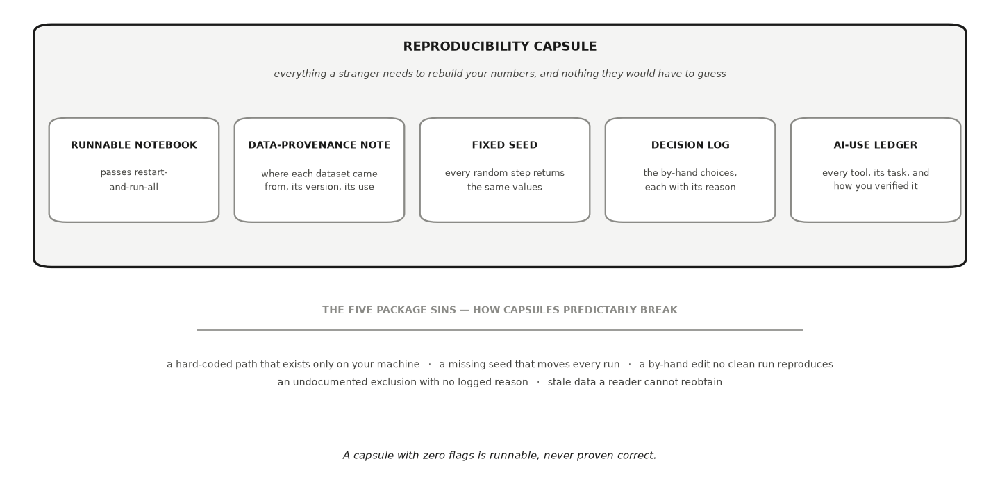

---
# GENERATED FILE — DO NOT EDIT.
# Written by scripts/build_studio_slides.py from the EDR|AI book:
#   book/studios/studio11-reproduce-and-package.qmd      (the studio's promise)
#   the studio's chapters                                 (its argument)
#   book/studios/milestone11-reproduce-and-package.qmd   (its milestone)
# Editorial overlay: planning/BOOK_SLIDE_PLANS/<lesson-id>.yml
# Lessons on this deck: replication-reproduction research-packages
# Edit the CHAPTER (or its plan) and rerun the script. Edits made here are
# silently reverted on the next build and fail `--check` in CI.
title: "HONR 46400 · Evidence-Driven Research"
subtitle: "Studio 11 — Reproduce and package"
author: "Davi Moreira"
format:
  revealjs:
    theme: [default, _theme/edrai-slides.scss]
    include-in-header: _theme/head.html
    include-after-body: _theme/fit.html
    width: 1600
    height: 900
    margin: 0.07
    center: false
    slide-number: c/t
    show-slide-number: all
    transition: fade
    background-transition: fade
    transition-speed: fast
    incremental: false
    hash: true
    hash-type: number
    history: false
    progress: true
    controls: true
    controls-layout: bottom-right
    touch: true
    preview-links: auto
    link-external-newwindow: true
    logo: _theme/edrai_logo.png
    footer: "EDR|AI · Studio 11 — Reproduce and package"
    chalkboard:
      buttons: false
    menu:
      side: left
      width: wide
      numbers: true
    code-line-numbers: false
    highlight-style: github
    fig-align: center
---

## What you can defend when you leave {data-menu-title="Studio 11 · What you can defend when you leave"}

::: {.kicker}

Studio 11

:::

::::: {.slide-body}

::: {.decision}

Prove that someone who is not you can obtain your result from your materials.

:::

:::::


## The milestone ahead {data-menu-title="Studio 11 · The milestone ahead"}

::: {.kicker}

Studio 11

:::

::::: {.slide-body}

This studio closes with **[Milestone 11: Your reproducible
package](https://davi-moreira.github.io/2026F_evidence_driven_research_purdue_HONR464/book/studios/milestone11-reproduce-and-package.html)**,
a short chapter of its own after the lessons. **What it asks you to produce.**
An independent cold-run record and a reusable research package. Working alone,
the record is a clean-environment rerun labeled "solo proxy; external cold run
pending" — the label, and the honesty it enforces, are part of the artifact.

:::::

::: {.notes}

Research that only runs on your machine, with you present, is testimony rather
than evidence. This milestone proves that someone who is not you can obtain
your result from your materials alone: a cold run, a stranger's run (or,
working alone, its honestly labeled solo proxy), and a package that carries
data access, code, environment, documentation, and licence. It is the boundary
between work you finished and work others can build on.

Milestone 12 decides whether the packaged work is ready to leave your hands,
and what the next cycle should ask. The milestone chapter keeps the working
details: the practice steps, the versioned record, and how the artifact is
assessed.

:::


## The lessons in this studio {data-menu-title="Studio 11 · The lessons in this studio"}

::: {.kicker}

Studio 11 · Road map

:::

::::: {.slide-body}

- [Lesson 36 — Replication and Reproduction](https://davi-moreira.github.io/2026F_evidence_driven_research_purdue_HONR464/book/part6-after-conference/32-replication-and-reproduction.html): your cold reproduction record: every number re-run from the top, one undisclosed choice varied, and missingness classified before any filling.
- [Lesson 37 — Open and Reusable Research Packages](https://davi-moreira.github.io/2026F_evidence_driven_research_purdue_HONR464/book/part6-after-conference/34-open-and-reusable-research-packages.html): your research capsule: the runnable notebook, the data-provenance note with its terms of use, the fixed seed, the decision log, your AI-use ledger, the environment record, the README, and a cold rerun in a second environment.

:::::


## Replication and Reproduction {background-color="#1a1a19" .divider data-menu-title="CHAPTER 36 — Replication and Reproduction"}

::: {.kicker}

Lesson 1 of this studio · Chapter 36

:::

::: {.divider-line}

whether a result regenerates from the files alone, and which of its weaknesses
most endangers the claim

:::


## The research decision {data-menu-title="Ch 36 · The research decision"}

::: {.kicker}

Chapter 36

:::

::::: {.slide-body}

::: {.decision}

Handed nothing but the files a study shipped, yours or someone else's, you
decide whether the reported number actually comes back out. Then you rank the
weaknesses you found by how much each one threatens the headline claim, not by
how easy each one is to fix.

:::

:::::


## The words this chapter uses {data-menu-title="Ch 36 · The words this chapter uses"}

::: {.kicker}

Chapter 36 · Key terms

:::

::::: {.slide-body}

:::: {.terms .two}

::: {.term}

[Reproduction]{.t}

[getting the same number from the *same* data and code a study shipped (National Academies of Sciences, Engineering, and Medicine 2019).]{.d}

:::

::: {.term}

[Replication]{.t}

[getting a similar result from a *new* study or new data.]{.d}

:::

::::

:::::

::: {.notes}

Each term is defined in the chapter on first use; these are the definitions as
the book gives them.

:::


## Hand me your files and let me get the same number back out {data-menu-title="Ch 36 · Hand me your files and let me get the same number back out"}

::: {.kicker}

Chapter 36 · Why this decision matters

:::

::::: {.slide-body}

- The decision: whether a result regenerates from the files alone.
- Then: which of its weaknesses most endangers the headline claim.

::: {.note-card}

I do not care that your figure is pretty or that the code ran on your laptop.
Hand me your files and let me get the same number back out. If I cannot, you
do not have a result yet. You have a story. — a **principal investigator**
reading a first-year researcher's lab report

:::

:::::

::: {.notes}

In a working lab, a number nobody else can regenerate is a liability, not a
finding. The reviewer here is applying the standard every result eventually
meets, and applying it to a first-year researcher's lab report rather than to
a published paper. Ask the room what they would hand over today if someone
made this request, and how long it would take them to find it.

:::


## A poster can round, and a clean notebook can still hide one choice {data-menu-title="Ch 36 · A poster can round, and a clean notebook can still hide one choice"}

::: {.kicker}

Chapter 36 · Why this decision matters

:::

::::: {.slide-body}

- A poster can round. A caption can overstate.
- The one choice holding the whole claim up rarely announces itself.
- You review someone else's package first, before anyone reviews yours.
- Rank what you find by threat to the claim, not by ease of repair.

:::::

::: {.notes}

The chapter puts you on the reviewing side of that standard first, so you
learn to see the cracks before someone finds them in your own work. The
ranking rule is the second half of the decision and the harder half, because
the defect that is easiest to fix is not the one that decides whether the
result stands. Keep that pairing in view: the worked example ends by ranking
its three findings.

:::


## You test the package, not the world {data-menu-title="Ch 36 · You test the package, not the world"}

::: {.kicker}

Chapter 36 · The concept

:::

::::: {.slide-body}

- **Reproduction:** the same number from the *same* data and code a study shipped (National Academies of Sciences, Engineering, and Medicine 2019).
- You open another researcher's notebook, run it top to bottom, check the figure comes back.
- **Replication:** a similar result from a *new* study or new data.
- A second lab runs its own experiment and sees the same effect.
- This chapter is about reproduction.

:::::

::: {.notes}

Two words sound alike and mean different things. Reproduction reruns the same
data and code the study shipped; replication is a new study or new data asking
the same question. This chapter stays with reproduction, so everything after
this slide tests the package rather than the world.

:::


## Restart, run every cell from the top, and see whether the headline returns {data-menu-title="Ch 36 · Restart, run every cell from the top, and see whether the headline returns"}

::: {.kicker}

Chapter 36 · The concept

:::

::::: {.slide-body}

:::: {.terms}

::: {.term}

[Reproducibility package]{.t}

[the full bundle a study ships so someone else can rebuild its numbers: the data, the code, the run order, any random seed, and the write-up]{.d}

:::

::: {.term}

[Headline number]{.t}

[the one figure the main claim rests on]{.d}

:::

::: {.term}

[Restart-and-run-all]{.t}

[clearing the notebook's memory and running every cell from the top with no manual fixes]{.d}

:::

::::

- A headline number sounds like this: "the supplement raised larval growth by 0.5 mm."
- If a number only appears when cells run out of order, it is not reproducible (Wilson et al. 2017).

:::::

::: {.notes}

Rebuild the headline number first, because it is the one figure the rest of
the audit is about. The restart matters more than it sounds: a notebook keeps
values in memory, so a number can survive on the screen only because the cells
were run out of order. Ask who in the room has ever had a result vanish after
a kernel restart.

:::


## A clean run proves the code executes, not that the write-up is true {data-menu-title="Ch 36 · A clean run proves the code executes, not that the write-up is true"}

::: {.kicker}

Chapter 36 · The concept

:::

::::: {.slide-body}

:::: {.terms .two}

::: {.term}

[Claims-vs-computation agreement]{.t}

[checks that every sentence the write-up asserts is backed by a number the code actually prints]{.d}

:::

::: {.term}

[Alternative specification]{.t}

[a different but equally defensible way to compute the same headline, to see whether the answer depends on an undisclosed choice]{.d}

:::

::: {.term}

[Hidden assumption]{.t}

[a claim the analysis quietly relies on and never states, which the result would collapse without]{.d}

:::

::: {.term}

[Pseudoreplication]{.t}

[treating repeated measurements from the same animal, plate, or tank as independent data points when the real experimental unit is the animal, plate, or tank]{.d}

:::

::::

- Three audits run on top of the clean run.
- The most dangerous hidden assumption in biology has a name.

:::::

::: {.notes}

Take the three audits in order, because each one asks something the run itself
cannot answer. Pseudoreplication is the named one, credited to Hurlbert, 1984
(Hurlbert 1984), and it is the one the worked example is built to catch.
Before the zebrafish appear, ask the room to name the experimental unit in
their own project, and to say what was actually assigned.

:::


## Six tanks, 240 larvae, and a poster that says 0.5 mm {data-menu-title="Ch 36 · Six tanks, 240 larvae, and a poster that says 0.5 mm"}

::: {.kicker}

Chapter 36 · A worked example

:::

::::: {.slide-body}

- A package from another lab tests a probiotic added to zebrafish tank water.
- Three tanks get the probiotic, three get plain water.
- Each tank holds about 40 larvae, and body length is recorded for every larva.
- The poster reads: "The probiotic increased larval body length by 0.5 mm."
- The figures in this worked example are constructed.

:::::

::: {.notes}

Read the setup slowly, because every finding later in this example comes out
of these two sentences. Six tanks and 240 larvae is the number pair to hold on
to. The treatment went into the water of a tank. The ruler went to a larva.
Say the last line out loud, so nobody leaves thinking a real probiotic study
is being reported.

:::


## The code says 0.43. The write-up says 0.5. {data-menu-title="Ch 36 · The code says 0.43. The write-up says 0.5."}

::: {.kicker}

Chapter 36 · A worked example

:::

::::: {.slide-body}

- You restart-and-run-all. The code splits larvae by tank type and differences the means.
- The package reproduces, which is a real success.
- Rounding does not explain the gap: 0.43 rounds to 0.4.
- That mismatch is your first finding, and it earns you the right to push harder.

:::::

::: {.notes}

Give the success its due before the criticism, because a package that runs top
to bottom from a clean start is already a real result. Then hold the two
numbers side by side, since the rounding check is what turns a shrug into a
finding.

:::


## Death after treatment is not an ordinary blank cell {data-menu-title="Ch 36 · Death after treatment is not an ordinary blank cell"}

::: {.kicker}

Chapter 36 · A worked example

:::

::::: {.slide-body}

- The package dropped larvae that died before the final measurement and never said so.
- **Post-treatment event:** something that happens after treatment and that treatment may cause.
- If the probiotic changes which larvae survive, the survivors differ between tanks.
- Their length difference is then a comparison between different populations.

:::::

::: {.notes}

This is the choice nobody declared, and it does not show up anywhere in the
output. Put the question to the room: why is this blank different from an
ordinary missing value? A larva that died has no day-30 length to be missing,
because that measurement never existed. Treatment being able to cause the
missingness is what makes it dangerous rather than merely annoying.

:::


## Carrying a dead larva's last length forward is a claim about biology {data-menu-title="Ch 36 · Carrying a dead larva's last length forward is a claim about biology"}

::: {.kicker}

Chapter 36 · A worked example

:::

::::: {.slide-body}

- That patch produces 0.31 mm. Resist calling it an equally defensible alternative.
- It assumes a last measurement stands in for a final length the larva never had.
- 0.43 and 0.31 answer different questions with different assumptions.
- The gap between them is not a range, and reporting it as one is a third error.

:::::

::: {.notes}

The temptation is strong, because filling the blanks makes the analysis run
and hands you a second number that looks like a sensitivity check. It is not
one. A neutral default is a choice you could defend without knowing any
biology, and this one smuggles in a statement about what a dead larva would
have measured. Two numbers only bound an answer when both answer the same
question.

:::


## Report survival by tank type first, then length among the survivors {data-menu-title="Ch 36 · Report survival by tank type first, then length among the survivors"}

::: {.kicker}

Chapter 36 · A worked example

:::

::::: {.slide-body}

- Label that pair as exactly what it is.
- It is an honest description of what happened in the tanks.
- It does not deliver an overall causal effect of the probiotic on day-30 length.
- Matching survival percentages do not rescue the comparison.

:::::

::: {.notes}

No rearrangement of these numbers will produce the causal effect, because
day-30 length does not exist for a larva that died. Two tanks can lose the
same fraction and still lose different kinds of larvae, so equal survival is
not the reassurance it looks like. If the study needs one headline outcome,
the fix is upstream: predefine a combined outcome before analysis, such as
survived-and-reached-a-given-length, and defend why that ordering answers the
biological question.

:::


## Six tanks, not 240 larvae, and the interval reaches zero {data-menu-title="Ch 36 · Six tanks, not 240 larvae, and the interval reaches zero"}

::: {.kicker}

Chapter 36 · A worked example

:::

::::: {.slide-body}

- The package reports its gap as if all 240 larvae were independent.
- The probiotic was assigned by tank, so tankmates share water, food, and crowding.
- Average each tank first, then compare three treated tanks against three controls.
- The point estimate barely moved. The honest uncertainty around it exploded.

:::::

::: {.notes}

The original interval was tight and well above zero. Recomputed at the tank
level, it widens until its lower edge touches zero. That is pseudoreplication
(Hurlbert 1984), and it is the weakness with teeth, because the estimate
barely moved while the certainty around it did not survive. The real
experimental unit is the tank, and there are only six of them.

:::


## Rank by threat to the claim, not by ease of repair {data-menu-title="Ch 36 · Rank by threat to the claim, not by ease of repair"}

::: {.kicker}

Chapter 36 · A worked example

:::

::::: {.slide-body}

- First: pseudoreplication, because it can dissolve the "clear effect" claim.
- Second: the undisclosed handling of dead larvae, which decides which larvae the number describes.
- Third: 0.43 reported as 0.5, real and a genuine reporting failure.
- It is also the smallest threat to whether an effect exists.

:::::

::: {.notes}

Notice that this ranking runs close to the reverse of the order in which the
findings turned up, and close to the reverse of how easy each one is to fix.
Correcting the 0.5 repairs a sentence in the write-up. The tank-level analysis
can dissolve the "clear effect" claim. Ask the room to rank the three
themselves before you show this slide.

:::


## Three defensible numbers, and none of them is 0.50 {data-menu-title="Ch 36 · Three defensible numbers, and none of them is 0.50"}

::: {.kicker}

Chapter 36 · A worked example

:::

::::: {.slide-body}

- Watch the death counts: the probiotic changes who dies.
- Compare survivors, everyone, and tank means against the poster's 0.50 mm.
- The unit of randomization was the tank, not the larva.

```python
import numpy as np, pandas as pd
SEED = 464
rng = np.random.default_rng(SEED)

tanks = pd.DataFrame({"tank": range(6), "probiotic": [True]*3 + [False]*3})
rows = []
for _, t in tanks.iterrows():
    n = 40
    tank_effect = rng.normal(0, 0.25)                  # tanks differ, larvae cluster
    length = (4.60 + 0.25 * t.probiotic + tank_effect
              + rng.normal(0, 0.35, size=n))
    # death is a POST-TREATMENT event, and the probiotic changes who dies
    died = rng.random(n) < np.where(t.probiotic, 0.06, 0.18) * (length < 4.6)
    rows.append(pd.DataFrame({"tank": t.tank, "probiotic": t.probiotic,
                              "length": length, "died": died}))
larvae = pd.concat(rows, ignore_index=True)

alive = larvae[~larvae.died]
gap_survivors = (alive[alive.probiotic].length.mean()
                 - alive[~alive.probiotic].length.mean())
gap_all = (larvae[larvae.probiotic].length.mean()
           - larvae[~larvae.probiotic].length.mean())
by_tank = alive.groupby(["probiotic", "tank"]).length.mean()
gap_tank = (by_tank[True].mean() - by_tank[False].mean())

print(f"the write-up claims          : 0.50 mm")
print(f"survivors, larva by larva    : {gap_survivors:.2f} mm")
print(f"everyone, including the dead : {gap_all:.2f} mm")
print(f"tank means (n = 3 vs 3)      : {gap_tank:.2f} mm")
print(f"\ndeaths: {larvae[larvae.probiotic].died.sum()} treated vs "
      f"{larvae[~larvae.probiotic].died.sum()} control")
print("three defensible numbers, none of them 0.50, and the unit of")
print("randomization was the TANK, not the larva")
```

:::::

::: {.notes}

Run this before you accept any single number, including the one printed on the
poster. The block builds the package's data and computes the difference three
defensible ways, with death depending on both the treatment and the larva's
length, which is what makes it a post-treatment event here. SEED is 464, so
every run in the room returns the same numbers.

:::


## An AI failure case {data-menu-title="Ch 36 · An AI failure case"}

::: {.kicker}

Chapter 36

:::

::::: {.slide-body}

::: {.failure}

[Where the tool failed]{.label}

You paste the whole package into a general AI tool and ask, "Does this study
reproduce, and are its limitations complete?" It answers with total
confidence: yes, the code runs, and the limitations paragraph looks thorough,
covering sample size, measurement noise, and a call for future work. Every
sentence is fluent. The tool never once flags that 240 larvae came from only
six tanks. It has quietly mistaken a long list for a complete one.

:::

:::::


## How it failed {data-menu-title="Ch 36 · How it failed"}

::: {.kicker}

Chapter 36 · An AI failure case

:::

::::: {.slide-body}

- You catch it by refusing to judge the paragraph and judging the design instead.
- You ask what the experimental unit actually was, then recompute the interval at the tank level.
- When the lower bound drops to zero, the "clear effect" the tool endorsed turns out to rest on a certainty the data never earned.
- A green check and a polished paragraph are not a reproduced result.
- You verify the number and its match to the claim, never the confident story about them.

:::::

::: {.notes}

You catch it by refusing to judge the paragraph and judging the design
instead. You ask what the experimental unit actually was, then recompute the
interval at the tank level. When the lower bound drops to zero, the "clear
effect" the tool endorsed turns out to rest on a certainty the data never
earned. A green check and a polished paragraph are not a reproduced result.
You verify the number and its match to the claim, never the confident story
about them.

:::


## Do not delegate {data-menu-title="Ch 36 · Do not delegate"}

::: {.kicker}

Chapter 36

:::

::::: {.slide-body}

::: {.rule-human}

[This stays yours]{.label}

An AI tool connected to an execution environment *can* run the code, and
asking it to is reasonable. What it cannot do is stand behind the result. So
demand the evidence of the run rather than the summary of it: the commands,
the environment and package versions, the exact version of the code and data
it ran (a commit hash, if the package has one), whether each command exited
cleanly or errored, the raw output, and which files it actually touched. A
confident "it reproduces" with no execution record tells you nothing about
whether the released package ran, a modified copy ran, or nothing ran at all.
Then reproduce the headline yourself from a clean start, because the verdict
carries your name. You also keep three judgments: **which weakness most
threatens the claim**, **how you rank the recommendations**, and **the final
verdict** on what the package can and cannot support. A tool proposes
suspects. You decide which ones the evidence convicts.

:::

:::::


## It is your turn {data-menu-title="Ch 36 · It is your turn"}

::: {.kicker}

Chapter 36 · Your move

:::

::::: {.slide-body}

1. Gather everything into one folder: the data, the code, the run order, the random seed, and a short write-up that states your headline number in words.
2. Reproduce yourself cold.
3. Line every sentence of your write-up against a number your code actually prints.
4. Change one defensible choice you never disclosed, an exclusion rule or a cutoff or a subset, and record how far your headline moves.
5. Classify every missing value before you fill any of them.
6. Name the assumption your result would collapse without, and rank everything you found by threat to the claim rather than by ease of repair.
7. Log the audit in your AI Research Ledger, and verify at least one output with a named method from the [Verification Guide](https://davi-moreira.github.io/2026F_evidence_driven_research_purdue_HONR464/book/verification-guide.html).

::: {.turn}
Work it in the [companion notebook](https://colab.research.google.com/github/davi-moreira/2026F_evidence_driven_research_purdue_HONR464/blob/main/notebooks/book/ch36_replication_and_reproduction.ipynb) with [Chapter 36](https://davi-moreira.github.io/2026F_evidence_driven_research_purdue_HONR464/book/part6-after-conference/32-replication-and-reproduction.html) open beside it. Log every delegation in your AI Research Ledger.
:::

:::::

::: {.notes}

The chapter's numbered steps, in the book's own order. The AI prompts each
step carries live in the companion notebook.

:::


## Open and Reusable Research Packages {background-color="#1a1a19" .divider data-menu-title="CHAPTER 37 — Open and Reusable Research Packages"}

::: {.kicker}

Lesson 2 of this studio · Chapter 37

:::

::: {.divider-line}

what goes inside the capsule that ships with your work, and whether the
sentence "this reproduces" is honest when you write it

:::


## The research decision {data-menu-title="Ch 37 · The research decision"}

::: {.kicker}

Chapter 37

:::

::::: {.slide-body}

::: {.decision}

Decide what goes into the reproducibility capsule that ships with your
research note, and defend the claim that a stranger can rerun your work and
get your numbers. You own what the package includes and whether "it
reproduces" is honest, and you never let a clean run stand in for a correct
one.

:::

:::::


## Hand me the folder and let me press run {data-menu-title="Ch 37 · Hand me the folder and let me press run"}

::: {.kicker}

Chapter 37 · Why this decision matters

:::

::::: {.slide-body}

- A replication editor, opening the folder attached to your submission.
- The test is not whether it ran once. It is whether it runs without you.

::: {.note-card}

I don't want to hear that it runs on your laptop. Hand me the folder, let me
clear everything, and let me press run. If your headline number does not come
back on my machine, you do not have a result yet. You have a memory of one.

:::

:::::

::: {.notes}

Open with the editor, because she is the reader your capsule has to satisfy.
Notice what she refuses to accept: your report that it works. She wants the
folder, a cleared environment, and the same headline number on hardware you
have never touched. Ask the room whether their current project folder would
survive that on Monday.

:::


## A result no one can check is a rumor with a chart {data-menu-title="Ch 37 · A result no one can check is a rumor with a chart"}

::: {.kicker}

Chapter 37 · Why this decision matters

:::

::::: {.slide-body}

- Your research note argues the claim in prose.
- The capsule proves the claim survives without you in the room.
- If it only runs on your laptop, in the click-order you remember, no one can check you.

:::::

::: {.notes}

Say the decision on the table plainly: what goes inside the capsule that ships
with your work, and whether the sentence "this reproduces" is honest when you
write it. Both halves are yours to sign. The chapter is about packaging the
work so the checking is easy, and about staying honest about what the word
reproducible actually covers.

:::


## A capsule holds what a stranger needs and nothing they must guess {data-menu-title="Ch 37 · A capsule holds what a stranger needs and nothing they must guess"}

::: {.kicker}

Chapter 37 · The concept

:::

::::: {.slide-body}

:::: {.terms}

::: {.term}

[Reproducibility capsule]{.t}

[everything a stranger needs to rebuild your numbers and nothing they would have to guess (Wilson et al. 2017)]{.d}

:::

::: {.term}

[Restart-and-run-all]{.t}

[you clear the kernel and run every cell top to bottom with no memory of earlier clicks]{.d}

:::

::::

- Example: a folder with your notebook, your data, and a record of every by-hand choice.
- Runtime, Restart and run all, and your headline number reappears.

:::::

::: {.notes}

Both definitions are the chapter's own. Press on the second half of the
capsule definition, because that is the working test: anything a reader would
otherwise guess at is missing from the package. Then make restart-and-run-all
concrete by doing it live once, since it is the single check that catches most
of what follows.

:::


## The capsule has five parts, each defined once {data-menu-title="Ch 37 · The capsule has five parts, each defined once"}

::: {.kicker}

Chapter 37 · The concept

:::

::::: {.slide-body}

- A runnable notebook that passes restart-and-run-all.
- A data-provenance note: each dataset's source, its version, and how it may be used (Wilkinson et al. 2016).
- A fixed seed, so every random step returns the same values on every run (Sandve et al. 2013).
- A decision log: the by-hand choices that shaped the result, each with its reason.
- An AI-use ledger: every tool, its task, and how you verified its output.

:::::

::: {.notes}

Walk the five in order and give each one its example from the chapter: the
download URL, the date and the licence for provenance; SEED equals 464 feeding
each resample; every row you dropped, and why. The list is short on purpose,
so nobody can claim they did not know what to assemble. Ask which of the five
their own project currently has.

:::


## Capsules break in five predictable ways, and predictable means catchable {data-menu-title="Ch 37 · Capsules break in five predictable ways, and predictable means catchable"}

::: {.kicker}

Chapter 37 · The concept

:::

::::: {.slide-body}

- A hard-coded path that exists only on your machine.
- A missing seed that moves every run.
- A by-hand edit no clean run reproduces.
- An undocumented exclusion with no logged reason.
- Stale data a reader cannot reobtain.

:::::

::: {.notes}

The chapter names these the five package sins, and it treats their
predictability as good news: a failure you can name in advance is one you can
scan for. The lab's auditor scans for all five. Have the room say aloud which
one they are most tempted to leave alone, because that is the one their reader
will hit first.

:::


## Five parts in, five ways it breaks {data-menu-title="Ch 37 · Five parts in, five ways it breaks"}

::: {.kicker}

Chapter 37 · The concept

:::

::::: {.slide-body}

- The capsule holds five parts, each defined once.
- The five sins are how capsules predictably break, and predictable means catchable.
- Zero flags means runnable, never proven correct.

{fig-align="center" width="100%" fig-alt="A large container labelled reproducibility capsule, everything a stranger needs to rebuild your numbers and nothing they would have to guess. Inside it, five boxes: a runnable notebook that passes restart and run all; a data-provenance note recording where each dataset came from, its version and its use; a fixed seed so every random step returns the same values; a decision log of the by-hand choices, each with its reason; and an AI-use ledger of every tool, its task, and how you verified it. Below the container, a band lists the five package sins."}

:::::

::: {.notes}

The sins run as a band rather than as five boxes under five boxes, because the
chapter does not pair them one to one. Close on the last line: the scan gets
you to the starting line, and a person who reruns you cold is the race.

:::


## Zero flags means runnable, never proven correct {data-menu-title="Ch 37 · Zero flags means runnable, never proven correct"}

::: {.kicker}

Chapter 37 · The concept

:::

::::: {.slide-body}

::: {.lead}

The scan gets you to the starting line. A person who reruns you cold is the
race.

:::

- A clean audit says the code executes. It says nothing about whether the numbers are right.
- The honesty check is the one the auditor cannot do for you.

:::::

::: {.notes}

This is the sentence the chapter asks you to hold onto, so do not let it pass
as a caveat. An auditor checks the shape of the package; it cannot certify
that the analysis inside is correct rather than merely runnable. That is why
the last word belongs to a human replicator, and why the worked example ends
where it does.

:::


## Twelve counties of turnout, shipped two ways {data-menu-title="Ch 37 · Twelve counties of turnout, shipped two ways"}

::: {.kicker}

Chapter 37 · A worked example

:::

::::: {.slide-body}

- You collected precinct-level turnout for twelve counties in one state's midterm election.
- Your headline: the share of precincts where turnout fell below 40%.
- Same analysis, same headline, two very different folders.

:::::

::: {.notes}

Set the scene before either version appears. The claim is a simple share,
which is deliberate: nothing here fails because the statistics are hard. What
is about to differ is only the packaging, and that is enough to decide whether
anyone can check the number.

:::


## The sinful capsule commits all five, and every one breaks the rerun {data-menu-title="Ch 37 · The sinful capsule commits all five, and every one breaks the rerun"}

::: {.kicker}

Chapter 37 · A worked example

:::

::::: {.slide-body}

- Loads `turnout_clean.csv` from your own Desktop, a file only your laptop has.
- Bootstraps the interval with no seed, so the interval shifts on every run.
- Patches one duplicated precinct name by hand, in a cell no clean run repeats.
- Silently drops every precinct with a missing registered-voter count, with no note on why.
- Data downloaded "sometime last spring," before the count was certified, no version recorded.

:::::

::: {.notes}

Go slowly here, because none of these look like misconduct from the inside.
Each one is a shortcut that worked on the day. The path was real when the file
was there, the by-hand patch fixed a real duplicate, and the exclusion may
even have been reasonable. Every one of the five breaks the rerun, and the
rerun is the test the packaging has to pass before anything else can be asked
of it.

:::


## The clean capsule fixes each sin where a stranger can see it {data-menu-title="Ch 37 · The clean capsule fixes each sin where a stranger can see it"}

::: {.kicker}

Chapter 37 · A worked example

:::

::::: {.slide-body}

- Loads the certified file through its public URL, with source, download date and terms of use.
- Fixes `SEED = 464` before the bootstrap.
- Records the one relabel in the decision log, with its reason.
- Keeps the missing-registration precincts, or drops them by a logged, pre-declared rule.
- A stranger clears the kernel, runs top to bottom, and your share comes back.

:::::

::: {.notes}

Match each repair to the sin it answers, so the pairing is visible. The point
is not that the clean version is more careful in spirit; it is that every
choice moved out of your head and into a file. Same number, no guessing, is
the whole claim the capsule makes.

:::


## The clean capsule can still be wrong {data-menu-title="Ch 37 · The clean capsule can still be wrong"}

::: {.kicker}

Chapter 37 · A worked example

:::

::::: {.slide-body}

- Your seed might be fixed on the wrong subset.
- Dropping the missing-registration precincts might be a bad rule, cleanly logged.
- Runnable is not correct.
- That gap is why a person exercises your capsule, not only a script.

:::::

::: {.notes}

This is the honesty check the auditor cannot do for you, and it is the
chapter's real ending. A logged reason is not automatically a good reason, and
a pinned seed on the wrong subset reproduces your mistake perfectly. Ask the
room which choice inside their own analysis they would most want a reviewer to
question, and tell them to write that sentence down.

:::


## Rerun the cell and the interval does not move {data-menu-title="Ch 37 · Rerun the cell and the interval does not move"}

::: {.kicker}

Chapter 37 · A worked example

:::

::::: {.slide-body}

- Every repair the sinful version did by hand happens here in code.
- Watch the duplicate-name count: removed by a line, not by an edit.
- Missing registrations are reported, not silently dropped.
- The seed is pinned, so the bootstrap interval is identical on every run.

```python
import numpy as np, pandas as pd
SEED = 464                       # sin four, fixed: the seed is pinned
rng = np.random.default_rng(SEED)

# Twelve counties of precinct turnout, with the two data problems the sinful
# capsule handled silently: a duplicated precinct name and missing registrations.
precincts = pd.DataFrame({
    "county": np.repeat([f"county {i:02d}" for i in range(1, 13)], 25),
    "precinct": [f"P{i:04d}" for i in range(300)],
    "turnout": np.clip(rng.normal(0.44, 0.09, size=300), 0.05, 0.95),
})
precincts.loc[17, "precinct"] = precincts.loc[16, "precinct"]     # the duplicate
precincts.loc[rng.choice(300, 14, replace=False), "turnout"] = np.nan

deduped = precincts.drop_duplicates("precinct")
missing = deduped.turnout.isna().sum()
below = (deduped.turnout < 0.40).sum() / deduped.turnout.notna().sum()

boot = [(rng.choice(deduped.turnout.dropna(), deduped.turnout.notna().sum())
         < 0.40).mean() for _ in range(2000)]
lo, hi = np.percentile(boot, [2.5, 97.5])

print(f"precincts loaded         : {len(precincts)}")
print(f"duplicate names removed  : {len(precincts) - len(deduped)}")
print(f"registrations missing    : {missing} (reported, not silently dropped)")
print(f"share below 40% turnout  : {below*100:.1f}% [{lo*100:.1f}%, {hi*100:.1f}%]")
print("\nrerun this cell: the interval does not move, because the seed is")
print("pinned and every repair above happens in code a clean run repeats")
```

:::::

::: {.notes}

Run it twice in front of the room and read the share-and-interval line both
times. The interval does not move, and the reason is on screen rather than in
anyone's memory. Every repair the clean capsule made is on the published list
of rules for reproducible computational work (Sandve et al. 2013). Then say
the bound one last time: this cell proves the number is stable, not that the
rule producing it was a good one.

:::


## An AI failure case {data-menu-title="Ch 37 · An AI failure case"}

::: {.kicker}

Chapter 37

:::

::::: {.slide-body}

::: {.failure}

[Where the tool failed]{.label}

You paste your notebook into your AI and ask, "will this run cold and produce
my low-turnout share?" It walks through every cell and answers, with total
confidence, "Yes, this runs top to bottom cleanly and returns your headline
number." It sounds like a green check. It is not. The AI never executed
anything. It read the code and narrated it. Cell 3 loads
`~/Desktop/turnout_clean.csv`, a path only your laptop has, and the fluent
walkthrough described reading that file as if it were sitting there.

:::

:::::


## How it failed {data-menu-title="Ch 37 · How it failed"}

::: {.kicker}

Chapter 37 · An AI failure case

:::

::::: {.slide-body}

- You catch it the only way that counts: you actually run restart-and-run-all on a fresh kernel, ideally in Colab on a machine that is not yours.
- The `FileNotFoundError` appears on cell 3 in seconds.
- A narrated run is not a run.
- You verify the notebook by executing it, not by reading a paragraph about executing it.

:::::

::: {.notes}

You catch it the only way that counts: you actually run restart-and-run-all on
a fresh kernel, ideally in Colab on a machine that is not yours. The
`FileNotFoundError` appears on cell 3 in seconds. A narrated run is not a run.
You verify the notebook by executing it, not by reading a paragraph about
executing it.

:::


## Do not delegate {data-menu-title="Ch 37 · Do not delegate"}

::: {.kicker}

Chapter 37

:::

::::: {.slide-body}

::: {.rule-human}

[This stays yours]{.label}

You decide **what goes in the capsule** and whether the sentence "this
reproduces" is honest. The tool can list gaps and pin versions, but it cannot
record your true data provenance, judge whether an exclusion's logged reason
is a *good* reason, or certify that your analysis is correct rather than
merely runnable. The name on the folder, and the claim that a stranger can
trust it, are yours.

:::

:::::


## It is your turn {data-menu-title="Ch 37 · It is your turn"}

::: {.kicker}

Chapter 37 · Your move

:::

::::: {.slide-body}

1. Assemble the five parts for your own project: the runnable notebook, the data-provenance note, the fixed seed, the decision log, and your AI-use ledger.
2. Run the chapter's audit on your own key lines and fix what it flags, starting with the sin you were most tempted to leave alone.
3. Write the README a stranger reads first: what the project asks, what the headline number is, which file produces it, and in what order to run things.
4. Rerun it cold in a second environment, a clean Colab session or a machine that is not yours, and check the headline returns within rounding.
5. Write one honest sentence about the limit of all this: your capsule is runnable, which is not the same as correct, and name the choice inside it you would most want a reviewer to question.
6. Log the packaging round in your AI Research Ledger, and verify at least one output with a named method from the [Verification Guide](https://davi-moreira.github.io/2026F_evidence_driven_research_purdue_HONR464/book/verification-guide.html).

::: {.turn}
Work it in the [companion notebook](https://colab.research.google.com/github/davi-moreira/2026F_evidence_driven_research_purdue_HONR464/blob/main/notebooks/book/ch37_open_and_reusable_research_packages.ipynb) with [Chapter 37](https://davi-moreira.github.io/2026F_evidence_driven_research_purdue_HONR464/book/part6-after-conference/34-open-and-reusable-research-packages.html) open beside it. Log every delegation in your AI Research Ledger.
:::

:::::

::: {.notes}

The chapter's numbered steps, in the book's own order. The AI prompts each
step carries live in the companion notebook.

:::


## Milestone 11: Your reproducible package {background-color="#1a1a19" .divider data-menu-title="MILESTONE 11 — Milestone 11: Your reproducible package"}

::: {.kicker}

Studio 11 closes here

:::

::: {.divider-line}

What the lessons handed you becomes one artifact you can defend.

:::


## What this milestone produces {data-menu-title="M11 · What this milestone produces"}

::: {.kicker}

Milestone 11

:::

::::: {.slide-body}

::: {.decision}

[The artifact]{.label}

**What this milestone produces.** An independent cold-run record and a reusable research package. Working alone, the record is a clean-environment rerun labeled "solo proxy; external cold run pending" — the label, and the honesty it enforces, are part of the artifact.

:::

:::::


## What you bring {data-menu-title="M11 · What you bring"}

::: {.kicker}

Milestone 11 · Check before you start

:::

::::: {.slide-body}

- [Lesson 36 — Replication and Reproduction](https://davi-moreira.github.io/2026F_evidence_driven_research_purdue_HONR464/book/part6-after-conference/32-replication-and-reproduction.html): your cold reproduction record: every number re-run from the top, one undisclosed choice varied, and missingness classified before any filling.
- [Lesson 37 — Open and Reusable Research Packages](https://davi-moreira.github.io/2026F_evidence_driven_research_purdue_HONR464/book/part6-after-conference/34-open-and-reusable-research-packages.html): your research capsule: the runnable notebook, the data-provenance note with its terms of use, the fixed seed, the decision log, your AI-use ledger, the environment record, the README, and a cold rerun in a second environment.

:::::


## The practice {data-menu-title="M11 · The practice"}

::: {.kicker}

Milestone 11 · In the studio

:::

::::: {.slide-body}

1. Assemble the draft package first: data or its access route, code, environment, documentation, and licence.
2. Run your own package cold, from a clean environment, following only your written instructions.
3. Then the external test: have someone else run it without your help, and log every place they had to ask you a question. Working alone? Rerun it yourself after a real break, instructions only, and label the record 'solo proxy; external cold run pending' — a proxy never becomes a claim of independent reproduction.
4. Fix what the runs exposed — every question asked is a missing line in your documentation — and freeze the final manifest with its date.

:::::


## The four rails, here {data-menu-title="M11 · The four rails, here"}

::: {.kicker}

Milestone 11 · Every studio, these four

:::

::::: {.slide-body}

:::: {.rails}

::: {.rail}

[Ethics, permissions, and data exposure]{.t}

[What can be shared is set by your permissions, and the package says so explicitly.]{.d}

:::

::: {.rail}

[Evidence, provenance, and reproducibility]{.t}

[Reproduction is the evidence rail's final test.]{.d}

:::

::: {.rail}

[AI activity, verification, and human decisions]{.t}

[An assistant can generate documentation; only a cold human run can validate it.]{.d}

:::

::: {.rail}

[Uncertainty, claim boundary, and revision history]{.t}

[Reproduce the uncertainty statement, not only the point estimate.]{.d}

:::

::::

:::::


## A version, not a pass {data-menu-title="M11 · A version, not a pass"}

::: {.kicker}

Milestone 11

:::

::::: {.slide-body}

::: {.note-card}

[How the record works]{.label}

Your milestone artifact is a dated, numbered **version** with the reason for
the version attached. When later evidence changes it, you write the next
version rather than editing the last one, because the sequence of changes is
itself part of your research record.

:::

:::::


## The one rule {background-color="#1a1a19" .divider data-menu-title="THE ONE RULE"}

::: {.creed}
AI is your arm and your research assistant, not your brain.
:::

::: {.divider-line}
AI can review AI, and a second model is a real auditor of the first. The
last decision is always human.
:::

::: {.deck-links}
[Studio 11 in EDR|AI](https://davi-moreira.github.io/2026F_evidence_driven_research_purdue_HONR464/book/studios/studio11-reproduce-and-package.html) · [Milestone 11](https://davi-moreira.github.io/2026F_evidence_driven_research_purdue_HONR464/book/studios/milestone11-reproduce-and-package.html) · [Verification Guide](https://davi-moreira.github.io/2026F_evidence_driven_research_purdue_HONR464/book/verification-guide.html)
:::
