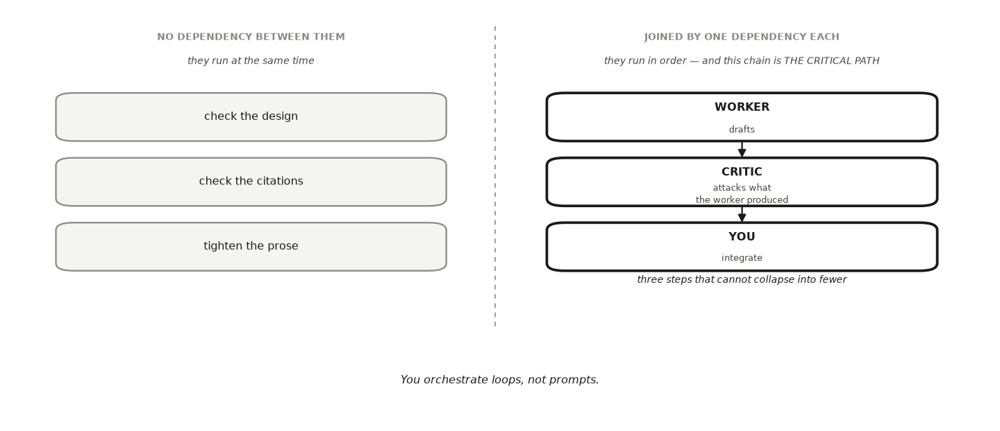

---
# GENERATED FILE — DO NOT EDIT.
# Written by scripts/build_studio_slides.py from the EDR|AI book:
#   book/studios/studio12-release-next-cycle.qmd      (the studio's promise)
#   the studio's chapters                                 (its argument)
#   book/studios/milestone12-release-next-cycle.qmd   (its milestone)
# Editorial overlay: planning/BOOK_SLIDE_PLANS/<lesson-id>.yml
# Lessons on this deck: managing-ai-agents conflicting-agents final-portfolio
# Edit the CHAPTER (or its plan) and rerun the script. Edits made here are
# silently reverted on the next build and fail `--check` in CI.
title: "HONR 46400 · Evidence-Driven Research"
subtitle: "Studio 12 — Special topic: agentic AI, release, and the next cycle"
author: "Davi Moreira"
format:
  revealjs:
    theme: [default, _theme/edrai-slides.scss]
    include-in-header: _theme/head.html
    include-after-body: _theme/fit.html
    width: 1600
    height: 900
    margin: 0.07
    center: false
    slide-number: c/t
    show-slide-number: all
    transition: fade
    background-transition: fade
    transition-speed: fast
    incremental: false
    hash: true
    hash-type: number
    history: false
    progress: true
    controls: true
    controls-layout: bottom-right
    touch: true
    preview-links: auto
    link-external-newwindow: true
    logo: _theme/edrai_logo.png
    footer: "EDR|AI · Studio 12 — Special topic: agentic AI, release, and the next cycle"
    chalkboard:
      buttons: false
    menu:
      side: left
      width: wide
      numbers: true
    code-line-numbers: false
    highlight-style: github
    fig-align: center
---

## What you can defend when you leave {data-menu-title="Studio 12 · What you can defend when you leave"}

::: {.kicker}

Studio 12

:::

::::: {.slide-body}

::: {.decision}

The book's special topic, turned onto your finished project: direct an
advanced multi-role AI review — agentic where your tools truly plan and act,
human-sequenced otherwise — under your own rules, adjudicate what it returns,
decide whether the work leaves your hands, and turn the largest unresolved
limitation into the next study.

:::

:::::


## The milestone ahead {data-menu-title="Studio 12 · The milestone ahead"}

::: {.kicker}

Studio 12

:::

::::: {.slide-body}

This studio closes with **[Milestone 12: Your release and next
cycle](https://davi-moreira.github.io/2026F_evidence_driven_research_purdue_HONR464/book/studios/milestone12-release-next-cycle.html)**,
a short chapter of its own after the lessons. **What it asks you to produce.**
A review-management record for your directed AI team, a release audit
recording release or withhold-pending-a-named-repair, your final dossier with
a complete manifest, an explicit stopping rule, and your next-study agenda.

:::::

::: {.notes}

The book opened with one rule: AI is your arm, not your brain. This last
studio is its special topic, and the rule's graduation: advanced practice in
directing AI for research — several scoped agents at once, wired so each
role's input exists before it starts, adversarial by design, escalated to you
when they conflict or agree too easily — turned onto your own finished project
as its closing review. The two agent lessons teach the wiring and the
escalation; a single well-run assistant playing the roles in turn runs the
same discipline. The release standard does not change with the tool count:
every public claim must sit inside its evidence and permissions, the package
must still match the cold run that tested it, and the team's records land in
the audit, never in place of it. What no agent can do is make the two
decisions this milestone exists for: whether this work is ready to leave your
hands, and what should be asked next. The book closes where it began: tools
extend your reach, and the decision about what leaves your hands remains
yours.

This is where the chain closes, on a decision. If the audit clears, the
artifact leaves your hands; if it does not, this version names the repair that
still blocks release. Either way the next-study agenda opens the cycle that
follows. The milestone chapter keeps the working details: the practice steps,
the versioned record, and how the artifact is assessed.

:::


## The lessons in this studio {data-menu-title="Studio 12 · The lessons in this studio"}

::: {.kicker}

Studio 12 · Road map

:::

::::: {.slide-body}

- [Lesson 38 — Managing Multiple AI Agents](https://davi-moreira.github.io/2026F_evidence_driven_research_purdue_HONR464/book/part6-after-conference/35-managing-multiple-ai-agents.html): your closing-review team: the loops' scoped jobs, the dependency wiring and turn counts, and the one node you kept human.
- [Lesson 39 — Conflicting Agents and Human Escalation](https://davi-moreira.github.io/2026F_evidence_driven_research_purdue_HONR464/book/part6-after-conference/36-conflicting-agents-and-human-escalation.html): your escalation rules, and one load-bearing pair of outputs (agreeing or not) diagnosed and settled by your own check, with any override on record.
- [Lesson 40 — Final Research and AI-Management Portfolio](https://davi-moreira.github.io/2026F_evidence_driven_research_purdue_HONR464/book/part6-after-conference/37-final-research-and-ai-management-portfolio.html): your finished research artifact with every claim bounded, your AI-management portfolio with the team record inside, and the rehearsed three-movement defense.

:::::


## Managing Multiple AI Agents {background-color="#1a1a19" .divider data-menu-title="CHAPTER 38 — Managing Multiple AI Agents"}

::: {.kicker}

Lesson 1 of this studio · Chapter 38

:::

::: {.divider-line}

how many AI loops you set running on one piece of your work, in what order,
and which step you keep out of every one of them

:::


## The research decision {data-menu-title="Ch 38 · The research decision"}

::: {.kicker}

Chapter 38

:::

::::: {.slide-body}

::: {.decision}

Running several AI agents means running several loops at once. You decide how
to split the work into scoped jobs, in what order those loops run so that no
early mistake slips downstream, and which step in the chain no loop is ever
allowed to close.

:::

:::::


## The words this chapter uses {data-menu-title="Ch 38 · The words this chapter uses"}

::: {.kicker}

Chapter 38 · Key terms

:::

::::: {.slide-body}

:::: {.terms .two}

::: {.term}

[The AI loop]{.t}

[the cycle you have been running since the beginning of this book: you prompt, you read the output, you interrogate it, you refine the ask, you run it again.]{.d}

:::

::: {.term}

[Agentic tools]{.t}

[aI systems that run that loop on their own, deciding their own next step and calling their own tools between your turns (Yao et al. 2023).]{.d}

:::

::::

:::::

::: {.notes}

Each term is defined in the chapter on first use; these are the definitions as
the book gives them.

:::


## Your advisor wants a draft, not a pile of AI output {data-menu-title="Ch 38 · Your advisor wants a draft, not a pile of AI output"}

::: {.kicker}

Chapter 38 · Why this decision matters

:::

::::: {.slide-body}

::: {.lead}

Your **thesis advisor**, reading the draft you are about to defend.

:::

- She does not want a louder chorus of tools.
- She wants to see that you broke the job into pieces and ordered them sanely.
- And that you stayed the one person deciding what the draft claims.

::: {.note-card}

Bring me a draft, not a pile of AI output. I want to know which part each tool
touched, what you told it to do, and how you checked it. If you cannot tell me
that, you did not write it.

:::

:::::

::: {.notes}

Read the quote aloud and let it sit. She asks for three things: which part
each tool touched, what you told it to do, and how you checked it. What she
wants to see is that you broke the job into pieces, put those pieces in a sane
order, and stayed the one person who decided what the draft claims. Her
closing line sets the stakes plainly: an account you cannot give is a draft
you did not write. Ask the room who, in their own project, could answer her
three questions right now.

:::


## Four assistants at once is not four times safer {data-menu-title="Ch 38 · Four assistants at once is not four times safer"}

::: {.kicker}

Chapter 38 · Why this decision matters

:::

::::: {.slide-body}

- One assistant can now draft, cite, critique, and polish in a single breath.
- So the temptation is to open four of them and feel four times as safe.
- Four roles with the same instructions tend to miss the same thing, then agree loudly.
- Each role is not one prompt. It is a loop, running until you or it stops.
- Unmanaged, four loops is four times the unsupervised work.

:::::

::: {.notes}

The word to press on is "unsupervised". More output is easy to buy and easy to
mistake for more rigor. Agreement among four roles reading the same draft
under the same instructions is not the independent confirmation it looks like,
because they tend to share the blind spot. This chapter is about the
management skill that turns a crowd of loops into something you can defend.

:::


## Every turn you did not read is a turn you did not supervise {data-menu-title="Ch 38 · Every turn you did not read is a turn you did not supervise"}

::: {.kicker}

Chapter 38 · The concept

:::

::::: {.slide-body}

- You ask for the citations to be checked.
- An agentic tool searches, reads, rechecks, and revises across several turns (Yao et al. 2023).
- It comes back to you only at the end.
- Faster, and every one of those turns went unwatched.

:::::

::: {.notes}

The unit you are managing is the loop, not the prompt: you prompt, you read,
you interrogate, you refine, you run again. An agentic tool runs that same
loop on its own, choosing its next step and calling its own tools between your
turns. So the real management question is not how many prompts you write. It
is how many loops you have running, what each one is allowed to touch, and
where they hand off. You orchestrate loops, not prompts.

:::


## Split "improve my draft" into jobs you can pass or fail {data-menu-title="Ch 38 · Split “improve my draft” into jobs you can pass or fail"}

::: {.kicker}

Chapter 38 · The concept

:::

::::: {.slide-body}

:::: {.terms}

::: {.term}

[Task decomposition]{.t}

[breaking one large job into smaller subtasks, each with a single clear owner (Malone & Crowston 1994)]{.d}

:::

::: {.term}

[Scoped role]{.t}

[an AI job narrow enough to state in one sentence and check in one pass]{.d}

:::

::::

:::::

::: {.notes}

Instead of asking a tool to improve your draft, split the work into check the
design, check the citations, and tighten the prose. Each piece now has a pass
or fail you can judge. That is what makes the crowd of loops into a workflow:
decomposition first, then each piece handed to a role narrow enough that you
can state its job in one sentence.

:::


## A finish line is what makes a loop safe to run {data-menu-title="Ch 38 · A finish line is what makes a loop safe to run"}

::: {.kicker}

Chapter 38 · The concept

:::

::::: {.slide-body}

- A scoped role: flag every sentence in my results section that claims more than my sample can support.
- That role has a clear finish line. "Make it better" does not.
- The loop stops when the job is done.
- And you can tell from the outside whether it is.

:::::

::: {.notes}

Notice why the finish line matters operationally, not just aesthetically. A
loop with no stated finish line stops only when you or it decides to stop,
which leaves you as the stopping condition instead of the job. A loop with a
stated finish line can be judged from outside by someone who did not run it,
which is exactly what your advisor is asking to do.

:::


## A worker alone is confident about its own quality {data-menu-title="Ch 38 · A worker alone is confident about its own quality"}

::: {.kicker}

Chapter 38 · The concept

:::

::::: {.slide-body}

- The **worker-critic pair**: one role produces something, a second, separate role attacks it.
- A worker drafts your limitations paragraph.
- A critic hunts for the limitation the worker left out.
- That confidence is exactly the blind spot the worker cannot see from the inside.

:::::

::: {.notes}

The pair is the backbone that keeps roles honest, and the word carrying the
weight is "separate". Asking the same role whether its own draft was any good
gets you the same blind spot with a second coat of polish. Ask the room what
the critic in their own project would be pointed at: the draft, or the
workflow that produced it.

:::


## The chain you cannot shorten sets your minimum number of rounds {data-menu-title="Ch 38 · The chain you cannot shorten sets your minimum number of rounds"}

::: {.kicker}

Chapter 38 · The concept

:::

::::: {.slide-body}

:::: {.terms}

::: {.term}

[Dependency]{.t}

[a required order between two subtasks, where one needs the other's output before it can start]{.d}

:::

::: {.term}

[Critical path]{.t}

[the longest run of must-follow-must steps in your workflow (Kelley 1961)]{.d}

:::

::::

:::::

::: {.notes}

A critic cannot attack a draft the worker has not written yet: that is a
dependency. Roles with no dependency between them run at the same time; roles
joined by one run in order. Worker drafts, then critic attacks, then you
integrate is three steps that cannot collapse into fewer. Count the path in
loops, not in messages: a single role may take four turns of prompting to
finish its one job and still occupy one node.

:::


## What runs together, and what cannot {data-menu-title="Ch 38 · What runs together, and what cannot"}

::: {.kicker}

Chapter 38 · The concept

:::

::::: {.slide-body}

- Roles with no dependency between them run at the same time.
- Roles joined by one dependency run in order.
- Worker, critic, you: three steps that cannot collapse into fewer.

{fig-align="center" width="100%" fig-alt="Two panels. On the left, three subtasks with no dependency between them, so they run at the same time: check the design, check the citations, tighten the prose. On the right, three steps joined by one dependency each, so they run in order: a worker drafts, a critic attacks what the worker produced, and you integrate. The right-hand chain is labelled the critical path, three steps that cannot collapse into fewer."}

:::::

::: {.notes}

Two panels, deliberately not joined into one workflow. Have the room read the
critical path off their own milestone rather than guess it, and notice that
the last step in the chain is a person.

:::


## One draft, four roles, and a dorm-floor heart-rate study {data-menu-title="Ch 38 · One draft, four roles, and a dorm-floor heart-rate study"}

::: {.kicker}

Chapter 38 · A worked example

:::

::::: {.slide-body}

::: {.lead}

Is a ten-minute post-lunch walk associated with a lower afternoon resting
heart rate on your dorm floor?

:::

- You have a draft and four AI roles waiting.
- Clarity reviewer: does each sentence read plainly?
- Methodologist: is "associated with" the honest word for what your data can show?
- Citation-checker: are the two heart-rate studies real, and do they say what you claim?
- Editor: tighten the prose.

:::::

::: {.notes}

This is the split step, done on a real write-up rather than in the abstract.
Each role owns one sentence-long job, and each of those jobs has a pass or
fail you could grade. Point out that the methodologist's job is the one that
touches the claim, which is why it will collide with another role in a few
minutes.

:::


## Three critics read the same draft at the same moment {data-menu-title="Ch 38 · Three critics read the same draft at the same moment"}

::: {.kicker}

Chapter 38 · A worked example

:::

::::: {.slide-body}

- The worker drafts your limitations paragraph first.
- No critic needs another's output, so all three read it in parallel.
- The citation-checker may run four or five turns, and report a study it cannot find.
- Then you integrate their notes, and the editor tightens what survives.
- Worker to critic, critic to you, you to editor: three arrows deep.

:::::

::: {.notes}

Trace the arrows on the board while you say this. The workflow is three arrows
deep and three loops wide at its widest point, and those two numbers answer
different questions: depth is how many rounds you must wait through, width is
how much is happening at once. Each loop takes as many turns as it needs, and
the number of turns inside a role does not change its position on the path.

:::


## The slowest critic sets the schedule {data-menu-title="Ch 38 · The slowest critic sets the schedule"}

::: {.kicker}

Chapter 38 · A worked example

:::

::::: {.slide-body}

- Compare all five roles in sequence against the three critics in parallel.
- The critical path prints as worker, then the slowest critic, then editor.
- So speeding up the other two critics buys nothing.
- The integration node is yours, and it is not in this table.

```python
import numpy as np, pandas as pd
SEED = 464
rng = np.random.default_rng(SEED)

# Turns each role actually needs. The three critics do not wait on each other.
roles = {"worker: draft limitations": 3, "clarity reviewer": 2,
         "methodologist": 3, "citation-checker": 5, "editor: merge": 2}
turns = {r: int(rng.integers(max(1, n - 1), n + 2)) for r, n in roles.items()}

worker = turns["worker: draft limitations"]
critics = {r: t for r, t in turns.items() if "review" in r or r in
           ("methodologist", "citation-checker")}
merge = turns["editor: merge"]

serial = sum(turns.values())
parallel = worker + max(critics.values()) + merge
print(pd.Series(turns, name="turns").to_string())
print(f"\nall five in sequence      : {serial} turns")
print(f"three critics in parallel : {parallel} turns")
print(f"critical path             : worker -> {max(critics, key=critics.get)}"
      f" -> editor")
print("\nthe slowest critic sets the schedule, so speeding up the other two")
print("buys nothing. and the integration node is yours, not the editor's")
```

:::::

::: {.notes}

The block counts turns per role under SEED = 464 and reads the critical path
off them. Have the room predict which critic will be slowest before you run
it. The point of the printout is not the exact turn counts, which are drawn:
it is that only the path is worth optimizing, and that the human node was
deliberately left out of the accounting.

:::


## The integrate step is the one node with no loop attached {data-menu-title="Ch 38 · The integrate step is the one node with no loop attached"}

::: {.kicker}

Chapter 38 · A worked example

:::

::::: {.slide-body}

- The methodologist says your walk-and-heart-rate result is only an association.
- The clarity reviewer loved the sentence that called it an effect.
- No role settles that clash. You do.
- The decision about what the write-up claims never enters the workflow as a delegated task.

:::::

::: {.notes}

End the example on the clash, because a clash is what makes the human node
visible. The tools drafted, flagged, and polished. You split the job, set the
order, decided when each loop had run long enough, and owned the claim that
carries your name. Ask which of the two roles the room would have believed if
they had only run one of them.

:::


## An AI failure case {data-menu-title="Ch 38 · An AI failure case"}

::: {.kicker}

Chapter 38

:::

::::: {.slide-body}

::: {.failure}

[Where the tool failed]{.label}

You ask a tool to design your multi-agent workflow, and it returns a
confident, well-formatted plan: run the worker, the methodologist, the
skeptic, and the editor all in parallel to "save rounds." The plan runs in
your head without a hitch. Here is the trap. The editor and the skeptic have
nothing to read yet, because the worker has not drafted anything. The tool
scheduled three roles to start before the input they depend on exists, and
dressed it up as efficiency. Hand that plan to an agentic tool that executes
it for you and the failure gets quieter, not louder: three loops run on an
empty draft and return three confident reviews of nothing.

:::

:::::


## How it failed {data-menu-title="Ch 38 · How it failed"}

::: {.kicker}

Chapter 38 · An AI failure case

:::

::::: {.slide-body}

- You catch it by drawing the arrows and asking one question at each role: does this role's input exist at the moment it starts?
- The editor's input is the integrated draft, which does not exist until the end, so "editor in parallel with worker" is impossible.
- Redrawn honestly, the plan is a critical path three arrows deep, not one.
- A green, tidy plan is not a valid one.
- You check the dependencies, not the confidence.

:::::

::: {.notes}

You catch it by drawing the arrows and asking one question at each role: does
this role's input exist at the moment it starts? The editor's input is the
integrated draft, which does not exist until the end, so "editor in parallel
with worker" is impossible. Redrawn honestly, the plan is a critical path
three arrows deep, not one. A green, tidy plan is not a valid one. You check
the dependencies, not the confidence.

:::


## Do not delegate {data-menu-title="Ch 38 · Do not delegate"}

::: {.kicker}

Chapter 38

:::

::::: {.slide-body}

::: {.rule-human}

[This stays yours]{.label}

The split and the order can be informed by a tool, but three calls stay yours
alone. You decide **which jobs are worth their own loop** and which just
multiply output you cannot supervise. You decide **the order**, so that no
role settles a question a role upstream of it should have answered first. And
you keep **the integrate step** human: when two roles disagree about what your
draft claims, you make that call in your own words. A workflow that hands the
claim to a tool is not a workflow you can defend. The rule scales with the
number of loops rather than bending to it. More agents does not mean looser
command; it means the same command discipline, repeated.

:::

:::::


## It is your turn {data-menu-title="Ch 38 · It is your turn"}

::: {.kicker}

Chapter 38 · Your move

:::

::::: {.slide-body}

1. Pick one real section of your project to revise: your methods, your results, or your limitations.
2. Set up three loops, each with a one-sentence job you could grade.
3. Wire them, and declare each role's capability while you do: who executes it, who chooses its next step (you, a script, or the tool), what tools it may touch, and what receipt it leaves.
4. Name the one node you keep human, the step where the loops' work becomes your claim, and write down why no role is allowed to take it.
5. Run the round.
6. Log every loop in your AI Research Ledger, and verify at least one output with a named method from the [Verification Guide](https://davi-moreira.github.io/2026F_evidence_driven_research_purdue_HONR464/book/verification-guide.html).

::: {.turn}
Work it in the [companion notebook](https://colab.research.google.com/github/davi-moreira/2026F_evidence_driven_research_purdue_HONR464/blob/main/notebooks/book/ch38_managing_multiple_ai_agents.ipynb) with [Chapter 38](https://davi-moreira.github.io/2026F_evidence_driven_research_purdue_HONR464/book/part6-after-conference/35-managing-multiple-ai-agents.html) open beside it. Log every delegation in your AI Research Ledger.
:::

:::::

::: {.notes}

The chapter's numbered steps, in the book's own order. The AI prompts each
step carries live in the companion notebook.

:::


## Conflicting Agents and Human Escalation {background-color="#1a1a19" .divider data-menu-title="CHAPTER 39 — Conflicting Agents and Human Escalation"}

::: {.kicker}

Lesson 2 of this studio · Chapter 39

:::

::: {.divider-line}

whether agreement among your AI reviewers is evidence or an echo, and the
moment you halt the loops and decide for yourself

:::


## The research decision {data-menu-title="Ch 39 · The research decision"}

::: {.kicker}

Chapter 39

:::

::::: {.slide-body}

::: {.decision}

Your loops have come back and they do not match, or they match a little too
well. You decide which of three things you are looking at (real disagreement,
correlated error, or manufactured consensus), and you decide the exact moment
to stop the loops and take the call into your own hands.

:::

:::::


## The words this chapter uses {data-menu-title="Ch 39 · The words this chapter uses"}

::: {.kicker}

Chapter 39 · Key terms

:::

::::: {.slide-body}

:::: {.terms .two}

::: {.term}

[Real disagreement]{.t}

[when the roles genuinely read the evidence differently.]{.d}

:::

::: {.term}

[Correlated error]{.t}

[when the roles agree, but on the same wrong assumption, so the agreement proves nothing.]{.d}

:::

::: {.term}

[False consensus]{.t}

[when the roles agree only because your prompt framed the task so they had to.]{.d}

:::

::: {.term}

[Escalation to human judgment]{.t}

[the moment an AI output would *settle* rather than *inform* a decision that is yours, so you stop and decide it yourself (Bansal et al. 2021).]{.d}

:::

::::

:::::

::: {.notes}

Each term is defined in the chapter on first use; these are the definitions as
the book gives them.

:::


## Agreement is the easiest thing in the world to manufacture {data-menu-title="Ch 39 · Agreement is the easiest thing in the world to manufacture"}

::: {.kicker}

Chapter 39 · Why this decision matters

:::

::::: {.slide-body}

- A **skeptical peer** at your practice defense puts it to you like this.
- The question is not whether they agreed.
- It is whether they could have agreed for the same wrong reason.

::: {.note-card}

Don't tell me your reviewers agreed. Tell me whether they could have agreed
for the same wrong reason. Agreement is the easiest thing in the world to
manufacture, and the most dangerous to trust.

:::

:::::

::: {.notes}

Read the peer's line out loud and stop on the second sentence, because that is
the whole chapter in one question. Notice the peer does not dispute that the
reviewers agreed. The challenge is about the reason behind the agreement,
which is a different thing entirely and much harder to answer. Ask the room
how they would answer that question about the last AI review they ran.

:::


## Three loops built the same way make one mistake three times {data-menu-title="Ch 39 · Three loops built the same way make one mistake three times"}

::: {.kicker}

Chapter 39 · Why this decision matters

:::

::::: {.slide-body}

- You can run a small team of AI roles, so you can run several loops at once.
- The seductive thought: three roles blessing your draft means three confirmations.
- Same build, same draft, same instructions, so they tend to make the same mistake.
- A loop that keeps running polishes the last answer instead of testing it.

:::::

::: {.notes}

Take the seductive thought seriously before you take it apart, because it is
the reasonable-sounding version of the mistake. Three loops built the same way
and pointed at the same draft with the same instructions are not three
witnesses; their agreement is one error repeated three times. The second
failure is about duration rather than number: a long loop returns a
well-defended version of the first mistake, with better paragraphs around it.
Ask who has already read a second AI reply that mostly agreed with the first
one.

:::


## When two roles clash, do not pick a winner yet {data-menu-title="Ch 39 · When two roles clash, do not pick a winner yet"}

::: {.kicker}

Chapter 39 · The concept

:::

::::: {.slide-body}

- **Reconciling conflicting outputs**: decide what to believe by first diagnosing why the roles differ.
- Before you side with the reviewer over the methodologist, ask what would make each of them right.
- There are three cases, and they call for opposite responses.

:::::

::: {.notes}

The instinct when two roles disagree is to score the argument and declare a
winner, and that instinct skips the only step that tells you anything. Asking
what would make each of them right forces you to name the assumption each one
is running on. The three cases that follow look similar from the outside,
which is why the diagnosis has to come first: one of them is useful, one is
empty, and one is your own doing.

:::


## Real disagreement is the good case {data-menu-title="Ch 39 · Real disagreement is the good case"}

::: {.kicker}

Chapter 39 · The concept

:::

::::: {.slide-body}

- Your reviewer calls a sentence clear and strong.
- Your methodologist flags that same sentence as reaching past your data.
- The roles genuinely read the evidence differently.
- The clash points straight at the claim you need to check.

:::::

::: {.notes}

Two roles reading one sentence in opposite ways has done you a favour, and the
chapter says so plainly: this is the good case. The disagreement is a pointer,
and what it points at is a specific claim, not a general worry about quality.
Ask the room what they would go and check first if they got exactly this pair
of comments on their own draft.

:::


## Correlated error: one wrong assumption, agreed three times {data-menu-title="Ch 39 · Correlated error: one wrong assumption, agreed three times"}

::: {.kicker}

Chapter 39 · The concept

:::

::::: {.slide-body}

- Three reviewers built from the same base model all miss the same flaw.
- They share the blind spot, so their agreement proves nothing.
- Ask the simple question: could they be wrong the *same* way?
- If yes, their consensus is one signal, not three (Peker 2023).

:::::

::: {.notes}

This is the case that costs you most, because it arrives dressed as
confirmation and feels like reassurance. The test the chapter gives is one
question you can ask on the spot, and it is about the shared assumption rather
than the shared answer. Counting to three here is the error: the roles came
from one place, so the head-count is a fiction.

:::


## Ask a role to confirm your draft and you led the witness {data-menu-title="Ch 39 · Ask a role to confirm your draft and you led the witness"}

::: {.kicker}

Chapter 39 · The concept

:::

::::: {.slide-body}

- You ask "confirm my draft is ready," and every role obliges.
- The roles agreed only because your prompt framed the task so they had to.
- You led all the witnesses.
- Reframe the ask neutrally and run it again.

:::::

::: {.notes}

This case is the one you built yourself, which makes it the cheapest to fix
and the easiest to miss. The wording of the ask decided the answer before any
role read a word of the draft. The repair is not a better model or another
reviewer; it is a neutral question and a second run. Ask the room to say out
loud the last thing they typed into a reviewer role, and hunt together for the
leading word in it.

:::


## Agreement counts only when the roles could have failed apart {data-menu-title="Ch 39 · Agreement counts only when the roles could have failed apart"}

::: {.kicker}

Chapter 39 · The concept

:::

::::: {.slide-body}

:::: {.terms}

::: {.term}

[Independence check]{.t}

[a test that makes agreement worth more than a head-count, either an independent method you run yourself or a way you force two roles to be genuinely independent]{.d}

:::

::: {.term}

[Human override]{.t}

[you take the pen back and make the call in your own words, backed by your own check, even when the roles agreed on something else]{.d}

:::

::::

:::::

::: {.notes}

The chapter's example of an independence check is deliberately ordinary: two
roles bless a cited number, so you open the source and recompute it yourself
before you trust either of them (Hong & Page 2004). The override is the moment
that follows, and it is written as an action rather than an attitude, because
taking the pen back means producing your own words and your own check. The
line to leave on the room is the chapter's: a decision that just counted the
roles is a vote, and votes among look-alike models are meaningless.

:::


## Write your stopping triggers before the round starts {data-menu-title="Ch 39 · Write your stopping triggers before the round starts"}

::: {.kicker}

Chapter 39 · The concept

:::

::::: {.slide-body}

- An agentic tool left running keeps looking for a next step.
- If nobody halts it, it takes the decision by default.
- Escalate when an AI output would *settle* a decision that is yours (Bansal et al. 2021).
- A trigger you decide with three tidy reviews in front of you is a mood.

:::::

::: {.notes}

Escalation is the one moment where the loops have to stop, and a loop with
nowhere else to go does not wait politely. The decision gets taken by default,
which is not delegation because you never chose it. So the triggers get
written before the round: the specific decisions where the loops pause and
wait for you. Ask each person for one trigger they will write down before
their next round, in the exact words they will read under pressure.

:::


## 250 adults outside the library, and a tidy 4.0% {data-menu-title="Ch 39 · 250 adults outside the library, and a tidy 4.0%"}

::: {.kicker}

Chapter 39 · A worked example

:::

::::: {.slide-body}

- The **unemployment rate** is the share of people who want paid work and cannot find it.
- You asked 250 adults outside the public library, over three weekday afternoons.
- Working, or looking for work? You divided one count by the other.
- Your draft: "unemployment here is 4.0%, in excellent agreement with the official rate."

:::::

::: {.notes}

Everything in this example rests on one small survey, so keep the method
visible: one place, three weekday afternoons, one question. The draft sentence
is the one under review, and note how much it claims, because the phrase
"excellent agreement" is a precision claim as much as a match. Ask the room
what they would want to know before believing that sentence.

:::


## Three roles blessed it because all three expected a number near 4% {data-menu-title="Ch 39 · Three roles blessed it because all three expected a number near 4%"}

::: {.kicker}

Chapter 39 · A worked example

:::

::::: {.slide-body}

- All three reviewer roles returned the same verdict: "Looks solid. Matches the published figure."
- Each one already expects a number near 4%, the range familiar headline rates sit in.
- So each pattern-matches your estimate and blesses it without checking how you got there.
- That is correlated error wearing the mask of confirmation.

:::::

::: {.notes}

Put the diagnosis question from the concept section to this case: could these
three be wrong the same way? They can, and the shared blind spot is named
exactly, the anchor to the familiar figure. What none of them did is look at
how the estimate was produced, which is where the real problem lives. Ask the
room whether a fourth role from the same family would have helped.

:::


## Your sample never met anyone who was at work {data-menu-title="Ch 39 · Your sample never met anyone who was at work"}

::: {.kicker}

Chapter 39 · A worked example

:::

::::: {.slide-body}

- You asked 250 people, so the luck of who walked by is worth a couple of percentage points.
- Weekday afternoons outside a library exclude almost anyone at work all day.
- The tidy "4.0%" was luck riding on an honest-looking method.
- The shared anchor to the familiar figure hid that mistake from all three roles.

:::::

::: {.notes}

Two separate problems sit under the same number, and it is worth naming them
apart. One is sampling luck at n equals 250, which the chapter prices at a
couple of percentage points on its own. The other is who could not appear at
all, and no sample size fixes that. Neither is exotic, and neither shows up in
a verdict that only asks whether the answer looks right.

:::


## You take the pen back: 4.0% ± 2.4 percentage points {data-menu-title="Ch 39 · You take the pen back: 4.0% ± 2.4 percentage points"}

::: {.kicker}

Chapter 39 · A worked example

:::

::::: {.slide-body}

- The agreement would *settle* your headline claim, and that claim is yours.
- You recompute from your raw responses, carrying the uncertainty of 250 people through.
- Consistent with the official rate, far less precise, and from a group missing most workers.
- You override three "looks great" verdicts and rewrite the claim with its real uncertainty.
- The roles counted the answer as correct. You checked whether it was earned.

:::::

::: {.notes}

This is escalation and override in one move, and notice what triggers it: the
agreement would settle the headline claim rather than inform it. The corrected
result keeps both bounds the chapter states, the interval and the group that
could not be reached, and it stays consistent with the official rate. The
closing pair of sentences is the standard to leave the room with. Agreement is
worth something only when the agreeing parties can fail independently, which
is why diversity of approach rather than head-count is what makes a group
better than its members (Hong & Page 2004).

:::


## Two defensible definitions, two different numbers {data-menu-title="Ch 39 · Two defensible definitions, two different numbers"}

::: {.kicker}

Chapter 39 · A worked example

:::

::::: {.slide-body}

- SEED = 464, so the same 250 respondents come back on every run.
- Watch the two printed rates: yours, then the one counting everyone who wants work.
- Neither number is the one the three reviewers blessed.

```python
import numpy as np, pandas as pd
SEED = 464
rng = np.random.default_rng(SEED)

# 250 adults asked outside the library on three weekday afternoons.
n = 250
employed_ft = rng.random(n) < 0.58     # daytime library sample skews non-working
wants_work = np.where(employed_ft, False, rng.random(n) < 0.24)
looking = wants_work & (rng.random(n) < 0.20)   # only some are actively looking

labour_force = employed_ft.sum() + looking.sum()
your_rate = looking.sum() / labour_force
official_style = wants_work.sum() / (employed_ft.sum() + wants_work.sum())

print(f"respondents            : {n}")
print(f"in your labour force   : {labour_force}")
print(f"counted as unemployed  : {looking.sum()}")
print(f"your rate              : {your_rate*100:.1f}%")
print(f"same people, counting everyone who WANTS work: "
      f"{official_style*100:.1f}%")
print("\ntwo defensible definitions, two different numbers, from one sample")
print("that never met anyone at work on a weekday afternoon. three reviewers")
print("who only checked whether the answer LOOKED right caught none of it")
```

:::::

::: {.notes}

The block builds the survey and computes the rate two defensible ways, and
both numbers come from the same afternoon outside the library. Run it, then
ask which of the two you would report and what you would have to say about the
other. Three reviewers who only checked whether the answer looked right caught
none of this, and that is the point of printing both.

:::


## An AI failure case {data-menu-title="Ch 39 · An AI failure case"}

::: {.kicker}

Chapter 39

:::

::::: {.slide-body}

::: {.failure}

[Where the tool failed]{.label}

You send your draft to four AI roles and all four reply "no major problems."
It feels like overwhelming confirmation, and it is confidently wrong. The four
share a base model and read the same draft with the same instructions, so they
share a blind spot. Whenever your one real flaw falls inside that blind spot,
all four miss it together. Their unanimous "fine" is close to a single voice,
not four. Running each loop longer does not rescue you either. Four loops with
the same blind spot, given more turns, return the same verdict with better
paragraphs around it.

:::

:::::


## How it failed {data-menu-title="Ch 39 · How it failed"}

::: {.kicker}

Chapter 39 · An AI failure case

:::

::::: {.slide-body}

- You catch it by refusing to treat agreement as evidence.
- You run an independence check: re-read the flagged claim against your own inquiry declaration, or hand the draft to a role with a different framing and different context.
- In the lab you will see the size of this trap measured.
- Four correlated reviewers miss a real flaw about seven times as often as four independent ones, and piling on more correlated roles cannot close the gap.

:::::

::: {.notes}

You catch it by refusing to treat agreement as evidence. You run an
independence check: re-read the flagged claim against your own inquiry
declaration, or hand the draft to a role with a different framing and
different context. In the lab you will see the size of this trap measured.
Four correlated reviewers miss a real flaw about seven times as often as four
independent ones, and piling on more correlated roles cannot close the gap.

:::


## Do not delegate {data-menu-title="Ch 39 · Do not delegate"}

::: {.kicker}

Chapter 39

:::

::::: {.slide-body}

::: {.rule-human}

[This stays yours]{.label}

Which claims your draft can defend, where each claim must stop, whether an
agreement among your roles was ever independent, and the moment to escalate:
those stay yours. No role decides its own trustworthiness, and no head-count
of roles decides your claim boundary or your ethics. When an AI output would
*settle* one of those rather than inform it, you stop and you decide.

:::

:::::


## It is your turn {data-menu-title="Ch 39 · It is your turn"}

::: {.kicker}

Chapter 39 · Your move

:::

::::: {.slide-body}

1. Write your escalation rules before the next round starts.
2. Add the stopping conditions that are not about content.
3. Take one load-bearing pair of outputs your roles have returned, whether they agree or disagree, and diagnose it on the record: real disagreement, correlated error, genuinely independent agreement, or a consensus your own prompt manufactured.
4. Resolve it yourself with a check the loops cannot run: recompute the number, open the source, or compare against a figure that was never in any prompt.
5. Take one place your roles agreed on something that mattered and test whether the agreement was independent.
6. Log the pair you examined, your diagnosis, and the check that settled it in your AI Research Ledger, with the override on record when you made one, and verify at least one output with a named method from the [Verification Guide](https://davi-moreira.github.io/2026F_evidence_driven_research_purdue_HONR464/book/verification-guide.html).

::: {.turn}
Work it in the [companion notebook](https://colab.research.google.com/github/davi-moreira/2026F_evidence_driven_research_purdue_HONR464/blob/main/notebooks/book/ch39_conflicting_agents_and_human_escalation.ipynb) with [Chapter 39](https://davi-moreira.github.io/2026F_evidence_driven_research_purdue_HONR464/book/part6-after-conference/36-conflicting-agents-and-human-escalation.html) open beside it. Log every delegation in your AI Research Ledger.
:::

:::::

::: {.notes}

The chapter's numbered steps, in the book's own order. The AI prompts each
step carries live in the companion notebook.

:::


## Final Research and AI-Management Portfolio {background-color="#1a1a19" .divider data-menu-title="CHAPTER 40 — Final Research and AI-Management Portfolio"}

::: {.kicker}

Lesson 3 of this studio · Chapter 40

:::

::: {.divider-line}

which of your claims you are willing to be wrong about in public, and what
record you can show for how you checked them

:::


## The research decision {data-menu-title="Ch 40 · The research decision"}

::: {.kicker}

Chapter 40

:::

::::: {.slide-body}

::: {.decision}

Out of everything your project produced, you decide which claims you will
stand behind in public, and you assemble the record that shows how you ran
your AI team, what you kept in your own hands, and how each surviving claim
was checked.

:::

:::::


## The examiner does not count your tools {data-menu-title="Ch 40 · The examiner does not count your tools"}

::: {.kicker}

Chapter 40 · Why this decision matters

:::

::::: {.slide-body}

- The decision on the table has two parts.
- Which of your claims you are willing to be wrong about in public.
- And what record you can show for how you checked them.

::: {.note-card}

"By the time you stand up to defend, I do not count your tools. I ask which
claims you are willing to be wrong about in public, and whether you can show
me you checked them yourself." — a defense examiner, opening the folder you
handed over

:::

:::::

::: {.notes}

Read the quote aloud and stop on the last clause, because that is the whole
chapter compressed: checked them yourself. Notice what the examiner does not
do. She does not count tools, so a list of tools is not an answer to what she
asks. Ask the room which of their current claims they would actually stand
behind in front of that folder.

:::


## A pile of AI-assisted work is not defensible {data-menu-title="Ch 40 · A pile of AI-assisted work is not defensible"}

::: {.kicker}

Chapter 40 · Why this decision matters

:::

::::: {.slide-body}

- Months of AI-assisted work leave drafts, role outputs, half-finished checks.
- Left in a pile, none of it is defensible.
- The examiner will not read the pile.
- She asks which claims you own, where each stops, and how you know.

:::::

::: {.notes}

The problem at the end of a project is not a shortage of material; it is that
nobody will sort it for you. Three questions decide what survives: which
claims you own, where each one stops, and how you know. This chapter is where
you answer them on purpose, before the room decides them for you.

:::


## The release audit does not change with the destination {data-menu-title="Ch 40 · The release audit does not change with the destination"}

::: {.kicker}

Chapter 40 · The concept

:::

::::: {.slide-body}

- It is the last check you run before work leaves your hands.
- Does every promise the work makes still hold up?
- Held up by the evidence, the permissions, and the record.
- What you assemble for that audit is your dossier.

:::::

::: {.notes}

Name the audit as the chapter's real subject, not the folder. How you package
the dossier depends on where the work is going: a repository, a supervisor, a
journal, a course. The packaging changes and the audit does not, which is why
this move transfers past this course.

:::


## Your final submission has two halves {data-menu-title="Ch 40 · Your final submission has two halves"}

::: {.kicker}

Chapter 40 · The concept

:::

::::: {.slide-body}

:::: {.terms}

::: {.term}

[A research portfolio]{.t}

[the assembled body of your finished work: your claims, the evidence behind them, and the verification that makes each one defensible (ALLEA – All European Academies 2023)]{.d}

:::

::: {.term}

[An AI-management portfolio]{.t}

[the honest record of how you ran your AI work from the first curiosity to the last check: which tasks you delegated, where you took the decision back, and which calls you never handed to a tool]{.d}

:::

::::

:::::

::: {.notes}

This chapter builds both halves, and they answer different questions. For a
lab project the research portfolio holds your headline result, the
measurements behind it, and the check you ran to confirm the number is right.
The AI-management portfolio covers one assistant or a directed team, whichever
the project actually used, so nobody has to invent a team they never ran. Its
example is concrete: a reviewer role drafted your limitations, you overrode it
when it softened a claim you could not support, and you alone chose the claim
boundary.

:::


## "When the roles all agree" is a trap {data-menu-title="Ch 40 · “When the roles all agree” is a trap"}

::: {.kicker}

Chapter 40 · The concept

:::

::::: {.slide-body}

::: {.lead}

A stopping rule is a written statement of what "done" means, phrased around
your own verified confidence rather than the tools' agreement (Nosek et al.
2018).

:::

- It is the decision that closes both halves of your submission.
- A team of look-alike tools can agree loudly and be wrong together.
- The rule that works names a check you ran yourself.

::: {.note-card}

"I stop when I can defend each surviving claim to a hostile reviewer with a
check I ran myself (National Academies of Sciences, Engineering, and Medicine
2019)."

:::

:::::

::: {.notes}

Put the two candidate rules side by side and ask which one a hostile reviewer
could break. Look-alike tools can agree loudly and be wrong together, so a
rule resting on their agreement can be satisfied with nothing checked. The
working version names a person doing a check, which is the part a tool cannot
supply for you.

:::


## Three reviewers who oblige tell you nothing {data-menu-title="Ch 40 · Three reviewers who oblige tell you nothing"}

::: {.kicker}

Chapter 40 · The concept

:::

::::: {.slide-body}

:::: {.terms}

::: {.term}

[False consensus]{.t}

[agreement that exists only because the tools shared a blind spot or you asked a leading question]{.d}

:::

::: {.term}

[An independence check]{.t}

[a step that makes agreement worth more than a head count: a check you run yourself, outside the tools]{.d}

:::

::::

:::::

::: {.notes}

The chapter's example is worth acting out: you ask three reviewers to confirm
your draft is ready, all three oblige, and the chorus tells you nothing. A
leading question and a shared blind spot produce the same sound as real
agreement. The cure the chapter names is not more reviewers, it is a check you
run yourself, outside the tools.

:::


## An evidence defense names what you do not claim {data-menu-title="Ch 40 · An evidence defense names what you do not claim"}

::: {.kicker}

Chapter 40 · The concept

:::

::::: {.slide-body}

- A short public defense of your claims at their boundaries.
- Then questions you cannot rehearse for.
- You state what you found, and name exactly what you do not claim.
- You answer each question from your own record.

:::::

::: {.notes}

Stress that the boundary is stated out loud by you, not extracted from you
under questioning. Naming what you do not claim is part of the defense, not a
concession made afterwards. The unrehearsable questions are the reason the
record has to exist before the defense rather than after it.

:::


## The 88% came from one packet in three trays of 50 {data-menu-title="Ch 40 · The 88% came from one packet in three trays of 50"}

::: {.kicker}

Chapter 40 · A worked example

:::

::::: {.slide-body}

- A germination test lays a counted number of seeds on damp paper.
- Steady warmth and light; count the sprouts after a fixed number of days.
- One packet of lettuce seed, three trays of 50 seeds each, 88% on average.
- Now you choose the claim you will defend.

:::::

::: {.notes}

Keep three facts on the board, because every later decision comes back to
them: one packet, three trays, 50 seeds per tray. Define the germination test
before anyone reasons about the number, since the method is what fixes the
reach of the claim. Ask what the 88% is a number about, and let the room hear
how easily the answer slides.

:::


## The two roles disagreed, and the disagreement was a gift {data-menu-title="Ch 40 · The two roles disagreed, and the disagreement was a gift"}

::: {.kicker}

Chapter 40 · A worked example

:::

::::: {.slide-body}

- You run three AI reviewer roles on your draft.
- One praises your headline: "Lettuce seed germinates at 88%."
- A diagnostician role flags the same sentence for reaching past your evidence.
- You tested one packet in three trays, not lettuce seed in general.
- You take the pen back.

:::::

::: {.notes}

Two roles reading the same sentence and splitting is more useful than two
roles agreeing, because the split points straight at the boundary decision.
Note that neither role settles it. Taking the pen back is the move, and the
rewrite that follows is yours.

:::


## The narrower sentence is the one you will defend {data-menu-title="Ch 40 · The narrower sentence is the one you will defend"}

::: {.kicker}

Chapter 40 · A worked example

:::

::::: {.slide-body}

- The sentence now carries the packet, the design, and the spread.
- Reporting what your evidence holds, with the spread that produced it, is the reproducibility standard (National Academies of Sciences, Engineering, and Medicine 2019).

::: {.note-card}

"This packet, tested in three trays of 50, averaged 88% germination, with the
trays spanning 84% to 92%."

:::

:::::

::: {.notes}

Read both sentences aloud, the rejected one and this one, and ask which is
easier to attack. The narrow sentence is still a finding; it is a finding that
survives the question of how you know. The chapter calls this the standard the
whole book has been building toward, and cites the report behind it, so name
both.

:::


## Run the trays and watch the spread the claim is built from {data-menu-title="Ch 40 · Run the trays and watch the spread the claim is built from"}

::: {.kicker}

Chapter 40 · A worked example

:::

::::: {.slide-body}

- The block runs the germination test tray by tray, with SEED = 464.
- Watch the three tray rates first, then the printed spread.
- The defensible sentence carries all three numbers, not the 88% alone.

```python
import numpy as np, pandas as pd
SEED = 464
rng = np.random.default_rng(SEED)

# Three trays of 50 seeds from ONE packet. Trays differ; seeds within a tray
# share their tray's conditions.
trays = []
for tray, sprouts in enumerate([42, 44, 46], start=1):      # 50 seeds per tray
    seeds = rng.permutation(np.r_[np.ones(sprouts), np.zeros(50 - sprouts)])
    trays.append({"tray": tray, "sprouted": int(seeds.sum()),
                  "rate %": round(seeds.mean() * 100)})
df = pd.DataFrame(trays)
print(df.to_string(index=False))
print(f"\naverage across the three trays : {df['rate %'].mean():.0f}%")
print(f"tray-to-tray spread            : {df['rate %'].min():.0f}% to "
      f"{df['rate %'].max():.0f}%")
print("\nthe defensible sentence carries all three numbers: this packet,")
print("three trays of 50, and the spread — not 'lettuce seed germinates at 88%'")
```

:::::

::: {.notes}

Run it live so the tray-to-tray spread appears on screen instead of being
described. Read the code's own comment aloud: the trays differ, and seeds
within a tray share their tray's conditions. The script prints the spread
precisely because the average on its own is the sentence you just rejected.

:::


## The packet's label was never part of your AI workflow {data-menu-title="Ch 40 · The packet's label was never part of your AI workflow"}

::: {.kicker}

Chapter 40 · A worked example

:::

::::: {.slide-body}

- The label states a germination rate of 85%.
- You compare your 88% against it by hand.
- The two numbers land close, and that is real reassurance.
- Your stopping rule is now satisfied, so you stop.

:::::

::: {.notes}

The reassurance is real for one reason only: the label sat outside everything
the tools touched. That is what an independence check buys you, and it is what
a head count never buys. Ask the room what the equivalent outside number is
for their own project, and whether they have looked at it yet.

:::


## Four things go into the AI-management portfolio {data-menu-title="Ch 40 · Four things go into the AI-management portfolio"}

::: {.kicker}

Chapter 40 · A worked example

:::

::::: {.slide-body}

- The roles you ran.
- The reviewer-versus-diagnostician conflict, and your override.
- This stopping rule.
- The label comparison that made agreement worth more than a head count.

:::::

::: {.notes}

Each of the four exists because something actually happened, so this list is a
record and never a reconstruction. The conflict entry is the one that shows
where you took the decision back, which is why it belongs in the record. Ask
what their own fourth line would say today.

:::


## An AI failure case {data-menu-title="Ch 40 · An AI failure case"}

::: {.kicker}

Chapter 40

:::

::::: {.slide-body}

::: {.failure}

[Where the tool failed]{.label}

You send your finished draft to three reviewer roles and ask each to "confirm
it is ready to submit." All three return the same verdict: "Looks solid, no
major problems." It feels like three confirmations. It is one. The three roles
run on the same base model, you gave them the same leading prompt, and they
share a blind spot: none flags that your headline number carries no
uncertainty, no range across your three trays. That is false consensus, and
trusting it would send an overclaimed result into your defense.

:::

:::::


## How it failed {data-menu-title="Ch 40 · How it failed"}

::: {.kicker}

Chapter 40 · An AI failure case

:::

::::: {.slide-body}

- You catch it with a reframe and a check the tools cannot see.
- First you drop the leading ask and run a neutral one: "List the three weakest claims in this draft and why." Now a role names the missing range.
- Then you leave the tools entirely and recompute the spread of your trays yourself, which hands you the 84% to 92% boundary the reviewers all skipped.
- The lesson is blunt: agreement is worth only the independence behind it.
- Count the checks you ran yourself, never the roles that nodded.

:::::

::: {.notes}

You catch it with a reframe and a check the tools cannot see. First you drop
the leading ask and run a neutral one: "List the three weakest claims in this
draft and why." Now a role names the missing range. Then you leave the tools
entirely and recompute the spread of your trays yourself, which hands you the
84% to 92% boundary the reviewers all skipped. The lesson is blunt: agreement
is worth only the independence behind it. Count the checks you ran yourself,
never the roles that nodded.

:::


## Do not delegate {data-menu-title="Ch 40 · Do not delegate"}

::: {.kicker}

Chapter 40

:::

::::: {.slide-body}

::: {.rule-human}

[This stays yours]{.label}

The tools may draft, review, and surface hard questions. They may never decide
which claims you put your name on, where a claim like "88% germination" must
stop, whether your reviewers were ever independent, what your stopping rule
is, or a single word of the public defense. When agreeing roles bless a claim,
deciding whether that agreement is real or just correlated is yours. So is the
answer you give when the room asks how you know.

:::

:::::


## It is your turn {data-menu-title="Ch 40 · It is your turn"}

::: {.kicker}

Chapter 40 · Your move

:::

::::: {.slide-body}

1. Finish the research artifact itself: your paper, note, or poster, with each claim stated at its boundary and your uncertainty in the same sentence as your headline number.
2. Assemble your AI-management portfolio around the team you directed in this studio: the decomposition of loops with their wiring, one conflict or suspicious agreement settled by your own non-AI check, your stopping rule and never-delegate list, and one independence check that made an agreement worth more than a head count.
3. Write your stopping rule as a sentence you could read aloud, phrased around what you have verified rather than what your tools approved. "Every surviving claim has a check I ran myself" is a stopping rule. "The reviewers agreed" is not.
4. Rehearse the defense in three movements: your claim and its boundary, the central choice you made and the road you did not take, and the verification you lead with.
5. Read the whole artifact once more against your ledger and cut anything you cannot trace to a check.
6. Close the ledger with the last entry, and verify your headline claim one final time with a named method from the [Verification Guide](https://davi-moreira.github.io/2026F_evidence_driven_research_purdue_HONR464/book/verification-guide.html).

::: {.turn}
Work it in the [companion notebook](https://colab.research.google.com/github/davi-moreira/2026F_evidence_driven_research_purdue_HONR464/blob/main/notebooks/book/ch40_final_research_and_ai_management_portfolio.ipynb) with [Chapter 40](https://davi-moreira.github.io/2026F_evidence_driven_research_purdue_HONR464/book/part6-after-conference/37-final-research-and-ai-management-portfolio.html) open beside it. Log every delegation in your AI Research Ledger.
:::

:::::

::: {.notes}

The chapter's numbered steps, in the book's own order. The AI prompts each
step carries live in the companion notebook.

:::


## Milestone 12: Your release and next cycle {background-color="#1a1a19" .divider data-menu-title="MILESTONE 12 — Milestone 12: Your release and next cycle"}

::: {.kicker}

Studio 12 closes here

:::

::: {.divider-line}

What the lessons handed you becomes one artifact you can defend.

:::


## What this milestone produces {data-menu-title="M12 · What this milestone produces"}

::: {.kicker}

Milestone 12

:::

::::: {.slide-body}

::: {.decision}

[The artifact]{.label}

**What this milestone produces.** A review-management record for your directed AI team, a release audit recording release or withhold-pending-a-named-repair, your final dossier with a complete manifest, an explicit stopping rule, and your next-study agenda.

:::

:::::


## What you bring {data-menu-title="M12 · What you bring"}

::: {.kicker}

Milestone 12 · Check before you start

:::

::::: {.slide-body}

- [Lesson 38 — Managing Multiple AI Agents](https://davi-moreira.github.io/2026F_evidence_driven_research_purdue_HONR464/book/part6-after-conference/35-managing-multiple-ai-agents.html): your closing-review team: the loops' scoped jobs, the dependency wiring and turn counts, and the one node you kept human.
- [Lesson 39 — Conflicting Agents and Human Escalation](https://davi-moreira.github.io/2026F_evidence_driven_research_purdue_HONR464/book/part6-after-conference/36-conflicting-agents-and-human-escalation.html): your escalation rules, and one load-bearing pair of outputs (agreeing or not) diagnosed and settled by your own check, with any override on record.
- [Lesson 40 — Final Research and AI-Management Portfolio](https://davi-moreira.github.io/2026F_evidence_driven_research_purdue_HONR464/book/part6-after-conference/37-final-research-and-ai-management-portfolio.html): your finished research artifact with every claim bounded, your AI-management portfolio with the team record inside, and the rehearsed three-movement defense.

:::::


## The practice {data-menu-title="M12 · The practice"}

::: {.kicker}

Milestone 12 · In the studio

:::

::::: {.slide-body}

1. Check that nothing moved since your Studio 11 cold run: any change to the package — a number, a claim, the data, the code, the environment record, or the instructions a stranger would follow — makes that run stale. Repeat it before you release.
2. Run the closing review as a directed team: scoped loops (a writer, a skeptic, an auditor at minimum), wired so each role's input exists before it starts, escalation rules written first, one node kept human. Declare who chooses each next step — you, a fixed script, or an agent that plans and calls tools — and never call a manually sequenced chat autonomous. A single well-run assistant playing the roles in turn is a legal team; record what you actually ran, never invented activity.
3. Run the release audit and mark each item clear, pending, or blocking: permissions, participant promises, disclosure, package-matches-cold-run, reproducibility, claim boundaries, and uncertainty.
4. Make the release decision. A blocking item means withhold pending the named repair, written as this version's reason — not a euphemistic release.
5. Assemble the dossier with a manifest: contract versions, evidence registry, permissions, measurement, your cycle log and claim-evidence table, AI ledger, artifacts, package, and revision history — each marked present, absent with reason, or not applicable.
6. Write your stopping rule: why you are stopping here rather than running one more check, stated as a decision.
7. Write the next-study agenda: tie the next question to an unresolved limitation, a warrant gap, or something this cycle's evidence opened.

:::::


## The four rails, here {data-menu-title="M12 · The four rails, here"}

::: {.kicker}

Milestone 12 · Every studio, these four

:::

::::: {.slide-body}

:::: {.rails}

::: {.rail}

[Ethics, permissions, and data exposure]{.t}

[Release is the last point at which a permission problem can still be prevented.]{.d}

:::

::: {.rail}

[Evidence, provenance, and reproducibility]{.t}

[The dossier is the evidence rail made assemblable.]{.d}

:::

::: {.rail}

[AI activity, verification, and human decisions]{.t}

[This studio is the ledger's graduation — loop wiring, conflicts, overrides, and independence checks all land as rows before it closes; record the team you actually ran.]{.d}

:::

::: {.rail}

[Uncertainty, claim boundary, and revision history]{.t}

[State what you still do not know as clearly as what you found.]{.d}

:::

::::

:::::


## A version, not a pass {data-menu-title="M12 · A version, not a pass"}

::: {.kicker}

Milestone 12

:::

::::: {.slide-body}

::: {.note-card}

[How the record works]{.label}

Your milestone artifact is a dated, numbered **version** with the reason for
the version attached. When later evidence changes it, you write the next
version rather than editing the last one, because the sequence of changes is
itself part of your research record.

:::

:::::


## The one rule {background-color="#1a1a19" .divider data-menu-title="THE ONE RULE"}

::: {.creed}
AI is your arm and your research assistant, not your brain.
:::

::: {.divider-line}
AI can review AI, and a second model is a real auditor of the first. The
last decision is always human.
:::

::: {.deck-links}
[Studio 12 in EDR|AI](https://davi-moreira.github.io/2026F_evidence_driven_research_purdue_HONR464/book/studios/studio12-release-next-cycle.html) · [Milestone 12](https://davi-moreira.github.io/2026F_evidence_driven_research_purdue_HONR464/book/studios/milestone12-release-next-cycle.html) · [Verification Guide](https://davi-moreira.github.io/2026F_evidence_driven_research_purdue_HONR464/book/verification-guide.html)
:::
