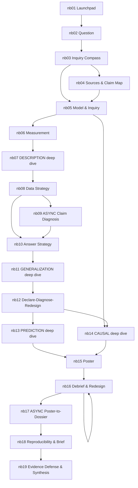

# COURSE_DEPENDENCY_MAP — what depends on what

The build's wiring diagram: notebook prerequisites, milestone inputs, and the
skill chains that make resequencing dangerous. Use before proposing ANY reorder.

## Notebook dependency graph

```mermaid
graph TD
    nb01[nb01 Launchpad] --> nb02[nb02 Question]
    nb02 --> nb03[nb03 Inquiry Compass]
    nb03 --> nb04[nb04 Sources & Claim Map]
    nb03 --> nb05[nb05 Model & Inquiry]
    nb04 --> nb05
    nb05 --> nb06[nb06 Measurement]
    nb06 --> nb07[nb07 DESCRIPTION deep dive]
    nb07 --> nb08[nb08 Data Strategy]
    nb08 --> nb09[nb09 ASYNC Claim Diagnosis]
    nb08 --> nb10[nb10 Answer Strategy]
    nb09 --> nb10
    nb10 --> nb11[nb11 GENERALIZATION deep dive]
    nb11 --> nb12[nb12 Declare-Diagnose-Redesign]
    nb12 --> nb13[nb13 PREDICTION deep dive]
    nb05 --> nb14[nb14 CAUSAL deep dive]
    nb12 --> nb14
    nb13 --> nb15[nb15 Poster]
    nb14 --> nb15
    nb15 --> nb16[nb16 Communicating Evidence]
    nb16 --> nb16[nb16 Debrief & Redesign]
    nb16 --> nb17[nb17 ASYNC Poster-to-Dossier]
    nb17 --> nb18[nb18 Reproducibility & Brief]
    nb18 --> nb19[nb19 Evidence Defense & Synthesis]
```

## Load-bearing skill chains (do not break)

1. **The classification chain:** nb03 (the skill) → every later notebook's
   compass header → M03 declaration → M09 branch choice → nb17 branch choice →
   the defense. nb03 cannot move later than M6 without stranding everything.
2. **The MIDA assembly chain:** nb05 (M+I) → nb06/nb08 (D: measurement,
   sampling, assignment) → nb10 (A) → M07 full declaration (M22 meeting).
   The declaration REQUIRES all four letters taught by Oct 16.
3. **The simulation chain:** nb05's simulated world (true estimand hidden) →
   nb10 reveals it (estimator miss) → nb11 replicates it (uncertainty, power) →
   nb12 diagnoses/redesigns it. One world, four uses — notebooks share this
   thread explicitly (seed 464 keeps it deterministic).
4. **The verification chain:** nb01 (Ask→Verify→Document) → nb04 (citation
   verification) → nb09 (recompute a published number) → M09 verification log →
   nb18/M20 (partner reproduction). Escalating rigor, same habit.
5. **The communication ramp:** M00 30-sec → … → M16 URC → M22 defense (see
   `MILESTONE_PRESENTATION_MAP.md`); nb15/nb16 must precede Nov 6/Nov 17.
6. **The poster-input chain (anti-cramming gate):** abstract (Oct 9) →
   declaration (Oct 16) → diagnosis (Oct 23) → pilot (Oct 30) → storyboard
   (Nov 2) → draft (Nov 4) → final (Nov 6). Every input is done in October;
   November assembles.

## Milestone input/output table

| Milestone | Requires (inputs) | Produces (consumed by) |
|---|---|---|
| M00 | nb01 | curiosity → M01 |
| M01 | M00, nb02–nb03 | question + compass-position candidate → M02, M03 |
| M02 | M01, nb04 | verified sources + gap placement → M03, poster refs |
| M03 | M01–M02, nb05 | model + inquiry → M07 |
| M04 | M03, nb06–nb07 | indicators + error analysis → M05, M07 |
| M05 | M04, nb08–nb09 | sampling/assignment + ethics → M07 |
| M06 | M05, nb10 | estimator + uncertainty plan → M07 |
| M07 | M03–M06, nb11 | abstract + full declaration → M08–M12 |
| M08 | M07, nb12 | diagnosands + redesign → M09 |
| M09 | M08, nb13/nb14 (branch) | pilot evidence → M10–M12, M19 |
| M10–M12 | M07–M09, nb15 | the poster → M13–M16 |
| M13–M15 | M12, nb16 | delivery readiness → M16 |
| M16 (URC) | M12–M15 | audience data → M17–M19 |
| M17–M18 | M16, nb16 | coded feedback + redesign plan → M19–M23 |
| M19 | M09, M18, nb17 | sensitivity + claim ledger → M20–M23 |
| M20 | M19, nb18 | verified reproducibility package → M23 |
| M21 | M19–M20, nb18 | research brief → M22–M23 |
| M22 | M19–M21, nb19 | defended claims → M23 |
| M23 | everything | the final dossier |

## Slack in the system (where a slip can be absorbed)

- nb04's claim-map second meeting (M8) can compress to one if M7 runs long.
- nb11 has three meetings (M20–M22); §generalization (M21) can absorb overflow.
- nb16 has four meetings; M34's hot seat can share time with M33's ULN rounds.
- The **only immovable dates**: Oct 2 + Nov 23 (async), Oct 9 (abstract gate),
  Nov 6 (poster), Nov 17 (URC), Dec 7/9 (defenses), Dec 11 (dossier).

## External dependencies

| Dependency | Status | Contingency |
|---|---|---|
| URC abstract deadline | TBD (external) | internal gate Oct 9 binds regardless |
| URC Expo Tue Nov 17 | fixed (brief) | if the event shifts, M16 becomes a department session — chain unchanged |
| Brightspace shells | instructor task | milestones publish from `_research_project/2026Fall/` md |
| Colab availability | assumed | notebooks also run locally (requirements.txt; data loads carry local fallback) |
